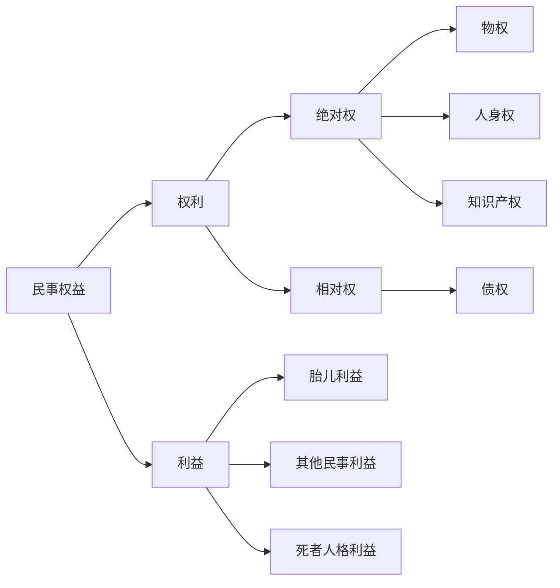
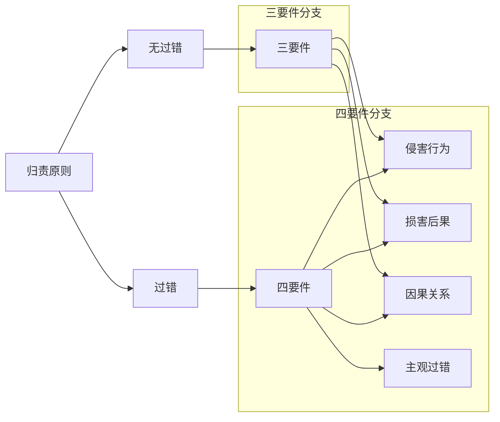

# 章节：侵权责任
1. 调整范围
2. 归责原则
3. 共同侵权
4. 免责事由

## 考点列表：侵权责任的基本原理
### 体系
#### 一、调整范围

侵权责任编调整因侵害民事权益产生的民事关系。共10章95条(第1164—1258 条),占整个《民法典》的7.5%。侵权责任是民事主体侵害他人权益应当承担的法律后果,是民事责任的典型形式。侵权责任中的“权”代表什么?  
答:==“民事权益”而非“民事权利”。民事权益包括两个部分:民事权利和民事利益。==
##### (一)民事权利
1. **绝对权**：绝对权,又称对世权,是指无须通过义务人实施一定的行为即可实现,并可以对抗不特定人的权利。物权、人身权和知识产权属于典型的绝对权。绝对权受到侵害的,依法可以追究侵权责任。
2. **相对权**：相对权,又称对人权,是指必须通过义务人实施一定行才能实现,只能对抗特定人的权利。债权属于典型的相对权。
##### (二)民事利益
胎儿利益、死者人格利益或其他民事利益受到侵害的,依法可以获得侵权责任的救济。
#### 二、归责原则

#### (一)过错责任原则
1. **含义**：通俗而言,过错责任原则,是指有过错才承担侵权责任。根据“举证责任”的不同,过错责任原则又进一步区分为两类,即一般过错(谁主张、谁举证)、和过错推定(过错要件举证责任倒置)。
2. **侵权类型**：过错责任原则的侵权行为类型(一般侵权行为),须同时满足四个构成要件: 
    - **侵害行为**
    - **损害后果**：侵权责任的首要功能在于补偿受害人所受到的损失,即利益补偿功能。损害是认定侵权的重要因素。对于损害后果而言,需要强调的是其与违约责任的不同,违约责任不需要存在损害后果。但是,侵权责任则必须存在损害后果才能请求承担此责任。通俗而言,无损害则无侵权。
    - **因果关系**：对于因果关系而言,通说认为,损害后果须与侵害行为之间存在法律意义上的相当的因果关系。如不存在相当的因果关系,则行为人无需承担侵权责任。相当因果关系说,是指以社会一般人在同样情况下有发生同样结果的可能性。
    - **主观过错**：对于主观过错(过失)而言,需要强调的是:与刑法不同,刑法中将过错分为故意(又进一步区分直接故意和间接故意)和过失(又进一步区分过于自信的过失和疏忽大意的过失)。而在民法中将过错分为三类即故意、一般过失和重大过失。
  ##### 案例分析
    - [例1] 甲搬家公司指派员工郭某为徐某搬家,郭某担心人手不够,请同乡蒙某帮忙。 搬家途中,因郭某忘记拴上车厢挡板,蒙某从车上坠地受伤。请问:郭某忘记拴上车厢挡板的行为属于一般过失还是重大过失? 答:==重大过失。因为郭某系专业的搬家公司员工,属于专业人员==。
    - [例2]甲将数箱蜜蜂放在自家院中槐树下采蜜。在乙家帮忙筹办婚宴的丙在帮乙喂猪时忘关猪圈,猪冲入甲家院内,撞翻蜂箱,使来甲家串门的丁被蜇伤,经住院治疗后痊愈。请问:丙忘记关猪圈的行为属于一般过失还是重大过失?  答:==一般过失。因为丙属于普通人员而非专业养猪户。==
    - [例3]甲骑乙公司运营的共享单车上班。途中,单车刹车失灵,甲躲闪不及,撞伤丙。丙的损害应当由乙公司承担全部赔偿责任,因为甲没有过错,乙公司有过错,乙公司构成==一般==侵权。
### (二)无过错责任原则
1. **含义**：无过错责任,又称严格责任。通俗而言,无过错责任原则,是指没有过错也承担侵权责任。
2. **侵权类型**：无过错责任原则的侵权行为类型(特殊侵权行为),须同时满足三个构成要件:
    - **侵害行为**：对于侵害行为而言,需要强调的是合法行为亦可构成侵害行为(加害行为)。
      - [例1]在机动车交通事故责任中,即使机动车驾驶人员没有任何过错也要承担不超过10%的赔偿责任。
      - [例2〕在环境污染和生态破坏责任中,污染者证明自己的排污行为完全符合国家的相关排放标准(行为合法)亦不能免责,仍然需要承担赔偿责任。
    - **损害后果**
    - **因果关系**
### (三)公平补偿规则
1. **性质**：受害人和行为人对损害的发生都没有过错的,依照法律的规定由双方分担损失。据此可知,公平责任在性质上属于“公平分担损失的规则”而不属于一种“归责原则”。
2. **适用条件**：
    - **受害人和行为人对损害的发生都没有过错**：对损失的发生,==受害人和行人既不存在故意也不存在过失。之所以在双方都没有过错的情况下分担损失,主要是基于利益平衡的公平考量。==
    - **属于法律规定的适用公平责任的情形**：
      - **完全民事行为能力人暂时丧失心智的情形**：==完全民事行为能力人对自己的行为暂时没有意识或失去控制造成他人损害有过错的, 应当承担侵权责任;没有过错的,根据行为人的经济状况对受害人适当补偿==。
      - **高空抛物坠物的情形**：禁止从建筑物中抛掷物品。从建筑物中抛掷物品或从建筑物上坠落的物品造成他人损害的,由侵权人依法承担侵权责任;经调查难以确定具体侵权人的,除能够证明自己不是侵权人的外,由可能加害的建筑物使用人给子补偿。可能加害的建筑物使用人补偿后,有权向侵权人追偿。
      - **紧急避险的情形**：危险由自然原因引起的,紧急避险人不承担民事责任,可以给予适当补偿。紧急避险采取措施不当或者超过必要的限度,造成不应有的损害的,紧急避险人应当承担适当的民妻责任。
      - **见义勇为的情形**：因保护他人民事权益使自己受到损害的,由侵权人承担民事责任,受益人可以给予适当补偿。没有侵权人、侵权人逃逸或无力承担民事责任,受害人请求补偿的,受益人应当给子适当补偿。
    - **双方当事人的行为需与损害后果的发生具有一定的因果关系**

## 考点：三、共同侵权

共同侵权,是指二人以上共同故意或共同过失侵害他人,依法承担连带责任的行为。其构成要件有四:
1. 行为人为二人以上;
2. 行为的关联性;
3. 具有共同过错;
4. 结果的单一性。
### (一)教唆、帮助侵权
1. **完全民事行为能力人教唆、帮助完全民事行为能力人**：教唆、帮助他人实施侵权行的,应当与行为人==承担连带==责任。
  - [例]赵某在公共汽车上因不慎踩到售票员而与之发生口角,售票员在赵某下车之后指着他大喊:“打小偷!”赵某因此被数名行人扑倒在地致伤。请问:对此应由谁承担责任? 答==:售票员和动手的行人==
2. **完全民事行为能力人教唆、帮助无民事行为能力或限制民事行为能力人**：教唆、帮助无民事行为能力人、限制民事行为能力人实施侵权行为的,原则上不成立共同侵权,由教唆、帮助者单独承担责任。无民事行为能力人、限制民事行为能力人的监护人**未尽到监护责任时,教唆者、帮助者与监护人承担按份责任**。
### (二)共同危险行为
《民法典》第1170条共1个条文规定了共同危险行为制度。
1. **含义**：共同危险行为,是指数人共同实施危及他人人身、财产的行为并造成损害后果,实际侵害行为人又无法确定的侵权行为。
2. **责任承担和免责事由**：二人以上实施危及他人人身、财产安全的行为==,其中一人或数人的行为造成他人损害,能够确定具体侵权人的,由侵权人承担责任;不能确定具体侵权人的,行为人承担连带责任。==
3. **案例分析**
    - [例1]孟某(6周岁)、马某(7周岁)、曹某(8周岁)和徐某(10周岁)四名小学生放学回家的路上,徐某提议扔石子儿。四人遂从地上各捡起一块小石子儿向张美丽(9周岁)扔去,张美丽被其中一块石子儿砸中,头破血流,花去医药费2000元。但不知是谁的石子儿砸中了张美丽。  
      本案中,孟某、马某、曹某和徐某四人共同实施了危险行为,但实际侵害行为人又无法确定。因此,构成共同危险行为。依法应由四人的监护人承担连带赔偿责任。如孟某的监护人欲免责,必须指明具体侵权人。**<u>*否则,不能免责。*</u>**
    - [例2]甲(10周岁)、乙(11周岁)、丙(12周岁)翻越高速公路天桥旁水泥护栏后,趴在防护网上往高速公路抛掷石块击打过往车辆,其中一石块击中司机丁致其重伤, 但无法确认该石块是谁投掷。丁的损害应由甲、乙、丙的监护人连带赔偿。
#### (三)无意思联络的数人侵权行为

1. **侵权才属于共同侵权**：
    - **原因力竞合**：二人以上分别实施侵权行为造成同一损害,每个人的侵权行为都足以造成全部损害的,行为人承担连带责任。据此可知,原因力竟合的核心即每个人的侵权行为“都足以”造成全部损害。
      - **案例分析**：[例]一条河流的两岸分别设有A、B 两个企业,A 企业向此河流里排放污水,B企业亦向该河流中排放污水,导致下游渔民孟某的鱼全部死亡。经查:即使是A 企业和B企业单独排放污水,亦足以导致孟某的鱼全部死亡。请问:孟某如何救济自己的权利? 答:==孟某可以请求 A企业和B企业承担连带责任。==
    - **原因力结合**：二人以上分别实施侵权行为造成同一损害,能够确定责任大小的,各自承担相应的责任;难以确定责任大小的,平均承担责任。据此可知,原因力结合的核心即每个人的侵权行为“都不足以”造成全部损害,只是各行人的行为结合在一起才导致最终损害的发生。
      - **案例分析**：[例]一条河流的两岸分别设有A、B两个企业,A 企业向此河流里排放污水,B企业亦向该河流中排放污水,导致下游渔民孟某的鱼全部死亡。经查:A企业单独排放污水不足以导致孟某的鱼全部死亡;B企业单独排放污水也不足以导致孟某的鱼全部死亡。但是,A、B两家企业同时往河流里排放污水,污水在河流里混合后发生化学反应,导致孟某的鱼全部死亡。请问:孟某如何救济自己的权利?  答==:孟某可以请求 A 企业和B 企业承担按份责任。==

## 四、免责事由

### (一)意外事件
[温馨提示]该考点历年来共真接考查1次。
1. **含义**：意外事件,是指非因当事人的故意或过失,由于当事人意志以外的原因而偶然发生的事故。
2. **构成要件**：
    - **意外事件是不可预见的**：确定意外事件的不可预见性适用“主观标准”,即应以当事人为标准,当==事人在当时的环境下,是否通过合理的注意能够预见。==  
    - **意外事件是归因于行为人自身以外的原因**
    - **意外事件是偶然事件**
#### (二)正当防卫
1. **含义**：正当防卫,是指为了使国家利益、社会公共利益、本人或他人的人身权利、财产权利以及其他合法权益免受正在进行的不法侵害,而针对实施侵害行为的人采取的制止不法侵害的行为。
2. **构成要件**：
    - **防卫目的**：为了使国家利益、社会公共利益、本人或他人的人身权利、财产权利以及其他合法权益免受==正在进行的不法侵害。==
    - **防卫起因**：==存在现实的(正在实施的)不法侵害。==对无意识能力人的侵害,如醉汉持刀伤人的,亦可以实施正当防卫。
    - **防卫时间**：正在进行的不法侵害。抢夺他人钱包尚在奔跑藏匿之中,但如丢掉钱包,其侵害行为即告结束。  
    - **防卫对象**：只能是不法侵害人本人。
3. **责任承担**：因正当防卫造成损害的,不承担民事责任。超过必要的限度(防卫过当/比例原则), 造成不应有的损害的,正当防卫人应当承担部分责任。
#### (三)紧急避险
1. **含义**：紧急避险,是指为了使国家利益、社会公共利益、本人或他人的人身权利、财产权利以及其他合法权益免受正在发生的急迫危险,不得已而采取紧急措施的行为。
2. **构成要件**：
    - **避险目的**：为了使国家利益、社会公共利益、本人或他人的人身权利、财产权利以及其他合法权益免受正在发生的急迫危险。
    - **避险起因**：==合法权益面临客观存在的急迫危险。==
    - **避险时间**：==正在发生==的急迫危险。
    - **避险必要**：==不得已==而采取。
3. **责任承担**：
    - **人为原因**：险情由人为原因引起的,由引起险情发生的人承担民事责任。
    - **自然原因**：险情由自然原因引起的,紧急避险人采取的措施又无不当的,原则上不承担民事责任,但受害人要求补偿的,可以责令受益人适当补偿。
    - **避险过当**：若紧急避险人采取措施不当或超过必要的限度,造成不应有的损害的,应承担适当的民事责任。如见狼犬追逐某孩童,击伤足以避险时,不必击毙。
#### (四)与有过失
1. 与有过失,又称过失相抵,是指被侵权人对同一损害的发生或扩大有过错的,可以减轻侵权人的责任。
2. 在于公平原则和责任自负原则。在侵权损害赔偿案件中,如果受害人对于损害的发生或扩大也具有故意或过失,此时令侵权人承担全部损害赔偿责任,有悖法理和公平原则。因此,各国或地区都允许在一定程度上减轻或免除侵权人的赔偿责任。
  - [例]孟某驾车在北京市海淀区中关村南大街超速行驶(本路段限速 60公里/小时, 孟某开到了90公里/小时),行人马某闯红灯。孟某将马某撞伤,花去医药费2000元。本案中,受害人马某对损害的发生亦有过错,可以减轻孟某的责任,如孟某赔偿马某1800 元,马某自己承担200元。
### (五)自甘冒险【温弊提示】该考点历年来共直接考查3次。
1. **含义**：自甘冒险,又称自担风险,是指受害人自愿参加某种可能发生风险的活动时,除非组织者或其他参加者存在过错,受害人自己承担由此产生的损害后果。如相约打篮球、賜足球、去水库游泳、骑马、爬山等。
2. **适用范围**：
    - **体育活烈**：体育比赛中,如足球、篮球、拳击等。运动员根据规则即处于身体碰撞的危险之中, 发生人身伤害的,其他参加者原则上不承担赔偿责任。
    - **户外探险活动**
    - **其他领域**：明知他人醉酒,仍然搭乘其驾驶的车辆,发生翻车等事故时,受害人的行为即属于自甘冒险的行为,可以减轻或免除加害人的赔偿责任。
- ### (六)自助行为
1. **含义**：自助行为,是指权利人为保护自己的权利,在情势紧迫而又不能及时请求国家机关予以救助的情形下,对他人的财产或人身施加扣押、约束或其他措施,而为法律或社会公德所认可的行为。
2. **构成要件**：
    - **须存在不法侵害状态**。
    - **须为保护自己的合法权利**：[萌主点拨]自助行为旨在保护自己的合法权利,而非他人权利。这是自助行为与正当防卫和紧急避险的一个显著区别;自助行为所保护的合法权利主要是请求权,包括债权请求权和基于物权、人身权等被侵害而产生的请求权。
    - **须情况紧急而来不及请求有关国家机关的援助**：自助行为的实施具有现实紧迫性和不可替代性。
    - **须不得超过必要的限度**。
    - **须为法律或公序良俗所许可**。
3. **责任承担**：
    - **基本规则**：自助行为如不符合构成要件,则要承担侵权责任。
    - **自助过当**：自助人采取的自助措施超出保全其请求权的必要,此时类似于防卫过当和避险过当的规则,自助人应承担适当的责任。
    - **迟延请求**：未立即请求有关国家机关处理,造成他人损害的,应当承担侵权责任。