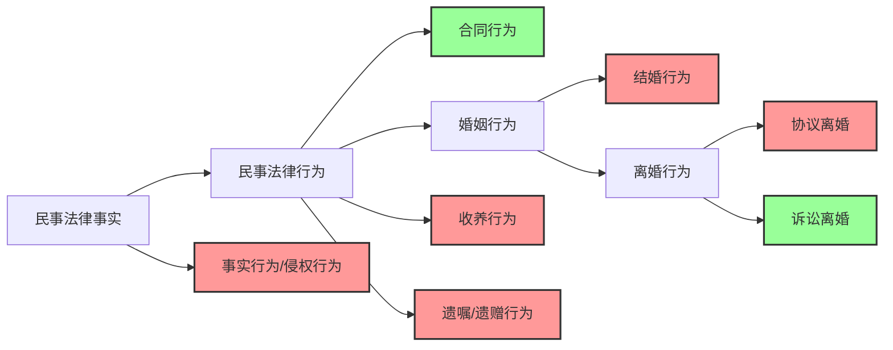
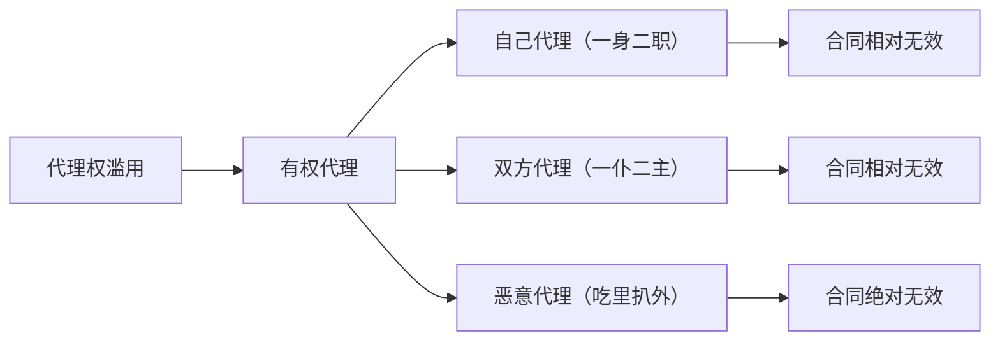

---
words:
  2026-05-06: 3633
PrevNote: "[[MTSFMF 03 民事法律行为]]"
NextNote: "[[MTSFMF 05 诉讼时效]]"
---
# 代理
## 章节概述
本章节主要介绍代理相关知识，包括代理的基本原理、复代理、职务代理、无权代理和表见代理等内容。

## 考点列表
### 考点1：代理的基本原理
1. **范围**：并非所有民事法律事实和行为都适用代理。演出、授课、订立遗嘱、婚姻登记、收养子女、参加求职面试等涉及身份关系的行为不适用代理。从民事法律事实角度，可分为民事法律行为和事实行为/侵权行为。民事法律行为中，合同行为适用代理，而婚姻行为（包括结婚行为、离婚行为，离婚行为又分协议离婚和诉讼离婚）、收养行为、遗嘱/遗赠行为不适用代理 。

1. **代理的内外部关系**：代理涉及内部关系（如委托合同等基础法律关系）和外部关系（授权委托书等）。例如，3月2日，孟律师胁迫当事人马某和自己所在的A律师事务所（普通合伙企业）签订一份委托合同（内部关系）并为自己出示授权委托书（外部关系），授权自己处理马某和曹某之间的房屋买卖合同纠纷案件。4月21日，马某获得生效的胜诉判决 。
    - 马某和A律师事务所之间的委托合同效力如何? **答:可撤销(胁迫)** 。
    - 授权委托书包括几个事项?分别是什么? 答:**5个事项。分别是:1代理人的姓名或名称;2代理事项;3代理权限;4代理期间;5被代理人签章** 。
    - 授权委托书上是否需要孟某签章? 答:**不需要** 。
    - 代理权授予行为是谁的行为? 答:**马某的单方民事法律行为** 。
    - 如马某向法院撤销了委托合同,是否会导致胜诉判决也无效? 答:**不会。因为代理权授予行为系无因行为,即使基础法律关系委托合同被撤销,也不影响胜诉判决的效力** 。
2. **代理滥用**：代理权滥用属于有权代理，但存在不当行使代理权的情况，包括自己代理（一身二职）、双方代理（一仆二主）和恶意代理（吃里扒外）。

    - **自己代理**：指代理人以被代理人名义与自己实施的民事法律行为。基于“相对无效理论”，被代理人同意或追认的，民事法律行为有效；被代理人不同意或不追认的，民事法律行为无效。
    - **双方代理**：基于“相对无效理论”，被代理的双方同意或追认的，民事法律行为有效；被代理的双方不同意或不追认的，民事法律行为无效。
    - **恶意代理**：指在代理过程中，代理人与第三人以损害被代理人的利益为目的，弄虚作假的违法行为。行为人与相对人恶意串通，损害他人合法权益的民事法律行为（绝对）无效。代理人和相对人恶意串通，损害被代理人合法权益的，代理人和相对人承担连带责任 。例如，潘某有一批珍贵红木，委托仲某找买家，刘某出价600万元，辛某出价400万元。仲某以潘某名义与刘某缔约时，辛某找到仲某表示愿意给仲某50万元回扣，出价350万元购入该红木，仲某同意。后仲某告知潘某红木市场状况欠佳，只能以该价卖出。仲某与辛某签订了合同。潘某的损失由仲某与辛某承担连带责任。

### 考点2：复代理（转委托）
1. **案例分析**：3月2日，孟某委托马某前往浙江省杭州市购买明前西湖龙井茶1000斤（特级）。4月1日，马某来到杭州后水土不服，突发急病，前往医院治疗。眼看清明将至，为了孟某的利益，马某欲将此事转委托给自己的好友曹某，电话征求孟某的同意，但始终无法与孟某取得联系。无奈之下，马某只好先斩后奏，将购买龙井茶一事转委托给曹某，但情急之下，忘记告知曹某购买茶叶的级别。4月6日，曹某亲自前往当地茶农徐某家中购买龙井茶（二级），为压低购买价格，威胁茶农徐某，如不低价出卖茶叶，将刺伤徐某的女儿。无奈之下，徐某只好低价出卖茶叶1000斤（全部损失共2万元） 。
    - 马某将购买龙井茶一事转委托给曹某，应以谁的名义选任? 答:**自己的名义** 。
    - 曹某是马某的代理人还是孟某的代理人? 答:**孟某** 。
    - 马某在未征得孟某事前同意的情况下，是否有权自行将购茶一事转委托给曹某? 答:**有权。因为紧急情况下，为被代理人的利益，可以直接转委托** 。
    - 茶农徐某的损失2万元是否可以直接向孟某请求赔偿? 答:**可以。因为基于合同相对性原理，孟某和徐某系茶叶买卖合同的当事人** 。
    - 孟某承担责任后，是否有权请求马某赔偿损失? 答:**有权。因为马某有指示过错(忘记告知购买茶叶的级别)** 。
    - 孟某承担责任后，可否请求马某和曹某向自己承担连带责任? 答:**有权。因为曹某(复代理人/转托代理人)有过错** 。
2. **相关法条**：《民法典》第169条确立了复代理制度。原则上，代理人应当亲自行使代理权。复代理，又称“转委托”，是指代理人为被代理人的利益将其所享有的代理权转托他人而产生的代理 。
3. **特征**：
    - 复代理人是由代理人以自己的名义选任。
    - 复代理人是被代理人的代理人而非代理人的代理人。
    - 复代理人的代理权限以代理人的权限为限。
    - 法律效果由本人承担。
4. **法律效果追认**：
    - 事前授权或者同意。
    - 事后本人追认。
    - 紧急情况下，为被代理人利益。

### 考点3：职务代理
1. **相关法条**：《民法典》第170条确立了职务代理制度。职务代理，是指根据代理人所担任的职务而产生的代理 。
2. **特征**：
    - 被代理人是法人或非法人组织。如果被代理人是自然人，只能采用一般的民事代理。民事代理遵循“一事一授权”规则；商事代理遵循“职位所产生的概括授权”规则。
    - 代理人须是执行法人或非法人组织工作任务的人员，如工厂采购员、商店售货员、劳务派遣单位派到用工单位的工作人员。
    - 代理事项须是职权范围内的事项。职权范围的判断标准就是：“是否属于本职工作”。如果是本职工作就是职务代理，如果不是本职工作就是无权代理。
3. **责任承担**：执行法人或非法人组织工作任务的人员，就其职权范围内的事项，以法人或非法人组织的名义实施民事法律行为，对法人或非法人组织发生效力。法人或非法人组织对执行其工作任务的人员职权范围的限制，不得对抗善意相对人 。例如，众森公司的市场部内部对各级工作人员进行了职权限制。其中，总监对外可以签订不超过2000万元的购销合同；副总监对外可以签订不超过1000万元的购销合同；工作人员对外可以签订不超过100万元的购销合同。10月16日，众森公司市场部新录用的员工小孟与海马公司签订了一份金额为500万元的设备购销合同，该购销合同合法有效，因为内部权限限制不得对外，内外有别。

### 考点4：无权代理和表见代理
1. **无权代理**：
    - **相关法条**：《民法典》第171条规定，行为人没有代理权、超越代理权或者代理权终止后，仍然实施代理行为，未经被代理人追认的，对被代理人不发生效力。相对人可以催告被代理人自收到通知之日起三十日内予以追认。被代理人未作表示的，视为拒绝追认 。无权代理，是指行为人没有代理权、超越代理权或代理权终止后，仍然以被代理人的名义实施民事法律行为。
2. **表见代理**：
    - **相关法条**：《民法典》第172条规定，行为人没有代理权、超越代理权或者代理权终止后，仍然实施代理行为，相对人有理由相信行为人有代理权的，代理行为有效 。
    - **主观要件**：主观上相对人要善意且无过失。
        - 善意，是指不知情、不了解、不知悉，即不知行为人没有代理权。民法上的善意，一般而言是一种消极、单纯和推定的善意。法律推定相对人善意，被代理人应当就相对人不善意承担举证责任。
        - 无过失，是指尽到必要的审查义务，一般是指对于行为人出示的授权文件或职位的形式审查义务（即对权利外观进行形式审查）而非实质审查义务（即无须核实）。
    - **客观要件**：客观上要存在权利外观。权利外观主要包括四类：
        - 授权委托书。
        - 介绍信。
        - 盖有公章或合同专用章的空白合同书。公司的公章和合同专用章具有相同的效力；公司的公章和合同专用章不得是伪造的，如是伪造的，则不构成表见代理，而构成无权代理。
        - 交易习惯。题目中关键词往往是：经常、往常、通常、常常、长期等 。
        - 有下列情形之一的不构成表见代理：
            - 行为人伪造他人的公章、合同书或授权委托书等，假冒他人的名义实施民事法律行为的。
            - 被代理人的公章、合同书或授权委托书等遗失、被盗，或与行为人特定的职务关系已经终止，并且已经以合理方式公告或通知，相对人应当知悉的。
    - **案件分析**：
        - 吴某是甲公司员工，持有甲公司的授权委托书。吴某与温某签订了借款合同，该合同由温某签字、吴某用甲公司合同专用章盖章。后温某要求甲公司还款。甲公司无权以温某明知借款合同上的盖章是甲公司合同专用章而非甲公司公章为由拒绝承担民事责任，因为甲公司的公章和合同专用章具有相同的功能。
        - 孟某是众森公司的销售人员，随身携带盖有该公司公章的空白合同书，便于对外签约。后孟某因收取回扣被众森公司除名，但空白合同书未被该公司收回。孟某以此合同书与他人签订购销协议合法有效，因为孟某的行为构成表见代理。
3. **总结**：
    - ### 无权代理和表见代理情形汇总
|情形|相对人善意与否|相对人有无过失|处理|法律依据|
|----|----|----|----|----|
|情形1|非善意|有过失|属于无权代理，非善意相对人无撤销权和选择权|《民法典》第171条第4款|
|情形2|善意|有过失|属于无权代理，善意相对人有撤销权和选择权|《民法典》第171条第3款|
|情形3|善意|无过失|构成表见代理，产生与有权代理相同的法律效果|《民法典》第172条|

### 表见代理和表见代表
|项目|定主体|行为类型|相对人|  |  |合同效力|内部追偿|
|----|----|----|----|----|----|----|----|
| | | |审查方式|依据|相信理由| | |
|表见代理|除特定主体（董事长、执行董事、总经理）以外的人|经营合同|形式审查|授权委托书|有理由相信行为人有代理权|合法有效|用工责任（当代理人存在故意或重大过失时）|
|表见代表|董事长、执行董事、总经理|担保合同|合理审查|决议或公开披露的信息|有理由相信行为人有代表权|合法有效|股东可通过股东代表诉讼追究有过错的代表人责任| 
### 文档检查说明
1. **排序**：整体内容按照考点顺序依次阐述，逻辑连贯，排序无误。
2. **文档标题**：文档标题“代理”准确概括了文档核心内容，无错误。 