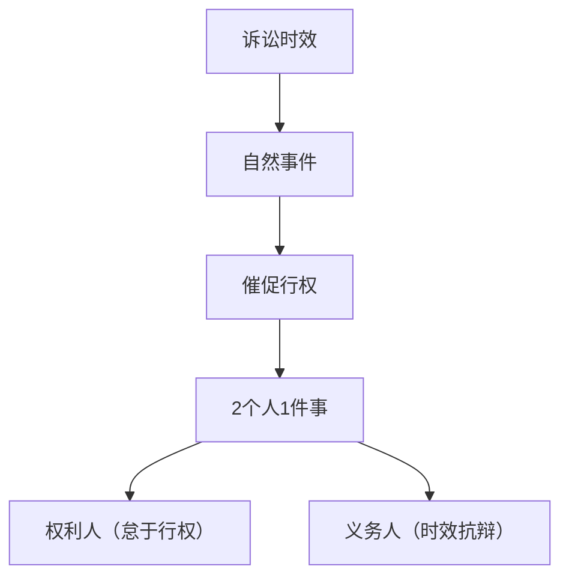
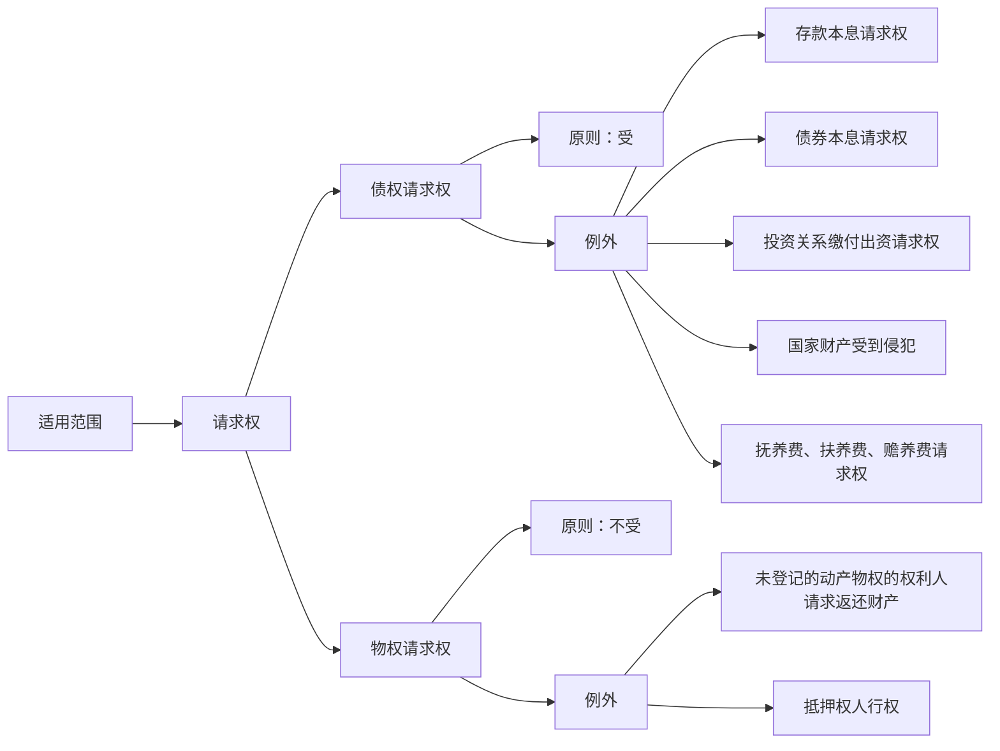
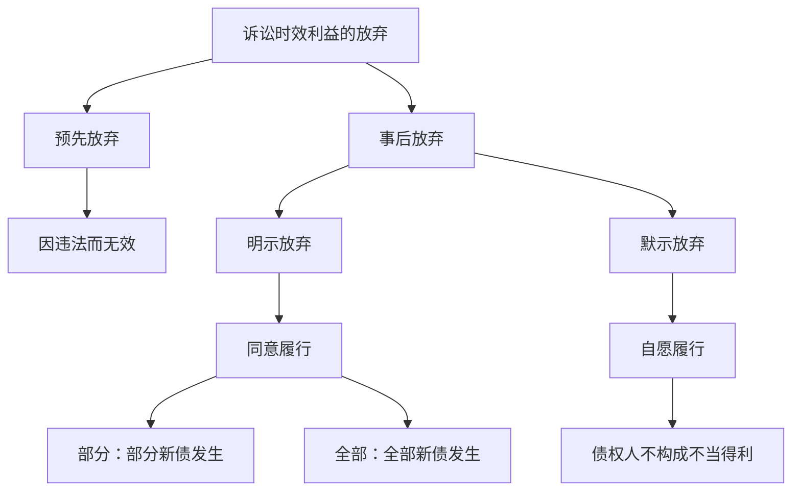

# 诉讼时效专题
本专题主要涉及五个方面的问题：
1. 诉讼时效的基本原理
2. 诉讼时效的种类
3. 诉讼时效的起算
4. 诉讼时效的中止
5. 诉讼时效的中断

诉讼时效制度属于客观题必考点，在备考过程中必须重点掌握，特别是诉讼时效的中断问题。

## 一、诉讼时效的基本原理
诉讼时效，是指权利人不行使权利，经过法定期间，使债务人获得拒绝履行的抗辩权的法律效果。

### 考点1：诉讼时效
1. **相关法条**：（此处未明确具体法条，可后续补充完整相关民法典等法律中关于诉讼时效的具体条款）
2. **适用范围**

1. **内容**
    - **债权请求权**：即“存、券、资、国、救”。
        - “存”代表支付存款本金及利息请求权。
        - “券”代表兑付国债、金融债券以及向不特定对象发行的企业债券本息请求权。
        - “资”代表基于投资关系产生的缴付出资请求权。缴付出资是投资人取得股东资格的唯一对价和前提，包括身份权请求权 。例如，2020年10月10日，孟某、马某、曹某和徐某四人发起设立一家有限责任公司（众森公司），注册资本金1000万元，以房地产开发为业。其中，孟某认缴800万元人民币。但是，直到2023年10月16日仍未按约缴足。众森公司起诉孟某请求其缴付出资，孟某不可以以超过3年诉讼时效期间为由拒绝，因为缴付出资是投资人取得股东资格的唯一对价和前提，包括身份权请求权，同时，为保护众森公司外部债权人的利益，法律综合考量，该类债权请求权不受诉讼时效期间的限制。
        - “国”代表国家财产受到侵犯。为防止国有资产流失，未授权给自然人或法人经营、管理的国家财产受到侵犯的，不受诉讼时效期间的限制。
        - “救”代表救命钱，即请求支付抚养费（长辈对晚辈）、赡养费或扶养费（同辈之间）。
    - **物权请求权**
        - **动产**：
            - 登记的动产物权的权利人请求返还财产不适用诉讼时效的规定。机动车、船舶、航空器等动产，价值较大，被称为“准不动产” ，准用不动产管理的很多规则，需要物权登记。例如，孟某有一辆轿车（特殊动产）登记在自己名下，马某甚是喜爱，欲借用3天。孟某欣然接受，将轿车交付于马某。借期届满后，马某拒不归还轿车。孟某基于所有权人的身份欲请求马某返还轿车（行使返还原物请求权，即物权请求权），不受期间限制，因为轿车系登记的特殊动产，存在登记制度，不存在举证困难，不会浪费司法资源。
            - 未登记的动产物权的权利人请求返还财产适用诉讼时效的规定。
        - **不动产**：不动产的权利人请求返还财产，不适用诉讼时效的限制 。
        - **抵押权人行权**：根据《民法典》第四百一十九条 ，抵押权人应当在主债权诉讼时效期间行使抵押权；未行使的，人民法院不予保护。
2. **经过的法律效力**
    - **起诉**：对于诉讼时效期间届满后，权利人起诉的，法院应当受理，不得裁定不予受理。在抗辩权发生主义下，债权人不丧失起诉权。
    - **审理**：诉讼时效抗辩权系义务人的私权利，义务人是否行使自行决定，法院既不能主动适用，也不能释明（被动司法）。债务人及其法定代理人、委托代理人、法定代表人在审理过程中提出诉讼时效抗辩的，法院应当判决驳回原告的诉讼请求；债务人及其法定代理人，委托代理人，法定代表人在审理过程中未提出诉讼时效抗辩的，法院应当判决原告胜诉 。
    - **行权时间阶段**：债务人要进行诉讼时效抗辩需在一审期间提出，在二审期间提出的，原则上不予支持，除非存在“新证据” 。例如，某公司因合同纠纷的诉讼时效问题咨询律师，孟律师答复称：“当事人在一审期间未提出诉讼时效抗辩的，二审期间不能提出该抗辩。”该答复不正确，因为二审期间如果有新证据可以提出诉讼时效抗辩。
3. **事后放弃诉讼时效利益**

    - **含义**：诉讼时效利益的放弃，是指诉讼时效期间届满后，义务人取得诉讼时效抗辩权，在义务人知道其享有诉讼时效抗辩权的情况下，可以选择放弃其诉讼时效利益。
    - **方式**：虽然当事人之间不得“事前”对诉讼时效问题进行约定，但允许“事后”放弃诉讼。
        - **明示 - 同意履行**：诉讼时效期间届满后，债务人虽未自愿履行但已作出同意履行（明示，包括书面、口头等表意方式）的意思表示的，视为放弃诉讼时效利益，诉讼时效期间重新起算。例如，2019年10月10日，孟某向马某借款2000万元，双方约定借款期限为1年。2023年10月16日（即3年诉讼时效期间届满后），债权人马某向债务人孟某主张归还全部欠款。债务人孟某同意先还200万元，视为在200万元范围内放弃诉讼时效利益（诉讼时效抗辩权），在200万元范围内，孟某和马某形成了一份新的债权债务关系（即单方允诺之债），200万元新债权的诉讼时效期间重新起算；若孟某同意归还全部欠款，则视为全部放弃诉讼时效利益（诉讼时效抗辩权），在2000万元范围内，孟某和马某形成了一份新的债权债务关系（即单方允诺之债），2000万元新债权的诉讼时效期间重新起算 。
        - **默认 - 自愿履行**：诉讼时效期间届满后，债务人自愿履行（默示行为）的，视为放弃诉讼时效利益，不得反悔；债权人受领给付的，不构成不当得利。例如，2023年10月16日（即3年诉讼时效期间届满后），债权人马某向债务人孟某主张归还全部欠款。债务人孟某自愿归还了200万元。10月20日，孟某反悔，孟某不可以基于不当得利请求马某返还200万元及利息，因为已过诉讼时效之债，债权本身依然存在，债权人受领给付的，不构成不当得利。

## 二、诉讼时效种类
1. **一般时效**：一般为三年，3年诉讼时效期间，可以适用中止、中断的规定，不适用延长的规定 。
2. **特殊时效**：
    - 因国际货物买卖合同和技术进出口合同争议一般比较复杂、涉及标的额也较大，为了更有效地保护当事人的合法权益，法律规定了比普通诉讼时效更长的期间，即因国际货物买卖合同和技术进出口合同争议提起诉讼或申请仲裁的时效期间为4年。
    - 人寿保险的被保险人或受益人向保险人请求给付保险金的诉讼时效期间为5年 。
3. **最长时效**：20年 。
4. **起算时间**：
    - **原则**：诉讼时效期间的起算点自权利人知道（事实上的知道）或应当知道（推定的知道）权利受到损害以及义务人之日起计算 。
    - **例外**：
        - **合同之债**：
            - **未约定履行期限**：未约定履行期限（无期限则无预期/随时行权）的合同，诉讼时效期间从债权人请求债务人履行义务的宽限期届满之日起计算，但债务人在债权人第一次向其主张权利之时明确表示不履行义务的，诉讼时效期间从债务人明确表示不履行义务之日起计算。
            - **约定1个确定履行期限**：约定1个确定履行期限的，诉讼时效从履行期限届满之日起计算。
            - **约定多个履行期限（即分期履行）**：当事人约定同一债务分期履行的，诉讼时效期间从最后一期履行期限届满之日起计算。
        - **被监护人受到侵权**：
            - **性侵害**：根据《民法典》第191条的规定，未成年人遭受性侵害的损害赔偿请求权的诉讼时效期间，自受害人年满18周岁之日起计算。
            - **性侵害以外的侵权**：根据《民法典》第190条的规定，无民事行为能力人或者限制民事行为能力人对其法定代理人的请求权的诉讼时效期间，自该法定代理终止之日起计算。

## 三、诉讼时效的中止
1. **相关法条**：《民法典》第194条确立了诉讼时效的中止制度。诉讼时效的中止，是指在诉讼时效进行中（最后6个月内），由于出现了法定事由（客观障碍）而暂停诉讼时效进行的法律制度。
2. **适用情形**：在诉讼时效期间的最后6个月内，出现以下例外情形：
    - 不可抗力。
    - 无民事行为能力人或限制民事行为能力人没有法定代理人，或法定代理人死亡、丧失民事行为能力、丧失代理权。
    - 继承开始后未确定继承人或遗产管理人。
    - 权利人被义务人或者其他人控制。
    - 其他导致权利人不能行使请求权的障碍。
3. **内容**：在法定期限内发生中止事由时，诉讼时效期间暂停计算。自中止时效的原因消除之日起继续计算6个月 。例如，2019年10月10日，孟某向马某借款2000万元，双方约定借款期限为1年。其中，2020年10月11日至2023年10月10日为3年诉讼时效期间。2023年4月10日至2023年10月10日为诉讼时效期间届满前6个月。2023年5月10日（最后6个月内），孟某所在地（北京市海淀区）发生地震（不可抗力）导致马某无法向孟某行使请求权，借款合同的诉讼时效期间中止（暂停）；2023年11月10日，孟某所在地（北京市海淀区）的震后重建工作全部完毕（中止时效的原因消除），当地恢复了正常的生产生活，借款合同的诉讼时效期间于2024年5月10日（中止时效的原因消除之日起继续计算6个月）届满。

## 四、诉讼时效的中断
1. **相关法条**：《民法典》第195条、《民法典总则编解释》第37条共2条规定了诉讼时效的中断制度。诉讼时效的中断，是指在诉讼时效进行中（整个诉讼时效期间内），因一定事由的发生，阻碍时效进行，致使以前经过的时效期间统归无效，从中断时起重新起算的制度。
2. **中断情形**：
    - 当事人一方直接向对方当事人送交主张权利文书，对方当事人在文书上签名、盖章、按指印或虽未签名、盖章、按指印但能够以其他方式证明该文书到达对方当事人的。
    - 当事人一方以发送信件或数据电文方式主张权利，信件或数据电文到达或应当到达对方当事人的。
    - 当事人一方为金融机构，依照法律规定或者当事人约定从对方当事人账户中扣收欠款本息的。
    - 当事人一方下落不明，对方当事人在国家级或下落不明的当事人一方住所地的省级有影响的媒体上刊登具有主张权利内容的公告的，但法律和司法解释另有特别规定的，适用其规定。
    - 义务人同意履行义务，包括义务人作出分期履行、部分履行、提供担保、请求延期履行、制定清偿债务计划等承诺或行为的。
    - 权利人提起诉讼或申请仲裁，当事人一方向人民法院提交起诉状或口头起诉的，诉讼时效从提交起诉状或口头起诉之日起中断。
    - 与提起诉讼或申请仲裁具有同等效力的其他情形 。
3. **法律后果**：诉讼时效中断，已经经过的期间归于无效，从中断或有关程序终结时起，诉讼时效重新计算。

## 五、复习总结
### 本章重点
1. 诉讼时效的适用范围，特别是债权请求权和物权请求权中哪些受诉讼时效限制，哪些不受限制。
2. 诉讼时效中断和中止的情形、适用条件及法律后果，尤其是中断的多种具体情形需要准确记忆。
3. 诉讼时效的起算时间，包括原则性规定以及合同之债、被监护人侵权等特殊情况下的起算规则。

### 易错点
1. 混淆诉讼时效中止和中断的适用时间和法定事由，中止发生在诉讼时效最后6个月内，由客观障碍引起；中断发生在整个诉讼时效期间，由当事人的行为等引起。
2. 对诉讼时效经过后的法律效力理解不清，如法院受理起诉的规定、义务人抗辩权的行使阶段以及事后放弃诉讼时效利益的具体情形和法律后果。
3. 在合同之债中，不同履行期限约定下诉讼时效起算点容易记错，未约定履行期限、约定一个确定履行期限和约定分期履行的起算规则不同。

### 复习建议
1. 对比记忆：将诉讼时效的中止、中断和延长进行对比，分析它们的区别和联系，制作对比表格，加深理解。
2. 案例分析：多做一些关于诉讼时效的案例分析题，通过实际案例来理解和运用知识点，提高解题能力。
3. 结合法条：复习时紧密结合相关法条，理解法条背后的立法意图，准确把握知识点的法律依据。
4. 定期回顾：定期回顾诉讼时效的知识点，防止遗忘，尤其是易错点和重点内容，加强记忆和理解。 