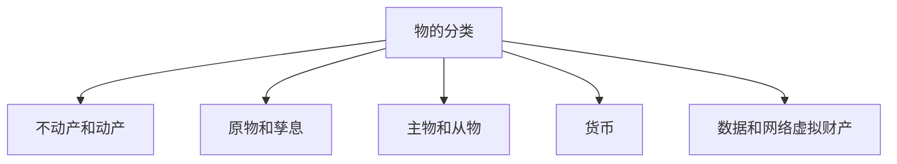
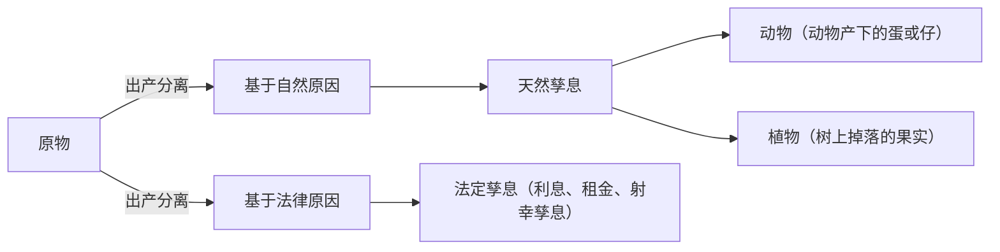
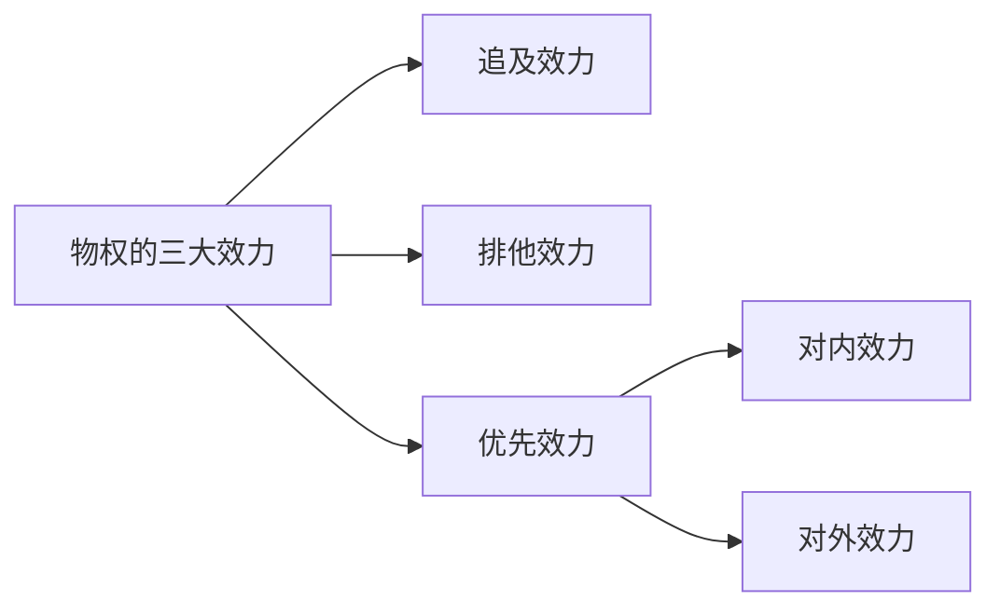
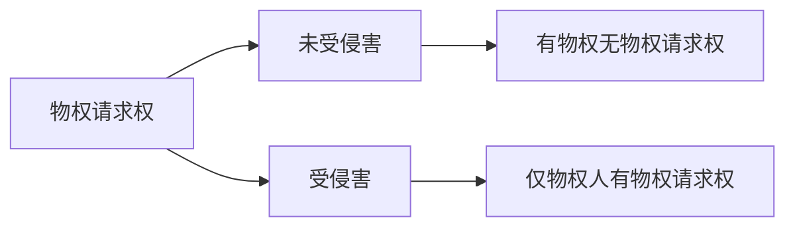
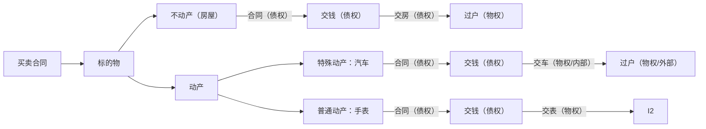
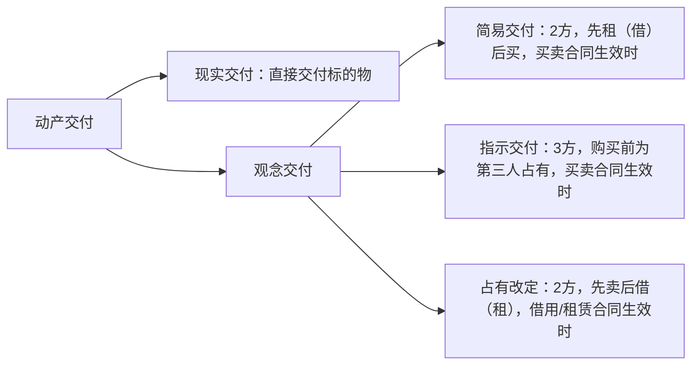
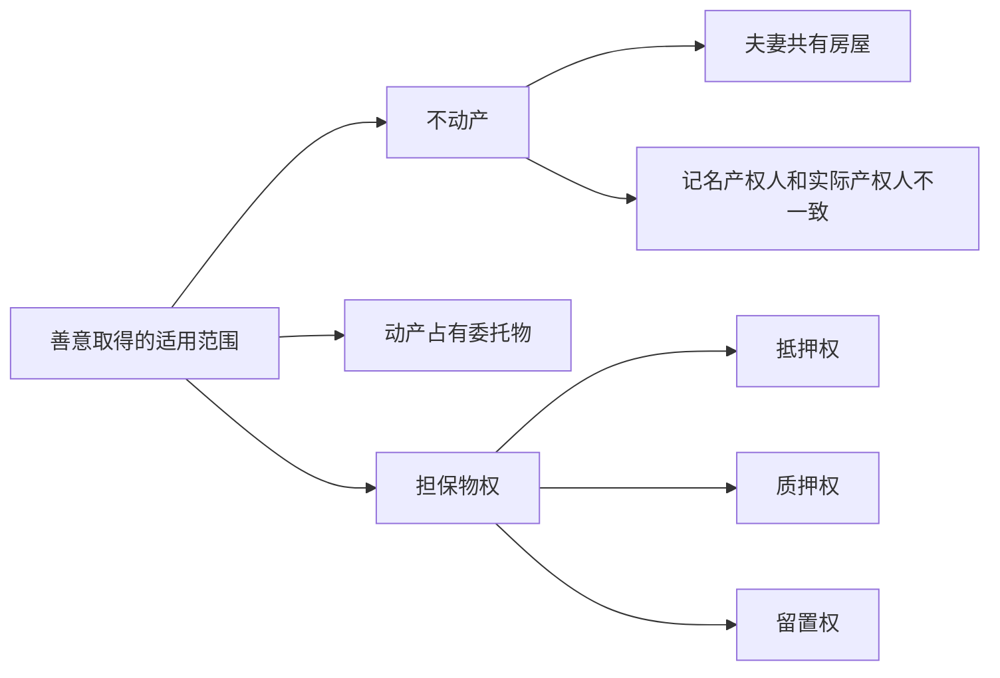
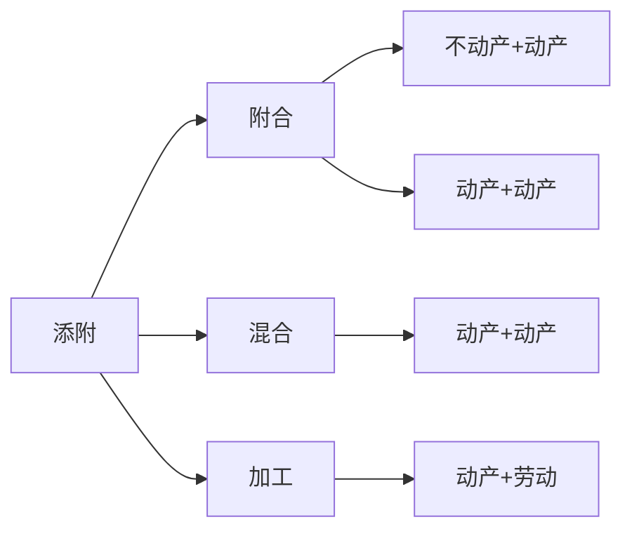
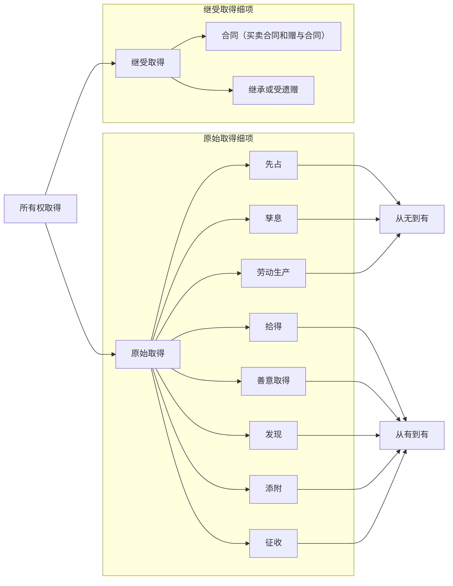
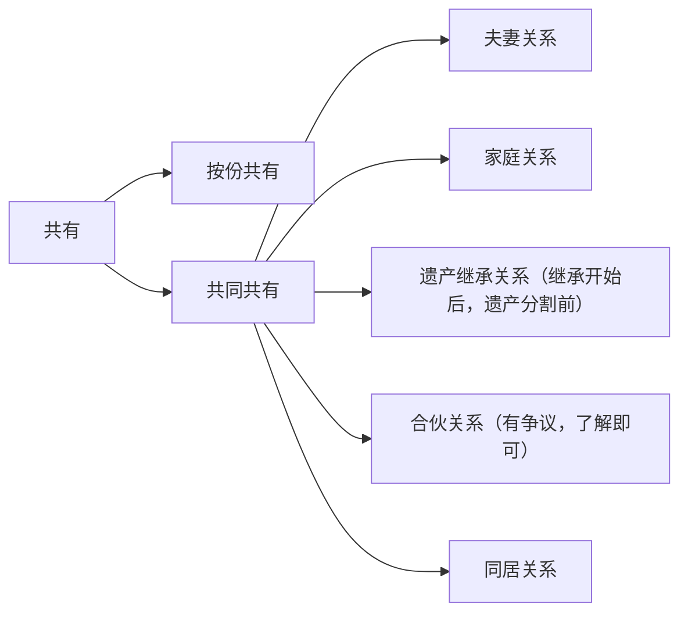

好的，我将为你整理内容的MD格式，规范mermaid生成格式，并改进缩进和标题。以下是优化后的内容，对标题进行了统一格式和层级梳理，使内容结构更清晰，mermaid图表格式更规范，整体缩进也进行了调整，增强了文本的可读性：

# 物权相关知识专题

## 章节概述

## 考点列表
## 第一节 物权变动
### 考点1: 物的分类
1. **分类**
    - **不动产和动产**：包括土地、海域以及地上或海上定着物，如房屋、建筑物、构筑物、林木、桥梁、堤坝、纪念碑等。
    - **原物和孳息**

        - **原物**：原物，是指**能够产生收益**的物。
        - **孳息**：孳息，是指由原物所生的物或收益，包括<u>天然孳息和法定孳息</u>。
            - **天然孳息**：是指果实、物的出产物及按照物之使用方法所获得的出产物。如动物产下的蛋或仔、剪下的羊毛、树上掉落的果实、收割后的庄稼等。
                - **天然孳息的归属分三步确定**：
                    - 第一步：==有约从约==;
                    - 第二步：==无约归所有权人==;
                    - 第三步：==有用益物权人的归用益物权人。==
            - **法定孳息**：
                - **法定孳息**：是指利息、租金以及其他因民事法律关系而获得的收益。如房屋的租金、存款的利息和射幸孳息等。射幸孳息，是指发生与否不确定。如彩票中奖所得的奖金、抽奖获得的奖品以及保险合同产生的保险金等。
                - **归属**：法定孳息的归属分两步确定：第一步：有约从约；第二步：无约或约定不明的，依交易习惯。
    - **主物和从物**
        - **标准**：两物之间的关系
            - 非主物的构成有三：
                - 非主物的构成成分。轮胎属于汽车的构成部分，房门属于房屋的构成部分。因此， 轮胎对于汽车，房门对于房屋均不属于从物。
                - 须辅助主物的使用。
                - 须与主物同属一人
    - **货币**：货币的占有只能是现实占有，不发生间接占有。一言以蔽之，货币，*原则上占有即所有。*
    - **数据和网络虚拟财产**：
        - 它在法律上具有可支配性和排他性。
        - 数据和网络虚拟财产具有经济价值。属于权利人通过合法劳动取得， 具有可交换性，有一定的经济价值。如游戏中的装备可以交易和转让。
        - 虽然数据和网络虚拟财产本身是无形的，但是它们在网络空间中也具有一定的「有形」存在。

### 考点2: 物权的三大效应
1. **框架**

1. **追及效力**
    - 追及效力，是指物权成立后，不论其标的物辗转至何人之手，==权利人均可以追及标的物之所在，并直接行使权利；只要在最后占有人处发现自己的物，即可予以取回==。
    - **相关法条**：
    - **案例分析**：[例]2023 年 3 月 10 日，孟某的手表丢失被马某拾得。3 月 12 日，曹某从马某家中将手表偷走。3 月 13 日，曹某又将手表丢失被柏某拾得。4 月 10 日，孟某发现自己的手表在柏某手中。请问：孟某可否请求柏某返还手表？
        - 答：==可以。因为物权具有追及效力，即物在呼唤主人。==
2. **排他效力**：排他效力，是指同一物上不得同时存在两个所有权（即一物一权）或两个内容相冲突的他物权。
3. **优先效力**：优先效力，是指同一物之上存在数个互相冲突的权利时，效力较强的权利排斥效力较弱的权利而率先获得实现。
    - [例]2023 年 3 月 2 日，孟某向徐某借款 2 万元。4 月 21 日，孟某又向马某借款 2 万元，将自己价值 27500 元的欧米茄手表质押给马某并交付。到期后，孟某无法归还该 4 万元。
        - 请问：徐某和马某的债权如何实现？
        - 答：马某优先受偿 2 万元，剩余 7500 元归徐某，徐某剩余的 12500 元转为一般债权（普通债权）。因为马某的物权优先徐某的债权，物权具有优先效力。

### 考点3: 物权的保护
1. **框架**
    - 物权请求权：是指物权人在其权利的实现上遇有某种妨害时，有权请求造成妨害事由发生的人排除此等妨害。

    - 物权是原权利，物权请求权是救济权。因此，物权请求权是独立于物权的一种行为请求权。<u>在物权未受到妨害也不存在受到妨害之可能性时，</u> 物权人则不享有物权请求权
1. **种类**
    - 返还原物请求权：所有权人、物权占有
    - 排除妨害请求
    - 消除危险请求权。
2. **行权**
    - 物权受到侵害的，权利人可以通过和解、调解、仲裁、诉讼等途径解决
    - **物权请求权 VS 债权请求权**
|项目|物权请求权|债权请求权|
|----|----|----|
|前提|以物的存在为前提，无物则无物权请求权|以债权的存在为前提|
|目的|救济被侵害的物权，恢复对物的圆满支配状态（使用价值 + 交换价值）|救济被侵害的债权，恢复被损害的利益（填补性损害原理）|
|是否需要过错|原则上不考虑相对人是否有过错|通常以相对人主观上有过错为要件（如一般侵权）|
|表现形式|返还原物、排除妨害、消除危险|赔偿损失|
|期间限制|具体问题具体分析|原则上受诉讼时效限制|
1. **案例分析**
    - [例]小贝购得一只世界杯指定用球后兴奋不已，一脚踢出，恰好落入邻居老马家门前的水井中，正在井边清洗花瓶的老马受到惊吓，手中花瓶落地摔碎。老马从井中捞出足球后，小贝央求老马归还，老马则要求小贝赔偿花瓶损失。根据上述案情，
    - 请回答：
        - （1）小贝对老马在行使何种请求权？ 答：==物权请求权。因为小贝请求老马归还足球。==
        - （2）老马对小贝在行使何种请求权？
        - 答：==债权请求权。因为老马请求小贝赔偿损失。==

### 考点4: 基于民事法律行为
1. **原理方式**：合同 + 公示

1. **相关原理**：一言以蔽之,一般物权变动===有权处分 + 有效合同 + 登记/交付=物权变动=继受取得。==
2. **案例分析**：[例 1]3 月 2 日,孟某将自己的房屋以 850 万元的价格出卖给马某。双方签订了房屋买卖合同(仅发生债权效力,二者互相对对方享有债权请求权),同年 4 月 21 日双方前往登记机构办理了过户登记(发生物权效力,发生了物权变动)手续。请问:马某何时取得房屋所有权? 答:4 月 21 日。因为不动产物权的变动经依法登记,发生效力。
    - **[萌主点拨]登记生效主义**：登记生效主义,==是指登记决定不动产物权的设立、变更、转让和消灭是否生效。==即不动产物权的各项变动原则上都必须登记,不登记则不生效。简单而言,有效合同 + 登记=不动产物权变动。
    - **登记类型**
        - 更正登记
        - 异议登记
        - 预告登记
            - 预告登记后,买方对房屋享有的仍然是债权而非物权。
            - 预告登记后,卖方仍然可以出卖该房屋,仍然是有权处分,合同仍然合法有效。
            - 预告登记后,未经预告登记的权利人同意,处分该不动产的,不发生物权效力。
            - 预告登记后,债权消灭或自能够进行不动产登记之日起 ==90 日内==未申请登记的,预告登记失效。
3. **案例**：[例]2022 年 3 月 2 日,天津众森实业股份有限公司(以下简称众森公司)取得了商品房预售许可证后开始预售期房。孟某为了(合同目的)结婚需要购买房屋一套,双方遂于 4 月 21 日签订了一份《商品房买卖合同》,孟某购买众森公司开发的北京市海淀区幸福小区 2 号楼 2 单元 402 室。合同中约定:“孟某应于合同签订后 30 日内向众森公司交纳全部购房款 850 万元,众森公司应于 2023 年 4 月 21 日交房并于交房后 30 日内协助孟某办理房屋产权过户登记手续。”
    - 根据上述案情,请回答如下问题: 
        - （1）孟某与众森公司签订的《商品房买卖合同》效力如何?为什么?
        - 答:==合法有效。因为完全符合有效民事法律行为的构成要件==。
        - （2）孟某为确保自己将来能取得房屋所有权,可以采取何种法律措施?
        - 答:==预告登记。因为当事人签订买卖房屋的协议,为保障将来实现物权,按照约定可以向登记机构申请预告登记。==
        - （3）孟某进行预告登记后,众森公司建造的房屋所有权在未办理产权过户登记手续前属于谁?为什么?
        - 答:==众森公司。==
        - （4） 2023 年 3 月 2 日,众森公司和孟某办理了预告登记后,又将出卖给孟某的房屋出卖给徐某,价款 1250 万元。请问:徐某欲取得房屋所有权是否需要经过孟某的同意?为什么?
        - 答:==需要。因为预告登记后,未经预告登记的权利人同意,处分该不动产的,不发生物权效力==。
        - （5）众森公司因资金周转困难,该项目自 2023 年 1 月 1 日起即停工,眼看按期交房无望(预期违约)。孟某于 1 月 10 日通知众森公司解除《商品房买卖合同》并请求众森公司返还购房款本金及利息,依约承担违约责任。请问:孟某行使解除权对预告登记将产生何种影响?为什么?
        - 答:==失效==。因为预告登记后,债权消灭的,预告登记失效。
        - （6） 2023 年 4 月,众森公司按期交房且通知孟某可以办理产权过户手续后,孟某应于多少日内办理?如孟某未在该期间内办理将对预告登记产生何种法律效力?
        - 答:==90 日；失效。==
4. **动产交付**

### 考点5: 非基于民事法律行为
1. **类型**
    - **政府征收**：政府征收引起的物权变动，是依据公法进行的变动，因为有公权力的介入！
    - **法律文书**：因人民法院、仲裁机构的法律文书导致物权设立、变更、转让或消灭的，自法律文书生效时发生效力
        - **形成判决**：[例]孟某和刘某共有一套房屋，所有权登记在孟某名下。2023 年 2 月 1 日，法院判决孟某和刘某离婚，并且判决房屋归刘某所有（形成判决）,但是并未办理房屋所有权变更登记。此时，自 2 月 1 日离婚判决生效时，房屋所有权即属于刘某，未办理变更登记，不影响刘某取得房屋所有权。因为法院该判决属于「形成判决」,可以直接引起物权变动。
        - **给付判决**：[例]甲、乙和丙于 2012 年 3 月签订了散伙协议，约定登记在丙名下的合伙房屋归甲、乙共有。后丙未履行协议。同年 8 月，法院判决丙办理该房屋过户手续，丙仍未办理。此时，2012 年 8 月，法院的判决系「给付判决」,即判决丙办理房屋过户手续，而非直接判决房屋所有权归甲、乙所有（形成判决）。后丙仍未办理过户手续。因此，房屋依然不发生物权变动，依然属于丙所有。
    - **继承（唯一继承人）**：在因继承取得物权的情况下，如果仍然适用物权变动的一般原则，要求物权的取得自登记或交付时才能生效，那么因登记或交付往往需要一定的时间，势必导致在被继承人死亡后不动产登记或动产交付前，遗产处于无主状态。此外，在因继承而取得物权的情况下，物权变动的状态已经明确，不能因未登记或交付而否认其效力
    - **事实行为（合法建造）**：除农村外，在城市建造房屋，必须符合如下两个要件：
        - 有合法的建房手续，违章建筑不能取得物权。
        - 只经建成房屋。如果房屋尚处于建设中，还没有形成不动产，则因不动产物权的客体尚不存在，自然不能取得不动产物权。
        - **案例分析**：
            - [例 1] 中州公司依法取得某块土地建设用地使用权并办理报建审批手续后，开始了房屋建设并已经完成了外装修。请问：中州公司因何种行为而取得了房屋所有权？ 答：事实行为。
            - [例 2]甲在其宅基地上建造房屋。现房屋已建成，并办理了登记手续。请问：甲取得房屋所有权的时间是？答：房屋建造完成时。
            - [例 3]甲经政府主管部门批准，在其宅基地上盖了一栋楼房，未办理房屋登记手续。3 年后甲死亡，其唯一继承人乙将房屋卖给同村的丙，并交付丙占有使用。请问：现房屋的所有权人是？答：乙。
2. **法律效果**：处分依照政府征收、法律文书、继承和事实行为享有的不动产物权，依照法律规定需要办理登记的，未经登记，不发生物权效力。处分，是指依民事法律行为而进行的物权变动，如不动产转让、赠与或不动产上设定抵押权
以下是从考点六开始继续为你整理优化后的内容，保持了整体格式的一致性，进一步规范了表述和结构：

### 考点 6: 善意取得
1. **要件**
    - **行为人无权处分**：无权处分，是指以自己的名义处分他人（或共有）的财产；题目中关键词通常为：擅自或未经。
    - **相对人主观上善意且无重大过失**：
        - **何为善意**：不知情、不了解、不知悉即为善意。
        - **何时善意**：完成公示时，即依法完成不动产物权转移登记或动产交付之时。
        - **何重大过失**：具有下列情形之一的，应当认定不动产受让人知道转让人无处分权：
            - 登记簿上存在有效的异议登记。
            - 预告登记有效期内，未经预告登记的权利人同意。
            - 登记簿上已经记载司法机关或行政机关依法裁定、决定查封或以其他形式限制不动产权利的有关事项。
            - 受让人知道登记簿上记载的权利主体错误。
            - 受让人知道他人已经依法享有不动产物权。
            真实权利人有证据证明不动产受让人应当知道转让人无处分权的，应当认定受让人具有重大过失。
    - 以他人名义处分他人的财产，属于无权代理（合同效力待定）,而非无权处分，与善意取得亦无涉（无权代理 VS 无权处分）。
2. **适用范围**

### 考点 7: 遗失物
1. **遗失物**：[此处可补充遗失物的相关图示或说明，目前文档中仅给出了一个图片链接，未明确展示内容，暂保留原表述]​​
2. **动产遗失物的取得**：动产遗失物的拾得系事实行为，与拾得人的民事行为能力无关。
3. **拾得人的义务**
    - **返还义务**：拾得遗失物，应当返还权利人。拾得人将拾得物据为己有，拒不返还而引起诉讼的，按照侵权之诉处理。
    - **通知义务**：拾得人应当及时通知权利人领取，或送交公安等有关部门。
    - **保管义务**：拾得人在遗失物送交有关部门前，有关部门在遗失物被领取前，应当妥善保管遗失物；因故意或重大过失致使遗失物毁损、灭失的，应当承担民事责任。
4. **拾得人的权利**
    - **必要费用请求权**。
    - **悬赏报酬请求权**。
    - **权利丧失**：对于侵占遗失物的行为，我国立法坚持「零容忍」的态度。因此，拾得人侵占遗失物的，丧失必要费用请求权和悬赏报酬请求权。
    - **拾得物的归属**：自发布招领公告之日起 1 年内无人认领的，归国家所有。

### 考点 8: 先占
1. **定义**：是指基于所有的意思，先于他人占有无主动产，从而取得其所有权的事实。
2. **性质**：先占系事实行为，与占有人的民事行为能力无关。
3. **构成要件**
    - 须以自己所有的意思占有无主物。
    - 对象是无主动产。
    - 不得违反法律、行政法规的强制性或禁止性规定。专属于国家的财产、禁止流通物等，均不能先占。

### 考点 9: 添附
1. **定义**：添附，是指数个不同所有人的物结合成一物或由所有人以外的人加工而成为新物。对于添附之情形，法律之所以重定动产之所有权，专归某人单独取得，纯粹是为了避免形成共有关系或恢复原状，以减少纠纷，维护物之社会经济价值。
2. **种类**

### 考点 10: 物权学理变动

## 第二节 业主的建筑物区分所有权
1. **业主的建筑物区分所有权的构成**：业主对建筑物内的住宅、经营性用房等专有部分享有所有权，对专有部分以外的共有部分享有共有和共同管理的权利。
    - 下列人员可以认定为业主:
        - 基于与建设单位之间的商品房买卖合同已经合法占有建筑物专有部分，但尚未依法办理所有权登记的人。
        - 依法登记取得建筑物专有部分所有权的人。
        - 根据人民法院的生效判决取得建筑物专有部分所有权的人。
2. **类型**
    - **全小区共有**
|类别|归属/性质/使用|详情|
|----|----|----|
|道路|归属|业主共有（例外：城镇公共道路）|
|绿地|归属|业主共有（例外：城镇公共绿地或明示属于个人）|
|公共场所|归属|业主共有|
|共有设施|归属|业主共有|
|物业服务用房|归属|业主共有|
|维修资金|归属|业主共有|
|车位、车库|性质|车位、车库是小区业主共同生活的辅助设施，性质上属于小区的配套设施|
|车位、车库|归属|1. 建筑区划内，规划用于停放汽车的车位、车库的归属，由当事人通过出售、附赠或出租等方式约定（有约从约） 2. 占用业主共有的道路或其他场地用于停放汽车的新增的车位，属于业主共有|
|车位、车库|使用|建筑区划内，规划用于停放汽车的车位、车库应当首先满足业主的需要|
    - **全楼共有**：建筑物的基础、承重结构、外墙、屋顶等基本结构部分,通道、楼梯、大堂等公共通行部分,消防、公共照明等附属设施、设备,避难层、设备层或设备间等结构部分。建设单位、物业服务企业或其他管理人等利用业主的共有部分产生的收入,在扣除合理成本之后,属于业主共有。
    - **两户共有**：楼板、承重墙以外的其他墙体。对于楼板和墙体，采用“墙体中间层说”,即双方的权利到墙体的中间,而承重墙属于全楼共有非两户共有。

## 第三节 共有
1. **框架**

1. **类型**
    - **按份共有**
        - **内部关系**
            - **权利**
                - **保存行为/费用负担**：有约定按约定，没约定按份额。
                - **重大事项**：对共有的不动产或动产作重大修缮（改良行为）、变更性质或用途：
                    - 原则：应当经占份额 2/3 以上的按份共有人同意。
                    - 例外：共有人之间另有约定。
                - **收益分配**：收益分配（份额确定）。按份共有人对共有的不动产或动产享有的份额，没有约定或约定不明确的，按照出资额确定；不能确定出资额的，视为等额享有。
                - **分割**
                    - **条件**：共有人约定不得分割共有的不动产或动产，以维持共有关系的，应当按照约定，但是共有人有重大理由需要分割的，可以请求分割；没有约定或约定不明确的，按份共有人可以随时请求分割。因分割造成其他共有人损害的，应当给予赔偿。
                    - **方式**：共有人可以协商确定分割方式。达不成协议，共有的不动产或动产可以分割并且不会因分割减损价值的，应当对实物予以分割；难以分割或因分割会减损价值的，应当对折价或拍卖、变卖取得的价款予以分割。
                    - **瑕疵担保责任**：共有人分割所得的不动产或动产有瑕疵的，其他共有人应当分担损失。
                - **处分**
                    - **原则 1**：共 有物的处分。
                        - 原则：应当经占份额 2/3 以上的按份共有人同意。
                        - 例外：共有人之间另有约定。
                        - **共有份额的转让是否自由**：按份共有人转让共有的份额是自由的，无需经其他按份共有人的同意。
                        - **何为转让**：
                            - 第一，继承和遗赠不属于转让。
                            - 第二，对内转让不属于转让。
                        - **何为同等条件**：「同等条件」,应当综合共有份额的转让价格、价款履行方式及期限等因素确定。
                    - **优先购买权行使期间**：
                        - 第一，转让人向其他按份共有人发出的包含同等条件内容的通知中载明行使期间的， 以该期间为准。
                        - 第二，通知中未载明行使期间，或载明的期间短于通知送达之日起 15 日的，为 15 日。
                        - 第三，转让人未通知的，为其他按份共有人知道或应当知道最终确定的同等条件之日起 15 日。
                        - 第四，转让人未通知，且无法确定其他按份共有人知道或应当知道最终确定的同等条件的，为共有份额权属转移之日起 6 个月。
                    - **优先购买权的行使方式**：按份共有人向共有人之外的人转让其份额，其他按份共有人根据法律、司法解释规定，请求按照同等条件优先购买该共有份额的，应予支持。其他按份共有人的请求具有下列情形之一的，不予支持：
                        - 第一，未在法定期间内主张优先购买，或虽主张优先购买，但提出减少转让价款、增加转让人负担等实质性变更要求。
                        - 第二，以其优先购买权受到侵害为由，仅请求撤销共有份额转让合同或认定该合同无效。
                    - **优先购买权的冲突解决**：两个以上其他共有人主张行使优先购买权的，协商确定各自的购买比例；协商不成的，按照转让时各自的共有份额比例行使优先购买权。
        - **外部关系**
            - **第三人侵害共有物**：第三人侵害共有物的，任何按份共有人均可以主张权利，享有连带债权。
            - **共有物侵害第三人（共同侵权）**：共有物侵害第三人的，各按份共有人承担连带债务，超出自己应当承担份额的按份共有人，有权向其他按份共有人追偿，除非当事人之间另有约定。共有物侵害第三人利益的，按份共有人承担责任的规则：对外连带，对内按份。[例]孟某、马某、曹某和徐某四人各自出资 80 万元、10 万元、5 万元和 5 万元购买了一辆价值 100 万元的宝马轿车。份额为孟某占 80%,马某占 10%,曹某和徐某各占 5%。10 月 17 日，孟某驾车将王某撞伤，花去医药费 2000 元。根据上述案情，
            - **案例分析**：
                - 请回答如下问题：
                    - 1 王某可以向谁主张 2000 元医药费？
                    - 答：==王某可以任意选择孟某、马某、曹某和徐某承担 2000 元医药费，因为四人对外承担连带责任==。
                    - 2 如王某请求孟某承担了 2000 元医药费。孟某可否向马某、曹某和徐某内部追偿？答：==可以。因为当事人之间没有特别约定==。
    - **共同共有**
        - 共同共有和按份共有不同的方面包括如下五点：
        - 在管理问题下，对于重大修缮或处分的需要全体共有人一致同意。
        - 在收益分配时，直接共同享有。
        - 在费用负担问题下，无约定时共同承担。
        - 在共同共有的情况下，要分割共有物必须满足基础丧失（如二者离婚）或重大理由的条件。
        - 在外部关系中共有物侵害第三人的，共同共有不存在内部追偿问题。 

