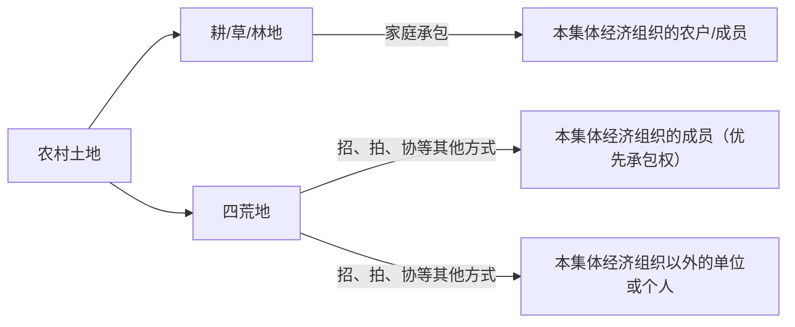

以下是经过格式整理、重点标记以及相关格式转换后的内容：

# 章节概述
**用益物权**

# 考点列表
## 考点1：土地承包经营权
### 含义：
土地承包经营权，是指土地承包经营权人为从事种植业、畜牧业、林业，对其承包的集体所有或国家所有由农民集体使用的土地所享有的占有、使用和收益的权利。据此可知，**土地承包经营权是一种以土地为标的物的用益物权**。

### 双层经营体制
1. 农村土地包括两个部分：
    - 集体所有的土地；
    - 国家所有由农民集体使用的土地。
2. 方式


### 内容：
1. 设立
    - 公式对抗主义立法模式（熟人模式）
    - 登记造册
2. 流转和限制
    - 意义：
土地承包经营权的流转，有利于促进农村生产力的发展，实现农村劳动力转移和优化农村土地资源配置，有利于推动农村土地承包关系的长期稳定。
    - 限制结论：
**土地承包经营权自合同生效时设立。流转时，未经登记不得对抗善意第三人。**
**流转期限为5年以上的土地经营权，自流转合同生效时设立。当事人可以向登记机构申请土地经营权登记；未经登记，不得对抗善意第三人**。
    - 以下是关于土地经营权的流转和限制的表格信息（转换为mermaid表格格式）：
```mermaid
table
    title 土地经营权的流转和限制
    |项目|家庭承包|其他方式承包 (招标、拍卖、公开协商等)|
    |----|----|----|
    |流转对象|本集体经济组织分配的农业用地 (耕地、草地和林地)|荒山、荒沟、荒丘、荒滩 (“四荒”地)|
    |流转方式|出租、入股或其他方式 (《民法典》第 339 条)|出租、入股、抵押或其他方式 (《民法典》第 342 条)|
    |价值理念|平均分配，既具有生产经营性质，又具有社会保障性质|市场化原则|
    |有无对价|无偿|有偿|
    |限制程度|自主决定/开展 (没有限制)|经依法登记取得权属证书|
```

## 考点2：居住权
### 框架
以下是关于地役权和相邻关系的区别的表格信息（转换为mermaid表格格式）：
```mermaid
table
    title 地役权和相邻关系的区别
    |项目|地役权|相邻关系|
    |----|----|----|
    |调节程度|享受性权利（通行便利和观看风景）|最低限度的容忍义务|
    |产生原因|意定（书面约定/书面协议）|法定|
    |是否有偿|可有偿可无偿，但通常有偿|无偿|
    |是否有期限|有期|无期|
    |是否毗邻|不一定|是|
```

### 含义：
地役权，是指为了自己不动产使用的便利和效益，按照合同约定而使用他人不动产的权利，如通行权、取水权、采光权、眺望权。其中，为自己不动产的便利而使用他人土地的一方称为需役地人或地役权人，将自己的不动产供他人使用的一方称为供役地人。相邻关系，是指两个或两个以上相互毗邻的不动产的所有人或使用人，在行使占有、使用、收益、处分权利时发生的权利义务。

### 区别
1. 地役权和相邻关系的区别主要包括如下5点: 
    - 调节程度不同。地役权是地役权人为自己不动产的便利而设定的权利，本质上属于一种享受性权利，如通行便利(积极地役权中的通行地役权)和观看风景(消极地役权中的眺望地役权)；而相邻关系则属于最低限度的容忍义务，如容忍邻居在合理时间内装修房屋。
    - 产生原因不同。地役权是意定的，即基于双方当事人的协议或合同而产生；而相邻关系是法定的。因此，如果题目中看到“协议、合同”这样的关键词时，结论就是地役权而非相邻关系。
    - 是否有偿不同。地役权可有偿可无偿，但通常是有偿的；而相邻关系是无偿的。 因此，如果题目中看到“价款”这样的关键词时，结论就是地役权而非相邻关系。
    - 是否有期限不同。地役权是有期限的，而相邻关系是无期限的。因此，如果题目中看到“几年”这样的关键词时，结论就是地役权而非相邻关系。
    - 是否毗邻不同。地役权中的需役地和供役地不一定是相互毗邻的，只要三者之间有互为利用之必要即可；但相邻关系一定是毗邻的。
2. (二)地役权的转让
    - 需役地转让。
        - 案例分析：
[例]甲公司与乙公司约定:为满足甲公司开发住宅小区观景的需要，甲公司向己公司支付100万元，乙公司在20年内不在自己厂区建造6米以上的建筑。甲公司将金部房屋售出后不久，乙公司在自己的厂区建造了一栋8米高的厂房。请问:谁有权请求乙公司拆除超过6米的建筑呢?
在地役权中包括两块土地，一块是“需役地”，另一块是“供役地”。在需役地转让的情况下，甲将全部房屋转让给丙后，就退出了地役权法律关系。同时，因地役权具有从属性(地役权属于从权利)。此后，只有丙才能向乙主张地役权。因此，本题中，只有小区业主才有权请求乙公司拆除超过6米的建筑，且小区的每一个业主都有权主张金部地役权。此时，体现的就是热役权具有不可分性。
    - 供役地转让。
        - [例]甲为了能在自己的房子里欣赏远处的风景，便与相邻的乙約定:乙不在自己的土地上从事高层建筑；作为补偿，甲每年支付给乙4000元。两年后，乙将该土地使用权转让给丙。丙在该土地上建造了一座高楼，与甲发生纠纷。对此纠纷。请问:甲是否有权不让丙建造高楼呢? 答:无权。  
答：地役权自地役权合同生效时设立，未经登记不得对抗善意第三人。善意第三人只有在供役地转让时才会出现，也就是图示中的“丙”。在题目中没有提及是否已经登记的，视为没有登记。本题中，由于甲和乙签订的地役权合同并未登记。因此，不得对抗善意第三人丙(因未登记，丙在受让时不知该土地上有负担，属于善意第三人)，换句话说就是内有权建造高楼。
    - 需役地和供役地均转让
需役地和供役地均发生变动的情况下，分别处置即可。本题与供役地转让一样，因末登记，不得对抗善意第三人丁，丁有权建高楼，丙无权禁止
案例分析：
[例]甲为了能在自己房中败赏远处风景，便与相邻的乙约定:乙不在自己的土地上建造高层建筑，作为补偿，甲一次性支付给乙4万元。两年后，甲将房屋转让给丙，乙将该二地使用权转让给丁。请问:丙可否禁止丁建高楼呢? 答:不可以。

# 复习总结
## 本章重点
总结本章的重点内容

## 易错点
列出本章容易出错的知识点

## 复习建议
提供复习建议或策略

# 备注
- 可以根据需要添加额外的章节或调整模板结构。
- 使用思源笔记的标签功能，可以为每个章节、考点、法条和案例添加标签，方便后续检索和复习。

<iframe src="/widgets/Wordcounter/" data-src="/widgets/Wordcounter/" data-subtype="widget" border="0" frameborder="no" framespacing="0" allowfullscreen="true" style="width: 762px; height: 354px;"></iframe> 