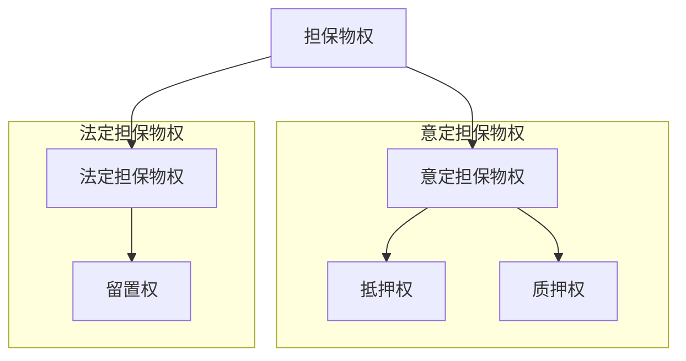
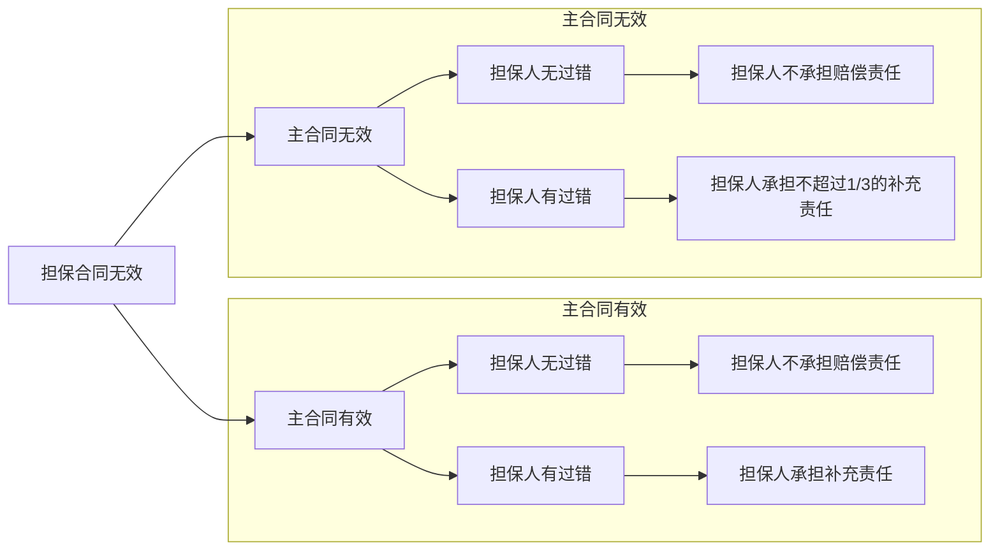
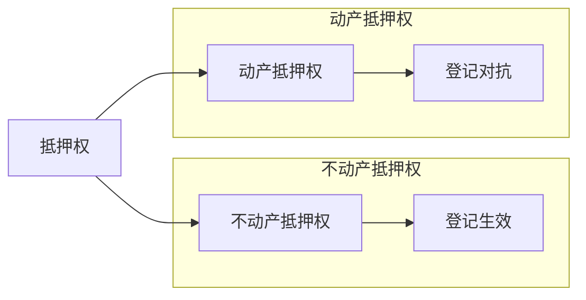
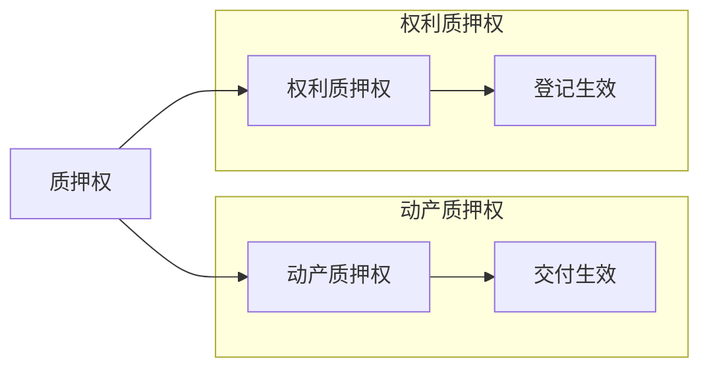
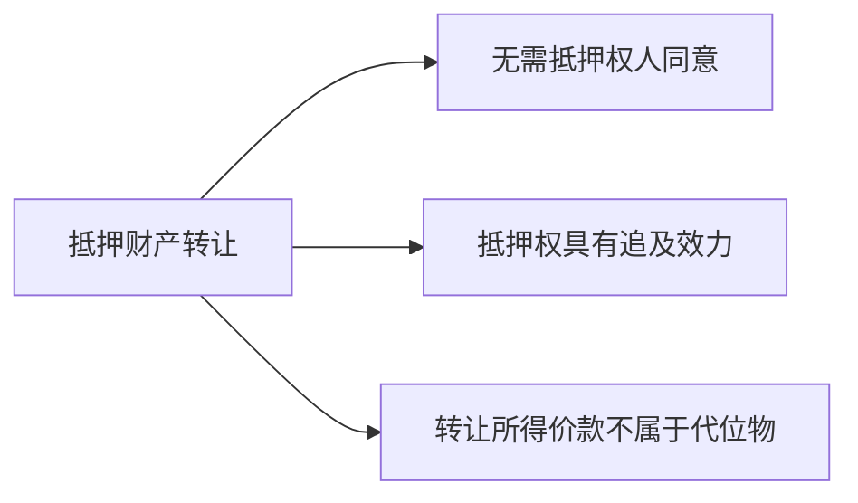
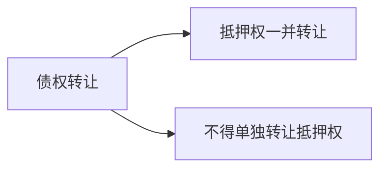
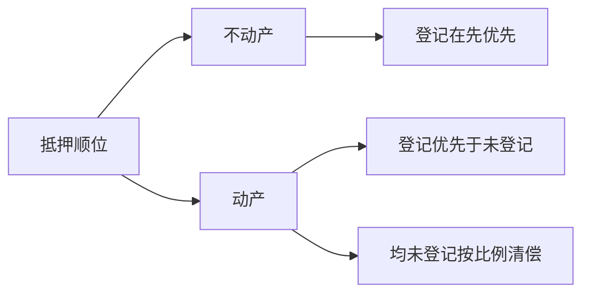
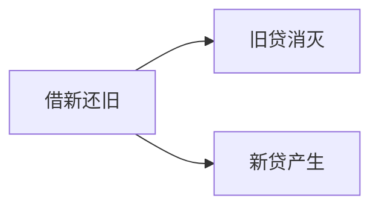
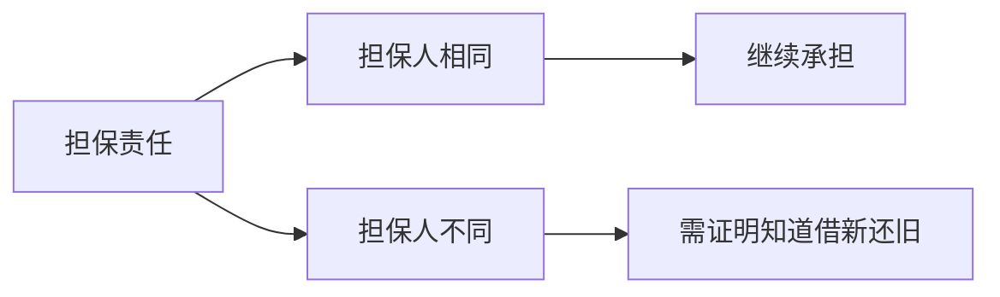

以下是优化后的MD文件内容，修正了格式、缩进和内容关系，标记了重点文字，并将HTML表格转换为Mermaid格式：

---

# 章节：物权

## **章节概述**  
担保物权是指债权人为了保障债权的实现，依法对债务人或第三人的特定财产享有的优先受偿权。

---

## **考点列表**

### **考点1：担保物权的基本原理**

#### **1. 担保物权的分类**  

#### **2. 担保物权的特征**  
1. **从属性**：担保物权从属于主债权，主债权无效，担保物权无效；  
2. **不可分性**：担保物权的效力及于担保物的全部，不因担保物或主债权的分割而受影响；  
3. **物上代位性**：担保物毁损、灭失或被征收时，担保物权人可就获得的保险金、赔偿金或补偿金优先受偿；  
4. **优先受偿性**：担保物权人对担保物享有优先受偿权。

#### **3. 担保合同无效的法律后果**  

---

### **考点2：抵押权**

#### **1. 抵押权的设立**  

#### **2. 抵押权的效力**  
1. **优先受偿权**：抵押权人对抵押物享有优先受偿权；  
2. **物上代位性**：抵押物毁损、灭失或被征收时，抵押权人可就获得的保险金、赔偿金或补偿金优先受偿；  
3. **不可分性**：抵押权的效力及于抵押物的全部，不因抵押物或主债权的分割而受影响。

#### **3. 抵押权的实现**  
1. **协议实现**：抵押权人与抵押人协议以抵押物折价或拍卖、变卖抵押物优先受偿；  
2. **诉讼实现**：抵押权人向人民法院提起诉讼，请求拍卖、变卖抵押物优先受偿。

---

### **考点3：质押权**

#### **1. 质押权的设立**  

#### **2. 质押权的效力**  
1. **优先受偿权**：质权人对质押物享有优先受偿权；  
2. **物上代位性**：质押物毁损、灭失或被征收时，质权人可就获得的保险金、赔偿金或补偿金优先受偿；  
3. **不可分性**：质押权的效力及于质押物的全部，不因质押物或主债权的分割而受影响。

---

### **考点4：留置权**

#### **1. 留置权的设立**  
留置权是法定担保物权，债权人依法对债务人的动产享有留置权。

#### **2. 留置权的效力**  
1. **优先受偿权**：留置权人对留置物享有优先受偿权；  
2. **物上代位性**：留置物毁损、灭失或被征收时，留置权人可就获得的保险金、赔偿金或补偿金优先受偿；  
3. **不可分性**：留置权的效力及于留置物的全部，不因留置物或主债权的分割而受影响。

---
以下是优化后的MD文件内容，修正了格式、缩进和内容关系，标记了重点文字，并将HTML表格转换为Mermaid格式：

---

# 章节：担保物权

## **章节概述**  
担保物权是指债权人为了保障债权的实现，依法对债务人或第三人的特定财产享有的优先受偿权。

---

## **考点列表**

### **考点1：抵押财产的转让**

#### **1. 抵押合同无特殊约定**  
抵押期间，抵押人可以转让抵押财产，抵押权具有追及效力。转让所得价款不属于代位物，抵押权人不得主张物上代位权。

**案例分析**：  
[例]孟某将房屋抵押给马某后，将房屋转让给曹某。  
1. **是否需要马某同意**：不需要；  
2. **转让行为性质**：有权处分；  
3. **合同效力**：合法有效；  
4. **抵押权效力**：马某仍可对曹某的房屋行使抵押权。

#### **2. 抵押合同有特殊约定**  

**案例分析**：  
[例]孟某与马某约定禁止转让抵押房屋。  
1. **未登记**：曹某可取得房屋所有权，马某可追究孟某违约责任；  
2. **已登记**：曹某无法取得房屋所有权，马某可追究孟某违约责任。

---

### **考点2：抵押权的转让**

#### **1. 转让规则**  
抵押权不得与债权分离而单独转让或作为其他债权的担保。债权转让的，抵押权一并转让。

**案例分析**：  
[例]马某将债权转让给工商银行，抵押权一并转让。

#### **2. 放弃抵押权**  
抵押权人放弃抵押权的，其他担保人在抵押权人丧失优先受偿权益的范围内免除担保责任。

**案例分析**：  
[例]马某放弃孟某的房屋抵押权，保证人曹某在850万元范围内免责。

---

### **考点3：抵押权的顺位**

#### **1. 顺位规则**  

**案例分析**：  
[例]孟某将房屋抵押给马某、曹某、王某，依次登记。马某优先受偿。

#### **2. 顺位变更**  
抵押权人与抵押人可以协议变更顺位，但不得对其他抵押权人产生不利影响。

---

### **考点4：超级动产抵押权**

#### **1. 含义**  
超级动产抵押权（购买价金担保权）优先于其他担保物权，需在交付后10日内登记。

**案例分析**：  
[例]甲公司购买设备后10日内登记超级动产抵押权，优先于工商银行的浮动抵押权。

---

### **考点5：最高额抵押权**

#### **1. 含义**  
最高额抵押权是对一定期间内连续发生的债权提供担保，债权确定前部分债权转让的，抵押权不转让。

**案例分析**：  
[例]众森公司为未来3年贷款提供最高额抵押，工商银行转让部分债权，抵押权不转让。

---

### **考点6：借新还旧**

#### **1. 含义**  
借新还旧是指以新贷款偿还旧贷款，旧贷消灭，新贷产生。

#### **2. 担保责任**  
新贷与旧贷担保人相同时，担保人继续承担担保责任；不同时，需证明新贷担保人知道借新还旧事实。

---

## **复习总结**

### **本章重点**  
1. 抵押财产的转让与追及效力；  
2. 抵押权的转让与放弃；  
3. 抵押权的顺位与超级动产抵押权；  
4. 最高额抵押权与借新还旧。

### **易错点**  
1. 抵押权与债权的关系；  
2. 抵押财产转让的法律后果；  
3. 超级动产抵押权的优先效力。

### **复习建议**  
1. 熟记抵押权的核心规则；  
2. 通过案例理解抵押权的设立与实现；  
3. 对比记忆不同类型担保物权的异同。

---

## **备注**  
1. 可以根据需要添加额外的章节或调整模板结构；  
2. 使用思源笔记的标签功能，为每个章节、考点、法条和案例添加标签，方便后续检索和复习。

---

优化后的内容更加清晰，重点突出，便于阅读和理解。如果有其他需求，请随时告诉我！