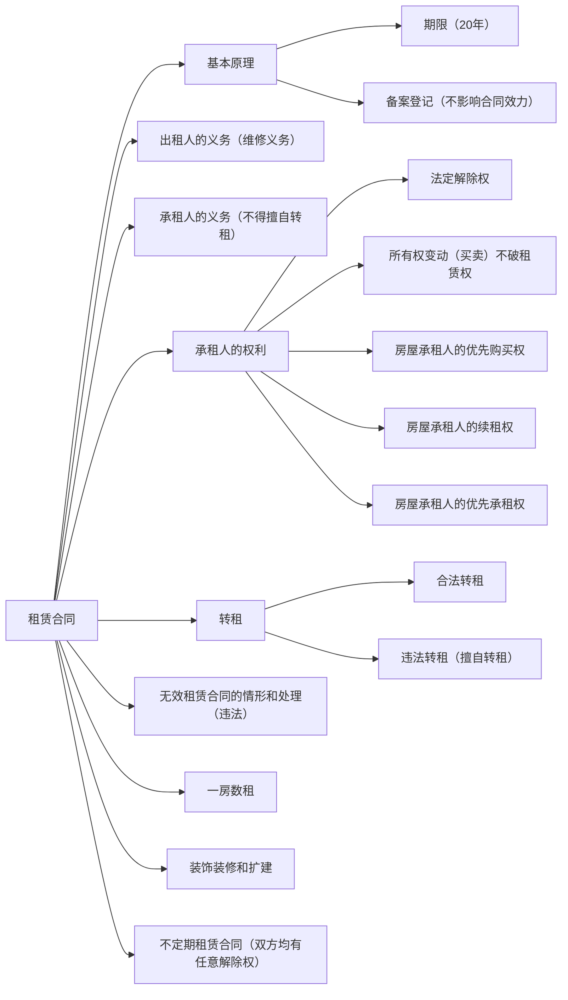

# 合同编相关知识整理
## 框架
### 第一分编：通则
- **范围**：第463条至第594条，共132条，约占合同编的25%。
- **构成**：包括8章，分别为一般规定、合同的订立、合同的效力、合同的履行、合同的保全、合同的变更和转让、合同的权利义务终止、违约责任 。

### 第二分编：典型合同
- **范围**：第595条至第978条，共384条，约占合同编的73%。
- **构成**：包括19章，涵盖买卖合同、供用电、水、气、热力合同、赠与合同、借款合同、保证合同、租赁合同、融资租赁合同、保理合同、承揽合同、建设工程合同、运输合同、技术合同、保管合同、仓储合同、委托合同、物业服务合同、行纪合同、中介合同、合伙合同 。

### 第三分编：准合同
- **范围**：第979条至第988条，共10条，约占合同编的2%。
- **构成**：包括2章，分别是无因管理和不当得利。

## 章节概述
## 考点列表
### 考点：买卖合同
#### 基本原理
- **含义**：买卖合同是出卖人转移标的物的所有权于买受人，买受人支付价款的合同。
- **无权处分的买卖合同**：
    - **合同效力**：基于“物债两分”的区分原则，买卖合同的生效仅在买卖双方产生债权效力（互相对对方享有债权请求权），而不能直接发生物权变动（物权效力）。
    - **救济途径**：因出卖人未取得处分权致使标的物所有权不能转移的，买受人可以解除合同并请求出卖人承担违约责任。

#### 案例分析
- **例**：3月2日，马某以自己的名义将孟某的手表以127500元出卖给欲参加法考的曹某，双方约定4月21日取表时付款。
    - **3月2日行为判断**：马某以自己的名义将孟某的手表出卖给曹某的行为是无权处分，因为无权处分是指以自己的名义处分他人或共有的财产。
    - **合同效力**：马某和曹某签订的手表买卖合同合法有效，因为买卖合同的生效仅导致出卖人负有移转标的物所有权的义务，并不直接引起物权变动，所以即使出卖人对标的物尚无所有权或处分权也不影响合同效力。
    - **4月2日情况分析**：若4月2日马某以27500元从孟某处购得该手表并于4月21日将手表交付于曹某，获得127500元，此时马某获得的10万元不构成不当得利，因为马某基于合法有效的合同而取得差价10万元。
    - **无法交付手表的救济**：若4月2日马某以27500元向孟某求购手表，孟某不同意，导致4月21日马某无法向曹某交付手表，曹某可以解除和马某的手表买卖合同，同时追究马某的违约责任。

### 考点：当事人的义务
#### 给付义务
- **出卖人的从给付义务**：出卖人应当按照约定或交易习惯向买受人交付提取标的物单证以外的有关单证和资料，主要包括保险单、保修单、普通发票、增值税专用发票、产品合格证、质量保证书、质量鉴定书、品质检验证书、产品进出口检疫书、原产地证明书、使用说明书、装箱单等。
    - **要点**：从给付义务的违反构成违约，可以追究违约责任；原则上不可以解除合同，除非构成根本违约；从给付义务的违反并不影响风险转移；从给付义务的违反不构成重大误解；从给付义务的违反不得主张惩罚性赔偿。
- **买受人的通知义务**：出卖人多交标的物的，买受人可以接收或拒绝接收多交的部分。买受人接收多交部分的，按照约定的价格支付价款；买受人拒绝接收多交部分的，应当及时通知出卖人。

### 考点：风险负担
#### 含义
风险负担是指在合同订立后，标的物因不可归责于任何一方的事由（主观要件）而发生的意外毁损、灭失（客观要件）的损失由何方负担。

#### 原则
买卖合同中的风险负担规则属于任意性、补充性规定，应由当事人根据具体状况、运输方式、当事人所处位置等综合确定，原则上有约从约。

#### 例外
- **交付主义**：
    - **含义**：以标的物的交付作为风险转移的时间标准，在标的物交付于买受人之前由出卖人承担风险，在标的物交付于买受人之后则由买受人承担风险。
    - **情形**：交付既包括现实交付，又包括观念交付（简易交付、指示交付和占有改定），不动产和动产均适用。
        - **不动产买卖合同**：
|项目|交付（交房）|登记（过户）|债权效力（风险转移）|物权效力（物权变动）|
| -------| --------------| --------------| ----------------------| ----------------------|
|情形1|否|否|未转移|未变动|
|情形2|是|是|转移|变动|
|情形3|是|否|转移|未变动|
|情形4|否|是|未转移|变动|
        - **动产买卖合同**：
|项目|情形|交钱完毕|交付|债权效力（风险转移）|物权效力（物权变动）|
| --------------------| -------| ----------| ------| ----------------------| ----------------------|
|普通动产买卖|情形1|不考虑|否|未转移|未变动|
|普通动产买卖|情形2|不考虑|是|转移|变动|
|动产所有权保留买卖|情形1|否|否|未转移|未变动|
|动产所有权保留买卖|情形2|是|是|转移|变动|
|动产所有权保留买卖|情形3|是|否|未转移|变动|
|动产所有权保留买卖|情形4|否|是|转移|未变动|
        - **违约在先**：
            - 因买受人的原因致使标的物未按照约定的期限交付的，买受人应当自违反约定时起承担标的物毁损、灭失的风险。
            - 出卖人按照约定将标的物置于交付地点，买受人违反约定没有收取的，标的物毁损、灭失的风险自违反约定时起由买受人承担。
            - 因标的物不符合质量要求，致使不能实现合同目的（根本违约）的，买受人可以拒绝接受标的物或解除合同。买受人拒绝接受标的物或解除合同的，标的物毁损、灭失的风险由出卖人承担。
        - **代办托运**：
            - 当事人约定明确的交付地点的，出卖人将货物交付承运人时，风险不发生转移。待承运人将标的物运抵该地点，交付给买受人时，风险转移给买受人。
            - 当事人没有约定交付地点或约定不明确，出卖人将标的物交付给第一承运人后，标的物毁损、灭失的风险由买受人承担。
        - **在途货物**：
            - **特征**：在途货物买卖是凭单据的交易，买卖双方只能凭单据判断标的物状况；订立合同时，标的物已脱离出卖人实际控制；出卖人交付运输时通常会对标的物投保，合同签订后单据及保险单会转移给买受人。
            - 出卖人出卖交由承运人运输的在途标的物，除当事人另有约定外，毁损、灭失的风险自合同成立时起由买受人承担。出卖人在合同成立时知道或应当知道标的物已经毁损、灭失却未告知买受人，买受人主张出卖人负担标的物毁损、灭失风险的，法院应予支持。

#### 风险负担与从交付义务
出卖人按照约定未交付有关标的物的单证和资料的，不影响标的物毁损、灭失风险的转移。

#### 风险负担与违约责任
标的物毁损、灭失的风险由买受人承担的，不影响因出卖人履行债务不符合约定，买受人请求其承担违约责任的权利。

### 考点：共同担保
#### 共同保证
- **含义与特征**：
    - **特征**：保证人人数系两个以上；两个以上的保证人必须是为同一债权人的同一债权提供保证；共同保证人的责任形式有按份责任和连带责任。
- **方式**：
    - **类型1**：孟某向徐某借款1000万元，马某、曹某与徐某签订保证合同，约定如孟某到期不能还款，马某、曹某承担保证责任，保证份额为马某承担40%、曹某承担60%。
        - **起诉**：债权人徐某诉讼方案有四，可单独起诉孟某，或将孟某和马某、孟某和曹某、孟某与马某和曹某作为共同被告。
        - **执行**：因马某和曹某系一般保证人，享有先诉抗辩权，所以法院应判决先执行孟某财产，不足部分再执行马某和曹某的财产。
    - **类型2**：孟某向徐某借款1000万元，马某、曹某与徐某签订保证合同，约定如孟某到期不能还款，马某、曹某承担保证责任 。
        - **起诉**：同类型1，徐某有四种诉讼方案。
        - **执行**：马某和曹某系一般保证人，享有先诉抗辩权，先执行孟某财产，不足部分再执行马某和曹某财产。
    - **类型3**：孟某向徐某借款1000万元，马某、曹某与徐某签订保证合同，约定马某、曹某提供连带责任保证，保证份额为马某承担40%、曹某承担60% 。
        - **起诉**：债权人徐某诉讼方案有七，可单独起诉孟某、马某、曹某，或将孟某和马某、孟某和曹某、马某和曹某、孟某与马某和曹某作为共同被告。
        - **执行**：马某和曹某系连带责任保证人，不享有先诉抗辩权，法院可判决徐某可任意选择执行孟某、马某和曹某的财产，单独执行马某财产时，马某承担不超过400万元保证责任；单独执行曹某财产时，曹某承担不超过600万元保证责任。
    - **类型4**：孟某向徐某借款1000万元，马某、曹某与徐某签订保证合同，约定马某、曹某提供连带责任保证。
        - **起诉**：徐某有七种诉讼方案，同类型3。
        - **执行**：马某和曹某系连带责任保证人，不享有先诉抗辩权，徐某可任意选择执行孟某、马某和曹某的财产，单独执行时均可请求全部。
- **总结**

#### 共同物保
- **按份共同物保**：
    - **例**：甲公司以机器设备为乙公司设立质权，后丙公司向银行贷款，甲公司将机器设备抵押给银行担保部分贷款，丙公司以房产抵押担保其余贷款，甲公司又将机器设备抵押给丁公司。
    - **问题分析**：
        - 如银行主张全部债权，应先拍卖房产实现抵押权的观点不正确，因为是按份共同物保，应按比例行权，拍卖丙公司房产获60万元，拍卖甲公司机器设备获40万元。
        - 如银行主张全部债权，可选择拍卖房产或机器设备实现抵押权的观点也不正确，同样应按比例行权。
        - 乙公司的质权效力优先于银行对机器设备的未登记抵押权，因为未登记的动产抵押权不得对抗善意第三人。
        - 乙公司的质权效力优先于丁公司对机器设备的抵押权，基于成立（公示）在先原则。
- **连带共同物保**：
    - **连带债务人提供的物保和第三人提供的物保并存**：
        - **例**：众森公司向工商银行贷款，以自己办公楼和海马公司厂房抵押。
        - **起诉**：如众森公司到期不能还款，工商银行诉讼实现担保物权，应以众森公司和海马公司为共同被告。
        - **执行**：存在争议，本书采“有顺序说”，应先执行债务人众森公司的物保，不足部分再拍卖海马公司财产。
    - **连带第三人提供的物保和第三人提供的物保并存**：
        - **例**：众森公司向工商银行贷款，佳茵公司以机器设备、海马公司以厂房抵押。
        - **起诉**：如众森公司到期不能还款，工商银行诉讼实现担保物权，应以众森公司、佳茵公司和海马公司为共同被告。
        - **执行**：工商银行在执行层面可任意选择佳茵公司和海马公司，无顺序先后限制，佳茵公司和海马公司仅以提供担保的财产承担有限责任。
- **混合担保**：
    - **含义与类型**：在同一个债权债务关系中，既有物的担保，又有人的担保的情形。
    - **连带债务人提供的物保和保证（人保）并存**：债权人工商银行实现债权时，有约从约，无约时应先就债务人提供的物保实现债权。
    - **连带第三人提供的物保和保证（人保）并存**：债权人工商银行实现债权无顺序，可任意选择执行各担保人财产。

#### 共同担保人之间的内部追偿权
- **共同担保人互相不知对方的存在**：在共同担保情形下，担保人之间互相追偿的前提是互相知道对方存在，如互相不知，则担保人之间无追偿权，承担担保责任的担保人均向主债务人（最终责任人）追偿。
- **连带共同担保**：连带共同担保人互相之间有追偿权，但原则上有顺序，应先向主债务人追偿，不足部分再请求其他担保人按比例分担。在连带共同担保人之间单独约定相互追偿及分担份额的，追偿时无顺序 。

#### 反担保
- **含义**：又称“求偿担保”，是指债务人或第三人向担保人作出保证或设定物的担保，在担保人因履行债务或承担责任而遭受损失时，向担保人作出清偿。
- **类型**：既可以设立人的担保（保证），也可以设立物的担保（抵押和质押），包括求偿保证（反担保人只能是债务人以外的第三人，以信誉确保担保人追偿权实现）、求偿抵押（债务人或债务人以外第三人以财产作抵押确保追偿权实现）、求偿质押（债务人或债务人以外第三人以财产提供质押确保追偿权实现）。

### 专题五“租赁合同”
#### 考点：租赁合同体系

#### 基本原理
- **含义**：通过租赁，可在自然人、法人和非法人组织之间调剂余缺，充分发挥物的使用价值，满足出租人和承租人双方利益。
- **期限**：租赁合同的最长租赁期限不得超过20年，超过部分无效。租赁期间届满，当事人可续订租赁合同，但约定的租赁期限自续订之日起不得超过20年。
- **备案登记**：租赁合同的备案登记属于管理性（取缔性）强制性规定，当事人未办理登记备案手续的，不影响合同效力。
- **形式**：租赁期限不满6个月的，既可以采用书面形式，也可以采用口头形式；租赁期限6个月以上的，应当采用书面形式。
- **风险负担**：因不可归责于承租人的事由，致使租赁物部分或全部毁损、灭失的，承租人可以请求减少租金或不支付租金；因租赁物部分或全部毁损、灭失，致使不能实现合同目的（根本违约）的，承租人可以解除合同。

### 二、出租人和承租人的义务
#### （一）出租人的义务
1. **交付租赁物和租赁物瑕疵担保义务**：出租人有责任按约定将符合质量要求的租赁物交付给承租人，并确保租赁物在租赁期间符合约定用途。
2. **维修义务**：
    - **有约从约**：租赁合同双方可自行约定维修义务承担方，充分尊重当事人意思自治，按约定执行。
    - **无约，出租人负有法定维修义务**：基于租赁物瑕疵担保责任，出租人需负责维修。承租人发现租赁物需维修时，应请求出租人在合理期限内维修；若出租人未履行，承租人可自行维修，费用由出租人承担，且因维修影响使用时，应相应减少租金或延长租期。
    - **因承租人过错导致的，承租人自行维修**：当承租人未按约定方法或租赁物性质使用，导致租赁物毁损需维修时，出租人不承担维修义务，由承租人自行负责。
3. **权利瑕疵担保义务**：若第三人对租赁物主张权利，致使承租人无法正常使用、收益，承租人有权请求减少租金或不支付租金，且应及时通知出租人。

#### （二）承租人的义务
1. **正当使用义务**：承租人不得擅自变动房屋建筑主体和承重结构或扩建，否则在出租人要求的合理期限内未恢复原状，出租人可依《民法典》第711条规定，请求解除合同并要求赔偿损失。
2. **妥善保管义务**：承租人需妥善保管租赁物，因保管不善造成租赁物毁损、灭失的，需承担赔偿责任。
3. **不作为义务**：
    - **禁止添附**：经出租人同意，承租人可对租赁物进行改善或增设他物；未经同意的，出租人有权请求承租人恢复原状或赔偿损失。
    - **禁止转租**：经出租人同意，承租人可转租，转租后原租赁合同继续有效，第三人造成租赁物损失的，承租人担责；未经同意擅自转租，出租人可解除合同。
4. **支付租金义务**：
    - **租金支付期限**：有约定按约定支付；无约定时，租赁期限不满一年的，在租赁期限届满时支付；一年以上的，每届满一年支付，剩余期限不满一年的，在租赁期限届满时支付。
    - **欠付租金的处理**：承租人无正当理由未支付或迟延支付租金，出租人可请求其在合理期限内支付；逾期不支付，出租人有权解除合同。
5. **返还租赁物义务**：租赁期限届满，承租人应返还租赁物，且返还的租赁物需符合按约定或租赁物性质使用后的状态。

#### （三）承租人权利
1. **法定解除权**：
    - 非因承租人原因致使租赁物无法使用，如租赁物被司法机关或行政机关依法查封、扣押；租赁物权属有争议；租赁物具有违反法律、行政法规关于使用条件的强制性规定情形，承租人可解除合同。
    - 因不可归责于承租人的事由，致使租赁物部分或全部毁损、灭失，承租人可请求减少租金或不支付租金；若因此不能实现合同目的，可解除合同。
    - 租赁物危及承租人安全或健康，即便承租人订立合同时明知租赁物质量不合格，仍可随时解除合同。
2. **所有权变动（买卖）不破租赁权**：
    - “买卖”作扩张解释，涵盖赠与、继承、互换、互易、出资等导致所有权变动的行为。
    - 原则上，基于成立在先原则，租赁物在承租人依据租赁合同占有期限内发生所有权变动，不影响租赁合同效力。
    - 例外情况为，先押（登记）后租，即在出租前已设立抵押权，因抵押权人实现抵押权发生所有权变动；先封后租，即在出租前已被人民法院依法查封。
3. **房屋承租人的优先购买权**：
    - **对象**：仅房屋承租人享有，旨在保护其居住利益，维护租赁形成的稳定生活秩序。
    - **例外**：
        - 房屋共有人行使优先购买权，因其源于物权关系，效力强于房屋承租人基于租赁合同关系产生的优先购买权。按份共有人 > 次承租人 > 承租人。
        - 出租人将房屋出卖给近亲属，可阻却承租人优先购买权行使。
        - 出租人履行通知义务后，承租人15日内未明确表示购买，视为放弃。
        - 第三人善意购买租赁房屋并已办理登记手续。
    - **放弃**：出租人委托拍卖人拍卖租赁房屋，应在拍卖5日前通知承租人，承租人未参加拍卖视为放弃。
    - **救济**：出租人未通知或妨害承租人行使优先购买权，承租人可请求其承担损害赔偿责任，但出租人与第三人订立的房屋买卖合同效力不受影响。
4. **房屋承租人的续租权**：承租人在房屋租赁期间死亡，与其生前共同居住的人（民事）或共同经营人（商事）可按原租赁合同租赁该房屋。
5. **房屋承租人的优先承租权**：租赁期间届满，房屋承租人在同等条件下享有优先承租权利。

#### （四）转租
1. **合法转租**：
    - **含义**：经出租人同意的转租。
    - **法律后果**：
        - 原租赁合同继续有效，第三人造成租赁物损失，承租人担责。
        - 超期转租，转租期限超过承租人剩余租赁期限的，超过部分约定对出租人无约束力，除非另有约定。
2. **未经出租人同意的转租（违法转租或擅自转租）**：
    - **含义**：承租人未经出租人同意将租赁物转租给第三人。
    - **法律后果**：出租人可行使合同解除权，解除与承租人的租赁合同。

#### （五）无效租赁合同的情形和处理
1. **情形违法**：建筑物租赁合同，未取得建设工程规划许可证或临时建筑未批准。
2. **处理房屋**：租赁合同无效，出租人无权主张租金，但可请求参照合同约定租金标准，基于不当得利请求支付房屋占有使用费。

#### （六）一房数租
1. **合同效力**：一房数租的租赁合同均合法有效。
2. **排序**：合法占有者 > 登记备案者 > 合同成立在先者（类似特殊动产的一物数卖） 。
3. **处理**：未履行合同的承租人，因合同目的无法实现，可解除合同并请求出租人承担违约责任赔偿损失。

#### （七）装饰装修和扩建
1. **装饰装修**：
    - **经出租人同意**：可对租赁物进行改善或增设他物。费用处理有约从约；无约时，租赁期间届满，承租人不得请求出租人补偿附合装饰装修费用。
    - **未经出租人同意**：出租人可要求承租人恢复原状或赔偿损失。
2. **扩建**：
    - **经出租人同意**：未约定扩建费用处理时，办理合法建设手续的，扩建造价费用由出租人负担；未办理的，由双方按过错分担。
    - **未经出租人同意**：扩建费用由承租人负担，出租人可请求恢复原状或赔偿损失。

#### （八）不定期租赁合同
1. **含义**：没有约定租期或对租期约定不明，且事后无法协商确定租期的租赁合同。
2. **情形**：
    - 租赁期限6个月以上未采用书面形式，无法确定租赁期限，视为不定期租赁。
    - 对租赁期限无约定或约定不明，依《民法典》第510条仍不能确定，视为不定期租赁，当事人可随时解除合同，但应在合理期限前通知对方。
    - 租赁期间届满，承租人继续使用租赁物，出租人无异议，原租赁合同继续有效，但租赁期限不定期。
3. **行权**：当事人可随时行使任意解除权，但需在合理期限前通知对方。

### 专题六 融资租赁合同
#### （一）含义
融资租赁合同是出租人根据承租人对出卖人、租赁物的选择，向出卖人购买租赁物，提供给承租人使用，承租人支付租金的合同。

#### （二）效力
当事人以虚构租赁物方式订立的融资租赁合同无效；依照法律、行政法规规定，租赁物经营使用应取得行政许可的，出租人未取得行政许可不影响融资租赁合同效力。

#### （三）特征
1. **不同于买卖**：
    - 出租人依承租人对出卖人、租赁物的选择订立买卖合同，出卖人向承租人直接交付标的物，承租人享有买受人受领标的物相关权利。
    - 三方可约定，出卖人不履行买卖合同义务，由承租人行使索赔权利，出租人协助。
    - 出卖人交付的标的物不能利用，承租人可要求修理或更换；无法实现合同目的，可解除合同并要求赔偿损失。
2. **不同于租赁**：
    - 租赁物不符合约定或使用目的，出租人一般不承担责任，除非承租人依赖出租人的技能确定租赁物或出租人干预选择租赁物。
    - 承租人承担占有租赁物期间的维修义务。
    - 承租人占有租赁物期间，租赁物毁损、灭失，出租人有权请求承租人继续支付租金，法律另有规定或当事人另有约定除外。
    - 承租人应按约定支付租金，经催告后合理期限内仍不支付，出租人可请求支付全部租金或解除合同收回租赁物。
    - 承租人占有租赁物期间，租赁物造成第三人的人身伤害或财产损害，出租人不承担责任。

#### （四）租赁物的归属
1. 出租人和承租人可约定租赁期限届满租赁物的归属；无约定或约定不明，依《民法典》第510条仍不能确定，租赁物所有权归出租人。
2. 当事人约定租赁期限届满，承租人仅需向出租人支付象征性价款，视为租金义务履行完毕后租赁物所有权归承租人。

### 专题七 保理合同
#### （一）含义和形式
保理合同是应收账款债权人将现有的或将有的应收账款转让给保理人，保理人提供资金融通、应收账款管理或催收、应收账款债务人付款担保等服务的合同，应当采用书面形式 。

#### （二）虚构应收账款的处理
保理人在订立合同前尽职调查，债务人确认应收账款真实存在后签订相关文件，若债务人以基础交易合同不实等为由抗辩，保理人权利维护需依据具体情况判定。

#### （三）保理人的通知规则
保理人向应收账款债务人发出应收账款转让通知时，应表明保理人身份并附有必要凭证。

#### （四）基础交易变更或终止对保理人的效力
应收账款债务人接到转让通知后，债权人和债务人无正当理由协商变更或终止基础交易合同，对保理人产生不利影响的，对保理人不发生效力。

#### （五）种类
1. **有追索权保理**：
    - **含义**：又称回购型保理，应收账款到期无法从债务人处收回时，保理人可向债权人反转让应收账款，要求回购或归还融资。
    - **规则**：当事人约定有追索权保理，保理人可向债权人主张返还保理融资款本息或回购应收账款债权，也可向债务人主张应收账款债权。
2. **无追索权保理**：
    - **含义**：又称断型保理，应收账款在无商业纠纷等情况下无法得到清偿，由保理人承担坏账风险，本质是真正债权转让。
    - **规则**：当事人约定无追索权保理，保理人应向债务人主张应收账款债权，取得超过保理融资款本息和相关费用的部分，无需向债权人返还。

#### （六）应收账款多重让与的处理
应收账款债权人就同一应收账款订立多个保理合同，多个保理人主张权利时：
1. 已登记的先于未登记的受偿；均已登记的，按登记先后顺序受偿。
2. 均未登记的，由最先到达应收账款债务人的转让通知中载明的保理人受偿。
3. 既未登记也未通知的，按照应收账款比例清偿。

### 专题9 承揽合同
#### （一）含义
承揽合同是承揽人按定作人的要求完成工作，交付工作成果，定作人支付报酬的合同，包括加工、定作、修理、复制、测试、检验等工作，典型的如修机器设备、修车、修手表、照相、打印讲义、礼服定制、家具定制等。

#### （二）人身信赖关系
1. 承揽人将主要工作交由第三人完成，需就第三人完成的工作成果向定作人负责；未经同意，定作人可解除合同。
2. 承揽人可将辅助工作交由第三人完成，无需定作人同意，且需就第三人完成的工作成果向定作人负责。

#### （三）种类
1. **承揽人提供材料**：应按约定选用材料并接受定作人检验。
2. **定作人提供材料**：应按约定提供材料，承揽人及时检验，发现不符约定及时通知定作人更换、补齐或采取其他补救措施，且不得擅自更换材料和不需要修理的零部件。

#### （四）共同承揽
共同承揽人对定作人承担连带责任，当事人另有约定除外。

#### （五）定作人的任意解除权
定作人在承揽人完成工作前可随时解除合同，造成承揽人损失的，应赔偿损失；中途变更承揽工作要求，造成损失的，也应赔偿。

#### （六）承揽人的留置权
定作人若未向承揽人支付报酬或材料费等价款，在当事人无另外约定的情况下，承揽人对完成的工作成果享有留置权，也有权拒绝交付该工作成果。这是法律赋予承揽人的一项重要权利，旨在保障其合法权益，确保其劳动成果得到相应的对价回报。

### 专题十 建筑工程合同
#### （一）基本原理
1. **含义**：建设工程合同是承包人进行工程建设，发包人支付价款的合同，应当采用书面形式。书面形式能明确双方权利义务，减少纠纷，保障工程建设顺利进行。
2. **禁止行为及条件**：
    - **禁止发包人支解发包**：支解发包是将应由一个承包人完成的建设工程分成若干部分发包给几个承包人，这种行为易导致工程管理混乱、质量难以保证等问题，所以被禁止。
    - **禁止承包人全部转包和支解后全部分包**：转包和违规分包会使工程建设脱离原承包人有效管控，影响工程质量和进度。
    - **禁止承包人分包给不具备相应资质条件的单位**：资质是衡量单位工程建设能力的重要标准，分包给无资质单位无法保障工程质量。
    - **禁止分包单位再分包**：多次分包易造成责任不清、管理混乱。工程分包需满足分包人具备相应资质、经发包人同意、只能实行一次分包且建设工程主体结构施工由承包人亲自完成等条件。
3. **法律后果**：资质管理和招投标规定是效力性强制性规定，一旦违反，建设工程合同无效。这是为保障工程质量、维护社会公共利益和市场交易稳定性。

#### （二）建设工程施工合同无效的情形和处理
1. **情形**：
    - **承包人未取得建筑业企业资质或超越资质等级的**：若承包人超越资质等级许可业务范围签订合同，在建设工程竣工前取得相应资质等级，合同有效，不按无效处理。
    - **没有资质的实际施工人借用有资质的建筑施工企业名义的（俗称“挂靠”）**：缺乏资质单位或个人借用资质签订合同，出借方与借用方对因出借资质造成的工程质量不合格等损失承担连带赔偿责任。
    - **建设工程必须进行招标而未招标或中标无效的**：招标是确保公平竞争、选择优质承包人的重要方式，违反该规定影响工程公正性和质量。
    - **另行签订的建设工程施工合同（黑合同）背离中标合同（白合同）实质性内容的**：招标人和中标人应按中标合同确定权利义务，另行签订合同实质性内容与中标合同不一致的，以中标合同为准。
    - **发包人在起诉前未取得建设工程规划许可证等规划审批手续，但恶意不办理的除外**：取得规划审批手续是工程合法建设的前提，恶意不办理的不能以此为由主张合同无效。
2. **处理**：
    - **工程质量合格**：合同无效但工程验收合格，可参照合同关于工程价款的约定折价补偿承包人。数份合同均无效且工程质量合格，参照实际履行合同约定补偿；实际履行合同难以确定，参照最后签订合同约定。
    - **工程质量不合格**：修复后合格，发包人可请求承包人承担修复费用；修复后仍不合格，承包人无权请求参照合同价款约定折价补偿。

#### （三）建设工程施工合同中的垫资和诉讼地位
1. **垫资**：
    - 当事人对垫资和垫资利息有约定，承包人可按约定请求返还垫资及其利息，但利息计算标准高于垫资时同类贷款利率或同期贷款市场报价利率的部分无效；对垫资无约定，按工程欠款处理；对垫资利息无约定，承包人请求支付利息法院不予支持。
    - 当事人对欠付工程价款利息计付标准有约定从约定，无约定按同期同类贷款利率或同期贷款市场报价利率计息。利息从应付工程价款之日起计付，付款时间无约定或约定不明时，建设工程已实际交付的，为交付之日；未交付的，为提交竣工结算文件之日；未交付且工程价款未结算的，为当事人起诉之日。
2. **诉讼地位**：
    - 因建设工程质量发生争议，发包人可将总承包人、分包人和实际施工人列为共同被告。
    - 实际施工人以转包人、违法分包人为被告起诉，法院依法受理。
    - 实际施工人以发包人为被告主张权利，法院追加转包人或违法分包人为第三人，查明发包人欠付转包人或违法分包人建设工程价款数额后，判决发包人在欠付范围内对实际施工人承担责任。
    - 实际施工人以转包人或违法分包人怠于向发包人行使到期债权或与该债权有关的从权利，影响其到期债权实现，可提起代位权诉讼，法院予以支持。
    - 发包人在承包人提起的建设工程施工合同纠纷案件中，以工程质量不符约定或法律规定为由，就承包人支付违约金或赔偿修理、返工、改建的合理费用等损失提出反诉，法院可合并审理。

#### （四）建设工程价款优先受偿权
1. **性质**：系法定优先权，属于物权优先效力的例外，承包人享有的该权利优于抵押权和其他债权，保障了承包人的工程款受偿。
2. **主体**：主体系承包人，与发包人订立建设工程施工合同的承包人以及装饰装修工程具备折价或拍卖条件时的装饰装修工程承包人，可请求其承建工程的价款就工程折价或拍卖的价款优先受偿。
3. **前提**：工程质量合格是享有该权利的前提，即使建设工程施工合同无效，工程竣工也不影响优先权；未竣工的建设工程质量合格，承包人也可就其承建工程部分主张优先受偿。
4. **范围**：承包人就逾期支付建设工程价款的利息、违约金、损害赔偿金等主张优先受偿，法院不予支持，优先受偿范围仅为工程价款本金。
5. **行权方式**：承包人可与发包人协议将该工程折价，或申请法院将该工程依法拍卖。
6. **行权期间**：承包人应在合理期限内行使，最长不超过18个月（除斥期间），自发包人应当给付建设工程价款之日起算。发包人与承包人约定放弃或限制该权利，损害建筑工人利益的，该约定无效。

### 专题十一 运输合同
#### （一）基本原理
1. **含义**：运输合同是承运人将旅客或货物从起运地点运输到约定地点，旅客、托运人或收货人支付票款或运输费用的合同。
2. **强制缔约**：从事公共运输的承运人不得拒绝旅客、托运人通常、合理的运输要求，体现了对公共利益的保护，保障公众出行和货物运输需求。

#### （二）客运合同
1. **含义**：又称为旅客运输合同，是承运人将旅客及其行李运输到目的地，旅客支付票款的合同。
2. **成立**：通常采用票证形式，客票是客运合同书面形式和成立凭证，自承运人向旅客出具客票时成立，当事人另有约定或另有交易习惯的除外。
3. **承运人的救助义务**：在运输过程中，承运人应当尽力救助患有急病、分娩、遇险的旅客，体现人道主义和保障旅客生命安全的要求。
4. **承运人的责任和免责事由**：
    - **人身关系**：承运人对运输过程中旅客的伤亡承担赔偿责任，但伤亡是旅客自身健康原因造成或承运人证明是旅客故意、重大过失造成的除外。
    - **财产关系**：旅客随身携带物品毁损、灭失，承运人有过错才承担赔偿责任；旅客托运的行李毁损、灭失，适用货物运输有关规定。

#### （三）货运合同
1. **含义**：是承运人将托运人交付的货物运输到指定地点，托运人支付运费的合同。
2. **托运人的任意解除权**：在承运人将货物交付收货人之前，托运人可要求承运人中止运输、返还货物、变更到达地或将货物交给其他收货人，但应赔偿承运人因此受到的损失。
3. **承运人的留置权**：托运人或收货人不支付运费、保管费以及其他费用，承运人在当事人无另外约定的情况下，对相应的运输货物享有留置权。

### 专题十二 技术合同
#### （一）技术合同的含义
技术合同是当事人就技术开发、转让、许可、咨询或服务订立的确立相互之间权利和义务的合同，其中技术开发、转让和许可合同属于要式合同，需采用特定形式订立。

#### （二）技术合同无效的情形和处理
1. **非法垄断技术**：通过合同条款限制对方在合同标的技术基础上进行新研究开发，或限制对方从其他渠道吸收先进技术，或阻碍对方按合理方式充分实施专利和使用技术秘密。包括限制新研究开发、限制获取竞争技术、阻碍合理实施技术、要求接受不必要附带条件、不合理限制采购渠道、禁止对知识产权有效性提出异议等情形。
2. **侵害他人技术成果**：指侵害另一方或第三方的专利权、专利申请权、专利实施权、技术秘密的使用权和转让权或发明权、发现权等行为，此类合同无效，侵权方需承担相应法律责任。

#### （三）技术开发合同
1. **含义**：是当事人之间就新技术、新产品、新工艺、新品种或新材料及其系统的研究开发所订立的合同，应当采用书面形式。
2. **解除**：因作为技术开发合同标的的技术已由他人公开，致使合同履行无意义，当事人可解除合同。
3. **风险负担**：履行过程中，因无法克服的技术困难致使研究开发失败或部分失败，风险由当事人约定；无约定或约定不明，依《民法典》第510条仍不能确定的，由当事人合理分担。一方发现可能导致失败情形时，应及时通知另一方并采取措施减少损失，否则对扩大的损失担责。
4. **种类**：
    - **委托开发合同**：委托开发完成的发明创造，除法律另有规定或当事人另有约定外，申请专利的权利（专利申请权）属于研究开发人。研究开发人取得专利权，委托人可依法实施该专利；研究开发人转让专利申请权，委托人有同等条件优先受让权。
    - **合作开发合同**：合作开发完成的发明创造，除当事人另有约定外，申请专利的权利属于合作开发的当事人共有。一方转让其共有的专利申请权，其他各方有同等条件优先受让权。委托开发或合作开发完成的技术秘密成果的使用权、转让权以及收益分配办法，由当事人约定；无约定或约定不明，在无相同技术方案被授予专利权前，当事人均有使用和转让权利，但委托开发的研究开发人不得在向委托人交付成果前转让给第三人。

#### （四）技术转让合同和技术许可合同
1. **技术转让合同**：
    - **含义**：是合法拥有技术的权利人，将现有特定的专利、专利申请、技术秘密的相关权利让与他人所订立的合同，应采用书面形式，合同中关于提供实施技术的专用设备、原材料或技术咨询、服务的约定是合同组成部分。
    - **种类**：包括专利权转让、专利申请权转让、技术秘密转让等合同。
    - **限制**：可约定实施专利或使用技术秘密的范围，但不得限制技术竞争和技术发展。
    - **让与人的义务**：保证自己是技术合法拥有者，保证技术完整、无误、有效，能达到约定目标。
    - **受让人的义务**：按约定范围和期限，对让与人提供的技术中未公开秘密部分承担保密义务。技术秘密转让合同的让与人还应按约定提供技术资料、进行技术指导，保证技术实用性、可靠性，承担保密义务；受让人应按约定使用技术、支付转让费、承担保密义务。
2. **技术许可合同**：
    - **含义**：是合法拥有技术的权利人，将现有特定的专利、技术秘密的相关权利许可他人实施、使用所订立的合同，应采用书面形式，合同中关于提供实施技术的专用设备、原材料或技术咨询、服务的约定是合同组成部分。
    - **种类**：包括专利实施许可、技术秘密使用许可等合同。
    - **限制**：可约定实施专利或使用技术秘密的范围，但不得限制技术竞争和技术发展。
    - **专利实施许可合同**：只在专利权存续期限内有效；许可人应按约定许可被许可人实施专利，交付相关技术资料，提供必要技术指导；被许可人应按约定实施专利，不得许可约定外第三人实施，按约定支付使用费。
    - **技术秘密使用许可合同**：许可人应按约定提供技术资料、进行技术指导，保证技术实用性、可靠性，承担保密义务；被许可人应按约定使用技术、支付使用费、承担保密义务。

#### （五）技术咨询合同和技术服务合同
1. **技术咨询合同**：
    - **含义**：是当事人一方以技术知识为对方就特定技术项目提供可行性论证、技术预测、专题技术调查、分析评价报告等所订立的合同。
    - **委托人的义务**：按约定阐明咨询问题，提供技术背景材料及有关技术资料，接受受托人的工作成果，支付报酬。
    - **受托人的义务**：按约定的期限完成咨询报告或解答问题，提出的咨询报告应达到约定要求。
    - **责任承担**：委托人未按约定提供必要资料，影响工作进度和质量，不接受或逾期接受工作成果，支付的报酬不得追回，未支付的报酬应当支付。
2. **技术服务合同**：
    - **含义**：是当事人一方以技术知识为对方解决特定技术问题所订立的合同，不包括承揽合同和建设工程合同。
    - **委托人的义务**：按约定提供工作条件，完成配合事项，接受工作成果并支付报酬。
    - **受托人的义务**：按约定完成服务项目，解决技术问题，保证工作质量，并传授解决技术问题的知识。
    - **责任承担**：委托人不履行合同义务或履行不符合约定，影响工作进度和质量，不接受或逾期接受工作成果，支付的报酬不得追回，未支付的报酬应当支付；受托人未按约定完成服务工作，应承担免收报酬等违约责任。 
      
- ### 专题十三 保管合同
#### （一）保管合同的含义
保管合同是保管人保管寄存人交付的保管物，并返还该物的合同。当寄存人到保管人处从事购物、就餐、住宿等活动，将物品存放在指定场所时，一般视为保管，但当事人另有约定或存在另有交易习惯的情况除外。这一规定明确了保管合同的基本定义和特殊情形下的认定标准。

#### （二）寄存人的权利和义务
1. **任意解除权**：寄存人拥有随时领取保管物的权利。若当事人对保管期限没有约定或者约定不明确，保管人也可以随时请求寄存人领取保管物；然而，在约定保管期限的情况下，保管人若无特别事由，不得请求寄存人提前领取保管物。这种规定充分考虑了寄存人和保管人的不同需求，平衡了双方的利益。
2. **支付保管费的义务**：寄存人有义务按照约定向保管人支付保管费。若当事人对保管费没有约定或者约定不明确，依据《民法典》第510条的规定仍不能确定时，视为无偿保管。在有偿保管合同中，寄存人应当按照约定的期限支付保管费；若对支付期限没有约定或者约定不明确，依据《民法典》第510条的规定仍不能确定的，应当在领取保管物的同时支付。这清晰地界定了寄存人在保管费支付方面的责任和义务。

#### （三）保管人的权利和义务
1. **保管人的留置权**：若寄存人未按照约定支付保管费或其他费用，在当事人没有另外约定的情况下，保管人对保管物享有留置权。这是法律赋予保管人的一种保障自身权益的手段，确保其能够获得应有的报酬。
2. **保管人的义务**：
    - **妥善保管**：保管人应当妥善保管保管物，当事人可以事先约定保管场所或者方法。除非遇到紧急情况或者为维护寄存人利益，否则保管人不得擅自改变保管场所或方法。这要求保管人尽到谨慎、妥善保管的责任。
    - **亲自保管**：保管人原则上不得将保管物转交第三人保管，除非当事人另有约定。若保管人违反规定，将保管物转交第三人保管并造成保管物损失，应当承担赔偿责任。这体现了保管合同中对保管人亲自履行保管义务的要求。

#### （四）孳息归属
当保管期限届满或者寄存人提前领取保管物时，保管人应当将原物及其孳息一并归还寄存人。这明确了保管期间保管物孳息的归属，保障了寄存人的合法权益。

### 专题十三 仓储合同
#### （一）基本原理
1. **含义**：仓储合同是保管人储存存货人交付的仓储物，存货人支付仓储费的合同。它与保管合同有相似之处，但也有其自身特点，如更侧重于大规模货物的储存和管理。
2. **成立**：仓储合同自保管人和存货人意思表示一致时成立，这意味着双方就合同主要条款达成共识，合同即告成立，无需实际交付仓储物。

#### （二）保管人的义务
1. **对存货的验收义务**：保管人有责任按照约定对入库仓储物进行验收。若在验收时发现入库仓储物与约定不符合，应当及时通知存货人。一旦保管人验收后，若发生仓储物的品种、数量、质量不符合约定的情况，保管人需承担赔偿责任，这促使保管人认真履行验收职责。
2. **给付仓单的义务**：存货人交付仓储物后，保管人应当出具仓单、入库单等凭证，并在仓单上签字或盖章。仓单包含存货人信息、仓储物详情、储存期限、仓储费等多项重要事项，是提取仓储物的凭证。存货人或仓单持有人在仓单上背书并经保管人签字或盖章后，可以转让提取仓储物的权利，仓单的存在方便了仓储物的流转和管理。
3. **接受检查**：保管人需要根据存货人或仓单持有人的要求，同意其检查仓储物或提取样品，这有助于存货人了解仓储物的状态。
4. **通知义务**：当保管人发现入库仓储物有变质或其他损坏时，应当及时通知存货人或仓单持有人，以便存货人采取相应措施。
5. **紧急处置权**：若保管人发现入库仓储物有变质或其他损坏，危及其他仓储物的安全和正常保管，应当催告存货人或仓单持有人作出必要的处置。在情况紧急时，保管人可以作出必要的处置，但事后应当将该情况及时通知存货人或仓单持有人，这是为了保障仓储物的整体安全。
6. **因保管不善的赔偿义务**：在储存期内，因保管不善造成仓储物毁损、灭失的，保管人应当承担赔偿责任；但如果是因仓储物的性质、包装不符合约定或超过有效储存期造成仓储物变质、损坏的，保管人不承担赔偿责任，明确了保管人承担责任的界限。

#### （三）存货人的义务
1. **如实说明义务**：储存易燃、易爆、有毒、有腐蚀性、有放射性等危险物品或者易变质物品时，存货人应当说明该物品的性质并提供有关资料。若存货人违反规定，保管人可以拒收仓储物，也可以采取相应措施避免损失发生，由此产生的费用由存货人负担。同时，保管人储存危险物品时，应当具备相应的保管条件，确保储存安全。
2. **按时提取存货的义务**：储存期限届满，存货人或仓单持有人应当凭仓单、入库单等提取仓储物。若逾期提取，应当加收仓储费；提前提取的，不减收仓储费。若当事人对储存期限没有约定或约定不明确，存货人或仓单持有人可以随时提取仓储物，保管人也可以随时请求其提取，但应当给予必要的准备时间。若储存期限届满，存货人或仓单持有人不提取储物，保管人可以催告其在合理期限内提取，逾期不提取的，保管人可以提存仓储物，规范了存货人提取仓储物的行为和责任。

### 专题十四 委托合同
#### （一）基本原理
1. **范围**：委托合同是委托人和受托人约定，由受托人处理委托人事务的合同。委托人既可以特别委托受托人处理一项或数项事务，也可以概括委托受托人处理一切事务，体现了委托合同的灵活性。
2. **费用**：委托人应当预付处理委托事务的费用，受托人为处理委托事务垫付的必要费用，委托人应当偿还该费用并支付利息，明确了费用承担和支付方式。
3. **共同委托**：当两个以上的受托人共同处理委托事务时，对委托人承担连带责任，这保障了委托人的权益。
4. **委托合同的终止**：委托人或受托人死亡、丧失民事行为能力或终止，委托合同一般终止，但当事人另有约定或根据委托事务的性质不宜终止的除外，规定了委托合同终止的一般情形和例外情况。

#### （二）委托人的权利和义务
1. **权利**：
    - **任意解除权**：委托人和受托人都可以随时解除委托合同。但因解除合同造成对方损失的，除不可归责于该当事人的事由外，无偿委托合同的解除方应当赔偿因解除时间不当造成的直接损失，有偿委托合同的解除方应当赔偿对方的直接损失和可以获得的利益，平衡了双方在解除合同情况下的利益关系。
    - **损失赔偿请求权**：在有偿委托合同中，因受托人的过错造成委托人损失的，委托人可以请求赔偿损失；在无偿委托合同中，因受托人的故意或重大过失造成委托人损失的，委托人可以请求赔偿损失。若受托人超越权限造成委托人损失，也应当赔偿损失，明确了不同类型委托合同中委托人的损失赔偿请求权。
2. **委托人支付报酬的义务**：受托人完成委托事务，委托人应当按照约定向其支付报酬。若因不可归责于受托人的事由，委托合同解除或委托事务不能完成，委托人应当向受托人支付相应的报酬，当事人另有约定的除外，规范了委托人支付报酬的情形。

#### （三）受托人的权利和义务
1. **受托人的损失赔偿请求权**：受托人处理委托事务时，因不可归责于自己的事由受到损失，可以向委托人请求赔偿损失。若委托人经受托人同意，在受托人之外委托第三人处理委托事务并造成受托人损失，受托人也可以向委托人请求赔偿损失，保障了受托人的权益。
2. **义务**：
    - **接受指示的义务**：受托人应当按照委托人的指示处理委托事务。如需变更委托人指示，应当经委托人同意；在情况紧急难以和委托人取得联系时，受托人应当妥善处理委托事务，并在事后及时报告委托人，体现了受托人对委托人指示的遵循和特殊情况下的处理方式。
    - **亲自处理的义务**：受托人原则上应当亲自处理委托事务，经委托人同意可以转委托。转委托经同意或追认，委托人可以就委托事务直接指示转委托的第三人，受托人仅就第三人的选任及其对第三人的指示承担责任；转委托未经同意或追认，受托人应当对转委托的第三人的行为承担责任，但在紧急情况下受托人为维护委托人利益需要转委托的除外，明确了受托人转委托的条件和责任承担。

#### （四）间接代理
1. **显名的间接代理**：受托人以自己的名义，在委托人的授权范围内与第三人订立合同，且第三人在订立合同时知道受托人与委托人之间的代理关系，该合同直接约束委托人和第三人，但有证据证明该合同只约束受托人和第三人的除外。其特征包括受托人以自己名义从事民事法律行为、受托人与第三人之间的民事法律行为合法有效、第三人在订约时知道委托人与受托人之间存在代理关系，效力上直接约束委托人与第三人，不存在“披露义务”“介入权”和“选择权”等问题。
2. **隐名的间接代理**：受托人以自己的名义与第三人订立合同时，第三人不知道受托人与委托人之间的代理关系，受托人因第三人的原因对委托人不履行义务，受托人应当向委托人披露第三人，委托人因此可以行使受托人对第三人的权利。其原则上只约束受托人与第三人，在特定情况下委托人可行使介入权。

### 专题十五 物业服务合同
#### （一）含义
物业服务合同是物业服务人在物业服务区域内，为业主提供建筑物及其附属设施的维修养护、环境卫生和相关秩序的管理维护等物业服务，业主支付物业费的合同，明确了合同双方的主要权利和义务内容。

#### （二）内容
物业服务人公开作出的有利于业主的服务承诺，为物业服务合同的组成部分，这使得物业服务人的承诺具有合同约束力。

#### （三）订立方式
建设单位依法与物业服务人订立的前期物业服务合同，以及业主委员会与业主大会依法选聘的物业服务人订立的物业服务合同，对业主具有法律约束力，规范了物业服务合同的订立主体和效力。

#### （四）前期物业服务合同的终止
在建设单位依法与物业服务人订立的前期物业服务合同约定的服务期限届满前，若业主委员会或业主与新物业服务人订立的物业服务合同生效，前期物业服务合同终止，明确了前期物业服务合同终止的条件。

#### （五）物业服务人的义务
1. **亲自履行**：物业服务人将物业服务区域内的部分专项服务事项委托给专业性服务组织或其他第三人时，应当就该部分专项服务事项向业主负责，且不得将其应当提供的全部物业服务转委托给第三人，或将全部物业服务支解后分别转委托给第三人，保障了物业服务的连贯性和整体性。
2. **妥善合理**：物业服务人应当按照约定和物业的使用性质，妥善维修、养护、清洁、绿化和经营管理物业服务区域内的业主共有部分，维护物业服务区域内的基本秩序，采取合理措施保护业主的人身、财产安全。对物业服务区域内违反有关治安、环保、消防等法律法规的行为，应当及时采取合理措施制止、向有关行政主管部门报告并协助处理，明确了物业服务人的基本职责。
3. **公开报告义务**：物业服务人应当定期将服务的事项、负责人员、质量要求、收费项目、收费标准、履行情况，以及维修资金使用情况等向业主公开报告，保障了业主的知情权。
4. **后合同义务**：物业服务合同终止，原物业服务人应当在约定期限或合理期限内退出物业服务区域，将物业服务用房、相关设施、物业服务所必需的相关资料等交还给业主委员会、决定自行管理的业主或其指定的人，配合新物业服务人做好交接工作，并如实告知物业的使用和管理状况。若违反规定，不得请求业主支付物业服务合同终止后的物业费；造成业主损失的，应当赔偿损失。在业主或业主大会选聘的新物业服务人或决定自行管理的业主接管之前，原物业服务人应当继续处理物业服务事项，并可以请求业主支付该期间的物业费，规范了物业服务合同终止后的相关事宜。

#### （六）业主的义务
1. **给付物业费的义务**：业主应当按照约定向物业服务人支付物业费。若物业服务人已经按照约定和有关规定提供服务，业主不得以未接受或者无需接受相关物业服务为由拒绝支付物业费，明确了业主支付物业费的责任。
2. **告知义务**：业主装饰装修房屋时，应当事先告知物业服务人，遵守物业服务人提示的合理注意事项，并配合其进行必要的现场检查，便于物业服务人进行管理和维护。

#### （七）物业服务合同的解除和续订
1. **解除**：业主依照法定程序共同决定解聘物业服务人，可以解除物业服务合同。决定解聘时，应当提前60日书面通知物业服务人，合同对通知期限另有约定的除外。若解除合同造成物业服务人损失，除不可归责于业主的事由外，业主应当赔偿损失，规定了解聘物业服务人的程序和责任。
2. **续订**：物业服务期限届满前，业主依法共同决定续聘，应当与原物业服务人在合同期限届满前续订物业服务合同。若物业服务人不同意续聘，应当在合同期限届满前90日书面通知业主或业主委员会，合同对通知期限另有约定的除外，规范了物业服务合同续订和不续聘的通知期限。

#### （八）不定期物业服务合同
当事人可以随时解除不定期物业服务合同，但应当提前60日书面通知对方。物业服务期限届满后，业主没有依法作出续聘或另聘物业服务人的决定，物业服务人继续提供物业服务，原物业服务合同继续有效，但服务期限为不定期，明确了不定期物业服务合同的解除和期限规定。

### 专题十六 行纪合同
#### （一）基本原理
1. **含义**：行纪合同是行纪人以自己的名义为委托人从事贸易活动，委托人支付报酬的合同，与委托合同有一定区别，突出行纪人的独立地位。
2. **特征**：
    - 行纪人以自己的名义为委托人办理业务，这是行纪合同的重要特征之一。
    - 除当事人另有约定外，行纪人处理委托事务支出的费用由行纪人负担，体现了行纪业务的商业特性。
    - 除当事人另有约定外，行纪人可以自买自卖，这是行纪业务的一种特殊经营方式。
    - 除当事人另有约定外，行纪人与第三人订立合同，行纪人对该合同直接享有权利、承担义务，第三人不履行义务致使委托人受到损害，行纪人应当承担赔偿责任，明确了行纪人在合同中的权利和责任。

#### （二）行纪人的权利和义务
1. **权利**：
    - **处分权**：委托物交付给行纪人时有瑕疵或容易腐烂、变质，经委托人同意，行纪人可以处分该物；若和委托人不能及时取得联系，行纪人可以合理处分，保障了行纪人在特殊情况下对委托物的处理权。
    - **留置权**：行纪人完成或部分完成委托事务，委托人应当向其支付相应的报酬。若委托人逾期不支付报酬，行纪人对委托物享有留置权，当事人另有约定的除外，这是行纪人保障自身权益的手段。
2. **行纪人的妥善保管义务**：行纪人占有委托物时，应当妥善保管委托物，这是行纪人的基本义务之一。

#### （三）行纪事务的处理
1. 行纪人低于委托人指定的价格卖出或高于委托人指定的价格买入，应当经委托人同意；未经委托人同意，行纪人补偿其差额，该买卖对委托人发生效力，规范了行纪人在价格方面的行为。
2. 行纪人高于委托人指定的价格卖出或低于委托人指定的价格买入，可以按照约定增加报酬。若没有约定或约定不明确，依据《民法典》第510条的规定仍不能确定，该利益属于委托人，明确了价格差异情况下的利益归属。
3. 委托人对价格有特别指示，行纪人不得违背该指示卖出或买入，体现了对委托人价格指示的尊重。

### 专题十七 中介合同
#### （一）基本原理
1. **含义**：中介合同是中介人向委托人报告订立合同的机会或提供订立合同的媒介服务，委托人支付报酬的合同。一般来说，报告中介的报酬由委托人支付，媒介中介的报酬由订立合同的当事人分担，明确了中介合同的定义和报酬支付方式。
2. **跳单**：
    - **含义**：跳单又称“跳中介”，是指在中介人向委托人提供中介服务后，委托人利用中介人提供的服务，甩开中介人私下与相对人订立合同，或另行委托其他中介人与相对人订立合同的现象。
    - **跳单违约的构成要件**：包括委托人接受了中介人的服务、委托人利用了中介人提供的信息机会或媒介服务、委托人绕开中介人直接订立合同。
    - **责任承担**：委托人在接受中介人的服务后，利用中介人提供的交易机会或媒介服务，绕开中介人直接订立合同，应当向中介人支付报酬，规范了跳单行为的认定和责任。

### （一）促成合同成立
中介人促成合同成立的，委托人应当按照约定支付报酬。对中介人的报酬没有约定或约定不明确，依据《民法典》第510条的规定仍不能确定的，根据中介人的劳务合理确定。因中介人提供订立合同的媒介服务而促成合同成立的，由该合同的当事人平均负担中介人的报酬。  
中介人促成合同成立的，中介活动的费用，由中介人负担。

### （二）未促成合同成立
中介人未促成合同成立的，不得请求支付报酬；但是，可以按照约定请求委托人支付从事中介活动支出的必要费用。

# 专题十八 合伙合同
合伙合同规定在《民法典》第三编合同第二分编典型合同第二十七章(第967 - 978条)，共12条。本专题主要涉及十二个方面的问题：
1. 合伙合同的含义
2. 合伙人的出资义务
3. 合伙财产
4. 合伙财产分割
5. 合伙事务执行
6. 合伙的利润分配和亏损分担
7. 合伙债务的承担
8. 合伙财产份额的转让
9. 代位权行使的禁止
10. 不定期合伙
11. 合伙合同的终止
12. 剩余财产的分配。合伙合同系新增制度，在备考中仅需重点掌握基础内容即可。

## 一、含义
合伙合同是两个以上合伙人为了共同的事业目的，订立的共享利益、共担风险的协议。

## 二、出资义务
合伙人应当按照约定的出资方式、数额和缴付期限，履行出资义务。

## 三、合伙财产
合伙人的出资、因合伙事务依法取得的收益和其他财产，属于合伙财产。

## 四、财产分割
合伙合同终止前，合伙人不得请求分割合伙财产。

## 五、合伙事务执行
1. 合伙事务由全体合伙人共同执行。合伙人就合伙事务作出决定的，除合伙合同另有约定外，应当经全体合伙人一致同意。
2. 按照合伙合同的约定或全体合伙人的决定，可以委托一个或数个合伙人执行合伙事务；其他合伙人不再执行合伙事务，但是有权监督执行情况。
3. 合伙人分别执行合伙事务的，执行事务合伙人可以对其他合伙人执行的事务提出异议；提出异议后，其他合伙人应当暂停该项事务的执行。
4. 合伙人不得因执行合伙事务而请求支付报酬，但是合伙合同另有约定的除外。

## 六、利润分配和亏损分担
1. 合伙的利润分配和亏损分担，按照合伙合同的约定办理；
2. 合伙合同没有约定或约定不明确的，由合伙人协商决定；
3. 协商不成的，由合伙人按照实缴出资比例分配、分担；无法确定出资比例的，由合伙人平均分配、分担。

## 七、债务承担
合伙人对合伙债务承担连带责任。清偿合伙债务超过自己应当承担份额的合伙人，有权向其他合伙人追偿(内部关系)。

## 八、财产份额转让
除合伙合同另有约定外，合伙人向合伙人以外的人转让其全部或者部分财产份额的，须经其他合伙人一致同意。  
[萌主点拨]有约从约，无约，全体一致同意。

## 九、代位权行使
禁止合伙人的债权人不得代位行使合伙人依照合伙合同章规定和合伙合同享有的权利，但是合伙人享有的利益分配请求权除外。
[萌主点拨] 
1. 人身属性的权利，不得代位；
2. 财产属性的权利，可以代位。

## 十、不定期合伙
合伙人对合伙期限没有约定或约定不明确，依据《民法典》第510条的规定仍不能确定的，视为不定期合伙。合伙期限届满，合伙人继续执行合伙事务，其他合伙人没有提出异议的，原合伙合同继续有效，但是合伙期限为不定期。

## 十一、终止
合伙人死亡、丧失民事行为能力或终止的，合伙合同终止；但是，合伙合同另有约定或者根据合伙事务的性质不宜终止的除外。

## 十二、剩余财产分配
合伙合同终止后，合伙财产在支付因终止而产生的费用以及清偿合伙债务后有剩余的，依据《民法典》第972条的规定进行分配。

# 专题十八 旅游合同
## 一、含义
旅游合同是旅游者支付旅游费用，旅游经营者提供旅游服务的民事合同。

## 二、旅游合同权利义务的转让
### （一）旅游经营者擅自转让业务及其法律后果
旅游合同系具有强烈人身信赖关系的合同，未经旅游者同意，旅游经营者不得擅自将旅游业务转让给其他旅游经营。  
旅游经营者擅自将其旅游业务转让给其他旅游经营者，旅游者在旅游过程中遭受损害，请求与其签订旅游合同的旅游经营者和实际提供旅游服务的旅游经营者承担连带责任的，法院应予支持。

### （二）旅游者权利义务的转让和任意解除权
除合同性质不宜转让或合同另有约定之外，在旅游行程开始前的合理期间内，旅游者将其在旅游合同中的权利义务转让给第三人，请求确认转让合同效力的，法院应予支持。
因前述原因，旅游经营者请求旅游者、第三人给付增加的费用或旅游者请求旅游经营者退还减少的费用的，法院应予支持。旅游行程开始前或进行中，因旅游者单方解除合同，旅游者请求旅游经营者退还尚未实际发生的费用，或旅游经营者请求旅游者支付合理费用的，法院应予支持。