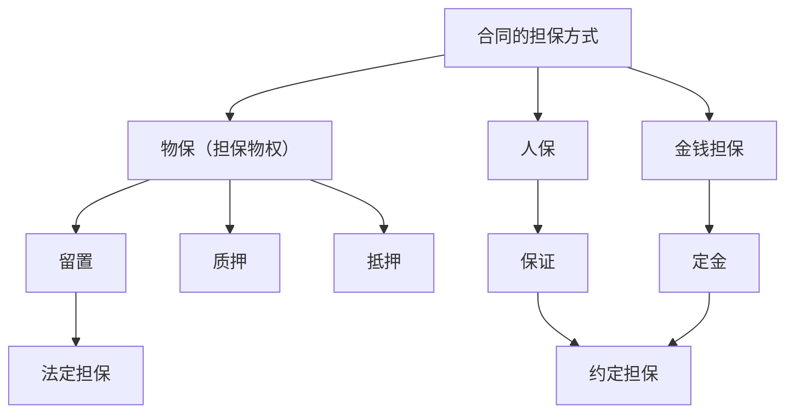

# 第一模块  民法 40 分

# 民事基本法律

## 第一记：法律规范，法律渊源、法律体系
### 第一模块  民法 40 分

#### 第一记：法律规范，法律渊源、法律体系  
1． 法律规范与相近概念的区分  
（1）==规范性法律文件==是法律规范的载体。  
（2）法律条文是法律规范的文字表述形式，是规范性法律文件的基本构成要素。  
（3）法律规范是==法律条文的内容==，法律条文是==法律规范的表现形式。==  
（4）法律条文的内容除了法律规范还可能包含其他法律要素，如法律原则等。  
（5）法律规范与法律条文==不是一一对应的。==

### 法律规范类型

###  法律规范和行为规范关系

### 法律规范与法律渊源

1． **法律规范的效力顺序**：
   - 涉及“法律类型”：==宪法 > 法律 > 法规 > 规章。==
   - 涉及“全国性职能部门”：==宪法 > 法律 > 行政法规 > 部门规章。==
   - 涉及“地方性法律”：==宪法 > 法律 > 行政法规 > 地方性法规 > 地方政府规章。==

2． **关于法律渊源的关键性表述**：
   1. 全国人大常委会：
      - 全国人大可以授权==全国人大常委会制定相关法律。==
      - 在全国人大闭会期间，全国人大常委会可以对==基本法律==进行部分补充和修改，但不得同该法律的基本原则相抵触。
      - 全国人大常委会负责解释法律，其作出的==法律解释与法律==具有同等效力。

   2. 地方人大及常委会：
      - 地方人大及常委会可以建立区域协同立法工作机制，并在有关区域内实施。
      - 上海市、海南省人大及常委会根据==全国人大常委会授权==，制定==浦东新区法规、海南自由贸易港法规，并在对应区域实施。==

   3. 司法解释：
      - 最高人民法院、最高人民检察院以外的审判机关和检察机关，不得作出具体应用法律的解释。
      - 最高人民法院、最高人民检察院作出的属于审判、检察工作中具体应用法律的解释，应当主要针对具体的法律条文，并符合立法的目的、原则和原意。
      - 遇法律的规定需要进一步明确具体含义的，或者==法律制定后出现新的情况需要明确适用法律依据的两种情况==，应当向全国人大常委会提出法律解释的要求或者提出制定、修改有关法律的议案。

### 法律体系

1. **宪法及宪法相关法**  
2. **刑法**  
3. **行政法**  
4. **民商法**：民法、商法、知识产权法。  
5. **经济法**：包括税收、宏观调控和经济管理、维护市场秩序、行业管理和产业促进等方面法律制度。  
6. **社会法**：调整劳动关系、社会保障关系、社会福利和特殊群体权益保障方面关系的法律规范。  
7. **程序法**。

> [!note]
> 司法解释
> 法律体系

---

# 第二记 法律关系
### 法律主体

### 权利能力和行为能力

1. （二）权利能力与行为能力 
2. 1． 关系
	1. （1）权利能力：权利主体享有权利和承担义务的能力，它==反映了权利主体取得权利和承担义务的资格。==
	2. （2）行为能力：权利主体能够通过自己的行为==取得权利和承担义务的能力。==
	3. ！ （3） 行为能力必须以权利能力为前提，无权利能力就谈不上行为能力。  
3. 2． 自然人的权利能力和行为能力
	1. （1）权利能力：自然人==从出生时起到死亡时止==，具有民事权利能力。自然人的民事权利能力一律平等。
	2. （2）行为能力：
	3. 

	

### 法律客体

###  法律事实

---

###  第二记 习近平法治思想引领全面依法治国基本方略 1 分

1.  习近平法治思想的重要意义
    1.  顺应实现中华民族伟大复兴时代要求应运而生的重大理论创新成果。
    2.  马克思主义法治理论中国化的最新成果。
    3.  习近平新时代中国特色社会主义思想的重要组成部分。
    4.  全面依法治国的根本遵循和行动指南。
2.  习近平法治思想的核心要义
    1.  坚持党对全面依法治国的领导，党的领导是推进全面依法治国的根本保证。
    2.  坚持以人民为中心，推进全面依法治国的根本目的是依法保障人民权益。
    3.  坚持中国特色社会主义法治道路。
    4.  坚持依宪治国、依宪执政。党领导人民制定宪法法律，领导人民实施宪法法律，领导健全保证宪法全面实施的体制机制，确立宪法宣誓制度。党自身要在宪法法律范围内活动。
    5.  坚持在法治轨道上全面建设社会主义现代化国家。
    6.  坚持建设中国特色社会主义法治体系。中国特色社会主义法治体系是推进全面依法治国的总抓手。
    7.  坚持依法治国、依法执政、依法行政共同推进，法治国家、法治政府、法治社会一体建设。
    8.  坚持全面推进科学立法、严格执法、公正司法、全民守法。
    9.  坚持统筹推进国内法治和涉外法治。
    10. 坚持建设德才兼备的高素质法治工作队伍。
    11. 坚持抓住领导干部这个“关键少数”。
    12. 坚持依法治国和依规治党有机统一。
3.  全面推进依法治国
    1.  全面推进依法治国的总目标是建设中国特色社会主义法治体系、建设社会主义法治国家。
    2.  全面推进依法治国的基本原则：
        1.  坚持中国共产党的领导。党的领导是中国特色社会主义最本质的特征，是社会主义法治最根本的保障。
        2.  坚持人民主体地位。必须坚持法治建设以保障人民根本权益为出发点和落脚点。
        3.  坚持法律面前人人平等。平等是社会主义法律的基本属性。
        4.  坚持依法治国和以德治国相结合。
        5.  坚持从中国实际出发。

---

> [!note]
> 命题角度：全面推进依法治国的核心考点。
> （1）推进全面依法治国的根本目的是==依法保障人民权益。==
> （2）推进全面依法治国的根本保证是==党的领导。==
> （3）全面推进依法治国的总目标是建设==中国特色社会主义法治体系、建设社会主义法治国家。==
> （4）推进全面依法治国的总抓手是==中国特色社会主义法治体系。==
> （5）把“坚持依法治国和依规治党有机统一”作为习近平法治思想核心要义的“第十二个坚持”，把“坚持在法治轨道上推进国家治理体系和治理能力现代化”发展为“坚持在法治轨道上全面建设社会主义现代化国家”，充分体现了习近平法治思想丰富发展的新成果。
> （6）新时代全面依法治国必须长期坚持的是习近平法治思想。

---

# 第三记 民事法律行为核心考点
---
## （一）民事法律行为的分类

| 分类标准             | 类型                       | 典例                                                                |
| ---------------- | ------------------------ | ----------------------------------------------------------------- |
| ==意思表示一致的当事人数量== | <u>单方民事法律行为</u>          | （1）无相对人：<u>遗嘱行为</u>、抛弃动产 （2）有相对人：委托代理的撤销、<u>无权代理的追认</u>、代理权的授予 |
|                  | <u>双方民事法律行为</u>          | 合同（含赠与合同）、<u>结婚</u>、收养                                            |
|                  | <u>多方民事法律行为</u>          | 决议，如<u>股东会决议</u>、董事会决议                                            |
| ==是否互为给付对价==     | <u>有偿民事法律行为</u>          | 买卖合同                                                              |
|                  | <u>无偿民事法律行为</u>          | 赠与行为、无偿委托、<u>保证</u>                                               |
| ==法律行为效果==       | <u>负担行为</u>：使一方承担给付义务    | 买卖合同（作为）、保密协议（不作为）                                                |
|                  | <u>处分行为</u>：直接导致==权利==变动 | 物权变动行为，如<u>所有权转让</u>                                              |

---
## （二）意思表示

### 1. 意思表示的类型及生效

| 意思表示类型 |  | 生效时间 |
|----|----|----|
| <u>无相对人的意思表示</u> |  | 意思表示<u>完成时</u>成立或生效 |
| <u>有相对人的意思表示</u> | 对话方式 | 相对人<u>知道其内容时</u>生效 |
| | 非对话·一般规定 | <u>到达相对人时</u>生效 |
| | 非对话·数据电文 | 指定系统：进入<u>特定系统</u>生效 未指定：知道/应当知道进入系统生效 |
| | 公告方式 | <u>公告发布时</u>生效 |

### 2. 沉默作为表示的条件
沉默视为意思表示（默示），满足其一即可：
1. 有<u>法律规定</u>。
2. <u>当事人约定</u>。
3. 符合<u>交易习惯</u>。

---
## （三）民事法律行为的效力类型

| 效力       | 提示                                                         | 条件或情形                                                             |
| -------- | ---------------------------------------------------------- | ----------------------------------------------------------------- |
| ==有效==   | 生效形式：口头、书面、<u>推定</u>、沉默                                    | 1. 具备<u>相应民事行为能力</u> 2. 意思表示<u>真实</u> 3. 不违法、不违背<u>公序良俗</u> |
| ==无效==   | 1. 自始、当然、绝对无效 2. 隐藏行为效力<u>另行判断</u>                      | 1. <u>无民事行为能力人</u>独立实施 2. 虚假意思表示 3. 违法/违背公序良俗/恶意串通          |
| ==效力待定== | 1. 追认前<u>未生效</u> 2. 催告期<u>30日</u> 3. 善意相对人可<u>撤销</u> | 1. 限制民事行为能力人<u>不能独立实施</u> 2. 狭义无权代理、滥用代理权                      |
| ==可撤销==  | 1. 撤销前已生效 2. 除斥期间经过则<u>终局有效</u> 3. 须经<u>诉讼/仲裁</u>行使  | 1. <u>胁迫</u> 2. <u>欺诈</u> 3. <u>显失公平</u> 4. <u>重大误解</u>  |

### 记忆口诀
1. 无效：**==小孩害人 (家)假，缺德勿（恶）违法。==**
2. 效力待定：**==少年早当家，无权别装傻。==**
3. 可撤销：**==胁迫欺诈公允误，撤销须仲裁起诉。==**

---
## （四）违法但不认定无效的情形
1. 为维护<u>国家利益</u>，认定有效不影响规范目的。
2. 为维护<u>第三人利益</u>，认定有效不影响规范目的。
3. 仅约束一方内控，对方无审查义务。
4. 事后可补正但<u>恶意不补正</u>。
	1. （4）当事人一方虽然在订立合同时违反强制性规定，但是在合同订立后其==已经具备补正违反强制性规定的条件却违背诚信原则不予补正==
5. 规制<u>履行行为</u>，而非合同本身。
6. 影响显著轻微，无效将<u>显失公平</u>。

### 记忆口诀
**==有效不减执法，无效伤害更大。==**

---
## （五）民事行为能力与效力关系

| 主体类型 | 行为人 | 行为类型 | 效力 |
|----|----|----|----|
| 自然人 | <u>无民事行为能力人</u> | 法定代理人代理 | 有效 |
| | | 独立实施 | <u>无效</u> |
| | <u>限制民事行为能力人</u> | 法定代理人代理 | 有效 |
| | | 纯获利益/相适应行为 | <u>有效</u> |
| | | 其他行为 | <u>效力待定</u> |
| | <u>完全民事行为能力人</u> | 独立实施 | 有效 |
| 法人 | 超经营范围 | 一般情况 | 有效 |
| | | 违反限制/特许/禁止经营 | <u>无效</u> |

### 记忆口诀
**==先看独立，再看代理，最后小事儿。==**

---
## （六）可撤销行为的撤销权

### 1. 行使期限

| 事由 | 期限起点 | 期限长度 |
|----|----|----|
| <u>重大误解</u> | 知道/应当知道撤销事由 | <u>90日</u> |
| <u>欺诈</u> | 知道/应当知道撤销事由 | 1年 |
| <u>显失公平</u> | 知道/应当知道撤销事由 | 1年 |
| <u>胁迫</u> | 胁迫行为终止 | 1年 |

- 最长保护期：行为发生之日起<u>5年</u>。

### 2. 行使方式与性质
撤销权性质：<u>形成权</u>，适用<u>除斥期间</u>；
行使方式：必须通过<u>诉讼/仲裁</u>。

---
## （七）附条件与附期限
1. <u>附条件</u>：以<u>未来不确定事实</u>决定效力。
2. <u>附期限</u>：以<u>确定到来的期限</u>决定效力。

### 记忆口诀
**==将来合法不法定，可能发生不确定。==**

> [!note]
> （四）违法但不认定无效的情形

---

# 第五记  代理制度核心考点（填空高亮版·MD）
-
## （一）代理关系
### 1. 代理关系的构成
三方主体与核心规则：
1.  **<u>被代理人</u>** ↔ **<u>代理人</u>**：存在==代理权关系==
2.  **代理人**：以<u>被代理人的名义</u>实施行为，在代理权限内==独立向第三人作出意思表示==
3.  **被代理人**：承担代理行为的==法律后果==

---
### 2. 代理与相关概念的区别
#### （1）代理 vs 委托
| 区别 | 代理 | 委托 |
|------|------|------|
| ==法律关系== | <u>三方</u>法律关系 | <u>双方</u>法律关系 |
| ==行为的名义== | <u>被代理人</u>的名义 | 委托人名义或<u>自己</u>的名义 |
| ==从事的事务== | <u>民事法律行为</u> | 民事法律行为或<u>其他事务</u> |

**委托与代理的联系**：
- 委托代理中的授权行为是一种==单方民事法律行为==
- 委托人与受托人之间的内部关系按==委托（双方法律行为）==处理
- 三方当事人之间的外部关系按==代理==处理

#### （2）代理 vs 行纪
| 区别        | 代理               | 行纪                         |
| --------- | ---------------- | -------------------------- |
| ==行为的名义== | <u>被代理人</u>的名义   | <u>行纪人自己</u>的名义            |
| ==法律效果==  | 直接由<u>被代理人</u>承受 | 先由**行纪人**承受，再通过其他法律关系转给委托人 |
| ==有偿性==   | <u>有偿或无偿</u>     | <u>有偿</u>                  |

#### （3）代理 vs 传达
| 事项 | 代理 | 传达 |
|------|------|------|
| ==意思表示的主动性== | 代理人独立向第三人表意，以<u>自己意志</u>决定内容 | 仅忠实转述委托人意思，<u>不独立表意</u> |
| ==行为能力== | 必须具有<u>相应民事行为能力</u> | 不以具有民事行为能力为条件 |
| ==身份行为== | <u>不得代理</u>实施 | 可以借助传达人传递意思表示 |

---
### 3. 代理权的滥用
| 行为                 | 描述                         | 效力       | 追认人         |
| ------------------ | -------------------------- | -------- | ----------- |
| ==<u>自己代理</u>==    | 以被代理人名义与自己实施民事法律行为         | ==效力待定== | <u>被代理人</u> |
| ==<u>双方代理</u>==        | 以被代理人名义与自己同时代理的其他人实施民事法律行为 | ==效力待定== | <u>被代理人</u> |
| ==<u>代理人与相对人恶意串通</u>== | 恶意串通损害被代理人合法权益             | ==无效==   | —           |

---
## （二）狭义的无权代理
| 类型                     | 举例                       |
| ---------------------- | ------------------------ |
| ==<u>无代理权的代理行为</u>==   | 甲未经乙委托，擅自替乙采购白糖          |
| ==<u>代理权终止后的代理行为</u>== | 甲委托乙采购原材料3个月，期满后乙仍以甲名义签约 |
| ==<u>超越代理权的代理行为</u>==  | 甲委托乙买白糖，乙却以甲名义买了味精       |

---
## （三）表见代理
### 1. 表见代理的构成要件
1.  代理人<u>无代理权</u>
2.  客观上有使相对人相信无权代理人有代理权的情形（存在==代理权的外观==）
3.  相对人主观上==善意无过失==，不知行为人是无权代理人
4.  相对人基于上述情形与无权代理人成立==民事法律行为==

**记忆口诀**：==无权外观可归责，表见代理善意得。==

### 2. 表见代理的法律效果
- 产生与==有权代理==一样的效果，被代理人应受该民事法律行为的约束
- 被代理人不得以无权代理为由主张代理行为==无效（等同于有效）==

> [!note]
> 此记注意
> 1.代理权滥用的分类
> 2.表见代理的构成要件

---

#  第六记 诉讼时效制度核心考点（填空高亮版·MD）
---
## （一）诉讼时效基本理论
### 1. 诉讼时效的作用机制
核心四句口诀：
1.  **“债权人还能告”**：诉讼时效经过，债权人**不丧失**<u>起诉权</u>。
2.  **“债务人主动闹”**：诉讼时效抗辩应由<u>当事人自行提出</u>。
3.  **“法院假装不知道”**：人民法院**不应**对诉讼时效问题进行释明及<u>主动适用</u>诉讼时效裁判。
4.  **“债务人还了不能要”**：时效届满后，债务人同意履行/自愿履行后，又以时效届满抗辩的，法院**不予支持**。

---
### 2. 诉讼时效 vs 除斥期间
| 区别            | 诉讼时效                         | 除斥期间                                                   |
| ------------- | ---------------------------- | ------------------------------------------------------ |
| ==适用对象不同==    | <u>债权请求权</u>                 | 1. <u>形成权</u>（追认权、解除权、撤销权等） 2. 法律明确规定的部分请求权（如停止侵害等） |
| ==可以援用的主体不同== |<u>当事人</u>（法院不得主动援用）| 法院可以<u>主动审查</u>（无论当事人是否主张）                             |
| ==法律效力不同==    | 届满后，债务人可抗辩，债权人<u>实体权利不消灭</u> | 届满后，<u>实体权利消灭</u>                                      |
| ==期间性质不同==    | <u>可变期间</u>（可中止、中断、延长）       | <u>不变期间</u>（不可中止、中断、延长）                                |

---
### 3. 诉讼时效期间长度和起算规则
| 种类     | 起算时点                           | 期间长度       |
| ------ | ------------------------------ | ---------- |
| 普通诉讼时效 | 权利人知道/应当知道<u>权利受到损害以及义务人</u>之日 | <u>3年</u>  |
| 最长诉讼时效 | <u>权利被侵害</u>之日                 | <u>20年</u> |

> ⚠️ 提示：国际货物买卖合同和技术进出口合同争议的时效期间为**<u>4年</u>**。

---
### 4. 诉讼时效的起算
#### （1）特殊类型债权的诉讼时效
| 债权类型    | 诉讼时效起算时点                                                                     |
| ------- | ---------------------------------------------------------------------------- |
| 附条件/附期限 | <u>条件成就/期限届满之日</u>                                                           |
| 约定履行期限  | 清偿期届满之日；分期履行的，<u>最后一期履行期限届满之日</u>                                            |
| 未约定履行期限 | ① 可确定履行期限：<u>履行期限届满之日</u> ② 不能确定：债务人明确表示不履行义务之日；否则，债权人要求履行的<u>宽限期届满之日</u> |
| 请求他人不作为 | 权利人知道义务人违反<u>不作为义务时</u>                                                      |

#### （2）无、限制民事行为能力人相关的诉讼时效
| 情况                | 诉讼时效起算时点                          |
| ----------------- | --------------------------------- |
| 对法定代理人的请求权        | <u>法定代理终止之日</u>                   |
| 未成年人遭受性侵害的损害赔偿请求权 | <u>受害人年满18周岁之日</u>                |
| 权利受到损害            | 其法定代理人知道/应当知道<u>权利受到损害以及义务人</u>之日 |

#### （3）国家赔偿的诉讼时效
起算时点：赔偿请求人知道/应当知道侵权行为之日（被羁押等限制人身自由期间**不计算在内**）。

---
## （二）诉讼时效的中止
- **时间要求**：在诉讼时效期间的**<u>最后6个月内</u>**。
- **法律效果**：时效<u>暂停计算</u>，中止事由消失后，**继续计算6个月**。
- **中止事由**：
  1.  <u>不可抗力</u>（如地震、通信中断）。
  2.  无/限制民事行为能力人<u>没有法定代理人</u>，或法定代理人死亡、丧失行为能力/代理权。
  3.  继承开始后未确定<u>继承人或遗产管理人</u>。
  4.  权利人被<u>义务人或其他人控制</u>。
  5.  其他导致权利人不能行使请求权的障碍。

---
## （三）诉讼时效的中断
| 情形 | 解析 |
|------|------|
| 权利人向义务人等提出履行请求 | 1. 送交主张权利文书并送达 2. 发送信件/数据电文并到达 3. 金融机构扣收欠款本息 4. 公告主张权利（下落不明时） 5. 对部分债权主张权利，效力及于剩余债权 |
| 义务人同意履行义务 | 1. 分期履行 2. 部分履行 3. 提供担保 4. 请求延期履行 5. 制定清偿债务计划 |
| 提起诉讼/申请仲裁或同等效力情形 | 1. 起诉/申请仲裁 2. 申请支付令 3. 申请破产/申报债权 4. 申请宣告失踪/死亡 5. 申请诉前保全/禁令 6. 申请强制执行 7. 申请追加当事人 8. 诉讼中主张抵销 |

---
## （四）诉讼时效的适用范围
原则上，诉讼时效适用于**请求权**，但下列请求权**不适用**诉讼时效：
1.  <u>不动产物权</u>和登记的动产物权的权利人请求返还财产。
2.  请求支付<u>抚养费、赡养费、扶养费</u>。
3.  请求<u>停止侵害、排除妨碍、消除危险</u>。
4.  基于<u>投资关系</u>产生的缴付出资请求权。
5.  支付<u>存款本金及利息</u>请求权。
6.  兑付国债、金融债券以及向不特定对象发行的<u>企业债券本息</u>请求权。

**记忆口诀**：==物权三费排妨害，投资存款企业债。==  #背诵

> [!note] 注意背诵内容
> 1.诉讼时效vs除斥期间
> 2.诉讼时效不可用的情形

---

# 物权法

# 物权变动核心考点（填空高亮版·MD）
## 物权的基本知识

---
## （一）物权变动的原因概述
### 1. 非基于法律行为的物权变动规则
| 类型       | 举例               | 物权变动生效时间            |
| -------- | ---------------- | ------------------- |
| ==事实行为== | 合法建造、拆除房屋        | <u>事实行为成就时</u>      |
| ==法律规定== | 继承               | <u>继承开始时</u>        |
| ==公法行为== | 法院/仲裁机构文书、政府征收决定 | <u>法律文书、征收决定生效时</u> |

---
### 2. 基于法律行为的物权变动——债权行为 vs 物权行为
| 事项      | 债权行为（合同）                | 物权行为                        |
| ------- | ----------------------- | --------------------------- |
| ==性质==  | <u>负担行为</u>             | <u>处分行为</u>                 |
| ==处分权== | 不要求处分权（出卖他人之物的买卖合同亦可有效） | 要求处分权（无权处分行为效力待定，未获追认则归于无效） |
| ==兼容性== |同一标的物上成立的**数重买卖合同均可有效**| 物权只能被转让一次，同一物不能实施两次处分行为     |

**记忆口诀**：==物权变动三件事，有权有效加公示。==
1.  **有权**：出让人拥有<u>处分权</u>（如所有权）
2.  **有效**：<u>法律行为有效</u>（如买卖合同有效）
3.  **公示**：受让人拥有物权外观（如<u>交付、登记</u>）

---
## （二）动产的物权变动
### 1. 动产的物权变动公示规则
| 类型               | 买卖（所有权） 设立 | 买卖（所有权） 设立对抗 | 抵押权 设立 | 抵押权 设立对抗 | 质权 设立  | 质权 设立对抗 |
| ---------------- | ------------- | --------------- | --------- | ----------- | --------- | ---------- |
| 普通动产             | <u>交付</u>     | —               | 合同生效      | <u>登记</u>   | <u>交付</u> | —          |
| 特殊动产（小汽车、船舶、航空器） | <u>交付</u>     | <u>登记</u>       | 合同生效      | <u>登记</u>   | <u>交付</u> | —          |

> ✅ 通关绿卡：==特殊动产**所有权变动仍自交付时生效**，未经登记，不得对抗善意第三人==。

---
### 2. 交付的形态
| 交付类型     | 含义                                  | 物权转让时点               |
| -------- | ----------------------------------- | -------------------- |
| ==现实交付== | **物直接交由对方占有**                       | <u>转移占有时</u>         |
| ==简易交付== | **动产物权设立/转让前，权利人已依法占有该动产**          | <u>法律行为生效时</u>       |
| ==指示交付== | **第三人依法占有该动产，通过转让请求第三人返还原物的权利代替交付** | <u>转让返还请求权的协议生效时</u> |
| ==占有改定== | **双方约定由出让人继续占有该动产**                 | <u>约定生效时</u>         |

---
## （三）不动产的物权变动
### 1. 变动规则
1. ！ 除<u>土地承包经营权、地役权</u>为**登记对抗**外，其余不动产物权均为**<u>登记生效</u>**。

---
### 2. 不动产统一登记制度
- 为保全不动产物权请求权：<u>预告登记</u>
- 首次权利登记：<u>首次登记</u>
- 权利消灭：<u>注销登记</u>
- 登记事项变更：
  - 权利主体变更 → <u>转移登记</u>
  - 其他事项变更 → <u>变更登记</u>
- 登记簿记载错误：
  - 同意更正/确有错误 → <u>更正登记</u>
  - 名义权利人不同意更正 → <u>异议登记</u>

---
### 3. 变更登记与转移登记的辨析
#### （1）核心区别
- 涉及**<u>权利主体转移</u>**：办理<u>转移登记</u>
- 不涉及权利主体转移：办理<u>变更登记</u>

#### （2）适用情形

#### （3）更正登记与异议登记
1.  申请主体：更正登记（权利人/利害关系人）；异议登记（仅利害关系人）
2.  顺序：更正登记在先，异议登记在后
3.  异议登记失效：申请人自异议登记之日起<u>15日内不起诉</u>
4.  异议登记不当：权利人可请求<u>损害赔偿</u>

#### （4）预告登记
| - 适用场景：预购商品房、预购商品房抵押、房屋所有权转让/抵押 | |
| - 效力：未经预告登记权利人同意处分不动产的，**不发生物权效力** | |
- 失效：债权消灭或自能够登记之日起<u>90日内未申请登记</u>

---
### 记忆口诀
- 物权变动三件事：**==有权有效加公示==**
- 不适用时效请求权：**==物权三费排妨害，投资存款企业债==**

====
> [!note] 记忆点
> 1.基于法律和非法律行为的物权变动
> 2.动产的物权变动公示规则
> 3.交付的形态
> 4.变动规则

---

# 第七记 所有权基础知识（填空高亮版·MD）
---
## （一）国家所有的财产
| 类型 | 内容 |
|------|------|
| ==全部国有== | 1. <u>城市的土地</u> 2. <u>矿藏、水流、海域</u>，以及无居民海岛 3. 法律规定为国有的铁路、公路、电力设施、电信设施和油气管道等基础设施 4. 法律规定为国有的<u>野生动植物资源和文物</u> 5. <u>国防资产</u> 6. <u>无线电频谱资源</u> |
| ==原则上国有== | 森林、山岭、草原、荒地、滩涂等自然资源（法律规定属于集体所有的除外） |
| ==例外情况下国有== | 法律规定属于国家所有的<u>农村和城市郊区的土地</u> |

---
## （二）拾得遗失物
### 1. 拾得遗失物的法律后果
1.  拾得行为**不能**令拾得人取得所有权，负有<u>归还权利人</u>的义务。
2.  遗失物自发布招领公告之日起<u>1年内</u>无人认领的，归<u>国家所有</u>。
3.  拾得人享有<u>费用偿还请求权</u>。
4.  遗失人发布悬赏广告时，拾得人还享有<u>报酬请求权</u>。

### 2. 拾得人处分遗失物的法律后果
1.  权利人有权向无权处分人请求<u>损害赔偿</u>，或自知道/应当知道受让人之日起<u>2年内</u>向受让人请求返还原物。
2.  若受让人通过拍卖/有经营资格的经营者购得该遗失物：
    - 权利人请求返还原物时，应当支付受让人所付费用；
    - 支付后，有权向<u>无权处分人</u>追偿。====

---
## （三）添附
| 类型        | 含义                       | 举例                                        | 所有权归属                                                                         |
| --------- | ------------------------ | ----------------------------------------- | ----------------------------------------------------------------------------- |
| 附合        | 不同所有人的物密切结合，构成不可分割的一物    | 动产附合于不动产：油漆漆于墙体、钢筋附合于房屋 动产附合于动产：油漆漆于木板 | 不动产附合：<u>不动产所有人</u>取得合成物所有权 动产附合：① 有主物的，<u>主物所有人</u>取得；② 无主物的，<u>共有</u>合成物 |
| <u>混合</u> | 所有权不属同一人的动产，相互混杂，难以识别或分离 | 牛奶、咖啡、冰块混合成拿铁                             | 按动产附合时的价值<u>共有</u>                                                            |
| <u>加工</u> | 在他人之动产上进行改造或劳作           | 书法、绘画、印刷、雕刻                               | 只要加工改造价值**不明显低于**材料价值，<u>加工者</u>取得新物所有权                                       |

> [!note]
> 所有权框架

---

## 第 10 记共有制度核心考点（2 分）
---
## （一）共有相关推定
### 1. 共有类型的推定
约定 → 家庭关系（**<u>共同共有</u>**） → **<u>按份共有</u>**
### 2. 按份共有中份额的推定
约定 → **<u>出资额</u>** → **<u>等额</u>**

---
## （二）共有的内部及外部关系（无特殊约定情形下）
| 维度                       | 按份共有                                                                   | 共同共有                                                               |
| ------------------------ | ---------------------------------------------------------------------- | ------------------------------------------------------------------ |
| ==**共有物之处分**==           | <u>2/3份额以上</u>同意（否则构成无权处分）                                             | **<u>全体一致同意</u>**（否则构成无权处分）                                        |
| ==**共有物的重大修缮、变更性质或用途**== | <u>2/3份额以上</u>同意                                                       | **<u>全体共同共有人</u>**同意                                               |
| ==**份额之处分**==            | 自由处分权 + **<u>同等条件下的优先购买权</u>**                                         | —                                                                  |
| ==**共有物的分割**==           | 约定不得分割的，非重大理由不得分割； 无约定的，**<u>可随时请求分割</u>**                          | 约定不得分割的，非重大理由不得分割； 无约定的，除**<u>重大理由</u>**或**<u>共有基础丧失</u>**外不得分割 |
|==**对外债权债务的承担——外部关系**==| 共有人享有**<u>连带债权</u>**，承担**<u>连带债务</u>**                                 | 共同共有人**<u>共同享有债权、承担债务</u>**                                        |
| ==**对外债权债务的承担——内部关系**==  | 按份共有人按照**<u>份额</u>**享有债权、承担债务； 对外承担债务超出应承担份额时，有权向其他共有人**<u>追偿</u>** | —                                                                  |

---
## （三）按份共有人的优先购买权
### 1. 前提与通知义务
1.  前提：**<u>按份共有</u>** + **<u>对外转让</u>**份额
2.  通知义务：转让人应将**<u>转让条件</u>**及时通知其他共有人

### 2. 行使期限
| 情况 | 其他共有人行使优先购买权的期限 |
|------|--------------------------------|
| 有约定 | 按约定处理 |
| 没约定、有通知 | ① 通知载明行使期间的，以该期间为准； ② 通知未载明或载明期间**<u>短于15日</u>**的，为**<u>15日</u>** |
| 没约定、没通知 | ① 知道/应当知道最终确定的同等条件之日起**<u>15日</u>**； ② 无法确定的，为共有份额权属转移之日起**<u>6个月</u>** |

### 3. 效力与要点
1.  效力：优先购买权**不具有排他物权效力**，仅可请求撤销份额转让合同或认定合同无效，不可主张物权变动无效
2.  期限限制：超期行使的，法院**不予支持**
3.  性质：不属于物权法三大类物权（所有权/用益物权/担保物权），仅为债权性权利
4.  无权处分：未征得足够共有人同意转让共有物的，构成**<u>无权处分</u>**，效力待定，需其他共有人追认
5.  善意取得：第三人**<u>善意且无过失</u>**的，可依善意取得制度获得所有权

---
### 通关绿卡要点
- 按份共有处分共有物：**2/3以上份额**（含本数）同意即满足条件，不构成无权处分
- 优先购买权是**<u>同等条件下</u>**的优先，价格/付款条件不一致的，不能主张优先购买
- 优先购买权需在**约定期限或法定期限**内行使，超期则丧失权利

---
> [!note]
> 共有物行使期限

---
# 第 11 记 善意取得制度核心考点（填空高亮版·MD）
---
## （一）善意取得的条件
### 1. 善意取得的构成要件
1.  **“无权”**：转让人**<u>无处分权</u>**。
2.  **“公允”**：转让合同**<u>有效</u>**且以**<u>合理的价格</u>**转让。
3.  **“已交付”**：已完成物权公示（动产已完成**<u>交付</u>**，不动产已完成**<u>登记</u>**）。
4.  **“善意”**：受让人为善意（动产：不知对方无处分权；不动产：存在权属登记错误）。
5. ！ “不含遗失物**：转让人基于真权利人意思**<u>合法占有</u>**标的物（遗失物、赃物不适用善意取得）。

**记忆口诀**：==无权公允已交付，善意不含遗失物。==

---
### 2. 动产善意取得的特点
- 善意判断时点：**<u>动产交付之时</u>**。
- 若交付时满足善意条件，**交付后得知转让人无处分权**，不影响受让人的善意认定。

---
### 3. 不动产善意取得的特点
具备下列情形之一时，认定受让人**不构成善意**：
1.  登记簿上存在有效的**<u>异议登记</u>**。
2.  预告登记有效期内，未经预告登记权利人同意。
3.  登记簿上记载司法/行政机关**<u>查封/限制权利</u>**的事项。
4.  受让人知道登记簿上记载的**<u>权利主体错误</u>**。
5.  受让人知道他人已依法享有不动产物权。

---
## （二）善意取得的法律后果
| 主体 | 法律后果 |
|------|----------|
| **真权利人** | 所有权**<u>消灭</u>**；有权向**<u>无权处分人</u>**请求**<u>损害赔偿</u>** |
| **善意第三人** | 取得标的物**<u>所有权</u>** |
| **无权处分人** | 与第三人发生无权处分行为；向真权利人承担**<u>损害赔偿责任</u>** |

---
## （三）通关绿卡（命题陷阱）
1.  **前提**：善意取得以**<u>无权处分</u>**为前提，若转让人有处分权，则不构成善意取得。
2.  **动产善意时点**：以**<u>交付时</u>**判断善意，交付后知情不影响善意取得的认定。
3.  **占有前提**：转让人须基于真权利人意思**<u>合法占有</u>**标的物，**赃物、遗失物、抢夺物**不适用善意取得。
4.  **权利性质**：优先购买权不具有物权效力，仅为债权性权利，不影响善意取得。

> [!note]
> 不构成善意的情况
> 遗失物不在这个范围

---

# 第 12 将 用益物权核心考点（填空高亮版·MD）
---
## （一）用益物权概述
| 类型 | 说明 |
|------|------|
| <u>土地承包经营权</u> | 1. 自**土地承包经营权合同生效时**设立 2. 互换、转让的，可申请登记；**未经登记，不得对抗善意第三人** |
| <u>宅基地使用权</u> | — |
| <u>建设用地使用权</u> | 自**登记时**设立 |
| <u>居住权</u> | 自**登记时**设立 |
| <u>地役权</u> | 1. 自**地役权合同生效时**设立 2. 可申请登记；**未经登记，不得对抗善意第三人** |

---
## （二）建设用地使用权
### 1. 取得
| 取得方式 | 类型 | 提示 |
|----------|------|------|
| **创设取得（一级市场）** | 无偿划拨 | 严格限制；**商业开发用地不得划拨** |
| | 有偿出让 | 1. 集体土地需先征为国有后才可出让 2. 经营性用地/同一土地有多个意向用地者的，应采取**招标、拍卖**等公开竞价方式 |
| **移转取得（二级市场）** | 无偿划拨土地的转让 | 需报政府审批，办理出让手续并缴纳**土地出让金** |
| | 有偿出让土地的转让 | 1. 已支付全部出让金并取得**土地使用权证书** 2. 房屋建成的需持有**房屋所有权证书** 3. 完成开发投资总额**25%以上**（房屋建设工程）或形成工业用地条件（成片开发） |

### 2. 有偿出让最高年限
| 类型 | 年限 |
|------|------|
| 居住用地 | <u>70年</u> |
| 科教文卫体/工业/综合用地 | <u>50年</u> |
| 商业/旅游/娱乐用地 | <u>40年</u> |

> ⚠️ 提示：无偿划拨方式取得的建设用地使用权，**除法律另有规定外，无使用期限限制**。

### 3. 续约条件
| 类型 | 续约条件 |
|------|----------|
| 住宅建设用地使用权 | **期间届满，自动续期** |
| 其他建设用地使用权 | 至迟于届满前**1年**申请续期；除因公共利益需要收回外，应予批准；批准后需重新签订出让合同并缴纳**土地出让金** |

---
## （三）集体土地的使用
### 1. 农田
- 农用地转建设用地：需办理**农用地转用审批**手续
- 永久基本农田转建设用地：由**国务院**批准

### 2. 集体经营性建设用地
| 事项 | 规则 |
|------|------|
| 土地类型 | 土地利用总体规划、城乡规划确定为**工业、商业等经营性用途**，并经**依法登记**的集体经营性建设用地 |
| 流通方式 | 土地所有权人可通过**出让、出租**等方式交由单位或个人使用 |
| 操作程序 | 1. 本集体经济组织成员的**村民会议2/3以上成员或2/3以上村民代表**同意 2. 签订**书面合同** |
| 出让后的土地使用权 | 可**转让、互换、出资、赠与或抵押**（法律另有规定或合同另有约定除外） |

**记忆口诀**：==依法登记、不限主体、特别决议、自由交易。==

> [!note]
> 1.用益物权的种类
> 
> 
> ---
> 创设取得建设土地使用权
> 集体使用权
> 
> 
> 
> ---
> 1 快乐

---

#第十三记 抵押权核心考点（填空高亮版·MD）
---
## （一）抵押权标的
### 1. 不得作为抵押的标的
1.  **<u>土地所有权</u>**
2.  宅基地、自留地、自留山等**<u>集体所有土地的使用权</u>**（法律规定可抵押的除外）
3.  学校、幼儿园、医院等为公益目的成立的**<u>非营利法人的公益设施</u>**
4.  **<u>所有权、使用权不明或有争议</u>**的财产
5.  依法被**<u>查封、扣押、监管</u>**的财产

> 💡 核心逻辑：不适合买卖的财产不得抵押。

---
### 2. 不动产==抵押房地一体原则==
1.  **房随地走、地随房走**：以建筑物抵押的，该建筑物占用范围内的**<u>建设用地使用权</u>**一并抵押；以建设用地使用权抵押的，该土地上的**<u>建筑物</u>**一并抵押。
2.  抵押权效力及于**<u>已有的和已建成的在建建筑物</u>**，不及于**<u>续建部分和新增建筑物</u>**。
3.  实现抵押权时，应将**<u>新增建筑物与建设用地使用权一并处分</u>**，但新增建筑物所得价款，抵押权人**<u>无权优先受偿</u>**。

---
### 3. 动产浮动抵押
| 内容       |   | 规定                                                      |
| -------- |---| ------------------------------------------------------- |
| 抵押物范围    |   | 现有的以及将有的**<u>生产设备、原材料、半成品、产品</u>**                      |
| 生效要件     |   | 抵押合同生效时设立，**<u>未经登记不得对抗善意第三人</u>**                      |
| 抵押财产确定情形 |   | 1. 债务履行期届满，债权未实现 2. 抵押人被宣告破产或解散 3. 当事人约定的实现抵押权的情形 |

---
### 4. 抵押物的物上代位
1.  担保期间，担保财产毁损、灭失或被征收等，担保物权人可就获得的**<u>保险金、赔偿金或补偿金</u>**优先受偿。
2.  债权履行期未届满的，可**<u>提存</u>**该保险金、赔偿金或补偿金。

---
### 5. 抵押物瑕疵的处理规则
| 情况 | 规则 |
|------|------|
| 违建抵押 | 1. 以违法建筑物抵押的，抵押合同**<u>无效</u>**（一审法庭辩论终结前补办合法手续的除外） 2. 以建设用地使用权依法设立抵押，抵押人以土地上存在违建为由主张合同无效的，**<u>不予支持</u>** |
| 权属瑕疵 | 以所有权、使用权不明或有争议的财产抵押，构成**<u>无权处分</u>**，准用**<u>善意取得</u>**制度 |
| 划拨地抵押 | 1. 抵押人以未办理批准手续为由主张抵押合同无效或不生效的，**<u>不予支持</u>** 2. 实现抵押权所得价款，应**<u>优先用于补缴土地出让金</u>** |

---
## （二）抵押权的生效规则
### 1. 一般规则
| 抵押权 | 设立要件 | 对抗要件 |
|--------|----------|----------|
| 动产（含承包的土地经营权） | **<u>合同生效</u>** | **<u>登记</u>** |
| 不动产（不含承包的土地经营权） | **<u>登记</u>** | — |

> ⚠️ 易错点：==动产抵押**合同生效即设立**，登记仅为对抗要件==。

---
### 2. 流押条款无效
抵押权人在债务履行期届满前，与抵押人约定债务人不履行到期债务时抵押财产归债权人所有的，**只能依法就抵押财产优先受偿**，该流押条款**<u>无效</u>**。

---
### 3. 正常买受人规则
1.  以动产抵押的，**不得对抗**正常经营活动中已**<u>支付合理价款并取得抵押财产</u>**的买受人。
2.  下列情形**不属于**“正常经营活动”：
    - 购买数量明显超过一般买受人
    - 购买出卖人的**<u>生产设备</u>**（设备制造企业除外）
    - 订立买卖合同目的在于担保债务履行
    - 买受人与出卖人存在控制关系
    - 买受人应查询抵押登记而未查询

---
## （三）抵押存续期间双方的权利义务
### 1. 抵押物转让规则
- 除非当事人另有约定，否则**<u>抵押人有权转让抵押物所有权</u>**，转让时应**<u>及时通知抵押权人</u>**。
- 抵押权的存续**<u>不受抵押物转让影响</u>**。

### 2. 抵押权之保全
- 抵押财产价值减少的，抵押权人有权请求**<u>恢复财产价值或提供相应担保</u>**。
- 抵押人不恢复价值也不提供担保的，抵押权人有权请求**<u>债务人提前清偿债务</u>**。

### 3. 抵押权人的孳息收取权
自**<u>法院扣押之日</u>**起，抵押权人有权收取该抵押财产的**<u>天然孳息或法定孳息</u>**。

---
## （四）抵押权实现的限制
### 1. 土地出让金优先清偿
拍卖划拨的国有土地使用权所得价款，应**<u>先缴纳相当于土地出让金的款额</u>**，抵押权人仅可就剩余价款主张优先受偿。

### 2. 建设工程承揽人优先受偿
**<u>建筑工程承包人的工程价款优先受偿权</u>**优于抵押权和其他债权。

> [!note]
> 不得抵押的资产
> 抵押权代位权
> 抵押物瑕疵处理规则
> 下列情形**不属于**“正常经营活动”：

---

# 第十四记 质权核心考点（填空高亮版·MD） 2 分
---
## （一）质权的客体（不动产不得设立质权）
| 质权客体      |  | 设立的生效要件                                       |
| --------- | --------------------------- | --------------------------------------------- |
| <u>动产</u> |  | **<u>交付</u>**                                 |
| <u>权利</u> |有价证券（汇票、支票、本票、存款单、仓单、提单、债券）| 有权利凭证的：**<u>交付</u>** 没有权利凭证的：**<u>登记</u>** |
|           | 基金份额与股权                     | **<u>登记</u>**                                 |
|           | 知识产权                        | **<u>登记</u>**                                 |
|           | 现有的以及将有的应收账款                | **<u>登记</u>**                                 |

> 💡 提示：**中国人民银行征信中心**是应收账款质押的登记机构。
>
> 📝 记忆口诀：==三票三单一债券（交付/登记）、基股知产应收款（登记）。==

---
## （二）质权与抵押权效力的对比
| 效力        | 质权                                                                                                                  | 抵押权                                                               |
| --------- | ------------------------------------------------------------------------------------------------------------------- | ----------------------------------------------------------------- |
| **孳息收取权** | 质押期间，质押财产孳息由**<u>质权人</u>**收取（合同另有约定除外）                                                                              | 抵押期间，抵押财产孳息由**<u>抵押人</u>**收取；**<u>法院扣押之后</u>**才由抵押权人收取            |
| **保管义务**  | 质权人负有**<u>妥善保管</u>**质押财产的义务                                                                                         | 抵押权人**<u>不负责</u>**保管抵押财产                                          |
| **保全**    | 因不可归责于质权人的事由可能使质押财产毁损或价值明显减少，足以危害质权人权利的，质权人有权要求出质人提供**<u>相应的担保</u>**                                                | 抵押财产价值减少的，抵押权人有权要求**<u>恢复抵押财产的价值</u>**，或者提供与减少的价值**<u>相应的担保</u>** |
| **处分限制**  | 1. 对质权人：未经出质人同意，擅自使用、处分质押财产或转质，给出质人造成损害的，应承担**<u>赔偿责任</u>** 2. 对出质人：基金份额、股权、知识产权中的财产权、应收账款出质后，**<u>原则上不得转让</u>** | 除非另有约定，**<u>抵押人（所有权人）有权转让抵押物</u>**，但应**<u>及时通知</u>**抵押权人          |

---
> [!note]
> 1，质权框架
> 
> 2.处分限制

---
# 第十五记 留置权核心考点（填空高亮版·MD）
---
## （一）留置权的性质
留置权是**<u>法定担保物权</u>**（无需事先约定，符合条件即成立）。

---
## （二）留置的标的
1.  只有**<u>动产</u>**才适用留置，**<u>不动产、权利</u>**均不适用留置。
2.  当事人**<u>可以特约排除</u>**留置权。
3.  若无特殊约定，**<u>债务人动产与第三人动产</u>**之上均可设立留置权。

---
## （三）留置权成立的条件
1.  债权人**<u>合法占有</u>**债务人或第三人之动产（第三人的动产也可以留置）。
2.  **<u>债权已届清偿期</u>**。
3.  动产之占有与债权属**<u>同一法律关系</u>**（**企业之间留置可以不受该限制**）。

> 📝 记忆口诀：==留置成立三合一，合法到期同关系。==

---
## （四）留置双方主要权利义务
### 1. 留置物的保管
1.  留置权人负有**<u>妥善保管</u>**留置财产的义务；因保管不善致使留置财产毁损、灭失的，应当承担**<u>赔偿责任</u>**。
2.  留置权人有权收取留置财产的**<u>孳息</u>**，所收取的孳息应当先充抵**<u>收取孳息的费用</u>**。

### 2. 留置发生后债务的履行
1.  留置权人与债务人应当约定留置财产后的债务履行期限；没有约定或约定不明确的，留置权人应当给债务人**<u>60日以上</u>**履行债务的期限（鲜活易腐等不易保管的动产除外）。
2.  债务人逾期未履行的，留置权人可以与债务人协议以留置财产**<u>折价</u>**，也可以就**<u>拍卖、变卖</u>**留置财产所得的价款**<u>优先受偿</u>**。

> [!note]
> 留置权性质
> 加行权条件
> 债务履行条件 

---

# 第十六记  担保物权综合问题

## 1. （一）“一物数保”情形的处理

2. 1． 多个抵押在同一物上并存的处理
	1. （1）抵押权==已登记的==先于==未登记的==受偿。
	2. （2）抵押权已登记的，按照==登记的先后==顺序清偿。
	3. （3）抵押权均未登记的，按照==债权比例==清偿。

## 6. 2． 抵押、质押在同一物上并存的处理

7. 按照登记（抵押的公示）、交付（质押的公示）的时间先后确定清偿顺序，纯以公示（交付、登记）之先后判断动产抵押、质押的顺位。

## 8. 3． 留置与抵押、质押在同一物上并存的处理

9. 同一动产上已经设立抵押权或者质权，该动产又被留置的，==留置权==人优先受偿。

> [!note]
> ---
> 命题角度：“一物数保”情形的处理。
> “先看公示，再看时间。若有留置，它最优先。

## 1. （二）最高额担保
1. 1． 含义
	1. 为担保债务的履行，债务人或者第三人对一定期间内将要连续发生的债权提供担保财产的，债务人不履行到期债务或者发生当事人约定的实现抵押权的情形，抵押权人有权在最高债权额限度内就该担保财产优先受偿。
2. 2． 主债权确定的情形
	1. （1）约定的债权确定期间届满。
	2. （2）没有约定债权确定期间或者约定不明确，抵押权人或者抵押人自最高额抵押权设立之日起满2年后请求确定债权。
	3. （3）新的债权不可能发生。
	4. （4）抵押权人知道或者应当知道抵押财产被查封、扣押。
	5. （5）债务人、抵押人被宣告破产或者解散。
3. （三）让与担保
	1. 1． 合同的效力债务人或者第三人与债权人约定将财产形式上转移至债权人名下，债务人不履行到期债务，债权人有权对财产折价或者以拍卖、变卖该财产所得价款偿还债务的，人民法院应当认定该约定有效。
	2. 2． 实质重于形式当事人所转移的所有权并非真正意义上的所有权，而是仅具有担保功能的所有权。形式上的受让人并不享有对财产的全面支配权，而只享有就该财产进行变价、优先受偿的权利。
	3. 3． 禁止流质条款当事人已经完成财产权利变动的公示，债务人不履行到期债务，债权人请求对该财产享有所有权的，人民法院不予支持

---

# 第十七记 合同的订立

## 合同的分类
1. 给付对价
	1. 单务合同
		1. 仅一方承担义务   
			1. ==赠与保证==
	2. 双务合同
		1. 买卖合同
2. 成立条件
	1. 诺诚
		1. 买卖合同
	2. 实践
		1. 借款，保管，代偿，定价
3. 合同的相对性
	1. 合同主要在特定的==合同当事人之间==发生权利义务关系，当事人只能基于合同向另一方当事人提出请求或提起诉讼，不能向==无合同关系的第三人==提出合同上的请求，也不能擅自为第三人设定合同上的义务。
4. 要约和要约邀请
	1. 要约
		1. ！ 内容具体
		2. ！ 经受邀约人的承诺，
	2. 2． 要约与要约邀请的辨析
		1. （1）拍卖公告、招标公告、招股说明书、债券募集办法、基金招募说明书、商业广告和宣传、寄送的价目表等，性质通常均为要约邀请。
		2. （2）若商业广告的内容符合要约的规定，则视为要约。
		3. （3）==悬赏广告属于要约。==
		4. （4）商品房的销售广告和宣传资料为==要约邀请==，但是出卖人就商品房开发规划范围内的房屋及相关设施所作的说明和允诺具体确定，并对商品房买卖合同的订立以及房屋价格的确定有重大影响的，应当视为要约。相关内容即使未订入合同，仍属合同的组成部分， 当事人违反要承担违约责任

5. 3． 要约的撤回、撤销以及承诺的撤回相关时点汇总
6. 

7. 4． 不得撤销的要约‘
	1. （1）要约人确定了承诺期限的。
	2. （2）要约人以其他形式明示要约不可撤销的。
	3. （3）受要约人有理由认为要约不可撤销的，并已经为履行合同做了合理准备工作。
8. 5． 承诺的期限
	1. （1）要约如果载明了承诺的期限，承诺应当在要约确定的期限内到达要约人。
	2. （2）要约没有确定承诺期限的，承诺应当依照下列规定到达： 
		1. 要约以对话方式作出的，应当即时作出承诺。
		2. 要约以非对话方式作出的，承诺应当在合理期限内到达

9. 7． 承诺与新要约的区分
	1. （1）承诺对要约内容进行了实质性变更的，为新要约，原要约相应失效。
	2. （2）承诺对要约的内容作出非实质性变更的，除要约人及时表示反对或者要约表明承诺不得对要约的内容作出任何变更的以外，该承诺有效，合同的内容以承诺的内容为准
10. 格式条款
	1. 无效情形
		1. （1）提供格式条款一方不合理地免除或者减轻其责任、加重对方责任、限制对方主要权利。
		2. （2）提供格式条款一方排除对方主要权利
	2. 3． 格式条款的解释
		1. （1）对格式条款的理解发生争议的，应当按照通常理解予以解释。
		2. （2）对格式条款有两种以上解释的，应当作出不利于提供格式条款一方的解释。
		3. （3）格式条款和非格式条款不一致的，应当采用非格式条款。
	3. 4． 格式条款的认定
		1. （1）合同中载明“本合同不属于格式条款”，该约定是无效的。
		2. （2）当事人一方采用第三方起草的合同示范文本制作合同的==，只要不允许对方协商修改，仍然属于格式条款。==
		3. （3）经营者仅以未实际重复使用为由主张其预先拟定且未与对方协商的合同条款不是格式条款的，不应予以支持。
11. 免责条款
	1. （五）免责条款
		1. （1）双方当事人自愿订立的免责条款，法律原则上不加干涉。
		2. （2）造成对方==人身伤害的，因故意或者重大过失造成对方财产损失的==免责条款无效。
	2. （六）缔约过失责任
		1. 1． 适用情形
			1. （1）假借订立合同，恶意进行磋商。
			2. （2）==故意隐瞒与订立合同有关的重要事实或者提供虚假情况。==
			3. （3）当事人泄露或者不正当地使用在订立合同过程中知悉的商业秘密或者其他应当保密的信息。

### 3 ． 法律、行政法规规定应当办理批准的合同
1. （1）合同获得批准前，当事人一方起诉请求对方履行合同约定的主要义务，经释明后拒绝变更诉讼请求的，人民法院应当判决驳回其诉讼请求
2. （2）负有报批义务的当事人不履行报批义务或者履行报批义务不符合合同的约定或者法律、行政法规的规定，对方有权分别提出如下诉讼请求：
	1. 1 请求继续履行报批义务。
	2. 2 解除合同并请求承担违反报批义务的赔偿责任。
	3. 3 在人民法院判决当事人一方履行报批义务后，仍不履行报批义务的，对方可以主张解除合同并参照违反合同的违约责任请求其承担赔偿责任。
	4. 4 在因迟延履行报批义务等可归责于当事人的原因导致合同未获批准时，对方可以请求赔偿因此受到的损失

---

# 第十八记   合同的履行
# 合同履行规则核心考点（填空高亮版·MD）
---
## （一）约定不明时的履行规则
| 事项       | 规则                                                                                                                  |
| -------- | ------------------------------------------------------------------------------------------------------------------- |
| **质量要求** | 按照**<u>强制性国家标准</u>**履行 → 按照**<u>推荐性国家标准</u>**履行 → 按照**<u>行业标准</u>**履行 → 按照**<u>通常标准</u>**或者**<u>符合合同目的的特定标准</u>**履行 |
| ==履行地点== | 1. 给付货币的：在**<u>接受货币一方（通常是卖方）</u>**所在地履行 2. 交付不动产的：在**<u>不动产所在地</u>**履行 3. 其他标的：在**<u>履行义务一方（通常是卖方）</u>**所在地履行 |
| **价款报酬** | 1. 按照**<u>订立合同时履行地的市场价格</u>**履行 2. 依法应当执行**<u>政府定价或者政府指导价</u>**的，按照规定履行                                          |
| **履行期限** | 债务人可以**<u>随时履行</u>**，债权人也可以**<u>随时请求履行</u>**，但应当给对方**<u>必要的准备时间</u>**                                               |

---
## （二）电子合同及其履行
### 1. 成立规则
当事人一方通过互联网等信息网络发布的商品或者服务信息**<u>符合要约条件</u>**的，对方选择该商品或者服务并**<u>提交订单成功时</u>**合同成立（当事人另有约定的除外）。

### 2. 交付时间规则
| 商品形式 | 交付时间 |
|----------|----------|
| **实物** | **<u>收货人的签收时间</u>** |
| **服务** | ① 生成的电子凭证或者实物凭证中**<u>载明的时间</u>** ② 凭证未载明时间或载明时间与实际提供服务时间不一致的，以**<u>实际提供服务的时间</u>**为准 |
| **软件** | 合同标的物进入对方当事人**<u>指定的特定系统且能够检索识别的时间</u>** |

## 合同履行规则（提前履行+双务合同抗辩权）核心考点（填空高亮版·MD）
---
## （三）提前履行规则
1.  **原则**：债权人**<u>可以拒绝</u>**债务人提前履行债务，但**<u>提前履行不损害债权人利益</u>**的除外。
2.  **例外**：提前履行是**<u>借款人的一项权利</u>**，因此属于提前履行规则的例外（如借款合同中，借款人可提前还款）。

---
## （四）双务合同履行中的抗辩权
| 抗辩权类型       | 解析                                                                                                                                                                                                                                                                                                             |   |
| ----------- | -------------------------------------------------------------------------------------------------------------------------------------------------------------------------------------------------------------------------------------------------------------------------------------------------------------- |---|
| **同时履行抗辩权** | 1. 当事人互负债务，约定同时履行或无先后履行顺序的，应当**<u>同时履行</u>**；一方在对方未履行之前，有权拒绝其履行要求 2. 一方在对方履行债务**<u>不符合约定</u>**时，有权拒绝其相应的履行要求                                                                                                                                                                                                |   |
| **先履行抗辩权**  | 1. 当事人互负债务，**<u>有先后履行顺序</u>**，先履行一方未履行的，后履行一方有权拒绝其履行要求 2. 先履行一方履行债务**<u>不符合约定</u>**的，后履行一方有权拒绝其相应的履行要求                                                                                                                                                                                                      |   |
| **不安抗辩权**   | 1. **适用前提**：应当先履行债务的当事人，有确切证据证明对方有下列情形之一： ==① **<u>经营状况严重恶化</u>** ② **<u>转移财产、抽逃资金，以逃避债务</u>** ③ **<u>丧失商业信誉</u>==** 2. **行使规则**： ① 可以中止履行的，应当**<u>及时通知对方</u>** ② 对方提供**<u>适当担保</u>**时，应当恢复履行 ③ 对方在合理期限内**<u>未恢复履行能力且未提供适当担保</u>**的，视为以自己的行为表明不履行主要债务，中止履行的一方可以**<u>解除合同</u>**并请求对方承担违约责任 |   |

---

### 第三人代为履行 + 双务合同抗辩权 核心考点（填空高亮版·MD）
---
## （五）第三人代为履行的债务
### 1. 具体规则
1.  债务人不履行债务，**<u>第三人对履行该债务具有合法利益的</u>**，第三人有权向债权人代为履行；但根据规定只能由债务人履行的除外。
2.  具有合法利益的第三人向债权人履行债务的，**<u>债权人无正当理由不得拒绝受领，债务人也无权加以反对</u>**。
3.  债权人接受第三人履行后，其对债务人的债权**<u>转让给第三人</u>**（债务人和第三人另有约定的除外）。

### 2. 具有合法利益的第三人
- 保证人或者提供物的**<u>担保的第三人</u>**
- **<u>担保财产的受让人、用益物权人、合法占有人</u>**
- 担保财产上的**<u>后顺位担保物权人</u>**
- 对债务人的财产享有合法权益且该权益将因财产被强制执行而丧失的第三人
- 承租人拖欠租金场合的**<u>次承租人</u>**

### 3. 不具有合法利益的第三人
- 债务人为法人/非法人组织：**<u>普通债权人、出资人</u>**（可通过继续注资、担保等方式挽救债务人）
- 债务人为自然人：同事、同学、热心陌生人、近亲属（除非存在共同财产可能被强制执行）

---
> [!info]
> ## 双务合同履行抗辩权 命题角度总结
> ### 命题角度1：抗辩权适用判断
> 1.  **无先后履行顺序/约定同时履行** → 主张**<u>同时履行抗辩权</u>**
> 2.  **有先后履行顺序**：
>     - 后履行一方 → 主张**<u>先履行抗辩权</u>**
>     - 先履行一方 → 主张**<u>不安抗辩权</u>**
> 
> ### 命题角度2：不安抗辩权的效力判断
> - 行使顺序：**<u>一停（中止履行）→ 二看（通知对方）→ 三解除（对方未恢复能力且未提供担保时）</u>**
> - ❌ 易错点：行使不安抗辩权**不能直接解除合同**，必须先中止履行，只有对方在合理期限内未恢复履行能力且未提供适当担保时，才可解除合同并主张违约责任。
> 

---

# 第十九记  合同的保全（代位权+撤销权）核心考点（填空高亮版·MD）
---
## （一）代位权与撤销权的实质规定
| 项目       | 代位权（之诉）                                                                                                                                                                                                                         | 撤销权（之诉）                                                                                                                                                                                                                                  |
| -------- | ------------------------------------------------------------------------------------------------------------------------------------------------------------------------------------------------------------------------------- | ---------------------------------------------------------------------------------------------------------------------------------------------------------------------------------------------------------------------------------------- |
| **行使条件** | 1. 债权人对债务人的债权**<u>合法</u>** 2. **<u>双向到期</u>**：债权人对债务人的债权原则上应到期，债务人对次债务人的债权已到期 3. 债务人**<u>怠于（不诉不裁）</u>**行使其到期债权，对债权人造成损害 4. 债务人的债权**<u>不是专属于债务人自身的债权</u>**（如基于扶养/抚养/赡养/继承关系的给付请求权、劳动报酬、退休金、养老金、抚恤金、安置费、人寿保险、人身伤害赔偿请求权等） | 1. 债权人对债务人存在**<u>有效债权</u>** 2. 债权可以到期也可以不到期 3. 债务人实施了**<u>减少财产的处分行为</u>**，例如： ① 放弃债权（到期/未到期均可）、放弃债权担保或恶意延长到期债权履行期 ② 无偿转让财产 ③ 以明显不合理低价转让财产/高价受让财产/为他人债务提供担保，且相对人**<u>知道或应当知道</u>**该情形 4. 债务人的处分行为**<u>有害于债权人债权的实现</u>** |
| **法律效果** | 次债务人向债权人履行清偿义务，债权人与债务人、债务人与次债务人之间相应权利义务终止                                                                                                                                                                                       | 债务人的处分行为即归于无效，债权人就撤销权行使的结果**<u>并无优先受偿的权利</u>**                                                                                                                                                                                           |

> 📝 记忆口诀：
> - 代位权：==双合法、双到期、不诉不裁、非专属。==
> - 撤销权：==债合法、不到期、减少财产、不合理。==

---
## （二）代位权和撤销权的诉讼程序规定
| 事项     | 代位权——“债务人太懒”                 | 撤销权——“债务人瞎折腾”             |
| ------ | ---------------------------- | ------------------------- |
| 行使对象   | 债务人与次债务人的交易                  | 债务人与相对人的交易                |
| 行使方式   | **<u>诉讼</u>**                | **<u>诉讼</u>**             |
| 原告     | 债权人（以自己的名义）                  | 债权人（以自己的名义）               |
| 必要费用   | 债务人负担                        | 债务人负担                     |
| 被告     | 次债务人                         | 债务人和相对人                   |
| 第三人    | 债务人                          | —                         |
| 管辖     | ==次债务人住所地人民法院==              | 债务人或相对人住所地人民法院            |
| 诉讼费    | ==次债务人==                     | —                         |
| 其他必要费用 | 债务人                          | 债务人                       |
| 优先受偿权  | **<u>有</u>**（次债务人直接向债权人履行义务） | **<u>无</u>**（相对人向债务人返还财产） |

---
## （三）各类撤销权对比与命题角度
### 1. 各类撤销权对比
| 类型 | 撤销权人 | 效力 | 撤销权行使期限 |
|------|----------|------|----------------|
| 合同保全中的撤销权 | 债权人 | 撤销后，债务人的处分行为**<u>无效</u>** | 1. 知道或应当知道撤销事由之日起**<u>1年</u>** 2. 行为发生之日起**<u>5年</u>** |
| 可撤销民事法律行为中的撤销权 | 意思表示不真实的一方 | 撤销后自始无效 | 1. 知道或应当知道撤销事由之日起90日（重大误解）或1年（显失公平/欺诈），或行为终止之日起1年（胁迫） 2. 行为发生之日起5年 |
| 效力待定民事法律行为中的撤销权 | 善意第三人 | 撤销后自始无效 | 权利人追认之前 |
| 公司决议撤销之诉中的撤销权 | 股东 | 已办理的登记应恢复原状，但不影响与善意相对人形成的民事法律关系 | 决议作出之日起**<u>60日内</u>** |

### 2. 命题角度2：撤销权与相对人善意的关系
- 相对人“白捡便宜”的行为（放弃债权、放弃债权担保、恶意延长到期债权履行期）：**债权人可直接撤销**，无需考虑相对人是否善意。
- 相对人“有所代价”的行为（明显不合理低价转让/高价受让/提供担保）：**只有在相对人恶意时**，债权人才可撤销。

### 3. 命题角度3：代位权诉讼后债务人的减免行为
债权人提起代位权诉讼后，债务人无正当理由减免相对人的债务或延长相对人的履行期限，**债务人及其相对人均不得以此对抗债权人**。

---

# 第二十二集 保证核心考点（填空高亮版·MD）
---
## （一）合同担保方式概述

- **法定担保**：留置
- **约定担保**：保证、定金、抵押、质押

---
## （二）保证合同
### 1. 特点
保证合同是**<u>单务合同、无偿合同、诺成合同、要式合同、从合同</u>**。

### 2. 成立（要式合同）
| 情形                 | 解析                                                                                               |
| ------------------ | ------------------------------------------------------------------------------------------------ |
| 主合同上有保证条款——推定成立    | 保证合同可以是单独订立的书面合同，也可以是**<u>主债权债务合同中的保证条款</u>**                                                    |
| 单方书面保函——推定成立       | 第三人单方以书面形式向债权人作出保证，债权人接收且未提出异议的，保证合同成立                                                           |
| 只签字盖章但未亮明身份——推定不成立 | 当事人在借据、收据、欠条等权利凭证或者借款合同上签字或者盖章，但**<u>未表明其保证人身份或者承担保证责任</u>**，或者通过其他事实不能推定其为保证人的，出借人不能要求当事人承担保证责任 |

---
## （三）保证人资格
1.  **主债务人不得同时为自身保证人**。
2.  **机关法人不得为保证人**，但经国务院批准为使用外国政府或者国际经济组织贷款进行转贷的除外。
3.  **以公益为目的的非营利性学校、幼儿园、医疗机构、养老机构等非营利法人、非法人组织原则上不得为保证人**。

---
## （四）保证方式
### 1. 保证类型的适用
| 保证类型      | 一般保证                                | 连带保证                                  |
| --------- | ----------------------------------- | ------------------------------------- |
| 含义        | 债务人**<u>不能</u>**履行债务时，由保证人承担保证责任的保证 | 债务人**<u>不履行</u>**债务时，由保证人对债务承担连带责任的保证 |
| 是否享有先诉抗辩权 | **<u>享有</u>**                       | **<u>不享有</u>**                        |

### 2. 保证类型的推定
当事人在保证合同中对保证方式**<u>没有约定或者约定不明确</u>**的，按照**<u>一般保证</u>**承担保证责任。

### 3. 先诉抗辩权
- **含义**：主合同纠纷**<u>未经审判或仲裁</u>**，并就债务人财产依法**<u>强制执行用于清偿债务前</u>**，对债权人可拒绝承担保证责任。
- **适用除外**：
  1.  债务人下落不明，且**<u>无财产可供执行</u>**。
  2.  人民法院已经受理债务人**<u>破产案件</u>**。
  3.  债权人有证据证明债务人的财产**<u>不足以履行全部债务</u>**或者**<u>丧失履行债务能力</u>**。
  4.  保证人**<u>书面表示放弃</u>**先诉抗辩权。

---
## （五）保证期间
### 1. 保证期间的确定
| 情形 | 推定 |
|------|------|
| 约定的保证期间早于主债务履行期限或者与主债务履行期限同时届满 | **<u>没有约定</u>** |
| 约定保证人承担保证责任直至主债务本息还清时为止 | **<u>约定不明</u>** |
| 没有约定或者约定不明 | 主债务履行期限届满之日起**<u>6个月</u>** |

### 2. 保证期间内主张权利的方式
| 保证形式 | 主张方式 |
|----------|----------|
| 一般保证 | 对债务人**<u>提起诉讼或者申请仲裁</u>** |
| 连带责任保证 | 在保证期间内向保证人**<u>请求承担保证责任</u>** |

> ⚠️ 保证期间内未主张则保证人不再承担保证责任。

---
## （六）主合同变更与保证责任承担
| 变更方式 | 具体规定 |
|----------|----------|
| 未经保证人同意，变更主债内容 | 1. 减轻债务的，保证人仍对**<u>变更后</u>**的债务承担保证责任 2. 加重债务的，保证人对**<u>加重的部分不承担</u>**保证责任 |
| 未经保证人同意，变更主债期限 | 保证责任的期限**<u>不受影响</u>** |
| 未通知保证人，转让主债债权 | 转让对保证人**<u>不发生效力</u>**（保证人仍对原债权人承担保证责任） |
| 未经保证人同意，转移主债债务 | 保证人对未经其同意转移的债务**<u>不再承担</u>**保证责任 |
| 第三人加入债务 | 保证人的保证责任**<u>不受影响</u>** |

---

# 第二十二记 “一债数保”情形的处理核心考点（填空高亮版·MD）
---
## （一）“人保+人保”
同一债权存在多个保证人时，分为两类共同保证：
1.  **按份共同保证**：保证人与债权人**<u>约定按份额</u>**对主债务承担保证义务的共同保证。
2.  **连带共同保证**：各保证人均约定对**<u>全部主债务</u>**承担保证义务的共同保证。

---
## （二）“人保+物保”
被担保的债权既有物的担保又有人的担保时，遵循以下规则：
- 债务人不履行到期债务或发生约定实现担保物权的情形：
  1.  **有约定从约定**：债权人应按照约定实现债权。
  2.  **无约定或约定不明**：
     - 若**<u>债务人自己提供物的担保</u>**：债权人应当**<u>先就该物的担保实现债权</u>**（“先物后人”）。
     - 若**<u>第三人提供物的担保</u>**：债权人可以选择就物的担保实现债权，也可以请求保证人承担保证责任；提供担保的第三人承担担保责任后，**<u>有权向债务人追偿</u>**。

---

# 第二十三 定金核心考点（填空高亮版·MD）
---
## （一）定金合同的性质与效力
| 内容 | 解析 |
|------|------|
| **定金合同的性质** | 定金合同是**<u>实践合同</u>**，**<u>实际交付定金之日</u>**，定金合同才生效。 |
| **定金的效力** | 定金一旦交付，**<u>定金所有权发生移转</u>**（金钱是消耗物，以让与为目的的金钱移转即转移所有权）。 |

---
## （二）定金罚则与金额限制
| 内容 | 解析 |
|------|------|
| **定金罚则** | 1. 给付定金一方不履行约定债务，致使不能实现合同目的的，**<u>无权要求返还定金</u>**。 2. 收受定金一方不履行约定债务，致使不能实现合同目的的，**<u>应当双倍返还定金</u>**（双方违约赔偿损失金额均为1倍定金）。 |
| **定金金额** | 当事人约定的定金数额不得超过**<u>主合同标的额的20%</u>**，如果超过20%，**<u>超过部分无效</u>**。 |
| **定金的适用** | 同一合同中，当事人既约定违约金，又约定定金的，在一方违约时，当事人**<u>只能选择适用违约金条款或者定金条款</u>**，**<u>不能同时要求适用两个条款</u>**。 |

---
## （三）定金的特殊法律效力
1.  当事人约定以交付定金作为合同成立或者生效条件，==应当交付定金的一方未交付定金==，但合同主要义务已经履行完毕并为对方所接受的，人民法院应当认定合同在对方接受履行时已经成立或者生效。
2.  双方当事人均具有致使不能实现合同目的的违约行为，其中一方请求适用定金罚则的，人民法院**<u>不予支持</u>**。
3.  当事人一方仅有轻微违约，对方具有致使不能实现合同目的的违约行为，**<u>轻微违约方可以主张适用定金罚则</u>**。
4.  当事人一方已经部分履行合同，对方接受并主张按照未履行部分所占比例适用定金罚则的，人民法院**<u>应予支持</u>**；对方主张按照合同整体适用定金罚则的，人民法院**<u>不予支持</u>**（部分未履行致使不能实现合同目的的除外）。

---
## （四）命题角度总结
### 命题角度1：定金合同特性
- 定金合同是实践合同，仅签署含定金条款的合同但未实际交付定金的，**定金合同未成立**，无须承担违约责任，也不得主张适用定金罚则。
### 命题角度2：定金金额上限
- 定金数额不得超过主合同标的额的20%，**超出部分无效**，但不导致整个定金合同无效。

---

# 第 23 记 合同的变更与转让核心考点（填空高亮版·MD）
---
## （一）合同的变更
1.  双方当事人**<u>协商一致</u>**，可以变更合同。
2.  合同的变更，除当事人另有约定以外，仅==对变更后未履行的部分==有效，对已履行的部分无溯及力。

---
## （二）债权转让
### 1. 条件
无须债务人同意，但**<u>应当通知债务人</u>**。**<u>未经通知，该转让对债务人不发生效力</u>**。

### 2. 禁止债权转让的情形
1.  根据**<u>债权性质</u>**不得转让。
2.  按照**<u>当事人约定</u>**不得转让。
3.  依照**<u>法律规定</u>**不得转让。

### 3. 债权的多重让与
1.  让与人将同一债权转让给两个以上受让人，债务人以已经向**<u>最先通知的受让人</u>**履行为由主张其履行的，人民法院应予支持。
2.  债务人明知接受履行的受让人不是最先通知的受让人，**<u>最先通知的受让人</u>**请求债务人继续履行债务或者依据债权转让协议请求让与人承担违约责任的，人民法院应予支持。
3.  最先通知的受让人请求接受履行的受让人返还其接受的财产的，人民法院**<u>不予支持</u>**，但接受履行的受让人明知该债权在其受让前已经转让给其他受让人的除外。

---
## （三）债务承担
### 1. 条件
应当**<u>经债权人同意</u>**。债务人或者第三人可以催告债权人在合理期限内予以同意，债权人未作表示的，**<u>视为不同意</u>**。

### 2. 新债务人的权利和义务
1.  债务人转移义务的，**<u>新债务人可以主张原债务人对债权人的抗辩</u>**。
2.  新债务人应当承担与主债务有关的**<u>从债务</u>**，但该从债务**<u>专属于原债务人自身的除外</u>**。

---

# 第 24 记 合同的终止核心考点（填空高亮版·MD）
---
## （一）清偿
### 1. 清偿顺序
债务人的给付不足以清偿其对==同一债权==人所负的==数笔==相同种类的全部债务时：
1.  除当事人另有约定外，由<u>债务人在清偿时指定其履行的债务</u>
2. ！ 债务人未指定的，按如下规则清偿：
	1. ① 应当优先履行**<u>已到期</u>**的债务。
	2. ② 数项债务均到期的，优先履行对债权人**<u>缺乏担保或者担保数额最少</u>**的债务。
	3. ③ 均无担保或担保相等的，优先履行**<u>债务负担较重</u>**的债务。
	4. ④ 负担相同的，按照**<u>债务到期的先后顺序</u>**履行。
	5. ⑤ 到期时间相同的，**<u>按比例</u>**履行。

> 📝 记忆口诀：**债务人指定→已、保、重、先、比。**

### 2. 代物清偿
1.  债务人清偿债务应当按合同标的清偿，但经债权人同意并受领替代物清偿的，也能产生清偿效果。
2.  代物清偿合同是**<u>实践合同</u>**，在债务人交付替代物后，代物清偿合同成立，同时原债务消灭。

---
## （二）提存
### 1. 提存的原因
1.  债权人**<u>无正当理由拒绝受领</u>**。
2.  债权人**<u>下落不明</u>**。
3.  债权人死亡未确定继承人、遗产管理人或者丧失民事行为能力未确定监护人。

### 2. 提存的方式
提存标的物，标的物不适于提存或者提存费用过高的，债务人依法可以拍卖或者变卖标的物，提存所得的价款。

### 3. 提存的法律效果
| 权利与义务 | 权利义务归属 |
|------------|--------------|
| 提存后毁损灭失的风险 | **<u>债权人承担</u>** |
| 提存费用 | **<u>债权人承担</u>** |
| 标的物的孳息 | **<u>债权人所有</u>** |
| 通知义务 | **<u>债务人负担</u>** |

### 4. 标的物的领取及归属
1.  债权人可以随时领取提存物，但债权人对债务人负有到期债务的，在债权人未履行债务或者提供担保之前，提存部门根据债务人的要求应当拒绝其领取提存物。
2.  债权人领取提存物的权利，自提存之日起**<u>5年内</u>**不行使则消灭，提存物扣除提存费用后归国家所有。
3.  债权人未履行对债务人的到期债务，或者债权人向提存部门书面表示放弃领取提存物权利的，债务人负担提存费用后有权取回提存物。

---
## （三）解除
### 1==. 法定解除权的类型及解除权人==

| 可以行使法定解除权的情形                         | 解除权人                            |
| ------------------------------------ | ------------------------------- |
| 当事人一方迟延履行债务或者有其他违约行为致使不能实现合同目的       | 迟延履行方的**<u>对方</u>**可以行使解除权      |
| 当事人一方迟延履行主要债务，经催告后在合理期限内仍未履行         | 迟延履行方的**<u>对方</u>**可以行使解除权      |
| 在履行期限届满之前，当事人一方明确表示或者以自己的行为表明不履行主要债务 | 不履行方的**<u>对方</u>**可以行使解除权       |
| 因不可抗力不能实现合同目的                        | 合同目的不能实现的**<u>当事人均</u>**可以行使解除权 |

> 📝 记忆口诀：**不当延迟不履行，不可抗力均法定。**

### 2. 合同解除的特殊事由
1.  以持续履行的债务为内容的不定期合同（如不定期的借款合同和租赁合同），当事人可以随时解除合同，但应当在**<u>合理期限之前通知</u>**对方。
2.  在承揽合同中，定作人在承揽人完成工作前可以随时解除合同。
3.  在货运合同中，==托运人有单方解除权。==
4.  无偿委托合同和部分有偿委托合同中委托人与受托人均==可以随时解除委托合同。==

### 3. 法定解除权的行使期间
法律没有规定或者当事人没有约定解除权行使期限，自解除权人知道或者应当知道解除事由之日起**<u>1年内</u>**不行使，或者经对方催告后在合理期限内不行使的，该权利消灭。

---
## （四）抵销
### 1. 法定抵销的条件
1.  须双方债务的给付为**<u>同一种类</u>**（不要求数额或价值相等）。
2.  须对方的债务**<u>已届清偿期</u>**。
3.  须双方**<u>互负债务，互享有债权</u>**。

### 2. 不得抵销的债务
1.  法律规定不得抵销的债务，如因故意侵权行为而产生的债务。
2.  债务性质不能抵销的债务，如提供劳务的债务、不作为的债务等。
3.  当事人**<u>约定不得抵销</u>**的债务。

> 📝 记忆口诀：**双同种、单到期、互负债务、非专属。**

### 3. 法定抵销权的行使
1.  **性质**：**<u>形成权</u>**。
2.  **行使方式**：**<u>通知对方</u>**，通知为**<u>非要式</u>**。
3.  **生效时间**：抵销的效果自**<u>通知到达对方时</u>**债务在同等数额内消灭。
4.  **能否附条件或附期限**：**<u>不得附条件或者附期限</u>**。

---

---

# 第 25 记 违约责任与情势变更核心考点（填空高亮版·MD）
---
## （一）违约责任类型
### 1. 继续履行
债权人在债务人不履行合同义务时，可请求人民法院<u>强制债务人实际履行合同义务</u>**。

### 2. 补救措施
当事人的履行不符合约定的，受损害方根据标的的性质以及损失的大小，可以合理选择请求对方承担**<u>修理、重作、更换、退货、减少价款或者报酬</u>**等违约责任。

### 3. 损害赔偿
| 子类型 | 解析 |
|--------|------|
| **赔偿损失** | 损失赔偿额应当相当于因违约所造成的损失，包括**<u>合同履行后可以获得的利益（可期待利益损失）</u>**。 |
| **违约金** | 违约金是按照当事人约定或者法律规定，一方当事人违约时应当根据违约情况向对方支付的一定数额的货币。 |
| **定金罚则** | （1）**<u>定金与违约金不可同时并用</u>**。 （2）定金与损失赔偿可以并处，但定金和损失赔偿的数额总和不应高于因违约造成的损失。 |

---
### 违约金调整规则
| 类别 | 赔偿性违约金 | 惩罚性违约金 |
|------|--------------|--------------|
| **目的** | 填补当事人可能遭受的损失 | 为了迫使对方当事人严格履行义务 |
| **调整标准** | ① 应当以当事人遭受的**<u>实际损失</u>**为基准。 ② 约定的违约金超过造成损失的**<u>30%</u>**的，一般可以认定为过分高于造成的损失。 | 只有在违约金数额与当事人施加压力的目的相比**<u>显著不合比例</u>**时才应该予以调整（例如：上市公司与其高级管理人员之间，就保密义务约定10万元违约金，并不需要减少）。 |
| **恶意违约** | ① 恶意违约：有能力履行合同的一方当事人**<u>故意违约</u>**，进而给对方当事人造成损失。 ② 无论是赔偿性违约金还是惩罚性违约金，恶意违约的当事人一方请求减少违约金的，**<u>一般不予支持</u>**。 |

---
## （二）免责事由——不可抗力
### 1. 常见的不可抗力类型
1.  **自然灾害**。
2.  **政府行为**。
3.  **社会异常现象**。

### 2. 主张不可抗力一方的义务
1.  **及时通知**对方相关情况，以减轻可能给对方造成的损失。
2.  **提供有关不可抗力的证明**。

---
## （三）情势变更
### 1. 适用情形
合同成立后，合同的基础条件发生了当事人在订立合同时**<u>无法预见的、不属于商业风险</u>**的重大变化（既可能是因不可抗力造成的，也可能是因其他不可归责于双方当事人的事由造成的），**<u>继续履行合同对于当事人一方明显不公平</u>**。

### 2. 当事人义务
**<u>重新协商</u>**。

### 3. 人民法院义务
应当将**<u>变更合同</u>**作为**<u>首先考虑</u>**的选项，只有在**<u>难以维持合同时</u>**才能解除合同。

---
## 命题角度总结
判断当事人是否可以单方解除合同，并能否要求对方承担违约责任：
- 结合**<u>合同法定解除权行使的情形</u>**判断是否可以解除合同。
- 根据**<u>合同违约形态</u>**判断对方是否构成违约，以及能否主张违约责任。

---

# 第 26 记 买卖合同核心考点（填空高亮版·MD）
---
## （一）一物数卖情形下标的物的所有权归属
1. ! 如果出卖人就同一标的物订立多重买卖合同，**<u>原则上各买卖合同均属有效</u>**。
2. ! 在多个买受人中，只有**<u>先完成动产交付或者不动产转移登记</u>**的买受人才能取得标的物的所有权。

---
## （二）标的物毁损、灭失风险负担规则
| 情形 | 解析 | 毁损灭失风险转移的时点 |
|------|------|--------------------------|
| **一般规则** | 交付之前由出卖人承担，交付之后由买受人承担（无论动产还是不动产） | **<u>交付</u>** |
| **买受人违约** | 买受人违约未接受交付或未按约定收取标的物的，标的物毁损灭失的风险自违约时由买受人承担 | **<u>买受人违约时</u>** |
| **需要运输** | 交付承运人/第一承运人后标的物毁损灭失的风险由买受人承担 | **<u>交付承运人时</u>** |
| **路货买卖** | 出卖人出卖交由承运人运输的在途标的物，除当事人另有约定外，毁损、灭失的风险自合同成立时起由买受人承担 | **<u>合同成立时</u>** |
| **出卖人违约** | 因标的物不符合质量要求，致使不能实现合同目的的，买受人拒绝接受标的物或者解除合同的，标的物毁损、灭失的风险由出卖人承担 | **<u>风险未转移，仍由出卖人承担</u>** |

---
## （三）检验期规定
1.  当事人约定检验期限的：买受人应当在检验期限内将标的物的数量或质量不符合约定的情形通知出卖人。买受人怠于通知的，**<u>视为标的物的数量或者质量符合约定</u>**。
2.  当事人没有约定检验期限的：买受人应当在发现或者应当发现标的物的数量或者质量不符合约定的**<u>合理期限</u>**内通知出卖人。
3.  买受人在合理期限内未通知或者自标的物收到之日起**<u>2年内</u>**未通知出卖人的，视为标的物的数量或者质量符合约定。
4.  对标的物有质量保证期的，**<u>适用质量保证期</u>**，不适用该2年的规定。

---
## （四）买卖合同的解除
1.  涉及从物时：**<u>主物解除及于从物，但从物解除不及于主物</u>**。
2.  涉及数物时：其中一物不符合约定的，买受人可以就该物解除合同，但该物与他物分离使标的物的价值明显受损害的，买受人可以就**<u>数物</u>**解除合同。
3.  涉及分批交付时：其中一批不符合约定，满足特定条件时，买受人可以就**<u>该批标的物/该批及今后各批标的物/已交付和未交付的各批标的物</u>**解除合同。

---
## （五）特种买卖合同
### 1. 分期付款买卖合同
- **定义**：买受人将应付的总价款在一定期间内**<u>至少分3次</u>**向出卖人支付。
- **解除**：分期付款的买受人未支付到期价款的金额达到全部价款的**<u>1/5</u>**，经催告后在合理期限内仍未支付到期价款的，出卖人可以请求买受人一并支付到期与未到期的**<u>全部价款</u>**或者**<u>解除合同</u>**。
> 📝 记忆口诀：**分期买卖315，加速到期或解除。**

### 2. 凭样品买卖合同
凭样品买卖的当事人**<u>应当封存样品</u>**，并**<u>可以</u>**对样品质量予以说明。出卖人交付的标的物应当与样品及其说明的质量相同。

### 3. 以招投标方式订立的买卖合同
| 环节 | 性质 |
|------|------|
| 招标公告 | **<u>要约邀请</u>** |
| 投标 | **<u>要约</u>** |
| 定标 | **<u>承诺</u>** |
- 中标人在接到中标通知书后与招标人签订书面合同：买卖合同原则上此时成立。
- 恶意不签订书面合同：当事人请求确认合同自中标通知书到达中标人时成立的，人民法院不予支持。人民法院应当依据招标文件、投标文件和中标通知书等确定合同内容。

### 4. 商品房买卖合同
#### （1）商品房预售合同的效力
- 出卖人未取得预售许可而与买受人订立预售合同的，**<u>合同无效</u>**，但是在起诉前取得预售许可的，合同有效。
- 未办理登记备案手续**<u>不影响</u>**合同生效。

#### （2）法定解除权
- 因房屋主体结构质量不合格不能交付使用，或者房屋交付使用后，房屋主体结构质量经核验确属不合格的。
- 因房屋质量问题**<u>严重影响正常居住使用</u>**的。
- 出卖人迟延交付房屋或者买受人迟延支付购房款，经催告后在**<u>3个月</u>**的合理期限内仍未履行的。
- 约定或者法定的办理房屋所有权登记的期限届满后**<u>超过1年</u>**，因出卖人的原因导致买受人无法办理房屋所有权登记的。

#### （3）与贷款合同的效力关系
- 商品房买卖合同无效、被撤销或者被解除，则贷款合同也应相应解除，出卖人应当将收受的购房贷款和购房款的本金及利息分别返还给担保人和买受人。
- 贷款合同未能订立，导致商品房买卖合同不能履行的，当事人可以解除合同，并分析贷款合同未能订立的原因，在可归责于一方当事人的情况下，由该当事人赔偿损失。

### 5. 所有权保留的买卖合同
#### （1）出卖人取回权的情形
- 未按照约定支付价款，经催告后在合理期限内仍未支付。
- 未按照约定完成特定条件。
- 将标的物出卖、出质或者作出其他不当处分。

#### （2）超级优先权
动产抵押担保的主债权是抵押物的价款，标的物交付后**<u>10日内</u>**办理抵押登记的，该抵押权人优先于抵押物买受人的其他担保物权人受偿，但是**<u>留置权人</u>**除外。

---
要不要我帮你整理一份**特种买卖合同（分期付款/凭样品/招投标/商品房/所有权保留）对比速记表**，方便你考前一次性区分记忆？