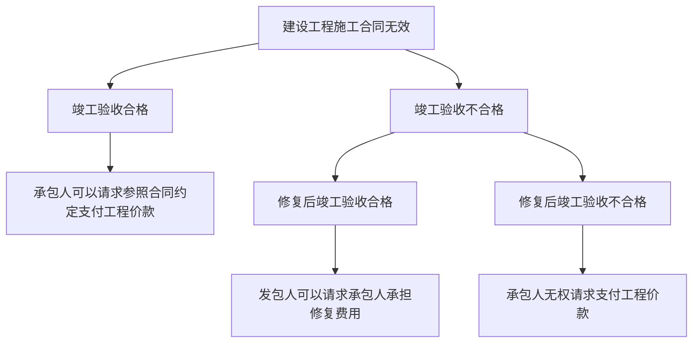

---
tags:
source: 注会
章节: 合同总论
主要程度: 核心
困难程度: 中等
复习次数: "2"
标签: " #合同法 "
创建时间: 2025-09-14T22:39:00.000Z
科目类别: 注会经济法
分值: 8
mindmap-plugin:
created:
updated: 2026-07-01
PrevNote: "[[国有资产法]]"
NextNote: "[[票据法-basic]]"
words:
  2026-05-19: 20883
  2026-05-30: 20881
  2026-05-31: 20878
  2026-07-01: 20296
  2026-07-09: 27329
  2026-07-10: 27522
  2026-07-12: 27732
---

# 
1. 合同法
2. 合同的基本原理
	1. 合同法
		1. 合同的基本理论
			1. 合同的概念
			2. 合同：民事主体之间设立、变更、终止民事法律关系的协议。合同是平等主体之间的民事法律关系，不但需要当事人有意思表示，而且要求当事人之间的意思表示一致
				1. 合同的分类（★★）
					1. 有名合同和无名合同
					2. 单务合同和双务合同
					3. 诺成合同和实践合同
					4. 实践合同：保定借代
		2. 合同的相对性（★★★）
		3. 合同的相对性：==合同主要在特定的合同当事人之间发生权利义务关系，当事人只能基于合同向另一方当事人提出请求或提起诉讼，不能向无合同关系的第三人提出合同上的请求，也不能擅自为第三人设定合同上的义务。==
	2. 合同成立
		1. 承诺
			1. 受要约人同意要约的意思表示。承诺应当由受要约人向要约人作出，并在要约确定的期限内到达要约人
				1. 承诺的期限
				2. 要约确定的期限称为承诺期限。承诺期限届满，受要约人未作出承诺的，要约失效。
		2. 合同成立的时间
			1. 承诺生效时合同成立，这是大部分合同成立的时间标准。
				1. 书面方式
3. | 					- 自当事人<mark style="background:rgba(240, 107, 5, 0.2)">均签名、盖章或者按指印时</mark>合同成立。如当事人未同时在合同书上签名、盖章或者按指印，则以当事人中最后一方签名、盖章或者按指印的时间为合同的成立时间。 |   |
4. | 					- 当事人采用信件、数据电文等形式订立合同要求签订确认书的，签订确认书时合同成立。 |---|
		1. 合同成立的地点
			1. <mark style="background:rgba(240, 107, 5, 0.2)">承诺生效的地点为</mark>合同成立的地点，这是大部分合同成立的地点标准。 #复习 #抽背 
			2. 当事人采用合同书形式订立合同的，最后签名、盖章或者按指印的地点为合同成立的地点。
			3. 采用数据电文形式订立合同的，收件人的主营业地为合同成立的地点；没有主营业地的，其住所地为合同成立的地点。
5. -3. 合同生效
	 1. 合同生效的时间
		 1. 原则：依法成立的合同，原则上==自成立==时生效。
		 2. 需批准的合同：法律、行政法规规定应当办理批准等手续生效的，在依照其规定==办理批准等手续后==生效。
		 3. 需登记的合同：法律、行政法规规定合同应当办理登记手续，但未规定登记后生效的，当事人==未办理登记手续==不影响合同的效力。
	 2. 法律、行政法规办理批准的合同
		 1. 合同获得批准前，当事人一方起诉请求对方履行合同约定的主要义务，经释明后拒绝变更诉讼请求的，人民法院应当判决驳回其诉讼请求。
			 1. 负有报批义务的当事人不履行报批义务或者履行报批义务不符合合同的约定或者法律、行政法规的规定，对方有权分别提出如下诉讼请求：
				 1. 请求继续履行报批义务。
				 2. 解除合同并请求承担违反报批义务的赔偿责任。
				 3. 在人民法院判决当事人一方履行报批义务后，仍不履行报批义务的，对方可以主张==解除合同并参照违反合同的违约责任请求其承担赔偿==责任。
				 4. 在因迟延履行报批义务等可归责于==当事人的原因导致合同==未获批准时，对方可以==请求赔偿因此受到==的损失。
6. 格式条款和免责条款
			 1. 格式条款
					 1. 格式条款的解释    #抽背 
						 1. 对格式条款的理解发生争议的：应当按照==通常理解==予以解释。对格式条款有2种以上解释的，应当作出==不利于提供格式条款==一方的解释。
						 2. 格式条款和非格式条款不一致的：应当采用非格式条款。
					 2. 格式条款的认定
						 1. 认定格式条款的核心标准：不容许对方磋商修改条款内容。
						 2. 合同中载明"本合同不属于格式条款"，该约定是无效的。
						 3. 当事人一方采用第三方起草的合同示范文本制作合同的，只要不允许对方协商修改，仍然属于格式条款。 #抽背 #记忆 
						 4. 经营者仅以未实际重复使用为由主张其预先拟定且未与对方协商的合同条款不是格式条款的，不应予以支持
			 2. 免责条款
				 1. 造成对方人身伤害的。 
				 2. 因故意或者重大过失造成对方财产损失的。
	1. 缔约过失责任
		1. 适用缔约过失责任的情形
			1. 假借订立合同，恶意进行磋商。
			2. 故意隐瞒与订立合同有关的重要事实或者提供虚假情况。
			3. 当事人泄露或者不正当地使用在订立合同过程中知悉的商业秘密或者其他应当保密的信息。
			4. 有其他违背诚实信用原则的行为。
- 2. 缔约过失责任与违约责任的区别
合同的履行
	 1. 合同的履行规则（★★）
			 1. 约定不明时的履行规则：合同生效后，当事人就以下事项没有约定或者约定不明确的，可以协议补充；不能达成补充协议的，按照合同相关条款或者交易习惯确定。依照上述规则仍不能确定的，依照下列规则确定：  #抽背 #记忆 
					 1. 履行期限：债务人可以随时履行，债权人也可以随时请求履行，但应当给对方必要的准备时间。
							 2. 履行地点
								 1. 给付货币的，在接受货币一方所在地履行。 #记忆 #复习 #抽背 
								 2. 其他标的在履行义务一方所在地履行。
								 3. 交付不动产的，在不动产所在地履行。
							 3. 价款报酬
								 1. 按照订立合同时履行地的市场价格履行。 #分录 #法条 #概念 
								 2. 依法应当执行政府定价或者政府指导价的，按照规定履行。
							 4. 质量要求
								 1. 按照==强制性国家标准==履行。
								 2. 没有强制性国家标准的，按照==推荐性国家标准==履行。
								 3. 没有推荐性国家标准的，按照==行业标准==履行。
								 4. 没有国家标准、行业标准的，按照==通常标准或者符合合同目的的特定标准==履行。
					 2. 履行方式：按照有利于实现合同目的的方式履行。
						 6. 履行费用的负担
							 1. 由履行义务一方负担。
							 2. 因债权人原因增加的履行费用，由债权人负担。
			 2. 电子合同的履行：电子合同<u>当事人对交付商品或者提供服务的方式、时间另有约定的，按照其约定。没有约定或约定不明的，</u>依照下列规则确定：
					 1. 交付内容：实物：通过互联网等信息网络订立的电子合同的标的为交付商品并采用快递物流方式交付的，收货人的签收时间为交付时间。
						 2. 交付内容：服务   #抽背 #记忆 #概念 
							 1. 电子合同的标的为提供服务的，生成的电子凭证或者实物凭证中载明的时间为提供服务时间。
							 2. 前述凭证没有载明时间或者载明时间与实际提供服务时间不一致的，以实际提供服务的时间为准。
				 3. 交付内容：软件：电子合同的标的物为采用在线传输方式交付的，合同标的物进入对方当事人指定的特定系统且能够检索识别的时间为交付时间。 #复习 #抽背 
			 3. 中止履行、提前履行与部分履行
				 1. 债权人分立、合并或者变更住所没有通知债务人，致使履行债务发生困难的，债务人可以中止履行或者将标的物提存。
						 2. 提前履行
							 1. 原则：债权人可以拒绝债务人提前履行债务，但提前履行不损害债权人利益的除外。债务人提前履行债务给债权人增加的费用，由债务人负担。
							 2. 例外：提前履行是借款人的一项权利，因此，属于提前履行规则的例外。
						 3. 部分履行
							 1. 债权人可以拒绝债务人部分履行债务，但部分履行不损害债权人利益的除外。
							 2. 债务人部分履行债务给债权人增加的费用，由债务人负担。
2. 涉及多方的债务履行（★★★）
	1. 按份债务：按份债务债务人为2人以上，且债务可分，各债务人按照份额各自负担债务的情况。按份债务人的份额难以确定的，视为份额相同
		2. 连带债务：债务人为2人以上，债权人可以请求部分或者全部债务人履行全部债务
			1. 对外：债权人有权请求任何一个或者几个连带债务人清偿全部债务
			2. 对内：连带债务人之间可以约定承担债务的份额，某连带债务人可就实际超额清偿部分向其他连带债务人追偿。连带债务人之间的份额难以确定的，视为份额相同。
		3. 第三人代为履行的债务    #复习 #抽背 #概念 
			1. 债务人不履行债务，<mark style="background:#b1ffff">第三人对履行该债务具有合法利益的</mark>，第三人有权向债权人代为履行；但是，根据规定只能由债务人履行的除外。
			2. 具有合法利益的第三人向债权人履行债务的，<mark style="background:#b1ffff">债权人无正当理由不得拒绝受领</mark>，债务人也无权加以反对。
			3. 债权人接受第三人履行后，其对债务人的债权转让给第三人，但是债务人和第三人另有约定的除外。
		4. 不安抗辩权
			1. ==先履行抗辩权==
			2. 应当先履行债务的当事人有确切证据（例如法院判决）证明对方有下列情形之一的， 可以中止履行：
				2. （1）经营状况严重恶化。
				3. （2）转移财产、抽逃资金，以逃避债务。
				4. （3）丧失商业信誉。
Å履行债务能力的其他情形
			3. 2． ==不安抗辩权的行使方式==
			4. （1）当事人行使不安抗辩权中止履行的，应当及时通知对方。
				2. （2）中止履行后，对方提供适当担保时，应当恢复履行。
				3. （3）对方在合理期限内未恢复履行能力并且未提供适当担保的，视为以自己的行为表明不履行主要债务，中止履行的一方可以解除合同并可以请求对方承担违约责任。
- 4. ！ 四、情势变更（★★）
		2． 处理方式 #抽背 #复习 #记忆 
			（1）构成情势变更时，当事人负有重新协商的义务。
			1. （2）当事人请求变更合同的，人民法院不得解除合同。
			2. （3）当事人一方请求变更合同，对方请求解除合同的，或者当事人一方请求解除合同，对方请求变更合同的，人民法院根据公平原则判决变更或者解除合同
合同的保全
- 1. 代位权
	1. 定义：代位权：债务人怠于行使其对第三人（次债务人）享有的到期债权或者与该债权有关的从权利，危及债权人债权实现时，债权人为保障自己的债权，可以自己的名义代位行使债务人对相对人的权利。
		1. ！ 行使条件
					1. （1）债权人对债务人的债权（债权 1）合法。 
					提示：法律只明确了债权 1 的合法，但通常债权 2 也需要合法。
			1. （2）债务人对次债务人的债权（债权 2）已到期，债权人对债务人的债权（债权 1）原则应到期
				1. （3）债务人怠于行使其到期债权（债权 2）或者与该债权有关的从权利。
				2. （4）债务人的债权（债权 2）不是专属于债务人自身的债权。
		2. 3． 代位权诉讼
			1. （1）债权人应以==自己的名义==通过诉讼方式行使代位权。
				1. （2）在诉讼中，债权人是原告，次债务人是被告，债务人为诉讼上应当追加的第三人。
				2. （3）代位权诉讼由==被告住所地人民法院==管辖，但是依法应当适用专属管辖规定的除外。
				3. （4）在代位权诉讼中，如果债权人胜诉，由==次债务人==承担诉讼费用，且从实现的债权中优先支付。
				4. （5）在代位权诉讼中，次债务人对债务人的抗辩，可以向债权人主张
		3. ！ 4． 代位权行使的法律效果
			1. （1）代位权的行使范围以债权人的到期债权为限。
				1. （2）债权人行使代位权的必要费用，由==债务人==负担。
				2. （3）人民法院认定代位权成立的，由债务人的相对人向债权人履行义务，债权人接受履行后，债权人与债务人、债务人与相对人之间相应的权利义务终止。
				3. （4）债权人提起代位权诉讼后，债务人无正当理由减免相对人的债务或者延长相对人的履行期限，债务人及其相对人均不得以此对抗债权人
	2. 二、撤销权★★★
	3. ！ 2． 撤销权的行使条件
		- 1. （1）债权人对债务人存在有效债权。
		1. （2）债权人对债务人的债权可以到期，也可以不到期。
			1. （3）债务人实施了减少财产的处分行为，具体体现为：
				1. 1 放弃债权、放弃债权担保或者恶意延长到期债权的履行期。
				- 1. 无偿转让财产。
				- 2. 3 以明显不合理的低价转让财产或者以明显不合理的高价受让他人财产或者为他人的债务提供担保，并且相对人知道或者应当知道该情形。
				- 3. 提示：转让价格未达到交易时交易地的市场交易价或者指导价 70％ 的，一般可以认定为"明显不合理的低价"。受让价格高于交易时交易地的市场交易价或者指导价 30％的， 一般可以认定为"明显不合理的高价"。
	- 4. （4）债务人的处分行为有害于债权人债权的实现
	2. 撤销权诉讼
		1. （1）债权人须以自己的名义行使撤销权。撤销权的行使必须通过诉讼程序。
			2. （2）在诉讼中，债权人为原告，债务人和相对人为共同被告。
			3. （3）撤销权诉讼由债务人或者相对人的住所地人民法院管辖，但是依法应当适用专属管辖规定的除外。
			4. （4）债权人行使撤销权所支付的律师代理费、差旅费等必要费用由债务人负担。
			5. （5）债权人在法定期限内主张撤销权。具体而言： 1 撤销权应当自债权人知道或者应当知道撤销事由之日起 1 年内行使。
			6. 自债务人的行为发生之日起 5 年内没有行使撤销权的，该撤销权消灭
	3. 4． 撤销权行使的法律效果
		1. （1）一旦人民法院撤销债务人影响债权人的债权实现的行为，债务人的处分行为即归于无效（自始无效）。债务人的处分行为无效的法律后果是双方返还，即受益人应当返还从债务人获得的财产。
			2. （2）撤销权行使的目的是恢复债务人的责任财产，债权人就撤销权行使的结果并无优先受偿权利。
			3. （3）撤销权的行使范围以债权人的债权为限
1. ! 三、担保方式
	1. 物保
		1. 留置
			1. 法定担保
		2. 质押 
		3. 抵押
	2. 人保
		1. 保证
			1. 保证的概念
				1. ! 第三人和债权人约定，当债务人不履行其到期债务或者发生当事人约定的情形时，该第三人按照约定履行债务或者承担责任的担保方式。
			2. 一、保证合同
				1. 单务、无偿、要式、诺诚、==从==合同
				2. 此外
					1. 1主债权债务合同中的保证条款。
					2. 2第三人单方以书面形式向债权人作出保证，债权人接收且未提出异议。
					3. ！ 3第三人在借据、收据、欠条等权利凭证或者借款合同上以保证人身份签字或者盖章
			3. 二、保证资格
				1. 主债务人不得同时为自身保证人
				2. 机关法人不得为保正为
				3. 公益目的的学校等机构不得为
			4. 三、保证方式
				1. 一般保证
					1. 无约定为一般保证
					2. 权利：先诉抗辩权
						1. ! 即在主合同纠纷未经审判或仲裁，并就债务人财产依法强制执行用于清偿债务前，保证人对债权人可拒绝承担保证责任
						2. ! 不得使用权力的情形
							1. 1债务人下落不明，且无财产可供执行。
							2. 2人民法院已经受理债务人破产案件。
							3. 3债权人有证据证明债务人的财产不足以履行全部债务或者丧失履行债务能力。
							4. 4保证人书面表示放弃先诉抗辩权
					3. ! （3）一般保证的保证人在主债务履行期限届满后，向债权人提供债务人可供执行财产的真实情况，债权人放弃或者怠于行使权利致使该财产不能被执行的，保证人在其提供可供执行财产的价值范围内不再承担保证责任
			5. 连带保证
				1. 不享有先诉抗辩权
				2. （1）连带责任保证的债务人不履行到期债务或者发生当事人约定的情形时，债权人可以请求债务人履行债务，也可以请求保证人在其保证范围内承担保证责任。
				3. 四、保证的范围
					1. 主债权
					2. 利息
					3. 违约金
					4. 赔偿金
					5. 实现债权的费用
					6. ! 有约定按约定，没约定全部承担
				4. 五、保证期间及诉讼时效
					1. 一般保证
						1. 未在保证期间起诉，不再承担保障责任
					2. 连带保证
						1. 未在保证期间起诉，不再承担保障责任
					3. 保征期间确认
						1. 没有约定，约定不明
							1. 自主债务期满期6个月   #抽背 #法条 #记忆 
						2. 有约定，自主债务履行期满之日起
							1. 例外：没有约定，自宽限期届满之日起
					4. 保证债务计算
						1. ! 1一般保证：债权人在保证期间届满前对债务人提起诉讼或者申请仲裁的，从保证人拒绝承担保证责任的权利消灭之日起，开始计算保证债务的诉讼时效。
						2. ! 2连带保证：债权人在保证期间届满前请求保证人承担保证责任的，从债权人请求保证人承担保证责任之日起，开始计算保证债务的诉讼时效
				六、主合同变更和保障责任
					变更履行期限，未经保证人同意，保证期间不便
					减轻责任，保证责任相应减轻，加重，则不变
					转移主债务
						保证人书面同意
							！1债权人未经保证人书面同意，允许债务人转移全部或者部分债务，保证人对未经其同意转移的债务不再承担保证责任，但是债权人和保证人另有约定的除外。
							! 2第三人加入债务的，保证人的保证责任不受影响。
				七、保证人的抗辩权
					（1）如果债务人放弃对债务的抗辩权，保证人仍有权抗辩（因其保证责任并未免除）。
					（2）保证人知道或者应当知道主债权诉讼时效期间届满仍然提供保证或者承担保证责任，又以诉讼时效期间届满为由拒绝承担保证责任或者请求返还财产的，人民法院不予支持。保证人承担保证责任后向债务人追偿的，人民法院不予支持，但是债务人放弃诉讼时效抗辩的除外。
				八、保证人的追偿权
					保证人承担保证责任后，除当事人另有约定外，有权在其承担保证责任的范围内向债务人追偿，享有债权人对债务人的权利，但是不得损害债权人的利益
				九、保证人的诉讼问题
				！因保证合同纠纷导致被起诉，债务人向保证人和被保证人一同主张权利的，人民法院淫荡列保证人和被保证人为被告
				（2）在民间借贷纠纷中，如出借人只向其中一方起诉，诉讼当事人因保证方式而异。
					仅起诉保借款人，可以不追加保证人为共同被告
					仅起诉保证人
						 人民法院可以追加借款人为共同被告
						 人民法院应当追加借款人为共同被告Ç
					合同担保的综合性问题
						1． 担保合同（保证合同、抵押合同、质押合同）无效
								 
							（2）担保合同无效的责任承担（缔约过失责任）
							
					一债多保
						（1）共同保证（人保与人保并存）：对于一个债权，有多个保证的情况。
						1 按份共同保证：保证人与债权人约定按份额对主债务承担保证义务。
						2 连带共同保证：各保证人约定均对全部主债务承担保证义务。
						（2）共同担保（人保与物保并存）：==被担保的债权既有物的担保又有人的担保的，债务人不履行到期债务或者发生当事人约定的实现担保物权的情==形，债权人应当按照约定实现债权，没有约定或者约定不明确的：
								 ！ 1债务人自己提供物的担保的，债权人应当先就该物的担保实现债权。
								 ！ 2第三人提供物的担保的，债权人可以就物的担保实现债权，也可以请求保证人承担保证责任
				金钱担保
					定金
						一：定金合同生效
							定金合同 实践合同，实际交付定金之日起起算
							定金数额不得超过主合同的 20%，超出部分无效
						定金的法律效力
							1）定金的物权转移：定金一旦交付，定金所有权发生移转，而不仅仅是占有的转移，这是货币的特点所决定的
							! （2）定金罚则：给付定金一方不履行约定的债务，致使不能实现合同目的，无权请求返还定金；收受定金的一方不履行约定的债务，致使不能实现合同目的，应当双倍返还定金。
								
2. 合同的变更和转让
	1. 一、合同的变更
		1. （1）法律、行政法规规定变更合同应当办理批准、登记等手续的，应当办理相应手续。
		2. （2）当事人对合同变更的内容约定不明确的，推定为未变更。
		3. （3）合同的变更，除当事人另有约定的以外，仅对变更后未履行的部分有效，对已履行的部分无溯及力
	2. 二、债权的转让
		1. （1）通知：债权人转让权利的，无须债务人同意，但应当通知债务人。未经通知，该转让对债务人不发生效力。
		2. （2）撤销：债权人转让权利的通知不得撤销，但经受让人同意的除外。
		3. （3）恶意履行：债务人接到债权转让通知后仍然向让与人履行，不发生消灭债务的效果，受让人可以请求债务人向自己继续履行债务
	3. 三、禁止债权转让情形
		1. 合同性质不能转让
		2. 当时人约定不得转让
		3. 法律规定不得转让
	4. 四、转让的效力
		1. 债权人
			1. （1）全部转让：原债权人脱离债权债务关系，受让人取代债权人地位。
			2. （2）部分转让：原债权人就转让部分丧失债权。
			3. ！（3）履行费用：因债权转让增加的履行费用，由让与人负担。
		2. 受让人
			1. （1）债权人转让权利的，受让人取得与债权有关的从权利（如抵押权），但该从权利专属于债权人自身的除外。
			2. （2）受让人取得从权利不因该从权利未办理转移登记手续或者未转移占有而受到影响
		3. 债务人
			1. （1）债务人接到债权转让通知后，债务人应在转让范围内以受让人为债权人。
			2. （2）债务人对让与人的抗辩可以向受让人主张。比如提出债权无效、诉讼时效已过等事由的抗辩。
	5. 五、债权的多重转让
		1. 2． 债务转移的效果
			1. 债务转让的条件
				1. 债务人转移债务给第三人，应经债权人同意
				2. 新节点
			2. 2． 债务转移的效果
				1. （1）新债务人可以主张原债务人对债权人的抗辩。
				2. （2）新债务人应当承担与主债务有关的从债务，但该从债务专属于原债务人自身的除外
		2. 债权债务的概括移转
			1. （1）意定的概括移转：基于转让合同的方式进行。当事人一方经他方当事人同意，可以将自己在合同中的权利义务一并通过合同转让给第三人。
			2. （2）法定的概括移转：往往是因为某一法定事实的发生而导致。最典型的就是合同当事人发生合并或分立时，就会有法定的概括移转的发生。
	合同的终止
	终止情形
		- 1. （二）约定抵销
		- 1. 当事人互负债务，标的物种类、品质不相同的，经双方协商一致，也可以抵销。
		- 2. 五、免除与混同导致合同终止（★★）
		- 1. （1）债务免除：==债权人免除债务人部分或者全部债务的，合同的权利义务部分或者全部终止==，但是债务人在合理期限内拒绝的除外。
		- 2. （2）债务混同：==债权和债务同归于一人（即债权债务混同）时，合同的权利义务终止==，但损害第三人利益的除外。
	合同的违约
		! 当事人一方不履行合同义务或者履行合同义务不符合约定的，应当承担继续履行、采取补救措施或者赔偿损失等违约责任。
		一、继续履行
			（1）金钱之债（包括价款、报酬、租金、利息等形式）一定可以请求继续履行。
				（2）当事人一方不履行非金钱债务或者履行非金钱债务不符合约定的，对方可以请求履行，但有下列情形之一的除外
				1法律上或者事实上不能履行。
					2债务的标的不适于强制履行或者履行费用过高。
					3债权人在合理期限内未请求履行
		二、补救措施（★★）
			! 当事人的履行不符合约定的，受损害方根据标的的性质以及损失的大小，可以合理选择请求对方承担修理、重作、更换、退货、减少价款或者报酬等违约责任。
		三、损害赔偿(★★★)
			当事人一方不履行合同义务或者履行合同义务不符合约定，给对方造成损失的，应当承担损害赔偿责任；一方在履行义务或者采取补救措施后，对方还有其他损失的，应当对其他损失承担赔偿责任。
				赔偿损失
					
				违约金
					
					
				（四）损害赔偿的减少或免责
					1． 过失相抵规则
						（1）当事人一方违约造成对方损失，对方对损失的发生有过错的，可以减少相应的损失赔偿额。
						（2）当事人一方违约后，对方应当采取适当措施防止损失的扩大。==没有采取适当措施致使损失扩大的，不得就扩大的损失请求赔偿==。当事人因防止损失扩大而支出的合理费用由违约方承担。
				2． 免责事由违
					约损害赔偿法定的免责事由仅限于不可抗力。
					（1）不可抗力的认定：不能预见、不能避免且不能克服的客观情况
					（2）对于合同履行的影响：因不可抗力，合同当事人不履行合同约定的行为并非当然免责，要根据不可抗力对合同履行的影响决定。
						- 1. 1 因不可抗力不能履行合同的，根据不可抗力的影响，部分或者全部免除责任。
						- 2. 2 当事人迟延履行后发生不可抗力的，不能免除责任。
						- 3. 3 主张不可抗力的义务：及时通知对方相关情况，以减轻可能给对方造成的损失；提供有关不可抗力的证明
3. 有名合同
4. 一、标的物的交付（★★★）
		 1. （一）交付的时间
			 1. 当事人约定交付期间的，出卖人可以在该==交付期间内==的任何时间交付
		 2. （二）交付的地点
			 1. 出卖人应当按照约定的地点交付标的物。==当事人没有约定交付地点或者约定不明确==， 依照有关规定仍不能确定的，适用下列规定
			 2. ！ 标的物需要运输（第三方运输）
				 1. 出卖人应当将标的物交付给第一承运人以运交给买受人
			 3. ! 标的物不需要运输
				 1. （1）出卖人和买受人订立合同时知道标的物在某一地点的，出卖人应当在该==地点交付标==的物。
				 2. （2）不知道标的物在某一地点的，应当在出卖人订立合同时的营业地交付标的物
		 3. （四）“一物数卖”下的交付
			 1. （1）如果出卖人就同一标的物订立多重买卖合同，==原则上各个买卖合同均属有效==，但标的物所有权归谁所有，则不能按照合同签订的先后顺序确定。
			 2. （2）在多个买受人中，只有先==完成动产交付或者不动产转移登记的买受人==才能取得标的物的所有权
		 4. 二、风险负担规则（★★★）
			 1. （一）风险负担的判断
				 1. 1． 一般规则——==交付时==
					 1. （1）标的物毁损、灭失的风险，在标的物交付之前由出卖人承担，交付之后由买受人承担。
						 1. 提示：无论不动产还是动产，风险负担转移的标准是交付，而非所有权转移。
					 2. （2）如果出卖人以提存的方式履行，则提存之后，提存物的风险转由买受人承担。
					 3. （3）出卖人未按照约定交付有关标的物的单证和资料的，不影响标的物风险的转移。
				 2. 2． 买受人违约——==买受人违约时==
					 1. （1）因买受人的原因致使标的物未按照约定的期限交付的，买受人应当自违反约定时起承担标的物毁损、灭失的风险。
					 2. （2）出卖人按照约定或者依照法律规定将标的物置于交付地点，买受人违反约定没有收取的，标的物毁损、灭失的风险自违反约定时起由买受人承担。
				 3. 3． 涉及运输——==交承运人时==
					 1. 当事人没有约定交付地点或者约定不明确，标的物需要运输的，出卖人将标的物交付给第一承运人后，标的物毁损、灭失的风险由买受人承担。
				 4. 4． 路货买卖——==合同成立时==
					 1. 出卖人出卖交由承运人运输的在途标的物，除当事人另有约定外，毁损、灭失的风险自合同成立时起由买受人承担。
				 5. 5． 出卖人根本违约——==买受人拒收或解除合同时==
					 1. 因标的物不符合质量要求，致使不能实现合同目的的，买受人可以拒绝接受标的物或者解除合同。买受人拒绝接受标的物或者解除合同的，标的物毁损、灭失的风险由出卖人承担。
			 2. （二）风险负担与违约责任
				 1. ！ 标的物毁损、灭失的风险由买受人承担的，不影响因出卖人履行义务不符合约定，买受人要求其承担违约责任的权利
	1. -
			1. 1. 三、标的物的检验（★★★）
					1. 1． 质量和包装
			2. -
					1. ！ （1）出卖人应当按照约定的质量要求交付标的物。出卖人提供有关标的物质量说明的，交付的标的物应当符合该说明的质量要求。
				1. 2. （2）出卖人交付的标的物不符合质量要求的，买受人可以依法要求其承担违约责任。
				2. 3. （3）出卖人应当按照约定的包装方式交付标的物。
				3. 4. ！ （4）对包装方式没有约定或者约定不明确的，依照《民法典》有关规定仍不能确定的，应当按照通用的方式包装，没有通用方式的，应当采取足以保护标的物的包装方式。
		1. -
				1. 2． 检验期买受人收到标的物时应当在约定的检验期限内检验；没有约定检验期限的，买受人应当及时检验。
			1. -
					1. （1）当事人约定检验期限的：买受人应当在检验期限内将标的物的数量或质量不符合约定的情形通知出卖人。买受人怠于通知的，视为标的物的数量或者质量符合约定。
				1. 2. （2）当事人没有约定检验期限的：买受人应当在发现或者应当发现标的物的数量或者质量不符合约定的合理期限内通知出卖人。
				2. 3. （3）买受人在合理期间内未通知或者自收到标的物之日起 2 年内未通知出卖人的，视为标的物的数量或者质量符合约定，以下情况除外： 1标的物有质量保证期的：适用质量保证期，不适用该 2 年的规定。
		2. 3. 2出卖人知道或者应当知道提供的标的物不符合约定的：买受人不受上述通知时间的限制。
		3. 4. 3超过合理期间或者 2 年期限后，出卖人自愿承担违约责任：后又以上述期限经过为由反悔的，人民法院不予支持。
		4. 5. 提示：2 年是最长的合理期限。该期限为不变期限，不适用诉讼时效中止、中断或者延长的规定
	2. 四、价款的支付
		1. 买卖合同当事人就价款支付没有约定或者约定不明确的，依照《民法典》的有关规定仍不能确定的，按照下列规则确定
			1. 地点
				1. （1）一般情况：在出卖人的营业地支付。
				   2. （2）以交付标的物或者交付提取标的物单证为条件的：在交付标的物或者交付提取标的物单证的所在地支付
	3. ！ 五、买卖合同的解除（★★★
		1. 涉及从物
			1. （1）因标的物的主物不符合约定而解除合同的，解除合同的效力及于从物。
			   2. ！ （2）标的物的从物因不符合约定被解除的，解除的效力不及于主物
		2. 涉及数物
			1. 新节点
		3. 分批交付
			1. ！ 1）出卖人对其中一批标的物不交付或者交付不符合约定，致使该批标的物不能实现合同目的的，买受人可以就该批标的物解除合同。
			2. ！ （2）出卖人不交付其中一批标的物或者交付不符合约定，致使之后其他各批标的物的交付不能实现合同目的的，买受人可以就该批以及今后其他各批标的物解除合同。
			3. ! （3）买受人如果就其中一批标的物解除合同，该批标的物与其他各批标的物相互依存的，可以就已经交付和未交付的各批标的物解除合同
5. 六、特种买卖合同
	1. 分期付款的合同
		1. （1）分期付款要求买受人将应付的总价款在一定期间内至少分 3 次向出卖人支付。
		2. ！ （2）分期付款的买受人未支付到期价款的金额达到全部价款的 1/5，经催告后在合理期限内仍未支付到期价款的，出卖人可以请求买受人一并支付到期与未到期的全部价款或者解除合同
	2. （二）凭样品买卖合同
		1. （1）凭样品买卖的当事人应当封存样品，并可以对样品质量予以说明。出卖人交付的标的物应当与样品及其说明的质量相同。
		2. （2）凭样品买卖的买受人不知道样品==有隐蔽瑕疵的，即使交付的标的物与样品相同==， 出卖人交付的标的物的质量仍然应当符合同种标的物的通常标准
	3. （三）试用买卖合同
		1. @  （1）试用买卖的当事人可以约定标的物的==试用期限==。对试用期限没有约定或者约定不明确，依照《民法典》的有关规定仍不能确定的，由==出卖人==确定
		2. （2）试用买卖的买受人在试用期内可以购买标的物，也可以拒绝购买。==买卖合同存在下列约定内容之一的，不属于试用买卖：==
			1. 1 约定标的物经过试用或者检验符合一定要求时，买受人应当购买标的物。
			2. 2 约定第三人经试验对标的物认可时，买受人应当购买标的物。
			3. 3 约定买受人在一定期限内可以调换标的物。
			4. 4 约定买受人在一定期限内可以退还标的物
		3. （3）试用期限届满，买受人对是否购买标的物未作表示的，视为购买。
		4. （4）如买受人已支付部分或全部价款，或对标的物实施了出卖、出租、设定担保物权等非试用行为的，应视为同意购买。
	4. （四）以招标投标方式订立的买卖合同 #变
		1. （1）招标：招标人发出招标公告，招标公告属于要约邀请。
		2. （2）投标：投标时投标人应当根据招标公告的要求作出意思表示，投标属于要约。
		3. （3）评标并定标：招标人组织评标并定标，定标属于承诺。
		4. （4）中标人在接到中标通知后与招标人签订书面合同：买卖合同原则上此时成立。
		5. （5）恶意不签订书面合同：当事人请求确认合同自中标通知书到达中标人时成立的， 人民法院应予支持。人民法院应当依据招标文件、投标文件和中标通知书等确定合同内容
	5. （五）商品房买卖合同
		1. 1． 商品房销售广告的性质认定
			1. （1） 有关商品房的销售广告和宣传资料原则上为要约邀请， 对出卖人无合同上的约束力。
			2. （2）就商品房开发规划范围内的房屋及相关设施所作的说明和允诺具体确定，并对合同的订立以及房屋价格的确定有重大影响的，为要约。内容即使未订入合同，仍属于合同的组成部分，当事人违反这些内容的，承担违约责任。
		2. 2． 商品房预售合同的效力
			1. 商品房预售属于法律规定的特许经营范围， 因此出卖人必须申领商品房预售许可证明。
			2. （1）出卖人未取得预售许可而与买受人订立预售合同的，合同无效；==但是在起诉前取得预售许可的，合同有效。==
			3. （2）商品房预售合同应当办理登记备案手续，但该登记备案手续并非合同生效条件， 当事人另有约定的除外。
		3. 3． 商品房买卖合同的法定解除权商品房买卖合同中，当事人==可以行使解除权==的特殊情形：
			1. （1）因房屋主体结构质量不合格不能交付使用，或者房屋交付使用后，房屋主体结构质量经核验确属不合格的。
			2. （2）因房屋质量问题严重影响正常居住使用的。
			3. （3）出卖人迟延交付房屋或者买受人迟延支付购房款，经催告后在 ==3 个月的合理期限==内仍未履行的。
			4. （4）约定或者法定的办理房屋所有权登记的期限届满后超过 1 年，因出卖人的原因==导致买受人无法办理房屋所有权==登记的。
		4. 4． 商品房买卖合同与贷款合同的效力关系
			1. （1）商品房买卖合同无效、被撤销或者被解除，则贷款合同也应相应解除，出卖人应当将收受的购房贷款和购房款的本金及利息分别返还给担保人和买受人。
			2. （2）贷款合同未能订立，导致商品房买卖合同不能履行的，当事人可以解除合同，并分析贷款合同未能订立的原因==，在可归责于一方当事人的情况下，==由该当事人赔偿损失。
	6. （六）互易合同互易合同：金钱以外相互交换标的物所有权的合同。
		1. 1. （1）互易合同参照买卖合同的规定，属于双务、诺成的合同。
		2. 2. （2）互易合同的标的物价值并不当然对等，实践中一方当事人还可能须交付一定金钱（附补足金的互易合同）。
		3. 3. （3）附补足金互易合同中的金钱部分，应当参照买卖合同中关于支付价款部分的规定处理。
6. 租赁合同
7. 合同形式
	1. 租赁期限 ==6 个月==以上的，应当采用==书面==形式。当事人未依照法律、行政法规规定办理租赁合同登记备案手续的，==不影响合同的效力==。
8. 二、租赁期限(★★★)
9. （一）定期租赁
	1. （1）租赁期限不得超过 ==20== 年。超过 20 年的，超过部分无效。
	2. （2）租赁期限届满，当事人可以续订==租赁==合同，但约定的租赁期限自续订之日起仍不得超过 ==20== 年。
10. （二）不定期租赁
	1. 不定期租赁主要有以下几种情况：
		1. （1）租赁期限 ==6 个月==以上，当事人未订立书面租赁合同，且==无法确定租赁期限==的，视为不定期租赁。
		2. （2）当事人对租赁期限没有约定或者约定不明确，依照有关规定仍不能确定的，视为不定期租赁。
		3. （3）租期届满，承租人继续使用租赁物，出租人没有提出异议的，==原租赁合同继续有效，但租赁期限为不定期。==
11. 三、租赁物的使用与维修（★★★）
12. （一）租赁物的使用（1）承租人应当按照约定的方法或租赁物的性质使用租赁物。
	1. 1 按照约定使用租赁物：致使租赁物受到损耗的，不承担损害赔偿责任。
	2. 2 未按照约定使用租赁物：致使租赁物受到损失的，出租人可以解除合同并请求赔偿损失。
	3. （2）在租赁期限内因占有、使用租赁物获得的收益，归承租人所有，但当事人另有约定的除外。
	4. （3）承租人经出租人同意，可以对租赁物进行改善或者增设他物。承租人未经出租人同意，对租赁物进行改善或者增设他物的，出租人可以请求承租人恢复原状或者赔偿损失。
13. （二）租赁物的维修出租人应当履行租赁物的维修义务，但当事人另有约定的除外。
	1. （1）承租人在租赁物需要维修时可以要求出租人在合理期限内维修。
	2. （2）出租人未履行维修义务的，承租人可以自行维修，维修费用由==出租人==负担。
14. 四、租金支付（★★★）
15. （一）支付租金的时间承租人应当按照约定的期限支付租金。对支付期限没有约定或者约定不明确，依照《民法典》的有关规定仍不能确定的：
	1. （1）租赁期限不满 1 年的：应当在租赁期间届满时支付。
	2. （2）租赁期限 1 年以上的：应当在每届满 1 年时支付，剩余期限不满 1 年的，应当在租赁期限届满时支付。
	3. （3）承租人无正当理由未支付或者迟延支付租金的，出租人可以请求承租人在合理期限内支付。承租人逾期不支付的，出租人可以解除合同。
16. （二）调减租金的事由
	1. （1）因第三人主张权利，致使承租人不能对租赁物使用、收益的，承租人可以请求减少租金或者不支付租金。第三人主张权利的，承租人应当及时通知出租人。
	2. （2）因维修租赁物影响承租人使用的，应当相应==减少租金或者延长租期。==
	3. （3）因不可归责于承租人的事由，致使租赁物部分或者全部毁损、灭失的，承租人可以要求==减少租金或者不支付租金。==
17. （三）次承租人的代为履行
	1. （1）承租人拖欠租金的，次承租人可以==代承租人支付==其欠付的租金和违约金，但是转租合同对出租人不具有法律约束力的除外。
	2. （2）次承租人属于对该债务履行具有合法利益的第三人，出租人无正当理由不得拒绝受领，否则陷入债权人迟延，承租人也无权加以反对。
	3. （3）次承租人代为支付的租金和违约金，可以充抵次承租人应当向承租人支付的租金；超出其应付的租金数额的，可以向承租人追偿。
18. 五、租赁物的转租（★★★）
19. 承租人经出租人同意，可以将租赁物转租给第三人。
	1. （1）承租人转租的，承租人与出租人之间的租赁合同继续有效，第三人对租赁物造成损失的，承租人应当赔偿损失。
	2. （2）承租人未经出租人同意转租的，出租人可以解除合同。
20. 六、“买卖不破租赁”(★★★)
21. 租赁物在承租人按照租赁合同占有期限内发生所有权变动的， 不影响租赁合同的效力。
22. 租赁合同的解决
23. （一）双方均可主张解除的事由
	1. 对于不定期租赁，双方当事人均可以==随时解除合同==，但出租人解除合同应当在合理期限之前通知承租人。
24. （二）出租人主张解除的事由
	1. （1）承租人未按照约定的方法或未根据租赁物的性质使用租赁物，致使租赁物受到损失的，出租人可以解除合同并请求赔偿损失。
	2. （2）承租人无正当理由未支付或者迟延支付租金的，出租人可以请求承租人在合理期限内支付。承租人逾期不支付的，出租人可以解除合同。
	3. （3）承租人==未经出租人同意转租==的，出租人可以解除合同。
	4. （三）承租人主张解除的事由
		1. （1）因不可归责于承租人的事由，致使租赁物全部毁损、灭失，不能实现合同目的的，承租人可以解除合同。
		2. （2）租赁物危及承租人的安全或者健康的，即使承租人订立合同时明知该租赁物质量不合格，承租人仍然可以随时解除合同。
25. 八、房屋租赁合同的特殊问题（★★★）
26. （一）房屋租赁合同的无效与处理
	1. 
	2. （二）房屋租赁中承租人的优先权（“居者有其屋”）
		1. 1． 承租人优先续租权租赁期限届满，房屋承租人享有以==同等条件优先承租==的权利。
		2. 2． 承租人优先购买权出租人出卖租赁房屋的，应当在出卖之前的合理期限内通知承租人，房屋承租人享有以同等条件优先购买的权利
		3. 3． 承租人优先购买权的保障措施
			1. （1）出租人委托拍卖人拍卖租赁房屋的，应当在==拍卖 5 日前==通知承租人。承租人未参加拍卖的，视为放弃优先购买权
			2. （2）出租人未在合理期限内通知承租人或者有其他妨害承租人行使优先购买权情形的，承租人可以请求出租人承担赔偿责任。但是，出租人与第三人订立的房屋买卖合同的效力不受影响，承租人不得以此主张房屋买卖合同无效。
			   3. 4． 承租人优先购买权的限制有下列情形之一的，承租人不得主张优先购买权：
				1. 
		4. （三）承租人同住人的权利承租人在房屋租赁期间死亡的，与其==生前共同居住的人或者共同经营人可以按照原租赁合同租赁==该房屋。
27. 具有融资性质的合同
28. （一）借款合同的性质
	1. （1）借款合同一般为==诺成==合同，自双方意思表示一致时成立。比较特殊的是，自然人之间的借款合同为实践合同，自贷款人提供借款时生效。
		 1. 提示：上述“提供借款”包括现金支付、银行转账、电子汇款、交付票据等各种方式。
	2. （2）借款合同应采用==书面==形式，但自然人之间借款另有约定的除外。
29. （二）借款合同的还本付息
	1. 1． 利息的确定
		1. （1）借款合同没有约定的：视为==没有==利息。
		2. （2）借款合同对支付利息约定不明确，当事人不能达成补充协议的：
		3. 1自然人之间借款：视为==没有==利息。
		4. -2其他情况：应按照当地或者当事人的交易方式、交易习惯、市场利率等因素确定利息。
	2. （3）借款的利息不得预先在本金中扣除。利息预先在本金中扣除的，应当按照==实际借款数额返还借款==并计算利息（“砍头息”）。
	3. 2． 付息时间
		1. 借款人应当按照约定的期限支付利息。对支付利息的期限没有约定或者约定不明确， 依照有关规定仍不能确定的：
			1. （1）借款期间不满 1 年的：应当在==返还借款==时一并支付。
			2. （2）借款期间 1 年以上的：应当在每届满 1 年时支付，剩余期间不满 1 年的，应当在==返还借款==时一并支付。
		2. 3． 还本时间
			1. ！ 借款人应当按照约定的期限返还借款。对借款期限没有约定或者约定不明确，依照《民法典》的有关规定仍不能确定的，借款人可以随时返还；贷款人可以==催告借款人在合理期限==内返还。
	4. 4． 提前还款与展期
		1. （1）展期：借款人可以在还款期限届满之前向贷款人申请展期，贷款人==同意的==，可以展期。
		2. （2）提前还款：借款人提前偿还借款的，除当事人另有约定的以外，应当按照==实际借款的期间==计算利息。
30. 民间借贷合同
	1. 合同效力
			1. 1． 合同的效力民间借贷：自然人、法人、其他组织（不包括持牌金融机构）之间及其相互之间进行资金融  通的行为。民间借贷的借款合同原则上有效。==但存在以下情况之一的，应为无效：==
			2. 1. （1）套取金融机构贷款转贷的。
				1. （2）以向其他营利法人借贷、向本单位职工集资，或者以向公众非法吸收存款等方式取得的资金转贷的。
				2. （3）未依法取得放贷资格的出借人，以营利为目的向社会不特定对象提供借款的。
				3. （4）出借人事先知道或者应当知道借款人借款用于违法犯罪活动仍然提供借款的。
				4. （5）违反法律、行政法规强制性规定的。
				5. （6）违反公序良
	2. 1. 民间借贷利率
			1. 出借人请求借款人按照合同约定利率支付利息的，人民法院应予支持，但是双方约定的利率超过合同成立时 ==1 年期贷款市场报价利率（LPR）4== 倍的除外。
		1. 2.
31. 民间借贷的逾期利率（有序列表版）
	1. 约定逾期利率
	   从其约定，但以不超过合同成立时1年期贷款==市场报价利率（LPR）4倍==为限。
	2. 未约定逾期利率，但约定借期利率
	   出借人主张借款人自逾期还款之日起按照借期内利率支付资金占用期间利息的，人民法院应予支持。
	3. 既未约定逾期利率，也未约定借期利率
	   出借人主张借款人自逾期还款之日起参照==当时1年期贷款市场报价利率（LPR）==标准计算的利息承担逾期还款违约责任的，人民法院应予支持。
	4. 主张逾期利息、违约金或者其他费用
	   可以一并主张，但总计超过合同成立时1年期贷款==市场报价利率（LPR）4倍==的部分，人民法院不予支持。
	   4． 互联网借贷平台的法律责任
	（1）原则：借贷双方通过网络贷款平台形成借贷关系，网络贷款平台的提供者==仅提供媒介服务==，不承担担保责任。
	（2）例外：网络贷款平台的提供者通过网页、广告或者其他媒介明示或者有其他证据证明其为借贷提供担保的，==网络贷款平台的提供者应当承担担保责任。==
	5． 法定代表人在民间借贷合同中的责任
	（1）法人的法定代表人或者非法人组织的负责人以==单位名义与出借人==签订民间借贷合同，有证据证明所借款项系法定代表人或者负责人个人使用，出借人请求将法定代表人或者负责人列为共同被告或者第三人的，人民法院应予准许。
	（2）法人的法定代表人或者非法人组织的负责人以个人名义与出借人订立民间借贷合同，所借款项用于单位生产经营，==出借人请求单位与个人共同承担责任的==，人民法院应予支持。
！ （四）借新还旧场合的担保责任
		 1． 旧贷担保人责任主合同当事人协议以新贷偿还旧贷，债权人请求旧贷的担保人承担担保责任的，人民法院不予支持。
		 1. 2． 新贷担保人责任主合同当事人协议以新贷偿还旧贷，债权人请求==新贷的担保人承担担保责任的==，按照下列情形处理： 
			 1. （1）新贷与旧贷的担保人相同的，人民法院应予支持。
			 2. （2）新贷与旧贷的担保人不同的（或者旧贷无担保新贷有担保的），人民法院不予支持，但是==债权人有证据证明新贷的担保人提供担保时对以新贷偿还旧贷的==事实知道或者应当知道的除外
32. 融资租赁合同
	1. 应当采用==书面==形式
	2. （一）从“买卖”的角度看融资租赁——“真买方：承租人”
		1. 出租人根据承租人对出卖人、租赁物的选择与出卖人订立买卖合同，出卖人按照约定向承租人==交付标的物==，承租人享有与受领标的物==有关的买受人的==权利。
			1. 在上述买卖合同中，未经承租人同意，出租人不得变更与承租人有关的合同内容。
				1. 1． 风险负担承租人占有租赁物期间，租赁物毁损、灭失的风险==由承租人==承担，（租赁物毁损、灭失后）出租人要求承租人继续支付租金的，人民法院应予支持。但当事人另有约定或者法律另有规定的除外。
				2. 2． 标的物检验与受领
					1. （1）出卖人违反合同约定的向承租人交付标的物的义务，存在下列情形之一的，==承租人可以拒绝受领租赁物：==
						1. 1租赁物严重不符合约定的。
						2. 2出卖人未按照约定交付标的物， 经承租人或者出租人催告后在合理期限内仍未交付。
					2. （2）承租人拒绝受领租赁物，==未及时通知出租人==，或者无正当理由拒绝受领租赁物， 造成出租人损失，出租人可以请求承租人承担损害赔偿责任。
					3. （3）出租人、出卖人、承租人可以约定，出卖人不履行==买卖合同==义务的，由承租人行使索赔的权利。
				3. 3． 标的物的所有权
					1. 出租人对租赁物享有所有权。承租人破产的，==租赁物不属于破产财产==
		2. （二）从“租赁”的角度看融资租赁——“假租赁”
			1. 1． 租赁物适用性的责任租赁物不符合租赁合同约定或者不符合使用目的的，出租人不承担责任，但承租人依赖出租人的技能确定租赁物或者出租人干预选择租赁物的除外。
			2. ! 2． 租赁物的占有、保管和维修
				1. （1）出租人应当保证承租人对租赁物的占有和使用。
				2. （2）承租人占有租赁物期间，租赁物造成第三人的人身损害或者财产损失的，出租人不承担责任。
				3. （3）承租人应当妥善保管、使用租赁物，履行占有租赁物期间的维修义务。
			3. ! 3． 变相的“买卖不破租赁”出租人转让其在融资租赁合同项下的部分或者全部权利，受让方不得据此要求解除或者变更融资租赁合同
		3. （三）从“借款”的角度看融资租赁——“真借贷”
		4. 1． 租金实质为本息融资租赁合同虽具有租赁的性质，但其目的是融资。租金是融资的对价，而非标的物使用的对价。
		5. ! 2． 出租人解除合同有下列情形之一的，出租人可以要求解除融资租赁合同：
			！ （1）承租人未按照合同约定的期限和数额支付租金，符合合同约定的解除条件，经出租人催告后在合理期限内仍不支付的，可以请求支付全部租金；也可以解除合同，收回租赁物。
			！ 2. （2）合同对于 欠付租金解除合同的情形没有明确约定，但承租人欠付租金达到 2 期以上，或者数额达到全部租金 15％ 以上，经出租人催告后在合理期限内仍不支付的。
			！ 3. （3）承租人未经出租人同意，将租赁物转让、抵押、质押、投资入股或以其他方式处分的。
			! 4. （4）承租人违反合同约定，致使合同目的不能实现的其他情形。
		6. ! 3． 承租人解除合同因出租人原因致使承租人无法占有、使用租赁物，承租人可以解除融资租赁合同。
		7. 4． 期满租赁物的归属出租人和承租人可以约定租赁期间届满租赁物的归属。
			1. （1）当事人约定租赁期限届满，承租人仅需向出租人支付象征性价款（如 1 元）的， 视为约定的租金义务履行完毕后租赁物的所有权归承租人。
			2. （2）对租赁物的归属没有约定或者约定不明确，依照《民法典》的有关规定仍不能确定的，租赁物的所有权归出租人。
33. 买卖合同
	1. 标题物的交付
		1. 买卖合同，义务是标的物交付
			1. 交付时间
				1. 当事人约定交付期间的，出卖人可以在==该交付期间内的任何时间==交付。
			2. 交付地点
				1. 出卖人应当按照约定的地点交付标的物。当事人没有约定交付地点或者约定不明确， ==依照有关规定仍不能确定的==，适用下列规定
					1. 标的物需要运输
						1. ！ 出卖人应当就将标的物交付给第一承运人以运交给买受人
					2. 标的物不需要运输
						1. （1）出卖人和买受人订立合同时知道标的物在某一地点的，出卖人应当==在该地点交==付标的物。
						2. ！ （2）不知道标的物在某一地点的，应当在出卖人订立合同时的==营业地==交付标的物
				2. 交付标的物
					1. （1）出卖人应当履行向买受人交付==标的物或者交付提取标的物的==单证，并转移标的物的所有权的义务。
					2. （2）出卖人就交付的标的物，负有保证第三人对该标的物不享有任何权利的义务，但买受人订立合同时知道或者应当知道第三人对买卖的标的物享有权利的，或法律另有规定的除外。
					3. （3）出卖人应按照约定或者交易习惯向买受人交付提取标的物单证以外的有关单证和资料（例：发票、保修单、说明书等）。
					4. （4）标的物的所有权自==标的物交付==时起转移，但法律另有规定的除外。
			3. 一物数卖
				1. （1）如果出卖人就同一标的物订立多重买卖合同，==原则上各个买卖合同均属有效==，但标的物所有权归谁所有，==则不能按照合同签订的先后顺序确定。==
				2. （2）在多个买受人中，只有==先完成动产交付或者不动产转移登记的买受人==才能取得标的物的所有权。
		2. 风险交付规则
			1. 风险交付原则
				1. （1）标的物毁损、灭失的风险，在标的物交付之前由==出卖人==承担，交付之后由==买受人==承担。
					1. 提示：无论不动产还是动产，风险负担转移的标准是交付，而非所有权转移。
				2. （2）如果出卖人以提存的方式履行，则提存之后，提存物的风险转由==买受人==承担。
				3. （3）出卖人未按照约定交付有关标的物的单证和资料的，不影响==标的物风险的转移。==
			2. 2． 买受人违约——==买受人违约时==
				1. （1）因买受人的原因致使标的物未按照约定的期限交付的，买受人应当自==违反约定时==起承担标的物毁损、灭失的风险。
				2. （2）出卖人按照约定或者依照法律规定将标的物置于交付地点，买受人违反约定没有收取的，标的物毁损、灭失的风险==自违反约定时起==由买受人承担。
			3. 3． 涉及运输——交承运人时
				1. 当事人没有约定交付地点或者约定不明确，标的物需要运输的，出卖人将标的物交付==给第一承运==人后，标的物毁损、灭失的风险由买受人承担。
			4. 4． 路货买卖——合同成立时
				1. 出卖人出卖交由承运人运输的在途标的物，除当事人另有约定外，毁损、灭失的风险自==合同成立时起==由买受人承担。
			5. 5． 出卖人根本违约——买受人拒收或解除合同时
				1. 因标的物不符合质量要求，致使不能实现合同目的的，买受人可以拒绝接受标的物或者解除合同。买受人拒绝接受标的物或者解除合同的，标的物毁损、灭失的风险由==出卖人==承担
		3. （二）风险负担与违约责任
			1. 标的物毁损、灭失的风险由==买受==人承担的，不影响因出卖人履行义务不符合约定，买受人要求其承担违约责任的权利
		4.标的物检验
			1.质量和包装
				（1）出卖人应当按照==约定的质量==要求交付标的物。出卖人提供有关标的物质量说明的，交付的标的物应当符合该说明的质量要求。
				（2）出卖人交付的标的物不符合质量要求的，买受人可以依法要求其承担违约责任。
				（3）出卖人应当按照约定的包装方式交付标的物。
				（4）对包装方式没有约定或者约定不明确的，依照《民法典》有关规定仍不能确定的，应当按照==通用的方式==包装，没有通用方式的，应当采取足以==保护标的物==的包装方式。
			检验期
				买受人收到标的物时应当在约定的检验期限内检验；没有约定检验期限的，买受人应当及时检验。
					（1）当事人约定检验期限的：买受人应当在==检验期限内==将标的物的数量或质量不符合约定的情形通知出卖人。买受人怠于通知的，==视为==标的物的数量或者质量符合约定。
					（2）当事人==没有约定==检验期限的：买受人应当在发现或者应当发现标的物的数量或者质量不符合约定的==合理期限内==通知出卖人。
					（3）买受人在合理期间内未通知或者自收到标的物之日起 ==2== 年内未通知出卖人的，视为标的物的数量或者质量符合约定，以下情况除外：
						1标的物有质量保证期的：适用==质量保证期==，不适用该 2 年的规定。
						2出卖人知道或者应当知道==提供的标的物不符合约定的==：买受人不受上述通知时间的限制。
						3超过合理期间或者 2 年期限后，出卖人自愿承担违约责任：后又以上述期限经过为由反悔的，人民法院不予支持。
		四、价款支付（★）
			买卖合同当事人就价款支付==没有约定或者约定不明确的==，依照《民法典》的有关规定仍不能确定的，按照下列规则确定：
				地点
					（1）一般情况：在出卖人的==营业地==支付。
					（2）以交付标的物或者交付提取标的物单证为条件的：在==交付标的物或者交付提取标的物单证的==所在地支付
				时间
					收到标的物或者提取标的物单证的==同时==支付
				金额
					出卖人多交标的物的，买受人可以接收或者拒绝接收多交的部分。
					（1）接受：按照==合同的价格==支付价款。
					（2）拒绝：应当及时通知出卖人
		五、买卖合同解除
			除了适用合同法总则规定的法定解除权，《民法典》对于买卖合同还规定了特别的解除规则。
				! 涉及从物
					（1）因标的物的主物不符合约定而解除合同的，解除合同的效力及于从物。
					（2）标的物的从物因不符合约定被解除的，解除的效力不及于主物
				! 涉及数物
					（1）因标的物的主物不符合约定而解除合同的，解除合同的效力及于从物。
					（2）标的物的从物因不符合约定被解除的，解除的效力不及于主物
				分批交付
					! （1）出卖人对其中一批标的物不交付或者交付不符合约定，致使该批标的物不能实现合同目的的，买受人可以就该批标的物解除合同。
					! （2）出卖人不交付其中一批标的物或者交付不符合约定，致使之后其他各批标的物的交付不能实现合同目的的，买受人可以就该批以及今后其他各批标的物解除合同。
					! （3）买受人如果就其中一批标的物解除合同，该批标的物与其他各批标的物相互依存的，可以就已经交付和未交付的各批标的物解除合同
	2. 六、特种买卖合同（★★★）
		1. （一）分期付款买卖合同
			1. （1）分期付款要求买受人将应付的总价款在一定期间内至少分 ==3== 次向出卖人支付。
			2. （2）分期付款的买受人未支付到期价款的金额达到全部价款的 ==1/5==，经催告后在合理期限内仍未支付到期价款的，出卖人可以请求买受人==一并支付到期与未到期的全部价款或者解除合同。==
		2. （二）凭样品买卖合同
			1. （1）凭样品买卖的当事人应当封存样品，并可以对样品质量予以说明。出卖人交付的标的物应当与==样品及其说明的质==量相同。
			2. （2）凭样品买卖的买受人不知道样品有隐蔽瑕疵的，即使交付的标的物与样品相同， 出卖人交付的标的物的质量==仍然应当符合同种标的物的==通常标准
		3. （三）试用买卖合同
			1. （1）试用买卖的当事人可以约定标的物的试用期限。对试用期限没有约定或者约定不明确，依照《民法典》的有关规定仍不能确定的，由==出卖人==确定。
			2. （2）试用买卖的买受人在==试用期内可以购买标的物，也可以拒绝购买==。买卖合同存在下列约定内容之一的，不属于试用买卖： 
				1. 1约定标的物经过试用或者检验符合一定要求时，买受人应当购买标的物。
				2. 2约定第三人经试==验对标的物认可时，买受人应当购买标的物==。
				3. 3约定买受人在一定期限内可以==调换标==的物。
				4. 4约定买受人在一定期限内可以==退还标的==物。
			3. （3）试用期限届满，买受人对是否购买标==的物未作表示的，视为购买。==
			4. （4）如买受人已支付部分或全部价款，或对标的物实施了出卖、出租、设定担保物权等非试用行为的，应视为同意购买
		4. ！ （四）以招标投标方式订立的买卖合同 
			1. 变招标投标：由招标人向数人或者公众发出==招标通知或招标公告==，在诸多投标人中按照一定的标准，选择自己最满意的投标人并与之订立合同的方式。
			2. （1）招标：招标人发出招标公告，招标公告属于要约邀请。
			3. （2）投标：投标时投标人应当==根据招标公告的要求作出意思表==示，投标属于要约。
			4. （3）评标并定标：招标人组织==评标并定标==，定标属于承诺。
			5. （4）中标人在接到中标通知后==与招标人签订书面合同：==买卖合同原则上此时成立。
			6. （5）恶意不签订书面合同：当事人请求确认合同自中标通知书到达中标人时成立的， 人民法院应予支持。人民法院应当依据==招标文件、投标文件和中标通知书==等确定合同内容。
		5. （五）商品房买卖合同商品房买卖合同：
		6. 房地产开发企业将尚未建成或已经竣工的房屋向社会销售并转移房屋所有权于买受人，买受人支付价款的买卖合同。
		7. 1． 商品房销售广告的性质认定
			1. （1） 有关商品房的销售广告和宣传资料==原则上为要约邀请==， 对出卖人无合同上的约束力。
			2. （2）就商品房开发规划范围内的房屋及相关设施所作的说明和允诺具体确定，并对合同的订立以及房屋价格的确定有重大影响的，为要约。内容即使未订入合同，仍属于合同的组成部分，当事人违反这些内容的，承担违约责任。
		8. 2． 商品房预售合同的效力商品房预售属于法律规定的特许经营范围， 因此出卖人必须申领商品房预售许可证明。
			1. （1）出卖人未取得预售许可而与买受人订立预售合同的，合同无效；==但是在起诉前取得预售许可的，合同有效。==
			2. （2）商品房预售合同应当办理登记备案手续，但该==登记备案手续并非合同生效条件==， 当事人另有约定的除外。
	3. ． 商品房买卖合同的法定解除权商品房买卖合同中，当事人可以行使解除权的特殊情形： 
		1. （1）因房屋主体结构质量不合格不能交付使用，或者房屋交付使用后，房屋主体结构质量经核验确属不合格的。
		2. （2）因房屋质量问题严重影响正常居住使用的
		3. ！ （3）出卖人迟延交付房屋或者买受人迟延支付购房款，经催告后在 3 个月的合理期限内仍未履行的。
		4. ！ （4）约定或者法定的办理房屋所有权登记的期限届满后超过 1 年，因出卖人的原因导致买受人无法办理房屋所有权登记的
		5. 4． 商品房买卖合同与贷款合同的效力关系（1）商品房买卖合同无效、被撤销或者被解除，则贷款合同也应相应解除，出卖人应当将收受的购房贷款和购房款的本金及利息分别返还给担保人和买受人。
			1. （2）贷款合同未能订立，导致商品房买卖合同不能履行的，当事人可以解除合同，并分析贷款合同未能订立的原因，在可归责于一方当事人的情况下，由该当事人赔偿损失。
			2. 提示：之所以有上述结果，是因为贷款合同与商品房买卖合同实际具有经济上的一体性。在理解两个合同的关系时，不能拘泥于合同相对性原则
		6. （六）互易合同
			1. 互易合同：金钱以外相互交换标的物所有权的合同。
				1. （1）互易合同参照买卖合同的规定，属于双务、诺成的合同。
				2. （2）互易合同的标的物价值并不当然对等，实践中一方当事人还可能须交付一定金钱（附补足金的互易合同）。
				3. （3）附补足金互易合同中的金钱部分，应当参照买卖合同中关于支付价款部分的规定处理。

### 第十节 租赁合同
	有偿、双务、诺成合同
		一、租赁合同的形式（★★★） 
			租赁期限 6 个月以上的，应当采用书面形式。当事人未依照法律、行政法规规定办理租赁合同登记备案手续的，不影响合同的效力
		# 租赁合同核心考点（填空高亮版·MD）
---
## （一）租赁期限
### 1. 不定期租赁
双方当事人均可以随时解除合同，但出租人解除合同应当在<u>合理期限之前通知承租人</u>。
- 租赁期限<u>6 个月以上</u>的，合同应当采用书面形式。当事人未采用书面形式，且无法确定租赁期限的，视为不定期租赁。
- 当事人对租赁期限没有约定或者约定不明确，依照有关规定仍不能确定的，视为不定期租赁。
- 租期届满，承租人继续使用租赁物，出租人没有提出异议的，原租赁合同继续有效，但租赁期限为不定期。

### 2. 租赁期限的上限
租赁期限<u>不得超过 20 年</u>，超过 20 年的，<u>超过部分无效</u>。

---
## （二）租赁合同当事人的权利与义务
| 权利与义务           | 解析                                                                                                                              |
| --------------- | ------------------------------------------------------------------------------------------------------------------------------- |
| 租赁物的使用（承租人） | 1. 承租人按约定方法或租赁物性质使用致租赁物损耗的，<u>不承担损害赔偿责任</u>。 2. 承租人未按约定方法或租赁物性质使用致租赁物损失的，出租人可<u>解除合同并要求赔偿损失</u>。                     |
| 租赁物改善（承租人）  | 1. 承租人对租赁物进行改善或增设他物，<u>需出租人同意</u>。 2. 未经出租人同意改善或增设他物的，出租人可要求承租人<u>恢复原状或者赔偿损失</u>。                                    |
| 转租（承租人）     | 1. 经出租人同意可转租，承租人与出租人之间的租赁合同继续有效，第三人对租赁物造成损失的，<u>承租人应当赔偿损失</u>。 2. 未经出租人同意转租的，出租人可<u>解除合同</u>。                        |
| 收益归属（承租人）   | 在租赁期间因占有、使用租赁物获得的收益，<u>归承租人所有</u>（当事人另有约定除外）。                                                                               |
| 租赁物维修（出租人）  | 1. 出租人应当履行租赁物的维修义务（当事人另有约定除外）。 2. 出租人未履行维修义务的，承租人可自行维修，<u>维修费用由出租人负担</u>。                                                |
| 买卖不破租赁      | 租赁物在承租人按合同占有期限内发生所有权变动的，<u>不影响租赁合同的效力</u>。                                                                                  |
| 租赁合同的解除     | 1. 出租人解除：承租人无正当理由未支付或迟延支付租金，出租人可请求在合理期限内支付；逾期不支付的，可解除合同。 2. 承租人解除：租赁物危及承租人安全或健康的，即使订立合同时明知质量不合格，<u>仍可随时解除合同</u>。 |
| 次承租人的代为履行   | 1. 承租人拖欠租金的，次承租人可代其支付欠付的租金和违约金（转租合同对出租人无法律约束力的除外）。 2. 出租人无正当理由不得拒绝受领。 3. 次承租人代为支付的租金和违约金，可充抵其应向承租人支付的租金；超出部分可向承租人追偿。      |

---
## （三）房屋租赁合同
### 1. 房屋租赁合同的无效与处理
| 无效事由 | 瑕疵治愈事由 |
|----------|--------------|
| 出租人未取得建设工程规划许可证或未按规划许可建设的房屋，订立的租赁合同无效 | 在一审法庭辩论终结前取得规划许可证或经主管部门批准建设的，<u>认定有效</u> |
| 出租人未批准或未按批准内容建设的临时建筑，订立的租赁合同无效 | 在一审法庭辩论终结前经主管部门批准建设的，<u>认定有效</u> |
| 租赁期限超过临时建筑使用期限，超过部分无效 | 在一审法庭辩论终结前经主管部门批准延长使用期限的，<u>认定延长使用期限内的租赁期限有效</u> |

### 2. 房屋承租人的优先购买权
- 含义：出租人出卖租赁房屋的，应在出卖前合理期限内通知承租人，承租人享有<u>以同等条件优先购买</u>的权利。
- 适用范围：<u>仅房屋租赁适用</u>，其他标的物租赁不适用。
- 效力：出租人未在合理期限内通知或妨害承租人行使优先购买权的，承租人可请求出租人承担赔偿责任，但<u>出租人与第三人订立的房屋买卖合同的效力不受影响</u>。
- 限制（不得主张优先购买权的情形）：

| 类型 | 情况 |
|------|------|
| “比你亲” | ① 房屋按份共有人行使优先购买权的； ② 出租人将房屋出卖给<u>近亲属</u>（配偶、父母、子女、兄弟姐妹、祖父母、外祖父母、孙子女、外孙子女）。 |
| “拖延症” | 出租人履行通知义务后，承租人在<u>15 日内未明确表示购买</u>的。 |

### 3. 房屋承租人优先续租权
租赁期限届满，房屋承租人享有<u>以同等条件优先承租</u>的权利。

---
# 具有融资性质的合同核心考点（填空高亮版·MD）
---
## （一）借款合同
### 1. 借款合同的一般规定
#### （1）借款合同的利息
1.  借款合同对支付利息<u>没有约定的</u>，视为<u>没有利息</u>。
2.  借款合同对支付利息<u>约定不明确</u>，当事人不能达成补充协议的：
    - 自然人之间借款的，视为<u>没有利息</u>。
    - 其他情况应按照当地或者当事人的交易方式、交易习惯、市场利率等因素确定利息。
3.  借款的利息<u>不得预先在本金中扣除</u>。预先扣除的，应当按照<u>实际借款数额</u>返还借款并计算利息。
4.  借款人提前偿还借款的，除当事人另有约定外，应按照<u>实际借款的期间</u>计算利息。

#### （2）付息时间
有约定按约定，没有约定且依照有关规定不能确定的：
- 借款期间<u>不满1年</u>的，应当在<u>返还借款时一并支付</u>；
- 借款期间<u>1年以上</u>的，应当在<u>每届满1年时支付</u>，剩余期间<u>不满1年</u>的，应当在<u>返还借款时一并支付</u>。

#### （3）还本时间
对借款期限没有约定或者约定不明确，依照有关规定仍不能确定的：
- 借款人可以<u>随时返还</u>；
- 贷款人可以<u>催告借款人在合理期限内返还</u>。

---
### 2. 民间借贷合同的特殊规定
#### （1）民间借贷合同原则上有效。
#### （2）利率确定
- 借期内利率：出借人请求借款人按照合同约定利率支付利息的，人民法院应予支持，但是双方约定的利率<u>超过合同成立时一年期贷款市场报价利率4倍</u>的除外。
- 逾期利率：借贷双方对逾期利率有约定的，从其约定（逾期利率与违约金或其他费用也可以一并主张），但是以<u>不超过合同成立时一年期贷款市场报价利率4倍</u>为限。

---
### 3. 互联网网贷平台的法律责任
1.  借贷双方通过网络贷款平台形成借贷关系，网络贷款平台的提供者仅提供媒介服务，当事人请求其承担担保责任的，人民法院<u>不予支持</u>。
2.  网络贷款平台的提供者通过网页、广告或者其他媒介明示或者有其他证据证明其为借贷提供担保，出借人请求网络贷款平台的提供者承担担保责任的，人民法院<u>应予支持</u>。

---
## （二）融资租赁合同
### 1. 融资租赁合同具体规定
| 理解的角度 | 具体规定                                                                                                                                                                                                                                         |
| ----- | -------------------------------------------------------------------------------------------------------------------------------------------------------------------------------------------------------------------------------------------- |
| 买卖角度  | 1. 承租人占有租赁物期间，<u>租赁物毁损、灭失的风险由承租人承担</u>。 2. 出租人根据承租人对出卖人、租赁物的选择订立的买卖合同，<u>未经承租人同意，出租人不得变更与承租人有关的合同内容</u>。                                                                                                                                  |
| 租赁角度  | 1. 租赁期间出租人对租赁物享有<u>所有权</u>。 2. 承租人占有租赁物期间，租赁物造成第三人的人身损害或者财产损失的，<u>出租人不承担责任（承租人承担责任）</u>。 3. <u>承租人</u>履行占有租赁物期间的<u>维修义务</u>。                                                                                                           |
| 借款角度  | 1. 合同对于欠付租金解除合同的情形没有明确约定，但承租人欠付租金达到<u>2期以上</u>，或者数额达到全部租金<u>15%以上</u>，经出租人催告后在合理期限内仍不支付的，出租人可以要求解除融资租赁合同。 2. 租赁期满，对租赁物的归属没有约定或者约定不明确，依照有关规定仍不能确定的，租赁物的所有权归<u>出租人</u>。当事人约定租赁期限届满，承租人仅需向出租人支付象征性价款（如1元）的，视为约定的租金义务履行完毕后租赁物的所有权归<u>承租人</u>。 |

> 📝 记忆口诀：融资租赁215，仍不支付可解除。

---
### 2. 租赁合同与融资租赁合同的对比
| 维度 | 租赁合同 | 融资租赁合同 |
|------|----------|--------------|
| 维修义务 | <u>出租人</u> | <u>承租人</u> |
| 租赁期间所有权归属 | <u>出租人</u> | <u>出租人</u> |
| 租赁物毁损灭失的风险 | 出租人承担（承租人可以要求减少租金或不付租金；因租赁物部分或者全部毁损、灭失，致使不能实现合同目的的，承租人可以解除合同） | 承租人承担（出租人要求承租人继续支付租金的，人民法院应予支持） |

---
# 建设工程合同核心考点（填空高亮版·MD）
---
## （一）建设工程合同的性质
建设工程合同性质上属于<u>承揽合同</u>，建设工程监理合同性质上属于<u>委托合同</u>。

---
## （二）建设工程合同无效的情形
### 1. 形式与内容
1.  建设工程合同应当采用<u>书面形式</u>。
2.  招标人和中标人另行签订的建设工程施工合同约定的工程范围、建设工期、工程质量、工程价款等实质性内容，与中标合同不一致，一方当事人请求按照<u>中标合同</u>确定权利义务的，人民法院应予支持。
3.  招标人和投标人可以依据<u>情势变更</u>规定协商变更中标合同的内容。

### 2. 合同的效力
1.  建设工程施工合同可能因违法而无效（例如：没有相应资质）。
2.  建设工程施工合同无效，一方当事人请求对方赔偿损失的，应当就对方过错、损失大小、过错与损失之间的因果关系<u>承担举证责任</u>。
3.  损失大小无法确定，一方当事人请求参照合同约定的质量标准、建设工期、工程价款支付时间等内容确定损失大小的，人民法院可以结合双方过错程度、过错与损失之间的因果关系等因素作出裁判。

### 3. 合同无效时的价款支付规则

---
## （三）建设工程合同的“总包”“分包”“转包”
1.  总包：原则上，发包人可以与总承包人订立建设工程合同，也可以分别与勘察人、设计人、施工人订立勘察、设计、施工承包合同。
2.  分包：总承包人或者勘察、设计、施工承包人经发包人同意，可以将自己承包的<u>部分工作</u>交由第三人完成，第三人就其完成的工作成果与总承包人或者勘察、设计、施工承包人向发包人<u>承担连带责任</u>。
3.  转包：承包人<u>不得</u>将其承包的全部建设工程转包给第三人或者将其承包的全部建设工程支解以后以分包的名义分别转包给第三人。

---
## （四）建设工程竣工
### 1. 竣工日期
| 情形 | 竣工日期 |
|------|----------|
| 建设工程经竣工验收合格 | <u>竣工验收合格之日</u> |
| 承包人已经提交竣工验收报告，发包人拖延验收 | <u>承包人提交验收报告之日</u> |
| 建设工程未经竣工验收，发包人擅自使用 | <u>转移占有建设工程之日</u> |

### 2. 竣工效力
1.  竣工验收合格方可交付。
2.  建设工程未经竣工验收，发包人擅自使用后，不得以使用部分质量不符合约定为由主张权利，但是承包人应当在建设工程的<u>合理使用寿命内</u>对<u>地基基础工程和主体结构质量</u>承担民事责任。

---
## （五）建设工程付款
| 情形 | 付款日期 |
|------|----------|
| 建设工程已实际交付 | <u>交付之日</u> |
| 建设工程没有交付 | <u>提交竣工结算文件之日</u> |
| 建设工程未交付，工程价款也未结算的 | <u>当事人起诉之日</u> |

---
## （六）建设工程优先受偿权
1. ！ 发包人逾期不支付工程款的，除按照建设工程的性质不宜折价、拍卖的以外，承包人可以与发包人协议将该工程<u>折价</u>，也可以申请人民法院将该工程<u>依法拍卖</u>。
2. ！ 建设工程的价款就该工程折价或者拍卖的价款<u>优先受偿</u>，建筑工程承包人的上述优先受偿权<u>优于抵押权和其他债权</u>。
3. ！ 商品房消费者以居住为目的购买房屋并已支付全部价款，其房屋交付请求权<u>优先于</u>建设工程价款优先受偿权、抵押权以及其他债权。
4. ！ 承包人应当在合理期限内行使建设工程价款优先受偿权，但最长不得超过<u>18个月</u>，自<u>发包人应当给付建设工程价款之日</u>起算。

---
# 赠与合同核心考点（填空高亮版·MD）
---
## （一）赠与合同概述
| 维度 | 解析 |
|------|------|
| 赠与合同 | 1. <u>单务合同</u> 2. <u>无偿合同</u> 3. <u>诺成合同</u> 4. 赠与行为是<u>双方民事法律行为</u> 5. 赠与的意思表示是有相对人的意思表示 |
| 赠与附义务 | 赠与可以附义务，赠与附义务的，受赠人应当按照约定履行义务 |
| 赠与财产有瑕疵 | 1. 赠与的财产有瑕疵的，赠与人<u>不承担责任</u>（“故意、重大过失+公证、公益”的除外） 2. 赠与人故意不告知瑕疵或者保证无瑕疵，造成受赠人损失的，<u>应当承担损害赔偿责任</u> |

---
## （二）赠与人的撤销权
| 撤销权类型                          | 行使条件                                                                                                                            | 行使时限                          |
| ------------------------------ | ------------------------------------------------------------------------------------------------------------------------------- | ----------------------------- |
| 任意撤销                           | 以下赠与合同不适用任意撤销： 1. 依法不得撤销的具有救灾、扶贫、助残等<u>公益、道德义务性质</u>的赠与合同 2. 经过<u>公证</u>的赠与合同                                             | 赠与财产的权利<u>转移之前</u>（通常是交付之前）   |
| 法定撤销 （赠与人的法定撤销权）            | 受赠人有忘恩行为时，无论交付前后、无论是否具有公益性质或是否经过公证，均可以撤销： 1. <u>严重侵害</u>赠与人或赠与人近亲属的合法权益 2. 对赠与人<u>有扶养义务而不履行</u> 3. <u>不履行赠与合同约定的义务</u> | 自知道或者应当知道撤销事由之日起<u>1年内</u>行使  |
| Ç法定撤销 （赠与人的继承人、法定代理人的法定撤销权） | 因受赠人的违法行为致使赠与人<u>死亡或者丧失民事行为能力</u>                                                                                               | 自知道或者应当知道撤销事由之日起<u>6个月内</u>行使 |

---
# 其他合同核心考点（填空高亮版·MD）
---
## （一）承揽合同
定作人的随时解除权：
1.  定作人在承揽人完成工作前<u>可以随时解除</u>承揽合同。
2.  定作人因此造成承揽人损失的，<u>应当赔偿损失</u>。

---
## （二）委托合同
### 1. 转委托
经委托人同意，受托人<u>可以转委托</u>。

### 2. 委托合同的费用与报酬
- 委托人应当预付处理委托事务的费用，受托人完成委托事务的，委托人应向其支付<u>报酬</u>。

### 3. 责任承担
| 委托类型 | 责任承担规则 |
|----------|--------------|
| 有偿委托合同 | 因受托人的<u>过错</u>给委托人造成损失的，委托人可以请求赔偿损失。 |
| 无偿委托合同 | 因受托人的<u>故意或者重大过失</u>给委托人造成损失的，委托人可以请求赔偿损失。 |
| 共同委托 | 两个以上的受托人共同处理委托事务，对委托人<u>承担连带责任</u>。 |

---
## （三）运输合同
### 1. 运输合同特点
一般为格式合同，运输合同的订立具有<u>强制性</u>，以保障旅客、托运人的利益和社会秩序。

### 2. 客运合同
1.  客运合同自承运人向旅客出具客票时<u>成立</u>（当事人另有约定或另有交易习惯的除外）。
2.  旅客可以自行决定解除客运合同。旅客因自己原因不能按客票记载时间乘坐的，应在约定时间内办理退票或变更手续；逾期办理的，承运人可以<u>不退票款</u>，并不再承担运输义务。

### 3. 货运合同
1.  货物运输到达后，承运人知道收货人的，应当及时<u>通知收货人</u>，收货人应当及时提货；收货人逾期提货的，应当向承运人支付<u>保管费等费用</u>。
2.  承运人对运输过程中货物的毁损、灭失<u>承担损害赔偿责任</u>，但承运人证明货物的毁损、灭失是因<u>不可抗力</u>、货物本身的自然性质或者合理损耗以及托运人、收货人的过错造成的，<u>不承担损害赔偿责任</u>。

---
## （四）行纪合同
### 1. 行纪行为中的定价
- 受损：行纪人在行纪中低于委托人指定的价格卖出或者高于委托人指定的价格买入的，应当<u>经委托人同意</u>。
- 受益：行纪人高于委托人指定的价格卖出或者低于委托人指定的价格买入的，可以按照约定<u>增加报酬</u>。
- 固定：委托人对价格有特别指示的，行纪人<u>不得违背</u>该指示卖出或者买入。

### 2. 行纪人的介入权
行纪人卖出或者买入具有市场定价的商品，除委托人有相反意思表示的以外，行纪人自己可以作为买受人或出卖人。行使介入权需满足：
1.  委托人委托的商品具有<u>市场定价</u>。
2.  委托人<u>没有相反的意思表示</u>。
3.  行纪人仍然可以要求委托人<u>支付报酬</u>。

---
## （五）技术合同
### 1. 技术合同类型
技术开发合同、技术转让合同、技术许可合同、技术咨询合同、技术服务合同。

### 2. 技术职务成果
- 职务技术成果：使用权、转让权属于法人或非法人组织，其订立技术合同转让职务技术成果时，完成人享有<u>以同等条件优先受让</u>的权利。
- 非职务技术成果：使用权、转让权属于完成技术成果的个人，个人可以就该项非职务技术成果订立技术合同。

---
## （六）物业服务合同
### 1. 概述
1.  物业服务合同应当采用<u>书面形式</u>订立。
2.  物业服务人公开作出的有利于业主的服务承诺，为物业服务合同的组成部分。
3.  前期物业服务合同在新物业服务合同生效时<u>终止</u>。
4.  业主委员会订立的物业服务合同对<u>全体业主</u>具有法律约束力。
5.  物业服务人的选聘、解聘需满足<u>双2/3参与+双过半同意</u>的表决规则。
6.  业主可依法定程序<u>随时解聘</u>物业服务人，应提前60日书面通知（合同另有约定除外）。
7.  物业服务期限届满后，业主未作出续聘或另聘决定，物业服务人继续提供服务的，原合同<u>继续有效</u>，为不定期合同。
8.  不定期物业服务合同可<u>随时解除</u>，应提前60日书面通知。
9.  新物业服务人接管前，原物业服务人应<u>继续处理</u>物业服务事项，并可请求业主支付该期间的物业费。

### 2. 物业服务人的权利和义务
1.  对物业服务区域内违反治安、环保、消防等行为，应及时采取<u>合理措施制止</u>。
2.  负有<u>信息公开义务和报告义务</u>，定期向业主公开并向业主大会、业主委员会报告。
3.  对主要服务事项应<u>亲自提供</u>，不得将全部物业服务转委托或支解后转委托。
4.  将部分专项服务委托给专业性组织的，应就该部分专项服务向业主<u>负责</u>。

### 3. 业主的权利和义务
1.  物业服务人已按约定提供服务的，业主<u>不得拒绝支付</u>物业费。
2.  物业服务人未按约定提供服务的，业主有权<u>拒绝在相应范围内支付</u>物业费。
3.  只有业主依法定程序共同决定，才可行使<u>同时履行抗辩权</u>。
4.  个别业主逾期不支付物业费的，由业主委员会<u>催告交纳</u>；无业主委员会的，物业服务人可催告业主交纳。
5.  物业服务人不得采取<u>停止供电、供水、供热、供燃气</u>等方式催交物业费，可直接起诉拖欠物业费的个别业主。
6.  业主装饰装修房屋的，应当<u>事先告知</u>物业服务人，并配合现场检查。
7.  业主转让、出租物业专有部分、设立居住权或改变共有部分用途的，应当<u>及时将相关情况告知</u>物业服务人。

---

---

---

## 分则合同

---

---

A 卖给 b，但是没收钱，在十天内办理登记，b 没钱付抵押给银行，a 抵押权优于银行

---

‘’

---

---

### 主观题

#### 邀约

Î

---
#### 合同履行

##### 合同相对权

##### 抗辩权

##### 合同保全---代位权撤销权

##### 合同的担保

---

---

##### 违约责任  

##### 买卖合同
---

##### 借款合同

---

##### 租赁合同

---

---

---

##### 建筑工程合同

---

---

---
##### 买卖合同违约风险

---
## 合伙法

---

---

---
### 记忆强化点

---

---

---

---

---

---

