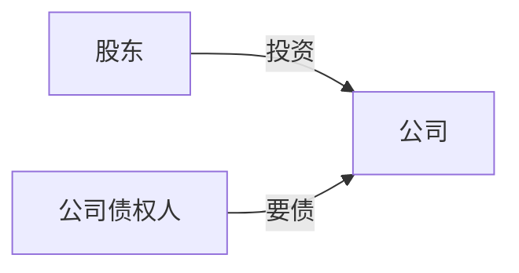
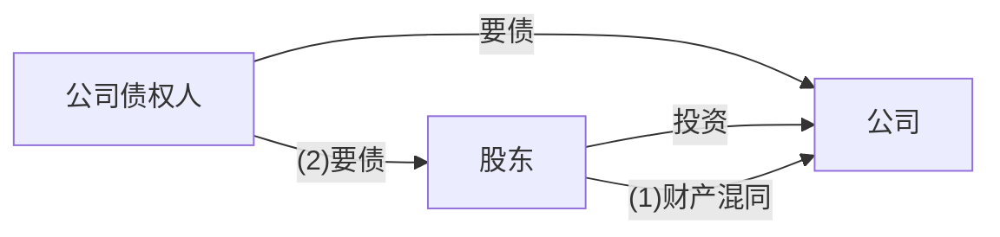

## 1 公司法

## 2 一、公司的概念（★★）
1.  公司是法人
    （1）公司具有民事**权利能力**和**行为能力**，法律地位独立于股东、管理人员和员工。
    （2）公司可以拥有**自己的财产**，<mark style="background:#40a9ff">可以与他人签订合同，可以起诉和应诉</mark>。
    （3）公司以其全部财产对自己的债务**承担责任**。
2.  公司是营利性法人
    公司是以**取得**利润并**分配**给股东等出资人为目的而成立的法人。
3.  公司股东通常承担有限责任
    股东对公司的义务或责任，一般来讲即按照章程规定**缴纳出资或者股款**。除此之外，股东不承担公司的债务。

---

## 3 二、公司的类型（★★）
根据我国的《公司法》，规定了两种基本的公司类型，分别为有限责任公司和股份有限公司。
（1）有限责任公司（或称“有限公司”）：股东以其**认缴的出资额**为限对公司承担责任，公司以其全部财产对公司的债务承担责任的公司。
（2）股份有限公司（或称“股份公司”）：将公司全部资本分为**等额股份**，股东以其认购的股份为限对公司承担责任，公司以其全部财产对公司的债务承担责任的公司。
> 提示：股份公司公开发行股份并上市之后，就成为所谓的上市公司。因此，上市公司一定是股份公司。

---

## 4 原理详解💡
有限责任公司和股份有限公司，二者的主要区别在于：
（1）股权或股份流动性上：有限责任公司股权对外转让受其他股东优先购买权制约，股份有限公司股份转让通常无此限制，转让相对便捷、自由。
（2）融资方式：股份有限公司可以依法公开发行股份募集资金，有限责任公司不可。

---
### 4.1 （3）其他类型：
①分公司：为本公司的分支机构。分公司没有自己的股东会、董事会等机构，只有本公司任命的负责人和其他管理人员。分公司不具有法人资格，其民事责任由设立该分公司的本公司承担。设立分公司的本公司，须向公司登记机关申请登记，领取营业执照。分公司具有经营资格，可以自己名义订立合同。分公司还可以自己名义参加民事诉讼。（<mark style="background:#ff4d4f">责任不独立</mark>）
②子公司：《公司法》允许公司设立子公司，<mark style="background:#ff4d4f">母、子公司互为独立法人，各自独立承担民事责任。</mark>

---

## 5 三、公司法人资格与股东有限责任（★★★）
### 5.1 （一）滥用法人独立地位和有限责任及其法律后果（“刺破公司面纱”）
公司股东滥用公司法人独立地位和股东有限责任，逃避债务，严重损害公司债权人利益的，应当对公司债务承担连带责任。
该情况下，相关股东不再受有限责任保护，其对公司债务承担责任的方式亦发生变化，具体请见下图：

**正常情况**

有限责任（“公司面纱”）

**“刺破公司面纱”**---连带责任

＂有限责任（“公司面纱”）

1. **纵向人格混同——母子混同**
公司与其股东在财产、业务、人员等方面“混同”，难分彼此，事实上无从区分。构成该种混同的具体情况有：
（1）股东无偿使用公司资金或者财产，不作财务记载。
（2）股东用公司的资金偿还股东的债务，或者将公司的资金供关联公司无偿使用，不作财务记载。
（3）公司账簿与股东账簿不分，致使公司财产与股东财产无法区分。
（4）股东自身收益与公司盈利不加区分，致使双方利益不清。
（5）公司的财产记载于股东名下，由股东占有、使用。

2. **横向人格混同——兄弟混同**
受同一母公司或者控制人控制的数个公司在财产、业务、人员等方面“混同”、重叠，不分彼此，事实上无从区别。

3. **单一股东公司人格混同——自己混同**
当公司为单一股东时，债权人无须举证证明股东与公司发生“纵向混同”，股东对公司财产独立性负有举证责任。  <mark style="background:#ff4d4f">股东举证</mark>

---

### 5.2 （二）法人人格否认的后果
法院否认公司法律独立地位并非彻底否定其法人资格，而是在某一具体法律关系中产生如下法律后果：
（1）公司行为被视为股东的行为，股东对公司债务承担连带责任。
（2）在横向否认的情况下，公司与其他公司被视为同一法律主体，各公司应当对任一公司的债务承担连带责任。
（3）只有一个股东的公司，股东不能证明公司财产独立于股东自己的财产的，应当对公司债务承担连带责任。

---

## 6 第二节 公司设立

## 7 一、公司的设立登记（★★★）

> [!note]
> 一、核心脉络拆解
> 公司设立：公司的诞生，包括设立登记、章程制定等。
> 股东出资：公司成立后，股东履行出资义务，形成公司的资本基础。
> 组织机构：建立股东会、董事会、监事会等治理结构。
> 股东权利：股东基于出资享有的资产收益、参与重大决策等权利。
> 股权 / 股份转让：股东退出或调整持股结构的主要方式。
> 公司财务会计：公司的财务报告、利润分配等制度。
> 重大变更：包括合并、分立、增资、减资等影响公司结构的重大事项

| 事项         | 规定                                                                                                                                                                                                |
| :--------- | :------------------------------------------------------------------------------------------------------------------------------------------------------------------------------------------------ |
| **登记事项**   | （1）名称。 （2）有限公司股东或者股份公司发起人的姓名或者名称。 （3）住所。 （4）经营范围。 （5）注册资本。 （6）法定代表人姓名。 口诀：**“名住经注法，发起人名下”** - 名（名称）、住（住所）、经（经营范围）、注（注册资本）、法（法定代表人），再加上 “发起人 / 股东名”。                          |
| **公示事项**   | 公司应当按照规定通过国家企业信用信息公示系统公示下列事项： （1）有限公司股东认缴和实缴的出资额、出资方式和出资日期，股份公司发起人认购的股份数。 （2）有限责任公司股东、股份有限公司发起人股权、股份变更信息。 （3）行政许可取得、变更、注销等信息  。                       |
| **营业执照签发** | （1）<mark style="background:#ff4d4f">营业执照签发日期为公司的成立日期。</mark> （2）营业执照分为正本和副本，具有同等法律效力。 （3）电子营业执照与纸质营业执照具有同等法律效力。 （4）营业执照遗失或者毁坏的，公司应当通过国家企业信用信息公示系统声明作废，申请补领。 |

---

**续表**

| 事项       | 规定                                                                                                                                                                              |
| :------- | :------------------------------------------------------------------------------------------------------------------------------------------------------------------------------ |
| **变更登记** | （1）公司变更登记事项，应当自作出变更决议、决定或者法定变更事项发生之日起30日内向登记机关申请变更登记。 （2）公司变更法定代表人的，变更登记申请书由变更后的法定代表人签署。                                                        |
| **歇业备案** | （1）公司应当在歇业前向登记机关办理备案。 （2）公司歇业的期限最长不得超过3年。 （3）公司在歇业期间开展经营活动的，视为恢复营业。 （4）公司成立后无正当理由超过6个月未开业的，或者开业后自行停业连续6个月以上的，公司登记机关可以吊销营业执照，但公司依法办理歇业的除外。 |

---
## 8 二、股份公司设立（★★）

## 9 （一）股份公司的发起人
股份公司设立过程中，由发起人承担公司筹办事务。法律对股份公司发起人的要求有：
1.  股份公司的发起人数量应为**1人以上200人以下**。
2.  股份公司发起人中须有<mark style="background:#ff4d4f">**半数以上在中国境内有住所**</mark>。<mark style="background:#ff4d4f">》=1/2</mark>
3.  发起人应当签订发起人协议，明确各自在公司设立过程中的权利和义务。

---

## 10 （二）股份公司的设立方式和程序----了解
根据股份公司设立方式的不同，程序有所不同，公开募集设立还需要经过向社会公开招募股份等相关程序，其他程序与发起设立方式相同：
签订发起人协议 → 报经有关部门批准（如有） → 制定公司章程 → 认购股份、缴纳出资 → 召开成立大会 → 制作股东名册并置备于公司 → 设立登记。

---

## 11 （三）发起设立和募集设立的区分

### 11.1 区别

| 事项        | 发起设立（一拨人）                                                          | 募集设立（两拨人）                            |
| :-------- | :----------------------------------------------------------------- | :----------------------------------- |
| 实缴出资      | 发起人应当在公司成立前按照其认购的股份全额缴纳股款                                          | 无论是公开募集还是非公开募集，均实行出资实缴制              |
| 验资        | 可以验资                                                               | 应当验资 |
| 关于股本的其他要求 | 发起人应当认足公司章程规定的公司设立时应发行的股份                                          | 发起人认购的股份不得少于公司股份总数的35%               |
| 成立大会      | 成立大会的召开和表决程序由公司章程或者发起人<mark style="background:#ff4d4f">协议规定</mark> | 股款缴足之日起30日内召开公司成立大会                  |

---

## 12 原理详解
募集设立中，公司的原始股东有“两拨人”。发起人来得早一些，认股人来得晚一些。公司设立阶段的基础工作（如制定公司章程）由发起人完成，须通过成立大会的方式取得认股人的认同。因此，成立大会是募集设立必要的程序。

1.  发起人应当在成立大会召开**15日前**将会议日期通知各认股人或者予以公告。成立大会应当有持有表决权**过半数**的认股人出席，方可举行。
2.  成立大会行使下列职权：
    - 审议发起人关于公司筹办情况的报告。
    - 对公司的设立费用进行审核。
    - 对发起人非货币财产出资的作价进行审核。（发起人事项）
    - 通过公司章程。
    - 选举董事。
    - 选举监事。（选人选章程）
    - 发生不可抗力或者经营条件发生重大变化直接影响公司设立的，可以作出不设立公司的决议。
3.  成立大会对上述事项作出决议，应当经出席会议的认股人所持表决权**过半数**通过。

> 提示：由上述情况可知，募集设立存在不确定性，即可能设立失败。发生以下情况的，认股人可以按照所缴股款并加算银行同期存款利息，要求发起人返还：
> - 公司设立时应发行的股份未募足。
> - 发行股份的股款缴足后，发起人在30日内未召开成立大会的。

4.  董事会应当授权代表，于公司成立大会结束后**30日**内向公司登记机关申请设立登记。

---
## 13 三、有限公司设立（★★）

## 14 （一）有限公司的发起人
有限责任公司由 **1 个以上 50 个以下** 股东出资设立。

---

## 15 （二）有限公司设立的程序
1.  有限责任公司设立时的股东可以签订设立协议，明确各自在公司设立过程中的权利和义务。
2.  全体股东认缴的出资额由股东按照公司章程的规定自公司成立之日起 **5 年内** 缴足。法律、行政法规以及国务院决定对有限责任公司注册资本实缴、注册资本最低限额、股东出资期限另有规定的，从其规定。

---

## 16 （三）出资证明书
有限责任公司成立后，应当向股东签发出资证明书。出资证明书是确认股东出资的凭证。出资证明书由法定代表人签名，并由公司盖章。

---

## 17 （四）股东名册
有限责任公司应当置备股东名册。<mark style="background:#ff4d4f">股东名册应为书面形式</mark>。记载于股东名册的股东，可以依股东名册主张行使股东权利。

当事人依法履行出资义务或者依法继受取得股权后，公司未依上述规定签发出资证明书、记载于股东名册并办理公司登记机关登记，当事人请求公司履行上述义务的，人民法院应予支持。

| 项目    | 股份有限公司                                                                                                                   |                              | 有限责任公司                   |
| :---- | :----------------------------------------------------------------------------------------------------------------------- | :--------------------------- | :----------------------- |
|       | **募集设立**〔发起人 + 认股人〕                                                                                                      | **发起设立**                     | **发起设立**                 |
| 设立方式  | 募集设立〔发起人 + 认股人〕                                                                                                          | 发起设立                         | 发起设立                     |
| 注册资本  | 实缴资本制                                                                                                                    | 实缴资本制                        | 认缴资本制                    |
| 出资制度  | (1) 发起人认购股份≥股份总数的35% (2) 发起人认购的股份募足前，不得向他人募集股份                                                                        | 发起人应当在公司成立前按其认购的股份全额缴纳股款     | 可分期，但应按章程规定自公司成立之日起5年内缴足 |
| 验资    | <mark style="background:#ff4d4f">公开募集：必须验资</mark>                                                                        | —                            | —                        |
| 发起人人数 | 1~200名发起人，半数以上发起人在中国境内有住所                                                                                                | 1~200名发起人，半数以上发起人在中国境内有住所    | 1~50名                    |
| 股东人数  | 1~无上限                                                                                                                    | 1~无上限                        | 1~50名                    |
| 章程制定  | 发起人共同制订                                                                                                                  | 发起人共同制订                      | 股东共同制定                   |
| 成立大会  | 股款缴足之<mark style="background:#ff4d4f">日起30</mark>日内召开公司成立大会，发起人应在成<mark style="background:#ff4d4f">立大会召开1</mark>5日前通知或公告 | 召开和表决程序由公司章程或者发起人协议规定        | —                        |
| 设立登记  | 董事会应当授权代表，于公司成立大会结束后30日内申请设立                                                                                             | 董事会应当授权代表，于公司成立大会结束后30日内申请设立 | —                        |

---

## 18 四、公司设立行为法律后果的承担（★★★）

1.  **对外以公司名义形成的债务和责任**
    设立时股东如果以设立中公司的名义，为设立公司实施各种民事活动，法律后果由公司承受。公司未成立的，法律后果由公司设立时的股东承受。设立时的股东为 2 人以上的，享有连带债权，承担连带债务。
2.  **对外以自己名义形成的债务和责任**
    设立时的股东如果以自己名义，为设立公司之目的而从事民事活动，第三人有选择权，可以请求公司承担法律后果，也可以请求公司设立时的股东承担。
3.  **对内债务和责任**
    设立时的股东因履行公司设立职责造成他人损害的，公司或者无过错的股东承担赔偿责任后，可以向有过错的股东追偿。

---

## 19 第三节    出资

要不要我帮你把这部分内容整理成适合CPA经济法备考的**考点速记清单**，方便你直接背诵？# 第三节 出资
## 20 一、出资方式及出资期限（★★★）

### 20.1 可以用于出资的财产

| 出资方式  | 具体财产                                                                |
| ----- | ------------------------------------------------------------------- |
| 货币    | 银行存款等                                                               |
| 非货币财产 | **实物：房屋、机器设备、工具、原材料、零部件等 知识产权：著作权、专利权、商标权、非专利技术 土地使用权、股权、债权** |

> **提示**：对作为出资的非货币财产应当评估作价，核实财产，不得高估或者低估作价。

---

### 20.2 不可用于出资的财产

不得作为出资的财产包括：==劳务、信用、自然人姓名、商誉、特许经营权或者设定担保的财产。==

---

### 20.3 出资期限

（1）**有限公司**：股东按照公司章程的规定自公司成立之日起5年内缴足。
（2）**股份公司**：股份有限公司实行出资实缴制。
（3）**加速到期**：公司不能清偿到期债务的，<mark style="background:#ff4d4f">公司或者已到期债权的债权人有权要求</mark>已认缴出资但未届出资期限的股东提前缴纳出资。

---
# 二、出资义务的履行（★★★）

## 1 （一）一般规定
股东应当按期足额缴纳公司章程中规定的各自所认缴的出资额，具体要求：
1.  股东以货币出资的，应将货币出资足额存入为设立公司而在银行开设的账户。
2.  以非货币财产出资的，应当依法办理其财产权的转移手续（如动产的交付、不动产的变更登记）。

---

## 2 （二）已交付但未办理过户登记 / 已办理过户登记但未交付
出资人以房屋、土地使用权或者需要办理权属登记的知识产权等财产出资：

| 情形                        | 规则                                                                                                                                  |
| ------------------------- | ----------------------------------------------------------------------------------------------------------------------------------- |
| **有实无名** （已交付但未办理权属变更） | 1. 人民法院应当责令当事人在指定的合理期间内办理权属变更手续。 2. 在上述期间内办理了权属变更手续的：    ① 人民法院应当认定其已经履行了出资义务。    ② 出资人主张自其实际交付财产给公司使用时享有相应股东权利的，人民法院应予支持。 |
| **有名无实** （已办理权属变更但未交付） | 出资人已经就前述财产出资，办理权属变更手续但未交付给公司使用，公司或其他股东主张其向公司交付，并在实际交付之前不享有相应股东权利的，人民法院应予支持。                                                         |

---

## 3 （三）以划拨地或负有权利负担的财产出资
出资人以划拨土地使用权出资，或者以设定权利负担（如担保）的土地使用权出资，公司、其他股东或者公司债权人主张认定出资人未履行出资义务的：

| 步骤 | 规则 |
|------|------|
| 先“减负” | 人民法院应当责令当事人在指定的合理期间内办理土地变更手续或者解除权利负担。 |
| 逾期未缴足 | 逾期未办理或者未解除的，人民法院应当认定出资人未依法全面履行出资义务。 |

---

## 4 （四）以污点财产出资
以贪污、受贿、侵占、挪用等违法犯罪所得的货币出资后取得股权的，对违法犯罪行为予以追究、处罚时应当采取拍卖或者变卖的方式处置其股权。

---

## 5 （五）以无权处分的财产出资
出资人以其不享有处分权的财产出资，当事人之间对于出资行为效力产生争议的，适用**善意取得制度**。

---

# 三、抽逃出资（★★★）
在公司成立后，股东存在下列情形且损害公司权益的，可以被认定为抽逃出资：
1.  通过虚构债权债务关系将其出资转出。
2.  制作虚假财务会计报表，虚增利润进行分配。
3.  利用关联交易将出资转出。
4.  其他未经法定程序将出资抽回的行为。

---

# 四、违反出资义务的责任（★★★）

## 1 （一）一般原则
1.  **不得以时效抗辩**
    <mark style="background:#ff4d4f">公司股东未履行或者未全面履行出资义务或者抽逃出资，公司或其他股东请求其向公司全面履行出资义务或返还出资。被告股东以诉讼时效为由进行抗辩的，人民法院不予支持。</mark>

2.  **继续履行出资义务**
    公司设立时，股东未按照公司章程规定实际缴纳出资，或者实际出资的非货币财产的实际价额显著低于所认缴的出资额的，<mark style="background:#ff4d4f">**设立时的其他股东**与该股东在出资不足的范围内承担连带责任。</mark>

3.  **董事会催缴、股东失权**
    （1）董事会应当对股东的出资情况进行核查，发现股东未按期足额缴纳公司章程规定的出资的，应当由公司向该股东发出书面催缴书。
    （2）宽限期届满（宽限期自公司发出催缴书之日起不得少于60日），股东仍未履行出资义务的，公司经董事会决议可以向该股东发出失权通知，通知应当以书面形式发出。自通知发出之日起，该股东丧失其未缴纳出资的股权。
    （3）依照前款规定丧失的股权应当依法转让，或者相应减少注册资本并注销该股权；6个月内未转让或者注销的，由公司其他股东按照其出资比例足额缴纳相应出资。
    （4）股东对失权有异议的，应当自接到失权通知之日起30日内，向人民法院提起诉讼。

4.  **股东权利受限**
    股东未履行或者未全面履行出资义务或者抽逃出资，公司根据公司章程或者股东会决议对其利润分配请求权、新股优先认购权、剩余财产分配请求权等股东权利作出相应的合理限制，该股东请求认定该限制无效的，人民法院不予支持。

5.  **股东资格解除**
    有限责任公司的股东未履行出资义务或者抽逃全部出资，经公司催告缴纳或者返还，其在合理期间内仍未缴纳或者返还出资，公司以股东会决议解除该股东的股东资格，该股东请求确认该解除行为无效的，人民法院不予支持。

6.  **补充清偿责任**
    股东违反出资义务而公司又不能偿还债务的，公司债权人有权请求该股东在一定范围内承担清偿责任。
    

---

## 2 （二）特殊情况的处理

### 2.1 股权转让后的出资责任
1.  有限责任公司股东转让已认缴出资但未届出资期限的股权的，由受让人承担缴纳该出资的义务；受让人未按期足额缴纳出资的，转让人对受让人未按期缴纳的出资承担补充责任。
2.  未按照公司章程规定的出资日期缴纳出资或者作为出资的非货币财产的实际价额显著低于所认缴的出资额的股东转让股权的，转让人与受让人在出资不足的范围内承担连带责任；受让人不知道且不应当知道存在上述情形的，由转让人承担责任。

#### 2.1.1 典例研习·6-5
**题干**：某有限责任公司股东甲将其所持全部股权转让给该公司股东乙。乙受让该股权时，知悉甲尚有70%出资款未按期缴付。下列表述中，符合公司法律制度规定的是（ ）。
A. 甲应继续向公司承担足额缴纳出资的义务，乙对此不承担责任
B. 甲应继续向公司承担足额缴纳出资的义务，乙对此承担连带责任
C. 乙应代替甲向公司承担足额缴纳出资的义务，甲对此不再承担责任
D. 乙应代替甲向公司承担足额缴纳出资的义务，甲对此承担补充清偿责任

**解析**：乙明知该股权对应的出资并未按期缴足，依然同意受让，因此，应与出资不实的原股东甲向该公司承担连带责任。
**答案**：**B**

---

### 2.2 董事、监事、高级管理人员责任
公司成立后，股东不得抽逃出资。股东应当返还抽逃的出资，给公司造成损失的，负有责任的董事、监事、高级管理人员应当与该股东承担连带赔偿责任。

---

### 2.3 名义股东的责任
1.  <mark style="background:#ff4d4f">名义股东与实际出资人不符的，名义股东不得以其为名义股东为由对抗公司债权人。</mark>
2.  冒用他人名义出资并将该他人作为股东在公司登记机关登记的，被冒名人并非名义股东，<mark style="background:#ff4d4f">冒名登记行为人</mark>应当承担相应责任。

---

Q# 第四节 组织结构

> [!note]
> # 股份有限公司组织机构（★★★）
> 
> ## （一）股东会
> ### 1. 股东会的职权
> 股份公司股东会由全体股东组成，是公司的**权力机构**，依法行使职权：
> 
> | 分类   | 明细                                                                 |
> |--------|----------------------------------------------------------------------|
> | 人权   | 选举和更换非由职工代表担任的董事、监事，决定有关董事、监事的报酬事项 |
> | 财权   | （1）审议批准公司的利润分配方案和弥补亏损方案 （2）对公司增加或者减少注册资本作出决议 （3）对发行公司债券作出决议（可授权董事会） |
> | 事务权 | （1）审议批准董事会的报告 （2）审议批准监事会的报告 （3）对公司合并、分立、变更公司形式、解散和清算等事项作出决议 （4）修改公司章程 |
> 
> > <mark style="background:#ff4d4f">只有1个股东的股份公司不设股东会，股东决定事项应采用书面形式并签名/盖章后置备于公司。</mark>
> 
> ---
> 
> ### 2. 股东会的形式
> 1.  **年度股东会会议**：每年召开1次年会，上市公司年度股东会应于上一会计年度结束后**6个月内**举行。
> 2.  **临时股东会会议**：有下列情形之一的，应当在**2个月内**召开：
>     - 董事人数不足《公司法》规定人数或公司章程所定人数的**2/3**时
>     - 公司未弥补的亏损达实收股本总额**1/3**时
>     - 董事会认为必要时
>     - 监事会提议召开时
>     - 单独或者合计持有公司**10%以上**股份的股东请求时
> 
> 
> 
> ---
> 
> ### 3. 股东会的召集
> 
> | 顺位 | 操作                                                                 |
> |------|----------------------------------------------------------------------|
> | “董” | 股东会会议由董事会召集，会议主持规则： （1）董事长主持 （2）董事长不能履职的，由副董事长主持 （3）副董事长不能履职的，由过半数董事共同推举1名董事主持 |
> | “监” | 董事会不能履行或不履行召集职责的，**监事会**应当及时召集和主持       |
> | “股” | 监事会不召集和主持的，连续**90日以上**单独或合计持有公司**10%以上**股份的股东可自行召集和主持 |
> 
> ---
> 
> ### 4. 股东会的通知
> 1.  召开股东会会议，应将会议时间、地点和审议事项于会议召开**20日**前通知各股东；临时股东会应于会议召开**15日**前通知。
> 2.  **临时提案**：
>     - 提案资格：单独或合计持有公司==**1%以上**==©股份的股东，可在股东会召开==**10日**==©前提出临时提案并书面提交董事会。
>     - 提案程序：董事会应在收到提案后==**2日**==©内通知其他股东，并将该临时提案提交股东会审议。临时提案内容应属于股东会职权范围，股东会不得对通知中未列明的事项作出决议。
> 
> ---
> 
> ### 5. 股东会的决议
> 3.  股东出席会议，所持每一股份有一表决权；公司持有的本公司股份没有表决权。股东可委托代理人出席，代理人应提交授权委托书。
> 4.  **特殊决议**：须经出席会议的股东所持表决权的==**2/3以上**==©通过：
>     - 修改公司章程
>     - 增加或减少注册资本
>     - 公司合并、分立、解散或变更公司形式
> 5.  **累积投票制**：选举董事或监事时，每一股拥有与应选人数相同的表决权，可集中使用。控股股东控股比例在==**30%以上**==©的上市公司，应当采用累积投票制。
> 
> ---
> 
> ### 6. 股东会的记录
> 股东会应对所议事项的决定作成会议记录，主持人、出席会议的董事应在会议记录上签名。会议记录应与出席股东的签名册及代理出席的委托书一并保存。
> 
> ---
> 
> ## （二）董事会
> 董事会是由股东会选举产生的董事组成，代表公司并行使经营决策权的**常设决策机关**。规模较小或股东人数较少的股份公司，可设1名董事，行使董事会职权，该董事可兼任公司经理。
> 
> ### 1. 董事会的组成
> 
> | 事项           | 规则                                                                 |
> |----------------|----------------------------------------------------------------------|
> | 人数           | 股份公司设董事会，成员为==**3人以上** ==©                                |
> | 任期           | （1）每届任期不超过3年，连选可连任 （2）任期届满未及时改选或董事在任期内辞职导致成员低于法定人数的，在改选出的董事就任前，原董事仍应履行职务 |
> | 职工董事       | （1）董事会成员中可以有职工代表 （2）职工人数300人以上的股份公司，==董事会成员中应当有职工代表==© （3）职工代表由公司职工民主选举产生 |
> | 董事长与副董事长 | （1）设董事长1人，可设副董事长 （2）董事长和副董事长由董事会以全体董事的过半数选举产生 |
> 
> ---
> 
> ### 2. 董事会的职权
> 
> | 分类   | 明细                                                                 |
> |--------|----------------------------------------------------------------------|
> | 人权   | 决定聘任或解聘公司经理及其报酬，并根据经理提名决定聘任或解聘副经理、财务负责人及其报酬 |
> | 财权   | （1）制订公司的利润分配方案和弥补亏损方案 （2）制订公司增加或减少注册资本方案 （3）制订公司债券发行方案 |
> | 事务权 | （1）决定公司的经营计划和投资方案 （2）决定公司内部管理机构的设置 （3）制定公司的基本管理制度 （4）制订公司合并、分立、变更公司形式、解散的方案 （5）召集股东会会议，并向股东会报告工作 （6）执行股东会的决议 |
> 
> ---
> 
> ### 3. 董事会的形式
> 1.  董事会每年度至少召开==**2次**==©会议，每次会议应于会议召开==**10日**==©前通知全体董事和监事。
> 2.  **临时会议**：
>     - 资格：1/3以上董事、监事会、代表1/10以上表决权的股东，可提议召开临时会议。
>     - 程序：董事长应自接到提议后==**10日**==©内，召集和主持会议。
> 
> ---
> 
> ### 4. 董事会的召开
> 3.  董事长召集和主持董事会会议。
> 4.  董事长不能履职的，由副董事长履职。
> 5.  副董事长不能履职的，由过半数董事共同推举1名董事履职。
> 
> ---
> 
> ### 5. 董事会的决议和记录
> 1.  董事会会议应有==**过半数**==©董事出席方可举行，董事因故不能出席，可书面委托其他董事代为出席，委托书中应载明授权范围。
> 2.  董事会决议表决实行一人一票，应经全体董事的==**过半数**==©通过。
> 3.  董事会应对所议事项的决定作成会议记录，出席会议的董事应在会议记录上签名。
> 
> ---
> 
> ### 6. 审计委员会
> 4.  股份公司可在董事会中设置由董事组成的审计委员会，行使监事会的职权，不设监事会或监事。
> 5.  审计委员会成员为==**3名以上**==©，过半数成员不得在公司担任除董事外的其他职务，且不得与公司存在可能影响其独立判断的关系；职工代表董事可成为成员。
> 6.  审计委员会决议表决实行一人一票，应经成员的过半数通过。
> 
> ---
> 
> ## （三）经营管理机关（经理）
> ### 1. 概念
> 经营管理机关是由董事会聘任的，负责公司日常经营管理活动的**执行机关**，即公司经理。股份公司应当设经理。
> 
> ### 2. 职权
> 经理对董事会负责，根据公司章程或董事会授权行使职权，经理列席董事会会议。
> 
> > 提示：上市公司的总经理必须专职，不得在集团等控股股东单位担任除董事外的其他职务。
> 
> ---
> 
> ## （四）监事会
> 股份有限公司依法应当设立监事会，是公司的**监督机构**。规模较小或股东人数较少的股份公司，可设1名监事，行使监事会职权。
> 
> ### 1. 监事会的组成
> 
> | 事项           | 规则                                                                 |
> |----------------|----------------------------------------------------------------------|
> | 人数           | 监事会成员为**3人以上**                                             |
> | 任职资格       | 董事、高级管理人员不得兼任监事                                     |
> | 任期           | （1）每届任期为3年，连选可连任 （2）任期届满未及时改选或监事在任期内辞职导致成员低于法定人数的，在改选出的监事就任前，原监事仍应履行职务 |
> | 职工监事       | （1）监事会应当包括职工代表，比例不低于**1/3** （2）职工代表由公司职工民主选举产生 |
> | 监事会主席与副主席 | （1）设主席1人，可设副主席 （2）主席和副主席由全体监事过半数选举产生 |
> 
> ---
> 
> ### 2. 监事会的职权
> 
> | 分类     | 明细                                                                 |
> |----------|----------------------------------------------------------------------|
> | 监督“人财务” | （1）对董事、高管执行职务的行为进行监督，对违反规定的董事、高管提出解任建议 （2）检查公司财务 （3）当董事、高管的行为损害公司利益时，要求其予以纠正 |
> | 主动作为   | （1）提议召开临时股东会，在董事会不履行召集职责时召集和主持股东会 （2）向股东会会议提出提案 （3）依照《公司法》的规定，对董事、高管提起诉讼 |
> 
> > 监事可以列席董事会会议，并对董事会决议事项提出质询或建议；监事会行使职权所需费用由公司承担。
> 
> ---
> 
> ### 3. 监事会会议的召开
> 监事会每**6个月**至少召开1次会议，监事可提议召开临时会议。
> 
> ### 4. 监事会会议的形式
> 7.  监事会主席召集和主持会议。
> 8.  主席不能履职的，由副主席召集和主持。
> 9.  副主席不能履职的，由过半数监事共同推举1名监事召集和主持。
> 
> ### 5. 监事会会议的决议和记录
> 10.  除《公司法》另有规定外，议事方式和表决程序由公司章程规定。
> 11.  决议表决实行一人一票，应经全体监事的**过半数**通过。
> 12.  监事会应对所议事项的决定作成会议记录，出席会议的监事应在会议记录上签名。
> 
> ---
> 

---

> [!note] 有限责任公司组织结构
> # 二、有限责任公司的组织机构（★★）
> 
> ## （一）股东会
> ### 1. 股东会的职权
> - 有限公司股东会职权与股份公司基本相同。
> - 区别：在有限公司中，股东以书面形式一致表示同意的，可以不召开股东会会议，直接作出决定，并由全体股东在决定文件上签名或者盖章。
> 
> ---
> 
> ### 2. 股东会的形式
> 股东会会议分为定期会议和临时会议：
> 1.  **定期会议**：应当按照公司章程的规定按时召开。
> 2.  **临时会议**：以下主体提议召开临时会议的，应当召开临时会议：
>     - ==1/3==©以上的董事
>     - 监事会
>     - ==代表1/10==©以上表决权的股东
> 
> #### 解题高手：不同公司机构临时会议的召开事由对比
> | 事由   | 有限公司 + 股东会 | 股份公司 + 董事会 | 股份公司 + 股东会 |
> |--------|-------------------|-------------------|-------------------|
> | 董事   | 1/3以上董事提议   | 1/3以上董事提议   | 董事会认为必要   |
> | 监事   | 监事会提议召开   | 监事会提议召开   | 监事会提议召开   |
> | 股东   | 1/10以上表决权的股东提议 | 1/10以上表决权的股东提议 | 单独或者合计持有公司10%以上股份的股东请求 |
> | 特别事项 | —                 | —                 | （1）董事人数不足《公司法》规定人数或章程所定人数的2/3时；（2）公司未弥补的亏损达实收股本总额1/3时 |
> 
> ---
> 
> ### 3. 股东会的召集
> 首次股东会会议由==出资最多的股东==©召集和主持，以后的股东会会议：
> 
> | 顺位 | 操作 |
> |------|------|
> | “董” | 由董事会召集，会议主持规则： （1）董事长主持 （2）董事长不能履职的，由副董事长主持 （3）副董事长不能履职的，由过半数董事共同推举1名董事主持 |
> | “监” | 董事会不能履行或不履行召集职责的，由监事会召集和主持 |
> | “股” | 监事会不召集和主持的，代表1/10以上表决权的股东可以自行召集和主持 |
> 
> > 提示：股份公司股东还有连续90日以上持股的要求。
> 
> ---
> 
> ### 4. 股东会的通知
> 召开股东会会议，应当于会议召开==**15日**==©前通知全体股东；公司章程另有规定或者全体股东另有约定的除外。
> > 提示：股份公司年度股东会提前20日通知，临时股东会提前15日通知。
> 
> ---
> 
> ### 5. 股东会的决议
> 1.  表决权：股东会会议由股东按照==**出资比例**==©行使表决权，但公司章程另有规定的除外。
>     > 提示：法律未规定有限公司股东行使表决权的出资比例是按实缴还是认缴；股份公司按股东所持股份数量行使表决权。
> 2.  **普通决议**：应当经代表*==*全体股东过半数**==表决权的股东通过。
>     > 提示：股份公司普通决议须经出席会议的股东所持表决权过半数通过。
> 3.  **特别决议**：必须经代表==**全体股东2/3以上**==表决权的股东通过，包括：
>     - 修改公司章程
>     - 增加或者减少注册资本
>     - 公司合并、分立、解散或者变更公司形式
>     > 提示：股份公司特别决议事项一致，但须经出席会议的股东所持表决权的2/3以上通过。
> 
> ---
> 
> ### 6. 股东会的记录
> 股东会应当对所议事项的决定作成会议记录，主持人、出席会议的股东应当在会议记录上签名或者盖章。
> 
> ---
> 
> ## （二）董事会
> 4.  **董事会的组成**：设董事长1人，可以设副董事长，董事长、副董事长的产生办法由公司章程规定。
> 5.  **董事会的职权**：与股份公司基本相同。
> 6.  **董事会的形式**：召开次数和提议人员资格除法律有规定外，由公司章程规定。
> 7.  **董事会的召开**：与股份公司基本相同。
> 8.  **董事会的决议和记录**：与股份公司基本相同。
> 9.  **审计委员会**：成员数量、身份、表决方式由公司章程具体规定。
> 
> ---
> 
> ## （三）经理
> 根据《公司法》规定，经理**并非**有限公司的必设职位。
> 
> ---
> 
> ## （四）监事会
> 监事会是公司的监督机构。股东人数较少或规模较小的有限公司，可以设1名监事，不设监事会；全体股东一致同意，也可以不设监事。
> 
> 10.  **监事会的组成**：与股份公司基本相同。
> 11.  **监事会的职权**：与股份公司基本相同。
> 12.  **监事会的召开**：有限公司监事会至少每**1年**召开一次。
>     > 提示：股份公司监事会至少每6个月召开一次。
> 13.  **监事会的形式**：与股份公司基本相同。
> 14.  **监事会的决议和记录**：与股份公司基本相同。
> 
> ---
> 

> [!note]
> 这张图片是一张关于**股份有限公司与有限责任公司董事会/监事会相关制度对比**的备考笔记，我帮你整理成清晰的结构化内容：
> 
> ---
> 
> ### 一、组成部分对比
> 
> | 项目 | 股份有限公司 | 有限责任公司 |
> | :--- | :--- | :--- |
> | **人数** | ≥3人 | 章程规定 |
> | **任期** | 章程规定，每届任期≤3年，连选可以连任 | 章程规定，每届任期≤3年，连选可以连任 |
> | **职工董事** | 可以有职工代表；但职工人数≥300人且未设置监事会的，**应当有**职工代表 | 可以有职工代表 |
> | **审计委员会** | 1. 成员≥3名，且>1/2成员不得在公司担任除董事以外的其他职务，须独立客观 2. 表决实行1人1票，应当经审委会成员的过半数通过（>1/2） | 章程规定 |
> 
> > 💡 注：设置审计委员会的股份有限公司，**不设监事会或者监事**；公司董事会成员中的职工代表可以成为审计委员会成员。
> 
> ---
> 
> ### 二、会议制度对比
> 
> | 项目 | 股份有限公司 | 有限责任公司 |
> | :--- | :--- | :--- |
> | **定期会议** | 每年至少召开2次会议，召开10日前通知 | 章程规定 |
> | **临时会议** | 代表≥1/10表决权的股东提议、≥1/3的董事提议、监事会提议 | 章程规定 |
> | **表决规则** | 董事会会议应有过半数董事出席方可举行，董事会作出决议应当经全体董事1人1票的过半数通过 | 章程规定 |
> 
> > 💡 补充：董事因故不能出席，可书面委托**其他董事**代为出席（应载明授权范围）。
> 
> ---
> 
---# 有限责任公司与股份有限公司组织机构对比表

## 3 总结

| 项目            | 股份有限公司                                                                  | 有限责任公司                                                     |
| :------------ | :---------------------------------------------------------------------- | :--------------------------------------------------------- |
| **股东会**       | 只有1个股东的，==不设股东会==。股东决定时应采用书面形式，并由股东签名或盖章后置备于公司                          | -                                                          |
| **董事会**       | -                                                                       | (1) 股东人数较少，规模较小的公司，==可不设董事会== ==只设1名董事== (2) 董事会成员可兼任经理 |
| **董事会（职工代表）** | 原则：==可以有==。 例外：职工人数==≥300人==的公司，==未设置监事会的==，应当有职工代表                  | -                                                          |
| **监事会**       | (1) 设置审委会行使监事会职权的，==不设监事会或监事== (2) 人数少，规模小的公司，==可不设监事会==，==只设置1名监事== | (3) 股东人数较少，规模较小的公司，==经全体股东一致同意==，==可不设监事==                 |
| **监事会（职工代表）** | 应当有==≥1/3==的职工代表，应当有股东代表                                                | -                                                          |
| **经理（机构设置）**  | ==必设==                                                                  | ==选设==                                                     |

---

# 三、上市公司的组织机构（★★★）

## 1 （一）上市公司的特别规定
上市公司是指其股票在证券交易所上市交易的股份有限公司。由于上市公司的股东包括数量巨大的公众投资者，《公司法》等规范性文件对上市公司的组织机构作出了更加细致、严格的规定，包括：

### 1.1 增加股东会职权
1.  对公司聘用、解聘会计师事务所作出决议。
2.  审议批准变更募集资金用途事项。
3.  审议股权激励计划。
4.  审议批准部分对外担保行为（“总3净5资率7，关联股东单笔1”）。  募激会保，木鸡快跑

---

### 1.2 增加股东会特别决议事项

| 分类     |                                                                    |
| :----- | :----------------------------------------------------------------- |
| 股份公司有  | (1) 修改公司章程。 (2) 增加或者减少注册资本的决议。 (3) 公司合并、分立、解散。 (4) 变更公司形式 |
| 上市公司独有 | 在1年内购买、出售重大资产或者向他人提供担保的金额超过公司资产总额**30%**                           |

---

### 1.3 上市公司审计委员会
7上市公司董事会审计委员会负责审核公司财务信息及其披露、监督及评估内外部审计工作和内部控制，下列事项应当经审计委员会全体成员过半数同意后，提交董事会审议：
1.  聘用、解聘承办公司审计业务的会计师事务所。
2.  聘任、解聘财务负责人。
3.  披露财务会计报告。
4.  国务院证券监督管理机构规定的其他事项。
口诀：财务人审报告

---

### 1.4 上市公司设立董事会秘书
董事会秘书负责公司股东会和董事会会议的筹备、文件保管以及公司股东资料的管理，办理信息披露等事务。<mark style="background:#ff4d4f">董事会秘书是上市公司高级管理人员。</mark>

PS:董事长秘书和董事会秘书不是同一个人

---

### 1.5 增设关联董事的表决权排除制度
上市公司董事与董事会会议决议事项所涉及的企业有关联关系的：
1.  不得对该项决议行使表决权，也不得代理其他董事行使表决权。
2.  该董事会会议由过半数的无关联关系董事出席即可举行，董事会会议所作决议须经无关联关系董事过半数通过。
3.  出席董事会的==无关联关系董事人数不足3人的==，应将该事项提交上市公司股东会审议。

---

### 1.6 上市公司交叉持股
1.  上市公司控股子公司==不得取得该上市公司的股份。==©
2.  上市公司控股子公司因公司合并、质权行使等原因持有上市公司股份的，不得行使所持股份对应的表决权，并应当及时处分相关上市公司股份。

---

## 2 （二）上市公司独立董事制度
上市公司独立董事，是指不在上市公司担任除董事外的其他职务，并与其所受聘的上市公司及其主要股东、实际控制人不存在直接或间接利害关系，或其他可能影响其进行独立客观判断关系的董事。

### 2.1 独立董事的设置
- 上市公司==董事会成员中应当至少**1/3**为独立董事==©，且==至少包括1名会计专业人士==©。
- 上市公司董事会下设委员会的，独立董事应当在审计委员会、提名委员会、薪酬与考核委员会成员中<mark style="background:#ff4d4f">过半数</mark>，并担任召集人。

---

### 2.2 独立董事的资格

#### 2.2.1 （1）担任独立董事应当符合下列基本条件：
1.  根据法律、行政法规及其他有关规定，具备担任上市公司董事的资格。
2.  具有《上市公司独立董事管理办法》规定的独立性。
3.  具备上市公司运作的基本知识，熟悉相关法律法规及规则。
4.  具有5年以上履行独立董事职责所必需的法律、会计或者经济等工作经验。
5.  具有良好的个人品德，不存在重大失信等不良记录。
6.  法律、行政法规、中国证监会规定、证券交易所业务规则和公司章程规定的其他条件。

#### 2.2.2 （2）下列人员不符合独立性要求，不得担任独立董事：

| 分类   | 具体规定                                                                                                                                                                                         |
| :--- | :------------------------------------------------------------------------------------------------------------------------------------------------------------------------------------------- |
| 内部人员 | 在<mark style="background:#ff4d4f">上市公司</mark>或<mark style="background:#ff4d4f">者其附属</mark>企业任职的人员及其配偶、父母、子女、主要社会关系                                                                           |
| 股东人员 | 以下人员及其配偶、父母、子女： ① 直接或间接持有上市公司已发行股份1%以上或者是上市公司前10名股东中的自然人股东。==（口诀：人看1% 10 名）== ② 在直接或间接持有上市公司已发行股份5%以上的股东单位或者在上市公司前5名股东单位任职的人员。==（5%单位 5单位人）== ③ 在上市公司控股股东、实际控制人的附属企业任职的人员及其配偶、父母、子女 |
| 业务人员 | ① 与上市公司及其控股股东、实际控制人或者其各自的附属企业有重大业务往来的人员，或者在有重大业务往来的单位及其控股股东、实际控制人任职的人员。 ② 为上市公司及其控股股东、实际控制人或者其各自附属企业提供财务、法律、咨询、保荐等服务的人员，包括但不限于提供服务的中介机构的项目组全体人员、各级复核人员、在报告上签字的合伙人、董事、高级管理人员及主要负责人。        |

> 提示：最近**12个月**内曾经具有上述所列举情形的人员也不得担任独立董事。

 （3）独立董事原则上最多在**3**家境内上市公司兼任独立董事，并应当确保有足够的时间和精力有效地履行独立董事的职责。

 （4）独立董事应当每年对独立性情况进行自查，并将自查情况提交董事会。董事会应当每年对在任独立董事独立性情况进行评估并出具专项意见，与年度报告同时披露。

---

### 2.3 独立董事的任免及履职要求

| 事项   | 规定                                                                                                                                                                                                                      |
| :--- | :---------------------------------------------------------------------------------------------------------------------------------------------------------------------------------------------------------------------- |
| 任职程序 | 上市公司董事会、监事会、单独或者合并持有上市公司已发行股份1% 以上的股东可以提出独立董事候选人，并经股东大会选举决定。                                                                                                                                                         |
| 任期   | 独立董事任期与该上市公司其他董事任期相同，任期届满，连选可以连任，但是连任时间不得超过**6年**。                                                                                                                                                                      |
| 履职要求 | (1) 独立董事因故不能亲自出席会议的，独立董事应当事先审阅会议材料，形成明确的意见，并书面委托其他独立董事代为出席。 (2) 独立董事连续**2次**未亲自出席董事会会议，也不委托其他独立董事代为出席的，董事会应当在该事实发生之日起30日内提议召开股东大会解除该独立董事职务。 (3) 独立董事每年在上市公司的现场工作时间应当不少于**15日**。                                   |
| 免职   | 独立董事任期届满前，上市公司可以依照法定程序解除其职务。提前解除独立董事职务的，上市公司应当及时披露具体理由和依据。独立董事有异议的，上市公司应当及时披露。 独立董事辞职将导致董事会或者其专门委员会中独立董事所占的比例不符合《上市公司独立董事管理办法》或者公司章程的规定，或者独立董事中欠缺会计专业人士的，拟辞职的独立董事应当继续履行职责至新任独立董事产生之日，上市公司应当自独立董事提出辞职之日起==60==日内完成补选。 |
|      |                                                                                                                                                                                                                         |

---

### 2.4 独立董事的==特别职权==

独立董事除应具有董事的职权外，还应当行使以下特别职权：
1.  独立聘请中介机构，对上市公司具体事项进行审计、咨询或者核查。
2.  向董事会提议召开临时股东大会。
3.  提议召开董事会会议。
4.  依法公开向股东征集股东权利。
5.  对可能损害上市公司或者中小股东权益的事项发表独立意见。
6.  法律、行政法规、中国证监会规定和公司章程规定的其他职权。

> 提示：独立董事行使上述第（1）项至第（3）项所列职权的，应当经全体独立董事**过半数同意**。

---

### 2.5 独立董事的前置审议
下列事项应当经上市公司全体独立董事过半数同意后，提交董事会审议：
1.  应当披露的关联交易。
2.  上市公司及相关方变更或者豁免承诺的方案。
3.  被收购上市公司董事会针对收购所作出的决策及采取的措施。
4.  法律、行政法规、中国证监会规定和公司章程规定的其他事项。
口诀：==被收购观承诺==

---

### 2.6 上市公司审计委员会
上市公司董事会审计委员会负责审核公司财务信息及其披露、监督及评估内外部审计工作和内部控制，下列事项应当经审计委员会全体成员==过半数==同意后，提交董事会审议：
1.  披露财务会计报告及定期报告中的财务信息、内部控制评价报告。
2.  聘用或者解聘承办上市公司审计业务的会计师事务所。
3.  聘任或者解聘上市公司财务负责人。
4.  因会计准则变更以外的原因作出会计政策、会计估计变更或者重大会计差错更正。
5.  法律、行政法规、中国证监会规#定和公司章程规定的其他事项。

> 审计委员会==**每季度至少召开一次会议**==，2名及以上成员提议，或者召集人认为有必要时，可以召开临时会议。审计委员会会议须有==**2/3**==以上成员出席方可举行。

---

### 2.7 独立董事的履职保障

| 事项   | 规定                                                                                                                                |
| :--- | :-------------------------------------------------------------------------------------------------------------------------------- |
| 履职协助 | ~~(1) 独立董事可以要求董事会秘书等相关人员签字确认，上市公司及相关人员应当予以配合。 (2) 2名及以上独立董事认为会议材料不完整、论证不充分或者提供不及时的，可以书面向董事会提出延期召开会议或者延期审议该事项，董事会应当予以采纳。~~      |
| 知情权  | (1) 上市公司应当保证独立董事享有与其他董事同等的知情权。 (2) 独立董事工作记录及上市公司向独立董事提供的资料，应当至少保存10年。                             |
| 中介费用 | 上市公司应当承担独立董事聘请专业机构及行使其他职权时所需的费用。                                                                                                  |
| 津贴   | (1) 上市公司应当给予独立董事与其承担的职责相适应的津贴。津贴的标准应当由董事会制订方案，股东大会审议通过，并在上市公司年度报告中进行披露。 (2) 除上述津贴外，独立董事不得从上市公司及其主要股东、实际控制人或者有利害关系的单位和人员取得其他利益。 |

---

## 3 #四、公司董事、监事、高级管理人员的资格和义务（★★★）
> [!note] 
> 
> ## （一）任职资格
> 有下列情形之一的，<mark style="background:#ff4d4f">不得担任公司的董事、监事、高级管理人员</mark>（以下合称“董监高”）：
> 
> | 类型 | 规则 |
> |------|------|
> | “小孩” | 无民事行为能力或者限制民事行为能力 |
> | “老赖” | 个人因所负数额较大债务到期未清偿被人民法院列为失信被执行人 |
> | “太坏” | （1）因贪污、贿赂、侵占财产、挪用财产或者破坏社会主义市场经济秩序，被判处刑罚，或者因犯罪被剥夺政治权利，执行期满未逾**5年**（自缓刑考验期满之日起未逾期2年） （2）担任因违法被吊销营业执照、责令关闭的公司、企业的法定代表人，并负有个人责任的，自该公司、企业被吊销营业执照、责令关闭之日起未逾**3年** |   口诀：有罪52
> | “太菜” | 担任破产清算的公司、企业的董事或者厂长、经理，对该公司、企业的破产负有个人责任的，自该公司、企业破产清算完结之日起未逾**3年** |  口诀：无罪33
> 
> > **提示**：
> > 1. 公司违反《公司法》的上述规定选举、委派董事、监事或者聘任高级管理人员的，该选举、委派或者聘任**无效**。
> > 2. 公司董事、监事、高级管理人员在任职期间出现上述所列情形的，公司应当**解除其职务**。
> 
> ---
> 
> ## （二）法定义务
> 公司“董监高”对公司负有==**忠实义务**==和==**勤勉义务**==©。公司的控股股东、实际控制人不担任公司董事但实际执行公司事务的，适用忠实义务和勤勉义务。
> 
> ### 1. 忠实义务
> 忠实义务是指公司的管理层应当采取措施避免自身利益与公司利益冲突，不得利用职权牟取不正当利益。
> 
> （1）公司“董监高”不得利用职权收受贿赂或者其他非法收入，不得侵占公司的财产。
> 
> （2）公司董事、监事、高级管理人员不得有下列行为，实施以下行为所得的收入应当**归公司所有**：
> 
> | 分类 | 事项 |
> |------|------|
> | 绝对禁止 | ①侵占公司财产、挪用公司资金。 ②将公司资金以其个人名义或者以其他个人名义开立账户存储。 ③接受他人与公司交易的佣金归为己有。 ④擅自披露公司秘密。 ⑤利用职权收贿赂或者收受其他非法收入。 |
> | 相对禁止 | ①==未经董事会或者股东会决议通过==©，直接或者间接与本公司订立合同或者进行交易（包括“董监高”近亲属及其他关联方）。 ②==未经董事会或者股东会决议通过==©，利用职务便利为自己或者他人谋取属于公司的商业机会（除非公司不能利用该商业机会）。 ③==未经董事会或者股东会决议通过==©，自营或者为他人经营与其任职公司同类的业务。 |
> 
> ---
> 
> ### 2. 勤勉义务
> 勤勉义务是指管理层执行职务应当为公司的最大利益尽到管理者通常应有的合理注意。
> 
> （1）有限责任公司成立后，董事会未及时履行催缴义务，给公司造成损失的，负有责任的董事应当承担赔偿责任。
> （2）公司成立后，股东抽逃出资给公司造成损失的，负有责任的董事、监事、高级管理人员应当与该股东承担连带赔偿责任。
> （3）董事、监事、高级管理人员违反规定，为他人取得本公司或者其母公司的股份提供财务资助，给公司造成损失的，应当承担赔偿责任。
> （4）公司违反规定向股东分配利润或者减少注册资本，给公司造成损失的，负有责任的董事、监事、高级管理人员应当承担赔偿责任。
> 
> ---

## 4 五、公司决议效力（★★★）

> [!note]
> 
> 
> # 五、公司决议效力（★★★）
> 
> ## （一）公司决议效力瑕疵
> 
> ### 1. 公司决议不成立
> 决议不成立是指某一决议在事实上从未作出，或者不满足程序要求而不构成通过。导致公司决议不成立的事由如下：
> 
> | 类型 | 事由 |
> |------|------|
> | 事实上从未作出 | （1）未召开股东会、董事会会议作出决议。 （2）股东会、董事会会议未对决议事项进行表决。 |
> | 程序上从未通过 | （1）出席会议的人数或者所持表决权数未达到《公司法》或者公司章程规定的人数或者所持表决权数。 （2）同意决议事项的人数或者所持表决权数未达到《公司法》或者公司章程规定的人数或者所持表决权数。 |
> 
> ---
> 
> ### 2. 公司决议无效
> 公司股东会、董事会决议的**内容违反法律、行政法规**的，决议无效（自始无效）。
> 
> ---
> 
> ### 3. 公司决议可撤销
> （1）会议召集程序、表决方式违反法律、行政法规或者公司章程。
> （2）决议内容违反公司章程。
> 
> > **提示**：公司股东会、董事会会议召集程序或者表决方式<mark style="background:#ff4d4f">仅有轻微瑕疵</mark>，且对决议未产生实质影响的，不导致决议可撤销。
> 
> ### 原理详解
> | 违反的规范 | 程序 | 内容 |
> |------------|------|------|
> | 没有会议表决通过的事实 | ==不成立==© | — |
> | 法律、行政法规 | 可撤销 | 无效 |
> | 公司章程 | 可撤销 | 可撤销 |
> 
> ## （二）相关诉讼
> 
> ### 1. 诉讼当事人
> 
> | 诉讼主张 | 原告 | 被告 | 第三人 |
> |----------|------|------|--------|
> | 确认公司决议不成立、无效 | 股东、董事、监事等 | 公司 | 其他利害关系人（高级管理人员、员工、公司债权人等） |
> | 撤销公司决议 | 股东 | 公司 | — |
> 
> > **提示**：一审法庭辩论终结前，其他有原告资格的人以相同的诉讼请求申请参加上述规定诉讼的，可以列为共同原告。
> 
> ---
> 
> ### 2. 撤销公司决议的程序性要求
> （1）股东可以自决议作出之日起==**60日**==©内请求人民法院撤销。
> （2）未被通知参加股东会会议的股东自知道或者应当知道股东会决议作出之日起==**60日**==©内，可以请求人民法院撤销；自决议作出之日起**1年**内没有行使撤销权的，撤销权消灭。
> 
> ---
> 
> ### 3. 决议瑕疵对善意第三人的效果
> 股东会、董事会决议被人民法院判决确认无效或者撤销的，公司依据该决议与善意相对人形成的民事法律关系**不受影响**。
> 
> ---

## 5 六、公司对外担保（★★）

> [!note]
> 
> 
> ## 1. 通用规则
> 公司向其他企业投资或者为他人提供担保，依照公司章程的规定，由**董事会或者股东会决议**；公司章程对投资或者担保的总额及单项投资或者担保的数额有限额规定的，不得超过规定的限额。
> 
> > **提示**：公司向其他企业投资或者为他人提供担保，至少要经过董事会决议。
> 
> ---
> 
> ## 2. 关联担保
> 公司为股东或者实际控制人提供担保的：
> （1）必须经**股东会决议**。
> （2）接受担保的股东或者受实际控制人支配的股东，**不得参加**上述规定事项的表决。
> （3）该项表决由出席会议的其他股东所持表决权的**过半数**通过。
> 
> ---

## 6 ==上市公司对外提供担保==©
> 
> ### （1）普通决议   （口诀：==1357关联方==©，单1，母3，母子5，资7，关联方）
> 上市公司存在下列对外担保行为，须经股东会审议通过：
> ① 公司及控股子公司的对外担保总额，超过最近一期经审计总资产的**30%**以后提供的任何担保。
> ② 公司及控股子公司的对外担保总额，超过最近一期经审计净资产的**50%**以后提供的任何担保。
> ③ 为资产负债率超过**70%**的担保对象提供的担保。
> ④ 对股东、实际控制人及其关联方提供的担保。
> ⑤ 单笔担保额超过最近一期经审计净资产**10%**的担保。
> 
> ### （2）特别决议
> 上市公司==在1年内购买、出售重大资产或者担保金额超过公司资产总额**30%==©**的，应当由股东会作出决议，并经出席会议的股东所持表决权的**2/3以上**通过。
> 
> > **解题高手**：记忆口诀：<mark style="background:#ff4d4f">“总3净5资率7，关联股东单笔1；买卖担保看总额，超过3成特别议。”</mark>
> 
> ---
> 
> ## 4. 法定代表人的越权担保
> 1. （1）法人章程或者法人权力机构对法定代表人代表权的限制，<mark style="background:#ff4d4f">**不得对抗善意相对人**。</mark>
> 1. （2）只要债权人能够证明其在订立担保合同时对董事会决议或者股东会决议进行了审查，同意决议的人数及签字人员符合公司章程的规定，就应当认定其构成善意，但公司能够证明债权人明知公司章程对决议机关有明确规定的除外。
> 2. （3）债权人对公司机关决议内容的审查一般限于**形式审查**，只要求尽到必要的注意义务即可。
> 
> ---
> 
> ## 5. 公司<mark style="background:#ff4d4f">应当承担担保责任的特殊情形</mark>
> 公司以其未依照《公司法》关于公司对外担保的规定作出决议为由主张不承担担保责任的，人民法院不予支持：
> （1）金融机构开立保函或者担保公司提供担保。
> （2）公司为其全资子公司开展经营活动提供担保。
> （3）担保合同系由单独或者共同持有公司**2/3以上**对担保事项有表决权的股东签字同意。
> 
> > **提示**：上市公司对外提供担保，不适用第（2）项、第（3）项的规定。
> 
> ---
> 
> ## 6. 对上市公司公开披露信息的信赖
> （1）相对人根据<mark style="background:#ff4d4f">上市公司公开披露的关于担保事项已经董事会或者股东会决议通过的信息</mark>，与上市公司订立担保合同，相对人主张担保合同对上市公司发生效力，并由上市公司承担担保责任的，人民法院应予支持。
> （2）相对人<mark style="background:#ff4d4f">未根据上市公司公开披露的关于担保事项已经董事会或者股东会决议通过的信息</mark>，与上市公司订立担保合同，上市公司主张担保合同对其不发生效力，且不承担担保责任或者赔偿责任的，人民法院应予支持。
> 
> 

---

# 第五节  股东权利和义务

> [!note]
> # 第五节 股东权利和义务
> 
> ## 一、股东权利概述（★★★）
> 
> ### （一）股东资格
> 1.  **有限责任公司**
>     股东向公司认缴出资后，即成为公司股东，享有相应权利。公司应向股东签发出资证明书、将股东名称在相关文件上登记记载等。
> 
> 2.  **股份有限公司**
>     （1）公司发行的股票均应为记名股票，股票是公司签发的证明股东所持股份的凭证。
>     （2）股票通常采取纸面形式，目前更多以电子簿记形式存在。
>     （3）证券登记结算机构出具的证券登记记录是证券持有人持有证券的合法证明。
> 
> ---
> 
> ### （二）股东权利
> 
> | 权利类型（分类） | 列举 |
> | :--- | :--- |
> | 参与管理权（共益权-对公司-对股东） | （1）股东会参加权、提案权、质询权 （2）股东会上的表决权、累积投票权 （3）股东会召集请求权和自行召集权 （4）了解公司事务、查阅公司账簿和其他文件的知情权 （5）提起诉讼权等 |
> | 资产收益权（自益权-对股东） | （1）利润分配请求权、剩余财产分配权 （2）股权质押、转让权 （3）增资优先认缴权（有限公司股东独有）等 |
> 
> ---
> 
> ## 二、股东知情权（查阅权）（★★★）
> 股东作为公司资本的提供者和经营风险的最终承担者，有权知悉公司的人事、财务、经营、管理等方面情况。
> 
> ### （一）知情范围
> 
> | 资料类型 | 有限公司 | 股份公司 |
> | :--- | :--- | :--- |
> | 股东会 | — | 查阅、复制会议记录 |
> | 董事会 | — | 查阅、复制会议决议 |
> | 监事会 | — | 查阅、复制会议决议 |
> | 公司章程 | — | 查阅、复制 |
> | 财务会计报告 | — | 查阅、复制 |
> | 股东名册 | — | 查阅、复制 |
> | 会计账簿、会计凭证 | 查阅 | 连续180日以上单独或者合计持有公司**3%以上**股份的股东可以要求查阅（公司章程对持股比例有较低规定的，从其规定） |
> 
> > **提示**：
> > 1.  公司有合理根据认为股东查阅会计账簿、会计凭证有不正当目的，可能损害公司合法利益的，可以拒绝提供查阅，并应当自股东提出书面请求之日起**15日**内书面答复股东并说明理由。
> > 2.  公司拒绝提供查阅的，股东可以向人民法院提起诉讼。
> > 3.  上市公司股东查阅、复制相关材料的，应当遵守《证券法》等法律、行政法规的规定。
> > 4.  股东要求查阅、复制公司全资子公司相关材料的，同样适用上述规定。
> 
> ---
> 
> ### （二）权利主体及辅助人员
> 1.  **权利主体**
>     （1）记载于股东名册的股东，可以依股东名册主张行使股东权利。
>     （2）公司章程或者股东间协议可以对查阅范围、方式等作出规定，但不得“实质性剥夺”股东依公司法享有的查阅权。
> 
> 2.  **辅助人员**
>     （1）股东查阅材料，可以委托会计师事务所、律师事务所等中介机构进行。
>     （2）公司董事、高管有义务依法制作、保存公司资料。如果公司董事、高管未依法履行职责，导致公司未制作或保存股东有权查阅的资料，造成股东损失的，应承担赔偿责任。
> 
> ---
> 
> ### （三）保密义务
> 股东查阅信息后如泄露公司商业秘密导致公司损害，则须对公司承担赔偿责任。辅助股东查阅的会计师、律师等专业人员，负有相同义务，适用同一规则。
> 
> ---
> 
> ## 三、增资优先认缴权（★★★）
> 增资优先认缴权是指公司新增资本或发行新股时，原有股东在同等条件下优先于外部投资者认缴出资或者认购新股的权利。
> 
> 1.  **有限公司**：股东的出资优先权是法定权利，认购数额以其实缴出资比例为准，除非全体股东约定其他认购比例。
> 2.  **股份公司**：==股东不享有出资优先权==©，除非公司章程另有规定或者股东会决议另有决定。
> 
> ### 相关理论观点
> 1.  增资优先认缴权的行使条件是，公司决定接受外部投资者认缴出资而新增注册资本，因此公司吸收合并导致其注册资本增加的情况下，原有股东不享有增资优先认缴权。
> 2.  公司原股东仅得在同等条件下行使增资优先认缴权，因此，当公司拟接纳外部投资者以特定的非现金资产增资、对员工实施股权激励时，原有股东通常因无法满足同等条件而无权优先增资。
> 3.  在具备行使该项权利的条件的前提下，股东应当在公司形成增资决议的过程中，向公司作出明确且合格的行使增资优先认缴权的意思表示。
> 4.  增资优先认缴权性质上属于形成权，股东作出意思表示后即与公司形成认缴出资的合意。
> 5.  股东可以放弃行使自己的增资优先认缴权，其放弃的认缴份额并不当然成为其他股东行使增资优先认缴权的对象。
> 6.  增资优先认缴权可以在公司原股东之间自由转让，但不得任意转让给股东以外的人。原股东如向股东以外的人转让其优先认缴权，则应准用股权对外转让规则，其他原股东享有购买权。
> 7.  针对侵害增资优先认缴权的不同行为，股东可提起的诉讼请求包括：请求人民法院否定相关决议、责令公司恢复原状、行使增资优先认缴权或责令公司继续履行增资认缴协议、损害赔偿等。
> 
> ---
> 
> ## 四、异议回购请求权（★★★）
> 异议回购请求权是指股东会作出对股东权益产生重大和实质性影响的决议时，对该决议有异议的股东，有权要求公司以公平价格回购其所持出资额或者股份，从而退出公司。
> 
> ### 1. 有限公司异议股东回购请求权
> 对股东会决议投反对票的股东，可请求公司按合理价格收购其股权的情形：
> -   **“小气鬼”**：公司连续5年不向股东分配利润，而公司该5年连续盈利，并且符合《公司法》规定的分配利润条件的。
> -   **“大变样”**：公司合并、分立、转让主要财产的。
> -   **“老不死”**：公司章程规定的营业期限届满或者章程规定的其他解散事由出现，股东会会议通过决议修改章程使公司存续的。
> 
> > **提示**：公司的控股股东滥用股东权利，严重损害公司或者其他股东利益的，其他股东有权请求公司按照合理的价格收购其股权。
> 
> ### 2. 股份有限公司异议股东回购请求权
> 对股东会决议投反对票的股东，可请求公司按合理价格收购其股份的情形（公开发行股份的公司除外）：
> -   **“小气鬼”**：公司连续5年不向股东分配利润，而公司该5年连续盈利，并且符合《公司法》规定的分配利润条件的。
> -   **“小变样”**：转让主要财产的。
> -   **“老不死”**：公司章程规定的营业期限届满或者章程规定的其他解散事由出现，股东会会议通过决议修改章程使公司存续的。
> 
> > **提示**：股东因对股东会作出的公司合并、分立决议持异议，要求公司收购其股份，公司可以收购本公司股份，但未规定公司须按照合理价格收购。
> 
> ### 3. 异议回购请求权的行使
> 1.  自股东会决议作出之日起**60日**内，股东与公司不能达成股权收购协议的，股东可以自股东会决议作出之日起**90日**内向人民法院提起诉讼。
> 2.  公司收购本公司的股权，应当在**6个月**内依法转让或者注销。
> 
> 

> [!note]
> ## 五、股利分配请求权（★★★）
> ## 核心规则
> 1. **制定与实施流程**
>    董事会制定方案 → 股东会**普通决议**通过 → 董事会实施。
> 
> 2. **分配原则（约定优先）**
>    - **有限公司**：按实缴出资比例分配；==全体股东另有约定除外==。
>    - **股份公司**：按持股比例分配；==公司章程另有规定除外==。
>    - ❌ 公司持有的本公司股份**不得分配利润**。
> 
> 3. **分配时间**
>    股东会作出利润分配决议之日起 ==6个月内== 完成分配。
> 
> ---
> 

---

## 1 六、主要的股东诉讼（★★★）
> [!note]
> ## （一）股东直接诉讼（个人利益）
> - **适用情形**：董事、高管违反规定，**损害股东利益**。
> - **原告**：受害股东（无持股比例/时间限制）。
> - **被告**：侵权的董事、高管。
> - **目的**：维护股东自身利益。
> 
> ## （二）股东代表诉讼（公司利益）
> > 别称：派生诉讼。核心：董监高或他人损害公司利益，公司怠于起诉，股东代公司起诉。
> 
> ### 1. 原告资格（起诉门槛）
> | 公司类型 | 原告资格 |
> | :--- | :--- |
> | 有限公司 | 任何股东（无限制） |
> | 股份公司 | 连续 ==180日以上== 单独或合计持有公司 ==1%以上== 股份的股东 |
> 
> ### 2. 前置程序（先请求，后起诉）
> - **董高违法**：股东书面请求 ==监事会== 起诉。（原告：公司；被告：董高）
> - **监事违法**：股东书面请求 ==董事会== 起诉。（原告：公司；被告：监事）
> 
> ### 3. 直接起诉的情形（前置程序豁免）
> 满足以下任一条件，股东可直接以**自己名义**起诉：
> 1. **拒**：监事会/董事会拒绝提起诉讼。
> 2. **拖**：收到请求之日起 ==30日内== 未起诉。
> 3. **急**：情况紧急，不立即起诉将使公司利益受到难以弥补的损害。
> 
> ### 4. 适用扩展
> - 全资子公司的董监高侵权，适用双重代表诉讼。
> - 他人侵犯公司合法权益，适用股东代表诉讼规定。
> 
> ## （三）利润分配之诉
> ### 1. 胜诉关键
> - ✅ **有有效决议**：公司已作出具体分配方案的有效决议，无正当理由拒不执行 → 法院判令履行。
> - ❌ **无决议**：股东未提交决议，法院**驳回**请求（除非大股东滥用权利损害小股东利益）。
> 
> ### 2. 诉讼当事人
> - **被告**：公司。
> - **共同原告**：一审辩论终结前，其他股东基于同一分配方案申请参加，列为共同原告。
> 
> ## （四）解散公司之诉（公司僵局）
> ### 1. 起诉条件（缺一不可）
> 1. **主体**：持有公司全部股东表决权 ==10%以上== 的股东。
> 2. **实质**：公司经营管理发生**严重困难**，继续存续会使股东利益受重大损失。
> 3. **穷尽救济**：通过其他途径不能解决。
> 
> ### 2. 法定事由（公司僵局的具体表现）
> 4. 持续 ==2年以上== 无法召开股东会。
> 5. 持续 ==2年以上== 不能作出有效的股东会决议。
> 6. 董事长期冲突，且无法通过股东会解决。
> 7. 其他严重经营困难情形。
> 
> ### 3. 禁止情形（不构成僵局）
> 股东不得以以下理由起诉解散：
> - 知情权、利润分配请求权等权益受损；
> - 公司亏损、资不抵债；
> - 公司被吊销营业执照未清算。
> 
> ### 4. 调解优先（破解僵局的替代方案）
> 法院审理解散案件应注重调解，以下方式合法有效：
> 1. 公司回购部分股东股份；
> 2. 其他股东/他人受让部分股东股份；
> 3. 公司减资；
> 4. 公司分立；
> 5. 其他恢复经营、避免解散的方式。

． > [!note]
> # 解题高手：各类公司诉讼当事人与股东资格速记
> 
> ## 一、各类公司诉讼的当事人
> 
> | 诉讼类型 | 原告 | 被告 |
> | :--- | :--- | :--- |
> | 主张公司决议不成立、无效 | 股东、董事、监事 | 公司 |
> | 主张撤销公司决议 | 股东 | 公司 |
> | 股东直接诉讼 | 股东 | 违法的董事、高管 |
> | 股东代表诉讼（前置程序） • 董高违法 • 监事违法 | 公司（董事会） 公司（监事会） | 违法的董事、高管 违法的监事 |
> | 股东代表诉讼 | 股东 | 违法的“董监高” |
> | 知情权之诉 | 股东 | 公司 |
> | 利润分配之诉 | 股东 | 公司 |
> | 解散公司之诉 | 股东 | 公司 |
> 
> ---
> 
> ## 二、股东的资格和权利
> 
> | 公司类型 | 股东的权利 | 股东的资格 |
> | :--- | :--- | :--- |
> | 股份公司 | 股东会临时提案 | 单独或者合计持有公司1%以上股份 |
> | 股份公司 | 提议召开董事会 | 代表1/10以上表决权 |
> | 股份公司 | 提议召开股东会 | 单独或者合计持有公司10%以上股份 |
> | 股份公司 | 召集主持股东会 | 连续90日以上单独或者合计持有公司10%以上股份 |
> | 股份公司 | 股东代表诉讼 | 连续180日以上单独或者合计持有公司1%以上股份 |
> | 股份公司 | 查阅会计凭证、账簿 | 连续180日以上单独或者合计持有公司3%以上股份 |
> | 有限公司 | 提议召开股东会 | 代表1/10以上表决权 |
> | 有限公司 | 召集主持股东会 | 代表1/10以上表决权 |
> | 上市公司 | 提出独立董事人选 | 合并持有上市公司已发行股份1%以上的股东 |
> | 有限公司 | 解散公司之诉 | 持有公司全部股东表决权10%以上的股东 |
> | 股份公司 | 解散公司之诉 | 持有公司全部股东表决权10%以上的股东 |
> 
> ---
> 
> # 七、股东义务（★★★）
> 1.  **出资义务**：按照法律和公司章程的规定，向公司按期足额缴纳出资。
> 2.  **善意行使股权的义务**：股东不得滥用其权利。
> 
> ---
> 
> # 八、隐名与显名股东（★★）
> 隐名股东与名义出资人订立合同（“代持协议”），约定由隐名股东出资并享有投资权益，以名义出资人为显名股东，除无其他违法情形外，人民法院应当认定该合同有效。
> 
> ## （一）投资权益的归属
> - 当隐名股东与显名股东因投资权益的归属发生争议，隐名股东以其实际履行了出资义务为由向显名股东主张权利的，人民法院应予支持。
> - 显名股东以公司股东名册记载、公司登记机关登记为由否认隐名股东权利的，人民法院不予支持。
> 
> ## （二）不得对抗善意第三人
> 1.  第三人凭借对公司登记内容的善意信赖，可以接受该显名股东对股权的处分，实际出资人不能主张处分行为无效。
> 2.  如果第三人明知显名股东不是实际出资的股东，相关方有权主张该第三人与显名股东之间的股权转让不发生权属变动的法律效果。
> 
> ### 典例研习·6-8
> **题干**：甲、乙双方订立协议，由甲作为显名股东，代为持有乙在丙有限责任公司的股权，但投资收益由实际投资人乙享有，协议并无其他违法情形。后甲未经乙同意将其代持的部分股权以合理价格转让给丙公司的股东丁，丁对甲只是显名股东的事实不知情。根据公司法律制度的规定，下列选项中，正确的有（ ）。
> A. 甲、乙之间的股权代持协议无效
> B. 甲、乙之间的股权代持协议有效
> C. 若乙反对甲、丁之间的股权转让，则丁不能取得甲所转让的股权
> D. 即使乙反对甲、丁之间的股权转让，丁亦合法取得甲所转让的股权
> 
> **解析**：
> - 甲、乙之间的股权代持协议，无其他违法情形，故协议本身有效，选项A错误，选项B当选。
> - 显名股东甲无权处分该股权，但丁的行为符合善意取得的要件（不知情、合理价格），因此无论乙是否反对，丁都可以善意取得该股权，选项C错误，选项D当选。
> 
> **答案**：**BD**
> 
> ---
> 
> ## （三）隐名股东转为显名股东
> 如果实际出资人请求公司变更股东、签发出资证明书、记载于股东名册、记载于公司章程并办理公司登记机关登记等，此时实际出资人的要求就已经突破了前述双方合同的范围，实际出资人将从公司外部进入公司内部、成为公司的成员。此时，应当参照《公司法》关于有限责任公司股权转让的规定处理。
> 
>

# 第六节  公司股权

> [!note]
> # 第六节 公司股权
> 
> ## 一、股份公司股权（★★★）
> 
> ### （一）股份发行
> 
> #### 1. 一般规则
> 1.  公司的全部股份，根据公司章程的规定采用**票面股**或者**无面额股**。采用面额股的，每一股的金额相等。
> 2.  股份的发行，实行公平、公正的原则，同类别的每一股份应当具有同等权利。同次发行的同类别股份，每股的发行条件和价格应当相同；认购人所认购的股份，每股应当支付相同价额。
> 3.  公司发行的股票，应当为**记名股票**。
> 4.  面额股股票的发行价格可以按票面金额，也可以超过票面金额，但**不得低于票面金额**。
> 
> #### 2. 无面额股
> （1）公司可以根据公司章程的规定将已发行的面额股全部转换为无面额股或者将无面额股全部转换为面额股。
> （2）采用无面额股的，应当将发行股份所得股款的**1/2以上**计入注册资本。
> 
> #### 3. 优先股
> 详见第七章证券法。
> 
> #### 4. 特殊表决权股
> （1）特殊表决权股是指，在表决权上比一股普通股特殊的股份。
>     - 提示：例如，公司可将其普通股分为A、B两类，两类股份的每股收益权相同，但A类普通股每股有10个表决权，B类普通股只有1个表决权。A类普通股由公司创始人（或创始团队）持有。
> （2）对于监事或者审计委员会成员的选举和更换，特殊表决权股与普通股每股的表决权数相同。
> （3）公开发行股份的公司不得发行特殊表决权股，除非公开发行前已经发行。
> 
> #### 5. 转让受限股
> （1）股份公司的股份以可自由转让为原则，但也应当允许公司以章程条款限制特定类别股份的转让。
> （2）限制股份转让的方式可以是章程规定转让须经公司同意，也可以通过其他方式限制。
> （3）公开发行股份的公司不得发行限制转让股，除非公开发行前已经发行。
> 
> #### 6. 其他类别股
> 发行类别股的公司，应当在公司章程中载明以下事项：
> （1）类别股分配利润或者剩余财产的顺序。
> （2）类别股的表决权数。
> （3）类别股的转让限制。
> （4）保护中小股东权益的措施。
> （5）股东会认为需要规定的其他事项。
> 
> ---
> 
> ### （二）股份转让
> 
> #### 1. 转让原则
> 股份有限公司的股东持有的股份可以向其他股东转让，也可以向股东以外的人转让；公司章程对股份转让有限制的，其转让按照公司章程的规定进行。
> 
> #### 2. 原始股锁定
> 公司公开发行股份前已发行的股份，自公司股票在证券交易所上市交易之日起 **1年内** 不得转让。
> > 提示：股份在法律、行政法规规定的限制转让期限内出质的，质权人不得在限制转让期限内行使质权。
> 
> #### 3. “董监高”持股的锁定
> （1）“董监高”所持本公司股份自公司股票上市交易之日起 **1年内** 不得转让。
> （2）“董监高”离职后 **半年内**，不得转让其所持有的本公司股份。
> （3）“董监高”在任职期间每年转让的股份不得超过其所持有本公司股份总数的 **25%**。
> > 提示：因司法强制执行、继承、遗赠、依法分割财产等导致股份变动的除外。上市公司董事、监事和高级管理人员所持股份不超过1000股的，可一次全部转让，不受转让比例的限制。
> 
> > **解题高手**：记忆口诀：**“上市一，离职半，年二五，一千股”**
> 
> 

> [!note]
> # 第六节 公司股权（续）
> 
> ## 一、股份公司股权（★★★）
> 
> ### 4. “董监高”不得买卖本公司股份的期间
> （1）上市公司年度报告、半年度报告公告前**15日**内。
> （2）上市公司季度报告、业绩预告、业绩快报公告前**5日**内。
> （3）自可能对本公司证券及其衍生品种交易价格产生较大影响的重大事件发生之日或在决策过程中，至依法披露之日内。
> 
> ---
> 
> ### （三）股份回购
> 根据《公司法》的规定，公司不得收购本公司股份，但有下列情形之一的除外：
> 
> | 事由 | 决策 | 处理 |
> | :--- | :--- | :--- |
> | 减少公司注册资本 | 应当经股东会决议 | 应当自收购之日起**10日内**注销 |
> | 与持有本公司股份的其他公司合并 | 应当经股东会决议 | 应当在**6个月内**转让或者注销 |
> | 异议股东要求回购（因对股东会作出的公司合并、分立决议持异议） | — | 应当在**6个月内**转让或者注销 |
> | 将股份用于员工持股计划或者股权激励 | 可以依照公司章程的规定或者股东会的授权，经**2/3以上董事出席的董事会会议决议** | （1）应当在**3年内**转让或者注销。 （2）公司合计持有的本公司股份数不得超过本公司已发行股份总额的**10%**。 |
> | 将股份用于转换上市公司发行的可转换为股票的公司债券 | 同上 | 同上 |
> | 上市公司为维护公司价值及股东权益所必需 | 同上 | （1）应当在**3年内**转让或者注销。 （2）公司合计持有的本公司股份数不得超过本公司已发行股份总额的**10%**。 （3）上市公司应当通过公开的集中交易方式进行。 |
> 
> ---
> 
> ### （四）股票质押
> 为防止公司变相违规收购本公司股份，根据《公司法》的规定，公司**不得接受本公司的股票作为质押权的标的**。
> 
> ---
> 
> ## 二、有限公司股权转让（★★）
> 
> ### （一）当事人约定的股权转让
> 有限责任公司股东可以通过协议的方式自主转让其持有的股权。受让人自记载于股东名册时起可以向公司主张行使股东权利。
> 
> #### 1. 对内转让股权
> 有限责任公司的股东之间可以相互转让其全部或者部分股权。因此，有限公司股东之间可以自由转让股权。
> 
> #### 2. 对外转让股权
> ##### （1）基本程序
> 
> | 程序 | 具体规则 |
> | :--- | :--- |
> | 通知其他股东 | ① 股东向股东以外的人转让股权的，应当将拟转让的数量、价格、支付方式和期限等事项书面通知其他股东，其他股东在同等条件下有优先购买权。 ② 股东自接到书面通知之日起**30日**内未答复的，视为放弃优先购买权。 |
> | 其他股东的优先购买权 | ① 两个以上股东主张行使优先购买权的，协商确定各自的购买比例。 ② 协商不成的，按照转让时各自的出资比例行使优先购买权。 |
> 
> > 公司章程对股权转让另有规定的，从其规定。
> 
> ##### （2）优先购买权
> - **同等条件的判断**：人民法院在判断是否符合同等条件时，应当考虑转让股权的数量、价格、支付方式及期限等因素。
> - **行使期间**：有限责任公司的股东主张优先购买转让股权的，应当在收到通知后，在公司章程规定的行使期间内提出购买请求。公司章程没有规定行使期间或者规定不明确的，以通知确定的期间为准，通知确定的期间短于30日或者未明确行使期间的，行使期间为**30日**。
> - **其他股东与受让方之间的利益平衡**：
>   - **对原股东的保护**：有限公司的股东向股东以外的人转让股权，以欺诈、胁迫等手段，损害其他股东优先购买权，其他股东主张按照同等条件购买该转让股权的，人民法院应当予以支持。
>     > 提示：其他股东在一定期限内提出上述主张，该期限为其他股东“自知道或者应当知道”行使优先购买权之日起**30日内**，最长不超过“股权变更登记之日起1年”。
>   - **对受让人的保护**：股东以外的受让人，因股东行使优先购买权而不能实现合同目的的，可以依法请求转让股东承担相应民事责任。
>   - **对出让人的保护**：有限责任公司的股东在其他股东主张优先购买权后又不同意转让股权的，对其他股东优先购买的主张，人民法院不予支持，但公司章程另有规定或者全体股东另有约定的除外。
>     > 提示：其他股东主张转让股东赔偿其损失合理的，人民法院应当予以支持。
> 
> ---
> 
> ### （二）法院强制执行有限公司股权
> 人民法院依照法律规定的强制执行程序转让股东的股权时，应当通知公司及全体股东，其他股东在同等条件下有优先购买权；其他股东自人民法院通知之日起**20日**不行使优先购买权的，视为放弃优先购买权。
> 
> ---
> 
> ### （三）有限公司股权的继承
> 在公司章程没有另外规定的情况下，自然人股东死亡后，其合法继承人可以直接继承股东资格，其他股东不得就此主张优先购买权（公司章程可排除继承）。
> 
> 

# 第七节  国家出资公司组织机构的特别规定
｜

## 1 线索

## 2 公司法·极简线索
1. **公司**：法人、独立财产、独立责任、营利性
2. **股东**：有限责任，仅以出资/股份为限
3. **两类公司**
   - 有限公司：认缴出资，1-50人
   - 股份公司：等额股份，可上市
4. **分公司 vs 子公司**
   - 分公司：无法人，责任总公司担
   - 子公司：独立法人，各自担责
5. **刺破面纱**
   - 滥用法人独立地位 → 股东连带
   - 一人公司：股东自证财产独立
6. **设立登记**
   - 执照签发日 = 成立日
   - 变更：30日内
   - 歇业：最长3年
7. **股份公司设立**
   - 发起人：1-200人，半数境内有住所
   - 募集设立：发起人≥35%，30日开创立大会
8. **有限公司设立**
   - 股东1-50人，5年内缴足出资
9. **设立中责任**
   - 以公司名义：公司承继
   - 以个人名义：第三人可选公司或股东
   - 过错股东：可被追偿

# # 国有独资公司的特别规定
> [!note]
> 
> 
> ## 一、概念
> 1.  **国家出资公司**：是指国家出资的国有独资公司、国有资本控股公司，包括国家出资的有限责任公司、股份有限公司。
> 2.  **国家出资公司**，由国务院或者地方人民政府分别代表国家依法履行出资人职责，享有出资人权益。
> 3.  **国务院或者地方人民政府可以授权国有资产监督管理机构或者其他部门、机构代表本级人民政府对国家出资公司履行出资人职责（履行出资人职责的机构）**。
> 4.  **国家出资公司中中国共产党的组织**，按照中国共产党章程的规定发挥领导作用，研究讨论公司重大经营管理事项，支持公司的组织机构依法行使职权。
> 
> ---
> 
> ## 二、国有独资公司的特别规定
> 
> ### 1. 公司章程
> 国有独资公司章程由**履行出资人职责的机构制定**。
> 
> ---
> 
> ### 2. 组织机构
> 
> | 事项 | 具体规定 |
> | :--- | :--- |
> | **股东会** | 国有独资公司**不设股东会**，由履行出资人职责的机构行使股东会职权。 履行出资人职责的机构可以授权公司董事会行使股东会的部分职权，决定公司的重大事项，但以下事项除外： （1）公司的合并、分立、解散、申请破产。 （2）增加或者减少注册资本。 （3）分配利润。 （4）公司章程的制定和修改。 |
> | **董事会** | 国有独资公司设立董事会，依照法律规定行使职权： （1）董事会成员中，应当**过半数为外部董事**，并应当有公司职工代表。 （2）董事会成员由履行出资人职责的机构委派；董事会成员中的职工代表由公司职工代表大会选举产生。 （3）董事每届任期不得超过**3年**。 （4）董事会设董事长1人，可以设副董事长。董事长、副董事长由履行出资人职责的机构从董事会成员中指定。 |
> | **审计委员会** | 国有独资公司在董事会中设置由董事组成的审计委员会行使监事会职权的，不设监事会或者监事。 |
> | **经理** | （1）国有独资公司的经理由董事会聘任或者解聘。 （2）经履行出资人职责的机构同意，董事会成员可以兼任经理。 |
> | **“董、高”兼职禁止** | 国有独资公司的董事、高级管理人员，未经履行出资人职责的机构同意，不得在其他有限责任公司、股份有限公司或者其他经济组织兼职。 |
> 
> 

#  # 第八节 公司的财务会计
> [!note]
> 
> 
> ## 一、公司财务、会计的基本要求
> 1.  财务会计报告应当由**董事会负责编制**，并对其真实性、完整性和准确性负责。
> 2.  有限责任公司应当按照公司章程规定的期限将财务会计报告送交各股东；股份有限公司的财务会计报告应当在召开股东大会年会的**20日**前置备于本公司，供股东查阅；公开发行股票的股份有限公司必须公告其财务会计报告。
> 3.  公司聘用、解聘承办公司审计业务的会计师事务所，依照公司章程的规定，由**股东会、董事会或者监事会**决定。
> 4.  公司应当依法建立账簿、开立账户；公司除法定的会计账簿外，不得另立会计账簿。
> 5.  对公司资金，不得以任何个人名义开立账户存储。
> 
> ---
> 
> ## 二、公司的公积金（★★）
> 公积金是公司在资本之外所保留的资金，又称为附加资本或准备金。公司为增强自身财力、扩大营业范围和预防意外亏损，从利润中提取一定的资金，用于扩大资本或弥补亏损。
> 
> ### （一）公积金的种类
> 
> | 公积金种类 | 相关规则 |
> | :--- | :--- |
> | **盈余公积金** | 从公司税后利润中提取的公积金： （1）**法定公积金**：按公司税后利润的**10%**提取，当法定公积金累计额为公司注册资本的**50%**以上时可不再提取。 （2）**任意公积金**：按公司股东会决议，从税后利润中提取。 |
> | **资本公积金** | 直接由资本原因形成的公积金： （1）公司以超过股票票面金额的发行价格发行股份所得的溢价款、发行无面额股所得股款未计入注册资本的金额以及国务院财政部门规定列入资本公积金的其他项目，应当列为公司资本公积金。 |
> 
> ### 典例研习·6-11
> **题干**：甲公司注册资本为700万元，公司当年税后利润为300万元，法定公积金累计额为310万元，公司无亏损。根据公司法律制度的规定，甲公司当年应提取的法定公积金金额是（ ）万元。
> A. 40
> B. 30
> C. 50
> D. 60
> 
> **解析**：
> 6.  法定公积金按税后利润的10%提取：300 × 10% = 30万元。
> 7.  累计提取后法定公积金总额为：310 + 30 = 340万元。
> 8.  注册资本的50%为：700 × 50% = 350万元。
> 9.  340万元 < 350万元，未达到上限，因此当年应提取的法定公积金为**30万元**。
> 
> **答案**：**B**
> 
> ---
> 
> ### （二）公积金的用途
> 10.  **弥补公司亏损**：公积金弥补公司亏损，应当先使用任意公积金和法定公积金；仍不能弥补的，可以按规定使用资本公积金。
> 11.  **扩大公司生产经营**：公司可根据生产经营的需要，用公司的公积金来扩大公司的生产经营规模。
> 12.  **转增公司资本**：公司为了实现增加资本的目的，可以将公积金的一部分转为资本。
>     - 对用任意公积金转增资本的，法律没有限制。
>     - 法定公积金转为资本时，所留存的该项公积金不得少于转增前公司注册资本的**25%**。
> 
> ---
> 
> ## 三、利润分配的财务规则（★）
> 13.  公司只能向股东分配税后利润。
> 14.  公司的法定公积金不足以弥补以前年度亏损的，在依照上述规定提取法定公积金之前，应当先用当年利润弥补亏损。
> 15.  公司可以自愿从税后利润中提取任意公积金，但须由股东会作出决议。
> 16.  弥补亏损和提取公积金后所余税后利润，通常应按股东持股比例分配（具体来说：有限责任公司按照股东实缴的出资比例分配利润，全体股东约定不按照出资比例分配利润的除外；股份有限公司按照股东所持有的股份比例分配利润，公司章程另有规定的除外）。
> 17.  股东会或者董事会作出利润分配决议的，董事会应当在股东会决议作出之日起**6个月内**进行分配。
> 
> -？

# # 第九节 公司重大变更

> [!note]
> 
> 
> ## 一、公司的合并与分立（★★）
> 
> ### （一）含义与分类
> 1.  **公司合并**：两个以上的公司依照法定程序，不需要经过清算程序，直接合并为一个公司的行为。
>     -   **吸收合并**：一个公司吸收其他公司加入本公司，被吸收的公司解散。
>     -   **新设合并**：两个以上公司合并设立一个新的公司，各方公司解散。
>     -   **简易合并**：公司与其持股90%以上的公司合并，应当经董事会决议（无须股东会决议），并通知其他股东，其他股东有权要求公司按照合理的价格收购其股权或者股份。
>     -   **小规模合并**：公司合并支付的价款不超过本公司净资产10%的，应当经董事会决议（无须股东会决议），但是，公司章程另有规定的除外。
> 
> 2.  **公司分立**：一个公司依法分为两个以上的公司。
>     -   **派生分立**：公司以其部分财产和业务另设一个新的公司，原公司存续。
>     -   **新设分立**：公司以其全部财产分别归入两个以上的新设公司，原公司解散。
> 
> ---
> 
> ### （二）主要程序
> 公司合并的主要程序是：签订合并协议、编制资产负债表及财产清单、作出合并决议、通知债权人、依法进行登记。签订分立协议的程序基本一样，以下择要介绍：
> 
> 1.  **参与合并的公司各自作出合并决议**
>     -   有限公司的股东会在对公司合并作出决议时，必须经代表**2/3以上**表决权的股东通过。
>     -   股份公司的股东会在对公司合并作出决议时，必须经出席会议的股东所持表决权的**2/3以上**通过。
> 
> 2.  **债权人通知**
>     -   公司合并：公司应当自作出合并决议之日起**10日**内通知债权人，并于**30日**内在报纸上或者国家企业信用信息公示系统公告。债权人自接到通知书之日起**30日**内，未接到通知书的自公告之日起**45日**内，可以要求公司清偿债务或者提供相应的担保。
>     -   公司分立：公司应当自作出分立决议之日起**10日**内通知债权人，并于**30日**内在报纸上或者国家企业信用信息公示系统公告，但是债权人没有请求公司清偿债务或者提供相应担保的权利。
> 
> ---
> 
> ### （三）债权、债务承继
> 1.  公司合并：合并各方的债权债务由合并后存续的公司或者新设的公司承继。
> 2.  公司分立：公司分立前的债务由分立后的公司承担连带责任。但是，公司在分立前与债权人就债务清偿达成的书面协议另有约定的除外。
> 
> ---
> 
> ## 二、公司注册资本的增加和减少（★★）
> 
> ### （一）公司注册资本的增加
> 公司增加注册资本，简称增资。新增资本无论由原股东还是原股东以外的人投入，都属于出资，适用公司设立时股东出资或认股的规范。
> 
> 1.  **增资的程序**
>     1.  公司董事会制订和提出增资方案。
>     2.  公司就增资形成股东会决议。
>     3.  公司通常与增资入股者订立“增资协议”“新股认购协议”或类似协议。
>     4.  履行可能的批准程序，例如涉及国有股权时，须经国有资产管理部门批准。
>     5.  修订公司章程，包括修订注册资本、股东名单、股东出资额等条款。
>     6.  增资人依约缴纳其认缴的出资或认购的股份。
>     7.  办理相应的公司变更登记手续，包括变更注册资本、变更股东登记事项、提交修订后的公司章程或公司章程修正案。
> 
> 2.  **股东会授权董事会发行**
>     1.  公司章程或者股东会可以授权董事会在3年内决定发行不超过已发行股份50%的股份，但以非货币财产作价出资的应当经股东会决议。
>     2.  董事会会决定发行股份导致公司注册资本、已发行股份数发生变化的，对公司章程该项记载事项的修改不再需要由股东会表决。
>     3.  公司章程或者股东会授权董事会决定发行新股的，董事会决议应当经全体董事**2/3以上**通过。
> 
> ---
> 
> ### （二）公司注册资本的减少
> 公司注册资本减少，简称减资，是指公司根据需要，依照法定条件和程序，减少公司的注册资本额。公司可采取返还出资或股款、减免出资或购股义务、缩减股权或股份的方式实施减资。
> 
> 1.  公司应当自作出减少注册资本决议之日起**10日**内通知债权人，并于**30日**内在报纸上或者国家企业信用信息公示系统公告；债权人自接到通知书之日起**30日**内，未接到通知书的自公告之日起**45日**内，有权要求公司清偿债务或者提供相应的担保。
> 2.  公司减少注册资本，应当按照股东出资或者持有股份的比例相应减少出资额或者股份（另有约定除外）。
> 3.  公司使用任意公积金、法定公积金和资本公积金弥补亏损后，仍有亏损的，可以减少注册资本弥补亏损。
> 4.  减少注册资本弥补亏损的，公司不得向股东分配，也不得免除股东缴纳出资或者股款的义务。
> 5.  公司依照上述规定减少注册资本后，在法定公积金和任意公积金累计额达到公司注册资本**50%**前，不得分配利润。
> 
> ---
> 
> ## 三、有限责任公司与股份有限公司的组织形态变更（★★）
> 
> ### （一）含义
> 有限公司和股份公司之间可以相互转化形态：
> -   有限责任公司可以变更为股份有限公司，但应当符合《公司法》规定的股份有限公司的条件。
> -   股份有限公司也可以变更为有限责任公司，也应当符合《公司法》规定的有限责任公司的条件。
> 
> ### （二）债权、债务的承继
> 公司形态变更，只是注册登记信息、组织机构的变化，公司的实质并未变化。因此，除伴随相应的增资或减资行为外，公司的财产也不会变化。公司变更前的债权、债务由变更后的公司承继。
> 
> ### （三）主要程序
> 对于有限公司变更为股份公司，《公司法》只要求折合的实收股本总额不得高于公司净资产额，对于变更程序则并无明确规定，一般认为应当适用股份有限公司设立程序。
> 
> > **原理详解**：
> > 1.  最常见的公司形态转化发生在有限责任公司变更为股份有限公司。多数企业在创业初期采用有限责任公司形态，当公司发展壮大需要吸纳更多资本时，再变更为股份有限公司。
> > 2.  中国证监会要求公开发行股票的股份公司必须设立并持续经营3年以上，但明确规定：有限责任公司按原账面净资产值折股整体变更为股份有限公司的，持续经营时间可以从有限责任公司成立之日起计算。
> 
> 

---
> [!note]
> # 第十节 公司解散和清算

> [!note]
> 
> 
> ## 一、公司解散（★★）
> 公司解散是指公司发生章程规定或法定的除破产以外的解散事由而停止业务活动，并进入清算程序的过程。
> 
> 1.  **解散事由**：
>     - 公司章程规定的营业期限届满或者公司章程规定的其他解散事由出现。
>     - 股东会决议解散。
>     - 因公司合并或者分立需要解散。
>     - 依法被吊销营业执照、责令关闭或者被撤销。
>     - 人民法院依法予以解散（解散公司之诉）。
> 
> 2.  **特殊情形**：除公司因合并或分立而解散外，公司解散必须经过法定清算程序。
> 
> 3.  **终止时间**：公司解散的目的是终止其法人资格，直到清算完毕并注销后才消灭其主体资格。
> 
> ---
> 
> ## 二、公司清算（★★）
> 
> ### （一）适用情形
> 公司解散或被依法宣告破产后，应当依法进行清算。但因合并、分立而解散的公司，其解散时无须清算。
> 
> ### （二）清算义务人
> 清算义务人，是指有义务组织公司清算的人，董事是公司的清算义务人。
> 
> ### （三）公司在清算期间的行为限制
> 4.  **禁止扩张**：清算期间，公司不再从事新的经营活动，仅局限于清理公司已经发生但尚未了结的事务，包括清偿债务、实现债权以及处理公司内部事务等。
> 5.  **清算组为核心**：清算期间，公司的代表机构为清算组。清算组负责处理未了事务，代表公司对外进行诉讼。在清算未依法结束并办理注销登记前，有关公司的民事诉讼，仍应当以公司的名义进行。在清算组未成立前，由原公司法定代表人代表公司进行诉讼。成立清算组后，由清算组负责人代表公司参加诉讼。
> 6.  **禁止财产分配**：清算期间，公司财产在未按照法定程序清偿前，不得分配给股东。
> 
> ---
> 
> ### （四）清算组的成立
> 7.  **自行成立清算组**：董事为公司清算义务人，应当在解散事由出现之日起**15日**内组成清算组进行清算。清算组由董事组成，但是公司章程另有规定或者股东会决议另选他人的除外。
> 8.  **法院指定清算组**：
> 
> | 事项 | 说明 |
> | :--- | :--- |
> | 适用情形 | （1）公司解散逾期不成立清算组。 （2）成立清算组后不清算的。 |
> | 申请主体 | 公司利害关系人及作出吊销营业执照、责令关闭或者撤销决定的部门或者公司登记机关，有权申请人民法院指定清算组进行清算。 |
> | 人员构成 | 人民法院受理公司清算案件，应当及时指定有关人员组成清算组。清算组成员可以从下列人员或者机构中产生： （1）公司股东、董事、监事、高级管理人员。 （2）依法设立的律师事务所、会计师事务所、破产清算事务所等社会中介机构。 （3）依法设立的律师事务所、会计师事务所、破产清算事务所等社会中介机构中具备相关专业知识并取得执业资格的人员。 |
> 
> ---
> 
> ### （五）清算组的职权
> 9.  **清算组职权**：清算组在清算期间代表公司进行一系列民事活动，全权处理公司经济事务和民事诉讼活动。清算组在清算期间行使下列职权：
>     - 清理公司财产，分别编制资产负债表和财产清单。
>     - 通知、公告债权人。
>     - 处理与清算有关的公司未了结的业务。
>     - 清缴所欠税款以及清算过程中产生的税款。
>     - 清理债权、债务。
>     - 分配公司清偿债务后的剩余财产。
>     - 代表公司参与民事诉讼活动。
> 
> 10.  **履职要求**：清算组成员应当履行忠实和勤勉义务。清算组成员怠于履行清算职责，给公司造成损失的，应当承担赔偿责任；因故意或者重大过失给债权人造成损失的，应当承担赔偿责任。
> 
> ---
> 
> ### （六）清算工作程序
> 
> | 顺序 | 程序 | 具体规则 |
> | :--- | :--- | :--- |
> | 第一步 | 通知债权人并公告 | 清算组应当自成立之日起**10日**内通知债权人，并于**60日**内在报纸上或者国家企业信用信息公示系统公告。 |
> | 第二步 | 债权申报和登记 | 债权人应当自接到通知之日起**30日**内，未接到通知的自公告之日起**45日**内，向清算组申报其债权。 |
> | 第三步 | 清理公司财产，制订清算方案 | 清算组在清理公司财产、编制资产负债表和财产清单后，应当制订清算方案，并报股东会或者人民法院确认。 |
> | 第四步 | 清偿债务、分配剩余财产 | **清偿顺序**： （1）清算费用。 （2）职工的工资。 （3）社会保险费用。 （4）法定补偿金。 （5）缴纳所欠税款。 （6）清偿公司债务。 （7）分配剩余财产：有限公司按股东的出资比例分配，股份公司按股东持有的股份比例分配。 |
> | 第五步 | 确认清算报告，申请注销登记 | （1）公司清算结束后，清算组应当制作清算报告，报股东会或者人民法院确认，并报送公司登记机关，申请注销公司登记。 （2）清算组应当自清算结束之日起**30日**内向登记机关申请注销登记。 （3）公司申请注销登记前，应当依法办理分支机构注销登记。 |
> 
> ---
> 
> ### （七）简易程序的适用
> 11.  **适用情形**：公司在存续期间未产生债务，或者清偿全部债务的，经全体股东承诺，可以按照规定通过简易程序注销公司登记。
> 12.  **负面清单**：公司注销依法须经批准的，或者公司被吊销营业执照、责令关闭、撤销，或者被列入经营异常名录的，不适用简易注销程序。
> 13.  **信息公示**：通过简易程序注销公司登记，应当通过国家企业信用信息公示系统予以公告，公告期限不少于**20日**。公告期限届满后，未有异议的，公司可以在自公示日起20日内向登记机关申请注销公司登记。公司通过简易程序注销公司登记，股东对上述公司债务情况承诺不实的，应当对注销登记前的债务承担连带责任。
> 
> ---
> 
> ### （八）强制注销制度
> 公司被吊销营业执照、责令关闭或者被撤销，满3年未向公司登记机关申请注销公司登记的，公司登记机关可以通过国家企业信用信息公示系统予以公告，公告期限不少于**60日**。公告期限届满后，未有异议的，公司登记机关可以注销公司登记。
> 
> 

## 1 总结
****

[[第六章 公司法律制度]]