---
words:
  2026-06-06: 18720
科目类别: 实物
创建时间: 2026-06-06T08:57:00.000Z
结束日期: 2026-06-06T08:57:00.000Z
文件分类: 实物
文件名: AI 时代下，顶级财务币别的技能
---
#  平安银行财税合规配套服务

### 境内外架构搭建
- **ODI/FDI直接投资登记**
  协助办理境内外投资备案与账户服务，合规搭建跨境运营主体，筑牢业务根基。
- **全球架构税务筹划建议**
  结合业务场景提供架构设计建议，确保全球业务全流程符合监管要求。

> [!important]
> 1. 基本概念
> ODI (Overseas Direct Investment)：对外直接投资
> 指中国境内企业 / 机构，经监管部门核准 / 备案后，在境外设立 / 并购企业，以获取经营控制权为目的的投资行为。
> FDI (Foreign Direct Investment)：外商直接投资
> 指境外投资者，经中国监管部门核准 / 备案后，在中国境内设立 / 并购企业，参与经营管理的投资行为。> [!note]

---

### 跨境资金管理
- **全球资金集中运营**
  整合境内外账户资金，统一调拨与结算，最大化提升资金使用效率，减少沉淀成本。
- **汇兑与风险管控**
  简化收付汇流程，提供汇率中性风险管理策略。

---

### 全场景收汇服务
- **覆盖全贸易模式**
  指导客户关于9610、9710、9810及0110，以及服务贸易等多场景收汇需求。
- **阳光化合规结汇**
  企业收结汇正规通道，保障客户资金安全。

> [!important]
> 
> 
> ### 📊 模式对比表
> | 模式 | 核心类型 | 交易对象 | 物流特点 | 典型场景 |
> | :--- | :--- | :--- | :--- | :--- |
> | **9610** | 跨境电商零售 | B2C | 小包直邮 | 海淘直购、速卖通小包裹 |
> | **9710** | 跨境电商B2B | B2B | 批量直运 | 阿里国际站企业订单 |
> | **9810** | 跨境电商B2B海外仓 | B2B2C | 先备货后配送 | 亚马逊FBA、独立站海外仓 |
> | **0110** | 一般贸易 | B2B | 大宗运输 | 传统外贸大货进出口 |
> 
> ---
> 
> ### 💡 实用提示
> - 做**跨境电商零售**：优先用 **9610**（直邮）或 **9810**（海外仓）。
> - 做**跨境电商企业对企业**：优先用 **9710**。
> - 做**传统大宗贸易**：用 **0110**。
> - 图中“全场景收汇服务”就是针对这4种模式，提供对应的收汇、结汇合规通道。
> 
> ---
> 
> 要不要我帮你整理一份**模式选择决策树**，让你能根据自己的业务类型（零售/批发、直邮/备货）快速判断用哪个代码最合适？

---
# 平安银行「银行+跨境电商生态」全链路拆解📌
这是平安银行围绕跨境电商全产业链打造的**闭环服务体系**，串联「货源端→服务商→平台/卖家→终端买家」，承接ODI/FDI、9610/9710/9810/0110等合规收结汇与资金管理需求。

---

## 一、生态层级结构（由外到内）
### 1. 最外层：货源端（出口商户）
- **市场采购平台**：九米、联多科技、一达通
  - 对接国内中小工厂、个体户，依托**市场采购贸易（1039）**模式，解决小商品无进项票、合规报关与收汇的痛点，是跨境电商的核心货源来源。
  - 典型场景：义乌、广州等小商品集散中心的商户出货。

### 2. 第二层：配套服务商集群
#### （1）外综服平台（外贸综合服务）
- 代表：一达通、九米、联多科技
- 核心价值：为中小工厂提供**一站式外贸代办服务**，包括报关、退税、单证制作、垫资等，帮助无自营进出口权的商户完成合规出口。
- 定位：连接国内货源与国际物流/报关环节的“桥梁”。

#### （2）跨境三方支付公司（境外回款通道）
- 代表：万里汇、富友支付、Payoneer（派安盈）、Airwallex（空中云汇）、PingPong
- 核心价值：
  - 作为海外电商平台与国内银行的中间载体，接收亚马逊、速卖通等平台的海外货款。
  - 完成**跨境换汇、资金归集**，再将合规资金结汇至平安银行，是跨境电商最主流的回款路径。
- 定位：跨境资金流的“中转站”，对应「全场景阳光化合规结汇」服务。

#### （3）配套服务商
- 代表：豆沙包（dowsure）、雨果网（cifnews）
- 核心价值：提供财税合规、跨境物流、店铺运营、风控保险等增值服务，赋能跨境卖家合规经营、降本增效。
- 定位：生态的“赋能者”，解决卖家在运营、风控中的实际问题。

### 3. 核心层：平安银行 + 跨境电商平台&企业
#### （1）核心平台与头部卖家
- 代表平台：AliExpress（速卖通）、阿里巴巴国际站、Amazon（亚马逊）、Shopify
- 代表品牌：SHEIN、ANKER（安克创新）
- 核心价值：
  - 是跨境交易的发生场景，海外买家在此下单，货款流向平台后再结算至卖家。
  - 头部卖家是平安银行的核心客群，也是资金流的主要承载者。

#### （2）平安银行的核心角色
- 作为**资金枢纽**，串联所有生态主体：
  - 对接三方支付公司，完成跨境收结汇与资金存管；
  - 为外综服平台、电商平台提供跨境放款、汇兑避险、全球资金池服务；
  - 为头部卖家提供ODI/FDI架构搭建、境外账户（OSA/NRA/FT/香港分行）等综合金融方案。
- 定位：整个生态的**金融底座**，保障资金流合规、高效、安全。

### 4. 终端层：海外买家
- 覆盖全球终端消费者与境外采购商，在各大电商平台完成下单支付，是整个跨境交易的起点与终点。

---

## 二、核心资金流转链路
海外买家付款 → 跨境电商平台（亚马逊/速卖通等） → 三方支付公司（万里汇/PingPong等） → **平安银行（结汇+资金存管）** → 国内出口商户人民币账户

---

## 三、生态核心价值
1. **合规闭环**：从货源报关（外综服/市场采购）到资金回款（三方支付+银行结汇），全链路符合监管要求，实现阳光化收汇。
2. **效率提升**：通过银行+生态的整合，简化跨境收付流程，降低汇兑成本，提升资金周转效率。
3. **一站式服务**：为跨境卖家提供“货源+物流+资金+运营”的全生命周期服务，无需对接多个分散服务商。

---

## 四、与前序业务的关联
- 对应「境内外架构搭建」：为头部卖家提供ODI/FDI登记、全球账户体系（OSA/NRA/FT/香港分行）。
- 对应「跨境资金管理」：提供全球资金集中运营、汇兑风险管控。
- 对应「全场景收汇服务」：覆盖9610/9710/9810/0110/1039等所有贸易模式的合规收结汇。

---

# 平安银行跨境五大账户体系全解析📌
该体系 = **在岸外币 + OSA离岸 + NRA + FT(FTN/FTE) + 香港分行**，是集团搭建跨境资金池、收付汇、全球架构的核心账户工具，对应此前「境内外架构+跨境资金管理」业务。

## 一、分项账户详解
### 1. 在岸外币账户
- **服务对象**：境内机构（具备进出口贸易资质）
- **用途**：境内企业常规外币收付款、进出口信用证、传统0110/9710贸易项下结算，受国内外汇常规监管，结汇需对应贸易背景。

### 2. OSA（离岸账户）
- **服务对象**：境外机构、境外个人
- **核心优势**：存款免征利息所得税；
- **定位**：境内银行开立的境外主体账户，等同境外账户，用于境外公司资金归集、跨境调拨。
- 作用：享受自由汇兑，相当于汇丰香港账户，享受外汇服务。
- 缺点：不能提供人民币服务，不能提取现金，

### 3. NRA（境外机构境内外汇账户）
- **服务对象**：境外机构
- **规则**：结售汇必须提供真实业务背景资料，使用**CNY（在岸人民币）汇率**；
- **适用**：境外母公司在境内开立账户，收取国内子公司分红、货款。
- 

### 4. FT账户（分FTN、FTE，自贸区自由贸易账户）
- FTN：面向**境外机构**；FTE：面向自贸区注册企业、上海科创名单企业
- **核心亮点**：**可无因结售汇，使用CNH（离岸人民币）汇率**，汇兑成本优于在岸CNY；
- **优势**：区内企业灵活跨境资金划转、外债、境外融资。
- 必须提供资料

### 5. 香港分行账户
- **服务对象**：境外机构/个人、境内机构
- **核心优势**：无强制结汇背景要求，使用**CNH离岸汇率**；
- **定位**：境外资金大本营，配合境内四类账户完成离岸-在岸资金互通。
- 尽调都要在境内单位尽调，其他行的香港分行要求独立尽调

---
## 二、关键汇率区分💡
1. **CNY（在岸人民币）**：NRA、常规在岸结汇使用，受国内外管管控，结汇需要贸易/投资凭证；
2. **CNH（离岸人民币）**：FT、香港分行账户适用，汇率市场化，可便捷无背景换汇，是跨境套利、优化汇兑成本的核心。

## 三、企业落地应用场景
1. **跨境集团资金池**：境外资金放香港/OSA，境内资金放FT/在岸外币，五大账户打通实现全球资金集中调拨（对应「跨境资金集中运营」）；
2. **跨境电商收汇**：境外回款落地香港分行/FT，用CNH低成本结汇回境内对公账户（对应全场景阳光结汇）；
3. **ODI/FDI投资**：境外投资款通过香港→NRA/FT入境，外商投资资金由NRA/OSA落地境内，完成合规出资登记。

---

# 平安银行非居民四大账户（OSA/NRA/FTN/香港分行）专项解读📌
## 一、整体框架逻辑
平安依托**在岸+离岸双轨账户**体系，把OSA、NRA、FTN、香港分行账户组合，区分「居民/非居民资金」监管边界：
- **居民资金**：走【在岸外币账户】，受国内常规外汇管控；
- **非居民资金**：OSA/NRA/FTN/香港分行四类账户，打通「境内在岸操作↔境外离岸调拨」，依托**CNY在岸、CNH离岸双汇率**，实现汇率&利率灵活择选，是跨境集团资金池、跨境电商回款、ODI/FDI架构的核心工具。

---
## 二、四大非居民账户参数对比
|对比项|OSA离岸账户|NRA境外机构境内户|FTN自贸区非居民户|香港分行账户|
| ---- | ---- | ---- | ---- | ---- |
|适用对象|非居民机构、个人|境外机构|境外机构|非居民机构、个人|
|开户主体|平安总行离岸部（持离岸牌照）|平安境内常规分支|平安自贸区分支（FT园区资质）|平安香港持牌分行|
|币种范围|全币种自由收付外币|外币+人民币|外币+人民币|外币+人民币|
|资金跨境|境外自由划转，境外→境内受跨境管制|境外可入金，对外付汇需对应业务背景|境外资金自由进出自贸区FT体系|全自由跨境调拨，等同境外账户|
|结汇规则|常规走在岸CNY汇率，需贸易背景|结售汇必须附业务资料，用**CNY在岸汇率**|无因结售汇，适用**CNH离岸汇率**|无因结售汇，适用**CNH离岸汇率**|
|存款理财|多币种定存、活期、结构性存款|人民币/外币活期、定期存款|本外币活期、定期、结构性理财|全品类外币理财、跨境投融资配套服务|

---
## 三、四类账户业务落地场景（结合跨境电商&集团架构）
### 1. OSA：老牌离岸资金归集
境外母公司、跨境大卖家在平安开OSA，归集全球亚马逊、独立站回款，**存款免征利息税**，适合境外主体留存海外资金。
### 2. NRA：境外主体境内落地账户
境外公司用来收国内子公司分红、国内工厂货款；做FDI外商投资资本金入境、ODI返程回款，结汇需报关/投资备案资料。
### 3. FTN：自贸区低成本汇兑优选
跨境集团境外主体开立FTN，依托**CNH离岸汇价**无背景换汇，汇兑成本低于在岸CNY，用来跨境电商大额备货结汇、外债入境。
### 4. 香港分行：境外资金大本营
放在香港做海外仓备货付款、海外平台回款沉淀，CNH自由换汇后，按需划转FTN/NRA/OSA回流国内，是全链路离岸资金出入口。

---
## 四、联动落地示例（跨境集团资金池）
海外买家货款→香港分行（留存外币/CNH结汇）→按需分流：
1. 需境内贸易结算：香港→FTN（CNH低成本结汇）→境内在岸商户户；
2. 境外资金留存：香港→OSA归集全球闲置资金；
3. 外商投资入境：香港→NRA（凭FDI备案结汇入国内子公司）。

---
## 五、核心优势总结💡
1. **汇率双选择**：NRA用CNY、FTN/香港用CNH，企业可根据行情择优选汇率结汇，压缩汇兑损耗；
2. **监管分层**：四类账户监管松紧差异化，灵活匹配「贸易回款/境外融资/资金留存/投资出入境」多场景；
3. 全链路配套：完美承接前面**ODI/FDI架构搭建、全球资金集中运营、9610/9710全场景收汇**三大银行业务。

---

# GPI全球追踪 + CIPS支付透镜产品解析📌
## 一、两项业务基础定义
### 1. GPI全球付款追踪（依托SWIFT系统，外币跨境清算）
平安面向进出口企业上线的**SWIFT跨境收付全链路追踪服务**，实时查看汇款在途节点、中间行扣费、入账进度，适配美元、欧元等外币跨境结算。
### 2. CIPS支付透镜（依托人民币跨境支付系统，跨境人民币清算）
针对跨境人民币业务的增值服务，穿透式展示人民币跨境付款全流程状态、手续费扣费明细，解决跨境人民币看不见资金流向的痛点。

---
## 二、产品三大核心优势
1. **全渠道线上查询**
网银、数字口袋、数字财资全端口开通GPI查询功能，无需线下临柜查报文。
2. **资金追踪透明可视**
随时随地查看款项位置、中转行信息、扣费明细，在途资金进度一目了然。
3. **降本增效优化财务管理**
省去和境外买家、中间行反复对账、索要报文的沟通成本，缩短结算周期、提升资金周转效率。

---
## 三、落地案例解读
### 企业概况
A公司主营电子烟出口，年贸易额2000万美金，合作境外买家30+（欧美为主），传统模式下：买家付款后，财务需频繁刷新网银、对接客户确认货款是否到账，人力成本高。
### 落地效果
启用GPI全球追踪后，**在途资金实时可查**：
- 减少和境外买方反复对账沟通成本；
- 减少财务重复查款工作量，结算效率显著提升。
### 网银操作路径
国际业务→汇款→汇款查询→汇出/汇入查询→未付/已解付/在途业务查询→明细查看

---
## 四、关联前面业务场景
1. **搭配跨境瞬利**：快速收付汇+在途实时追踪，实现「付款快落地+全程看得见」；
2. **搭配五大账户（OSA/NRA/FT/香港分行）**：集团跨币种、跨账户调拨资金全链路溯源，完善集团资金池管控；
3. **跨境电商场景（9610/9710/0110）**：跨境平台货款回款、境外供应商货款支付实时追踪，解决跨境卖家对账难。

---

# 平安银行数字财资功能全景表
| 模块分类 | 功能中心 | 核心功能点 | 业务价值/关联场景 |
|----------|----------|------------|-------------------|
| **六大金融业务场景** | 资金中心 | 现金池、跨行归集/下拨、多级调拨、委托贷款、内部拆借 | 集团境内外资金归集与调拨，适配OSA/NRA/FT/香港分行全球资金池 |
| | 票据中心 | 资产池、国内证、贴现、商票、保函 | 国内/跨境票据融资、信用证结算 |
| | 融资中心 | 授信管理、融资租赁、还款管理、一般委贷 | 进出口授信、跨境项目融资配套 |
| | 跨境中心 | 跨境资金池、结售汇、离岸金融、跨境投融资、内保外贷、平安避险 | 9610/9710/0110全场景结汇、汇率风险管理 |
| | 财富中心 | 协定存款、对公理财、定活两便、大额存单、结构性存款 | 企业闲置本外币资金增值配置 |
| | 供应链中心 | 车三方、预付融资、订货贷、尾款质押、保理 | 跨境电商/外贸上下游供应链融资 |
| **两大基础管理** | 账户中心 | 开户管理、回单下载、余额查询、明细查询、银企对账 | 全账户统一视图，支持在岸/离岸账户管理 |
| | 收付中心 | 联动支付、跨行代发、转账、代理支付、收款服务、智能清分 | 承载跨境瞬利、GPI/CIPS清算，实现快速收付汇 |
| **工具层** | 工具箱 | 资金驾驶舱、预算管理、业务审批流、数据连通器 | 可视化资金报表、全流程风控、系统对接 |
| **直联接口资源** | 外联通道 | 500+直联银行、SWIFT/CIPS跨境直联、18+票据直联银行、4000+流水模板、600+业务场景接口 | 对接银行/清算系统，实现数据自动化 |
| **服务方式** | 交付模式 | 整体解决方案、模块化输出、特色行业版、直联接口服务、前置机托管 | 适配不同规模企业，快速落地 |

---
### 补充说明
- 该表完整覆盖了**账户-收付-金融-工具-接口-交付**全链路，与之前的跨境账户、跨境瞬利、GPI/CIPS等产品完全打通。
- 核心价值：为跨境集团/外贸/电商企业提供**业务+司库+金融**一站式数字化管理，满足差异化需求。

---
# 移企付产品信息整理表
| 分类                | 明细内容                                                          | 落地价值&关联场景                     |
| ----------------- | ------------------------------------------------------------- | ----------------------------- |
| **产品定位**          | 企业对公账户直接出款，员工APP扫码因公消费、免垫资报销；资金从对公户实时划转商户                     | 配套数字财资收付中心，企业差旅费、采购、福利支出线上化管控 |
| **业务流转链路**        | 企业平安账户→后台分配额度→员工（数字口袋/云闪付APP）→线下门店/线上平台扫码消费→系统自动生成消费凭证→对公直接结算 | 省去员工个人垫资、财务收票报销全流程            |
| **适用消费场景**        | 福利消费、餐饮招待、差旅出行、企业采购、加油物流（银联全渠道商户，线上+线下）                       | 外贸/跨境企业外勤出差、零星采购、商务招待支出       |
| **三大产品优势：提升支付体验** | 省事：员工无需垫资、不用报销；省心：资金流向实时可控、对账简单；省钱：资金留存对公账户、提升存款收益            | 降低企业备用金占用，优化现金流               |
| **三大产品优势：便捷对公支付** | 高效：随时随地线上申领额度；简便：一键开通、操作简易；多样：线上+线下全银联商户通用                    | 嵌入数字财资统一费用管控台账                |
| **三大产品优势：资金合规安全** | 核人：指定使用人；按时：可设置额度有效期；核地：定向限定消费商户；核额：单笔/总额额度管控                 | 全链路资金留痕，满足财务、税务合规要求           |
| **终端使用渠道**        | 移动端：平安数字口袋/云闪付APP（额度申领、生成付款码） 商户端：全品牌线下实体门店、线上电商平台扫码受理     | 打通企业对公支出全场景闭环                 |

---

# 陈东捷老师线下分享内容梳理（优财CMA专场）
本次分享分为**三大核心模块**，聚焦财务人职业成长、企业财税合规、经营型财务分析三大实务方向：
## 一、财务人的职业生涯本质
围绕财务从业者个人发展4个核心问题展开：
1.  **职业路径剖析和避坑指南**：梳理财务全赛道发展路线，拆解从业路上常见择业、晋升误区；
2.  **考证+业余学习时间规划**：平衡证书备考与日常工作，给出碎片化时间利用方案；
3.  **打造高价值财务管理人**：从核算岗转向管理型财务的能力提升路径；
4.  **搭建完整财税知识框架**：构建系统化知识体系，落地问题解决方法，实现岗位价值提升。

## 二、老板最核心风控：企业财税合规
立足金税监管环境，以实务案例落地合规解决方案：
1.  **金税系统上线后的企业税务风险扫描**：金税全维度监管下，企业涉税风险点位排查方法；
2.  **高频财税痛点案例拆解**：无票收入、缺成本票、费用票据不合规、社保个税、股东分红20%个税等疑难问题落地解决思路；
3.  **老板公私账混用的风险误区与合规优化方案**：化解公私不分带来的个税、企税、资金风控隐患。

## 三、落地型财务分析：用报表辅助老板经营
破解传统财务报表脱离业务、老板看不懂的痛点，结合实战案例：
1.  **解决老板看不懂财报的核心原因&优化方法**：把专业报表转化为经营易懂的数据；
2.  **案例：财务数据扭亏为盈实操逻辑**：依托财务分析优化业务实现企业盈利改善；
3.  **挖掘财报隐藏的业务盈亏、资金漏洞**：从报表数据里识别企业隐性盈利/亏损点；
4.  **实战案例**：依靠精细化财务分析，全年帮企业节约成本80万。

---

# 财务人的本质
出自陈东捷老师优财CMA线下分享，定义老板眼中合格财务高管的4项核心素养：
### 一、四大核心相处准则
1.  **人品上信任**：职业操守过硬，严守公司资金、财税商业机密，公私分明，让老板在资金、内控层面放心托付；
2.  **专业上信服**：精通财税合规、成本管控、财务分析，能落地解决无票、分红个税、缺成本票等实务难题，用数据创造收益；
3.  **格局上折服**：跳出核算思维，立足企业经营视角做财务规划，匹配公司长期发展战略，从财税角度赋能业务扩张；
4.  **沟通上舒服**：把专业财报、财税术语转化为老板和业务听得懂的经营语言，顺畅对接管理层与业务部门。

### 二、财务高管三重身份定位
- **一位专业的财税专家**：把控全公司税务风控、合规筹划，规避金税系统监管下的涉税风险；
- **一个得力的事业伙伴**：深度绑定企业经营，依托财务分析降本增效、优化盈利模型，和老板共同经营企业；
- **一名忠心的得力干将**：恪守企业利益，落地财务制度、内控建设，成为企业稳健发展的核心支撑。

> 场景：优财CMA陈东捷老师线下粉丝见面会分享内容，面向财务从业人员进阶CFO的成长培训。

## 职业路径

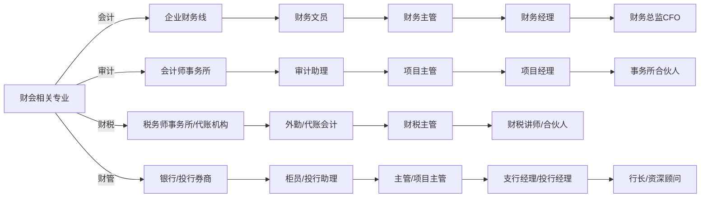

---

### 企业经营升级与财务核心能力对应表

| 传统粗放经营痛点 | 高端财务核心能力 | 企业现代化转型成果 |
|------------------|------------------|--------------------|
| 凭感觉/经验决策 | 1. 财务报表经营分析 | 数据化决策、系统化决策 |
| 拼规模/关系粗放竞争 | 2. 全面预算目标分解 | 市场：拼效益、拼速度 |
| 灰色利润、粗放/控票/历史遗留风险 | 3. 成本管控分析预测 | 阳光下的利润（适配金税三期、金税四期） |
| 单打独斗、人情式管理 | 4. 税务筹划风险管控 5. 顶层架构股权交易 | 投融资：股权、期权、IPO |

---

### Obsidian 表格代码（可直接复制使用）

| 传统粗放经营痛点          | 高端财务核心能力                   | 企业现代化转型成果           |
| ----------------- | -------------------------- | ------------------- |
| 凭感觉/经验决策          | 1. 财务报表经营分析                | 数据化决策、系统化决策         |
| 拼规模/关系粗放竞争        | 2. 全面预算目标分解                | 市场：拼效益、拼速度          |
| 灰色利润、粗放/控票/历史遗留风险 | 3. 成本管控分析预测                | 阳光下的利润（适配金税三期、金税四期） |
| 单打独斗、人情式管理        | 4. 税务筹划风险管控 5. 顶层架构股权交易 | 投融资：股权、期权、IPO       |
> [!todo]
> 
> 企业涨价，对抗人民币的涨价。
> 上游开票，这个供应链涨价。

##  财务BP心法 ：把财务当成一门服务生意
来源：陈东捷线下分享｜成为顶尖财务破局思路
### 一、核心理念

财务工作本质：经营一门叫财务服务的生意，摒弃单纯记账核算思维，用市场化服务视角做财务。
分类 明细内容 
服务客户 老板、股东、其他业务部门、部门内部同事 
交付产品 日常文书、专业财税意见、凭证、表单、经营报表、测算模型、管理工具 
考核来源 由服务客户进行评价、成果肯定 

### 二、财务BP定义

财务BP（Business Partner）= 企业内部商业合作伙伴

### 三、落地思考问题

---
## 要成为顶流，首先要心法
思考：这门生意的价值在哪里？
### 价值三个维度：专业、熟练、忠诚

所有人统一的成本：时间
提升工作价值的关键：提升有效工作时间
陈克捷老师线下粉丝见面会

AI+财税 成就不凡

---
## 要成为顶流 ，专业知识储备过硬
## 成为六边形财务专业人士 ：3+2+1
3 +2
1、懂得顶层设计和股权架构规划，成为老板的内参
2、规避税务风险，为企业和老板保驾护航
3、能帮助企业做好成本管控减少损耗，帮助公司“降本增效”
4、辅助业务做目标分解，经营分析找到业绩增长的核心
5、通过全面预算调配资源，做好资金管控
6、在一个行业里面沉淀足够多的时间

沟通表达技巧　个人收入的充盈　选择老板的自由

---
要成为顶流，专业知识储备过硬
## 基本盘3+2
### 1、经营分析
做一份老板看得懂用得上的经营分析报表
### 2、全面预算
资金管控
调配资源
目标分解
3、成本管控
### 定价指导
降本增效
4、税务筹划
### 政策解读
交易节税规划
风险诊断和应对
### 5、股权架构
顶层架构搭建
交易涉税规划
控制权、分红权、利益平衡

---

### OCR表格整理
| 交由AI处理（重复机械工作） | 高价值财务工作 | 高价值财务工作 |
| ---- | ---- |---|
| 记账报税 | 税务问题、内控问题、优惠政策 | 税务问题、内控问题、优惠政策 |
| 对账核实 | 股东股权、核算体系搭建、高新技术 | 股东股权、核算体系搭建、高新技术 |
| 数据加工 | 资金管控、成本管控、融资投资 | 资金管控、成本管控、融资投资 |
| 知识检索 | 财务预测、预算分析、IPO辅导 | 财务预测、预算分析、IPO辅导 |
| 重复性的机械的 | 绩效考核 | 绩效考核 |

---

## 时间如何分配？考证+能力
### 1. 学历提升
基础教育和综合素质，往往决定了岗位及工作机会的天花板
专科——本科——硕士研究生/EMBA
### 2. 专业证书考取
初级——中级——高级
CPA/CMA/ACCA
### 3. 解决问题能力提升
实际运用
工具和资源引入
自己参与过程

### 支招：专业知识框架是变现的武器
---
1.  **基本盘3+2**
    结合企业的需求来补充框架
2.  **在一个行业沉淀**
    时间成本成为门槛
3.  **木桶理论，全面补缺**
    不能不会，包括AI

---

# 2026年开始，企业最大的风险——税务合规？
## 一、五大合规分类
### 1. 钱的合规
四流一致、点对点对公支付，核查老板从公司拿钱合理性、个人卡收款风险
> 财：账务精准核算；税：依法按时缴纳；合：合乎法规要求；规：规避风险隐患萌芽

### 2. 票的合规
个人居间服务无发票、发票点开票不规范、虚开发票的涉税风险

### 3. 账的合规
记账凭证进销发票、纳税申报税会差异带来财税风险

### 4. 人的合规
员工劳动合同签署、实发工资、社保公积金据实缴纳

### 5. 股权合规
搭建合理股权架构，优化经营决策、最大化股东利益
钱都交

## 二、财务落地三大要求
1. 老板重视合规需要财务支招
2. 建立体系化的合规逻辑
3. 有计划+有步骤+有能力

---

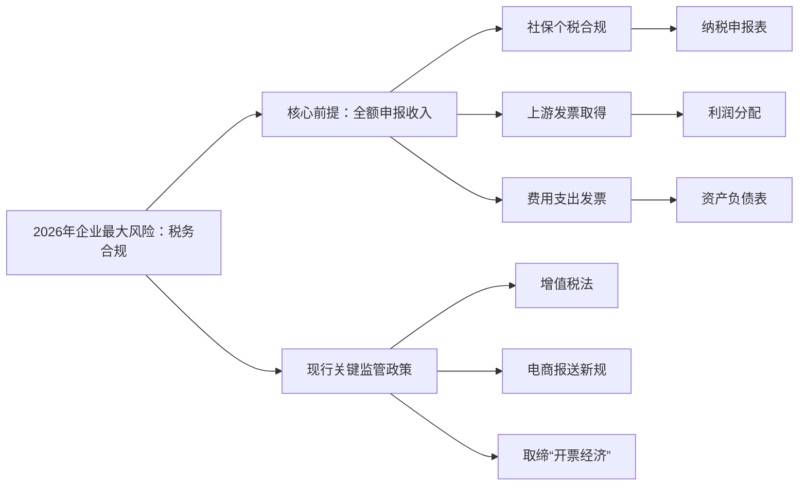

---

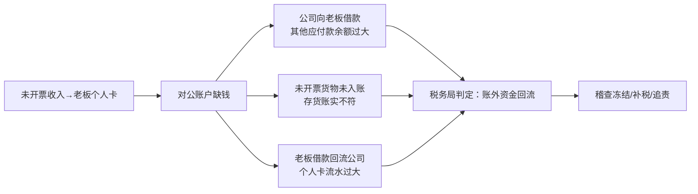
---

### 政策解读 —— 不合规发票现状（市面买卖发票 × 真实采购√）
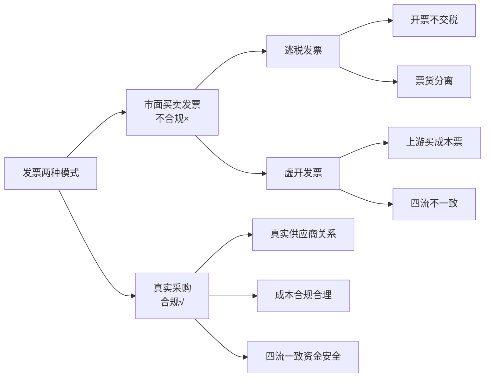

---

### 开发票+公转私成本

#### 开票 + 公转私综合税负成本表

|税费项目|一般纳税人|小规模纳税人|
|---|---|---|
|增值税|13%/6%|3%/1%|
|企业所得税|5%/15%/25%|5%/15%/25%|
|分红个人所得税|20%|20%|
|**综合合计**|**31%~53%**|**20%~43%**|
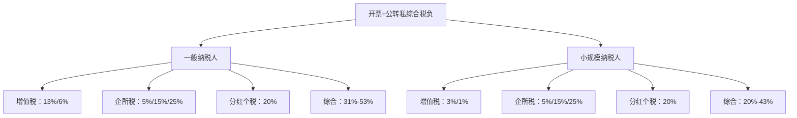

---

## 政策解读——发票虚开的风险
### 影响一、风险更高！
增值税入刑，5万起刑。
专票量刑：5万起刑、50万判3年、250万判10年、超250万十五年以上乃至无期；普通发票最高刑期7年。
以往买票抵扣进项的违规方式已被多数企业淘汰。

### 影响二、成本更高！
综合税负测算参考：13%增值税+25%企业所得税+20%分红个税≈53%
企业二选一决策：
1. 收入走私人账户：隐收入，规避全额53%综合税负（涉税违法）
2. 收入走对公账户：合规完税，依次缴纳增值税、企业所得税、分红个税

> 陈东捷老师线下粉丝见面会｜优财

---
## Mermaid
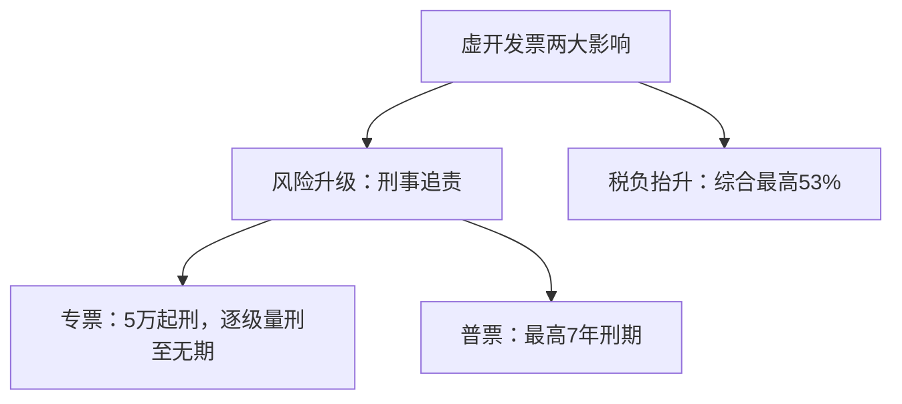

---

## 2026年开始，企业最大的风险——税务合规？
1. 金税上线后依托八大数据比对：==品名、规格、型号、数量、单价、金额，交叉稽核进项、销项、行业税负率。==
2. 核心观点：经营企业最大的风险不是亏损，是税务风险。
3. 监管趋势：数据互联互通，市场主体与个人财税信息透明，私下隐匿收支，极易因多方申报数据不匹配被稽查曝光。

> 陈东捷老师线下粉丝见面会｜优财

---
## Mermaid
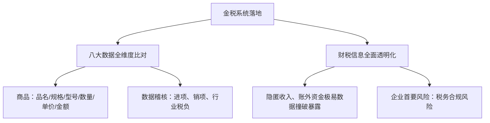

---

## 案例标题：老板买发票，会计被判九个月

### 案件信息

文书：苑宏英虚开增值税专用发票一审刑事判决书

法院：北京市第一中级人民法院，案号：(2018) 京 01 刑初 6 号

发布日期：2018-07-02

被告人：苑宏英，兼职会计，受聘多家科技公司；因涉嫌虚开增值税专用发票罪，2017 年 3 月被羁押，最终获刑 9 个月。

### 案例警示

企业老板虚开发票，经办会计参与入账开票，**会计需要承担刑事法律责任**，涉税发票业务风险传导至财务人员。

---

### 法规依据：2024 版《会计法》新增会计人员自律条款
第五条
会计机构、会计人员依法核算与监督；禁止单位 / 个人授意、指使、强令财会伪造变造凭证账簿、出具虚假财报；不得打击报复依法拒办违规业务的会计。
第二十六条
单位负责人不得授意、强令会计违法做账；会计对不合规事项，有权拒绝办理或依规纠正。
第三十八条
因虚列财报、两套账、隐匿销毁会计资料、贪污挪用等被追究刑责，终身禁止从事会计行业。

---

## 2026年开始，企业最大的风险——税务合规？
### 税务筹划三大目的
1. 降低税务风险
2. 降低企业整体税负
3. 降低企业资金成本（延迟纳税）

### 核心逻辑
税务筹划：**改变交易方式，改变纳税**

> 陈东捷老师线下粉丝见面会｜优财

---
## Mermaid
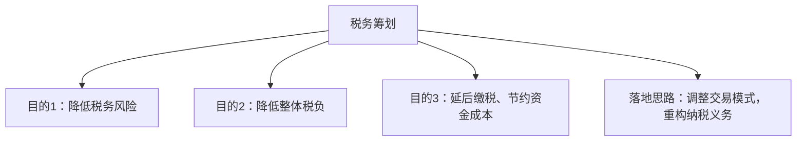

---

## 2026年开始，企业最大的风险——税务合规？
### 主题：企业没有进项票，还能全合规吗？
#### 一、缺进项票三类场景&风险
1. 上游采购缺票
2. 隐形支出无票
3. 内部管理失票

#### 二、江湖避票做法（涉税风险）
1. 设立供应链公司
2. 个体户充当采购中转站

#### 三、合规落地方案：内控+税务筹划
1. 源头筛选、规范合作供应商
2. 落地无票支出付款管理制度
3. 实时跟进、用好各类税收优惠政策

> 陈东捷老师线下粉丝见面会｜优财

---
## Mermaid
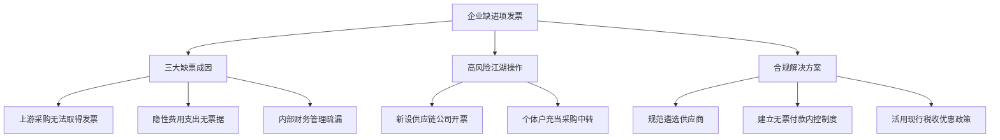

---

# 下现场

> [!info] 案例
> 民企需要怎样的财务？
> 
> 案例：建筑业老板的家族生意
> 
> 某建筑企业张老板，干建筑赚了些钱。3年前收购了一家有年份的制造企业，这个企业各方面结构齐全，但就是人员工作效率不高，处于亏损状态。多数技术骨干是老油条，加上之前财务操作不规范还有不少历史遗留问题。企业收购回来3年了，张老板基本上经营上情况也摸得差不多了，他很看好这个企业未来能赚钱，而且有可能上市。
> 
> 张老板有独生儿子小张总（未婚）刚留学回来现在在公司任职，张老板打算在他婚前把公司传给小张总。如何设置架构如何转让？公司该如何扭亏，张老板找到陈老师团队，求支招。
> 要不要我帮你把这个案例的财务+股权+扭亏方案整理成一份可直接参考的执行清单？

---
## 股权设计+顶层架构搭建

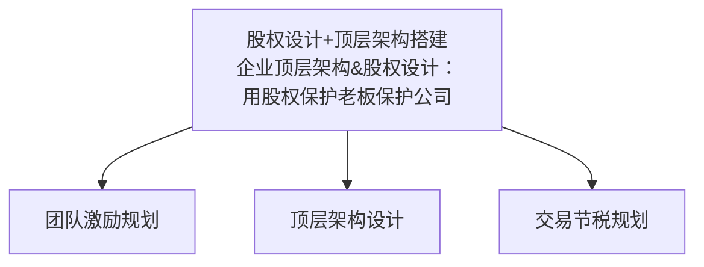
### 内容拆解📌
1. **顶层架构设计**：匹配前文张老板家族传承需求，搭建控股平台，实现小张总婚前股权隔离、家业&企业风险隔离，适配后续上市主体规范。
2. **团队激励规划**：针对制造企业低效老员工，落地股权/分红激励，绑定技术骨干，精简冗余人员，实现降本扭亏。
3. **交易节税规划**：优化股权划转、并购、资产转让涉税方案，解决历史财税遗留问题，降低股权转让与企业重组税负。

---

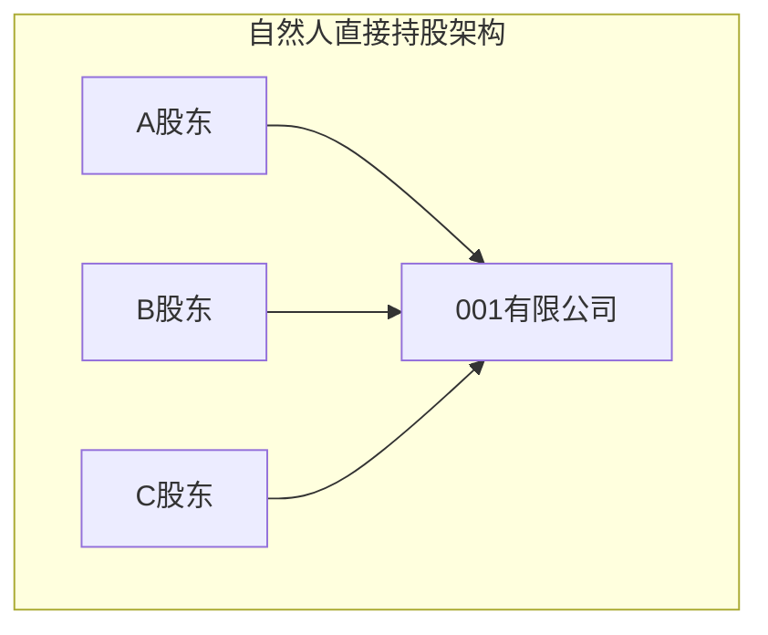
### 自然人持股三大弊端解析📌
1. **税务成本高**：公司税后利润分红至自然人，==强制扣缴20%股息红利个税==；老板若通过无票往来、体外收款避税，涉嫌偷税违规。
2. **无限连带风险**：认缴制下，企业资不抵债涉诉时，债权人可主张股东提前实缴出资，**个人名下房产、存款、配偶共同财产都存在被执行风险**，无法隔离家业与企业债务。
3. **股权治理缺陷**：股权分散在多名自然人，股东分歧易造成决策停滞；婚前/婚后股权混同，发生婚变会导致股权被分割，不利于张老板向小张总婚前平稳传承股权。

> 对应前序方案：改用**控股有限公司/有限合伙企业**上层持股，规避上述自然人持股缺陷。

---

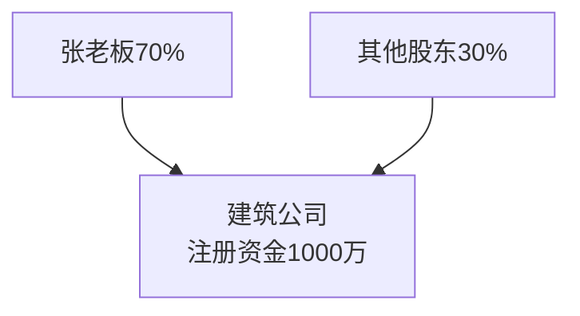
### 裸奔式股权架构痛点解析📌
1. **盈利端税负痛点**
公司分红直接打到自然人股东，分红需缴纳**20%股息个税**，利润越高缴税越多；老板私下公转私提现易触发税务稽查，产生罚款滞纳金。
2. **债务连带风险**
注册资本1000万为认缴，建筑行业工程款、劳务纠纷频发，一旦公司负债破产，张老板作为大股东需要在认缴额度内以个人及家庭资产承担清偿责任。
3. **股权传承隐患**
自然人直接持股，小张婚前过户股权时，直接股权转让税负高；婚后股权极易混同为夫妻共同财产，婚变面临股权被分割风险；叠加后续收购制造企业、上市规划，架构无法满足合规要求。

---
### 个人持股风险

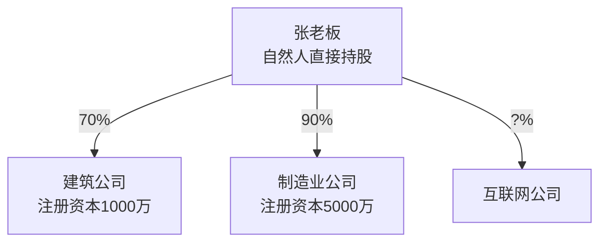
### 一、现有架构核心弊端📌
1. **债务穿透风险**
三家公司均为自然人直投，**各公司债务互相牵连**：制造公司认缴5000万，若经营亏损负债，张老板个人名下房产、存款需要代偿全公司债务，建筑公司盈利资产也会被牵连偿债。
2. **高额分红个税**
三家公司税后利润分红至张老板个人账户，统一征收**20%股息红利个税**，个人日常开销从公司拿钱无法合规免税。
3. **股权传承困难**
自然人股权婚前过户给小张总，股权转让税费高；婚后股权易变成夫妻共同财产，婚变面临股权拆分，不符合婚前资产隔离诉求。
4. **资金调度受限**
跨行业拆借资金（建筑→制造补亏损）直接转账视同分红，产生涉税风险。

---

### 优化后股权结构
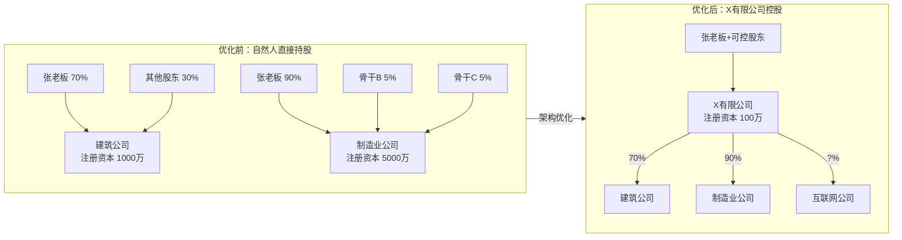

> [!important]
> ### ✅ 优化后家族控股架构（X有限公司）核心优势
> 
> #### 1. 🔒 风险隔离：阻断债务穿透
> - **子公司负债不牵连个人**：建筑公司、制造公司均为独立法人，其债务仅以自身注册资本为限承担责任，不会向上穿透至张老板个人及家庭资产。
> - **小额注册资本兜底**：X有限公司注册资本仅100万，以极小出资额撬动旗下千万级资产，大幅降低老板个人偿债风险。
> - **跨主体风险隔离**：制造公司5000万认缴债务、建筑项目坏账等风险被隔离在各自子公司，不会互相牵连。
> 
> #### 2. 💰 节税降本：省下20%分红个税
> - **居民企业间分红免税**：子公司税后利润分红至X有限公司，符合居民企业间股息红利免税政策，**无需缴纳20%自然人股息个税**。
> - **集团资金调拨无涉税风险**：X平台可在各子公司间自由调配资金（如用建筑公司盈利补贴制造公司扭亏），避免自然人直接拆借产生的“视同分红”补税风险。
> - **合规提取个人开支**：通过X平台的工资、报销、股权激励等方式，合规将资金转化为个人收入，规避私下公转私的稽查风险。
> 
> #### 3. 👨‍👦 股权传承：婚前资产隔离
> - **一次性完成传承**：小张总婚前受让X有限公司股权，即可完整继承集团控制权，无需逐一过户各子公司股权。
> - **锁定婚前个人财产**：X公司股权作为婚前财产，可通过公证明确归属，避免婚后混同为夫妻共同财产，防范婚变导致股权分割。
> - **适配上市合规要求**：统一控股架构便于后续IPO股权梳理，符合上市公司股权清晰、控制权稳定的监管要求。
> 
> #### 4. 🧩 集团管控：高效统筹资源
> - **统一决策与资金池**：X平台作为集团中枢，可集中调配利润、制定战略，解决多行业子公司分散管理的效率问题。
> - **便于股权激励**：可在X平台或子公司层面设计骨干股权激励，绑定核心员工（如制造公司技术骨干），提升经营效率。
> - **展示资本实力**：控股平台架构更利于对外融资、合作，彰显集团化运营实力。
> 
> ---
> 

---
## 第二步 运用有限合伙有控制权

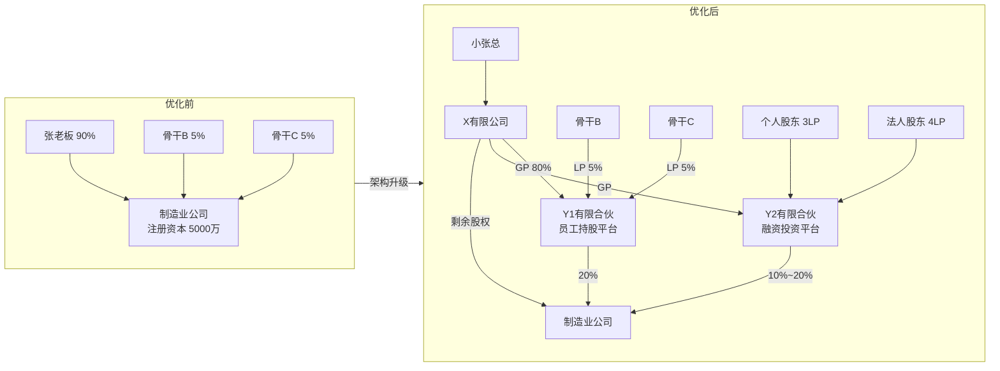

### 方案落地四大作用📌
1. **控制权锁定（小张总）**
X有限公司由小张总婚前持有，担任Y1、Y2两家有限合伙**GP（普通合伙人）**，GP1%持股即可100%掌控合伙企业表决权；即便骨干、外部投资人合计持有LP大额份额，也无法干涉制造公司经营决策，完成张老板向小张总平稳股权转让。

2. **员工股权激励落地**
骨干B/C作为Y1有限合伙LP，只享有分红收益权，无经营投票权；既能绑定核心技术人员、盘活低效老员工，又不会稀释小张总实际控制权，方便后续持续引进人才扩股。

3. **预留融资扩容空间**
Y2有限合伙作为专项融资平台，后续引入个人/法人投资人仅在合伙企业层面增资，不用频繁变更制造公司工商股权，简化融资流程，股权占比可控在10%~20%区间。

4. **财税+传承双重保障**
- 分红路径：制造公司→有限合伙→X控股公司，居民企业分红免税，规避20%自然人个税；
- 婚前资产保全：X公司股权归属小张婚前财产，合伙架构隔离婚变股权拆分风险，适配制造企业未来上市股权合规梳理。

---
##  上下结构

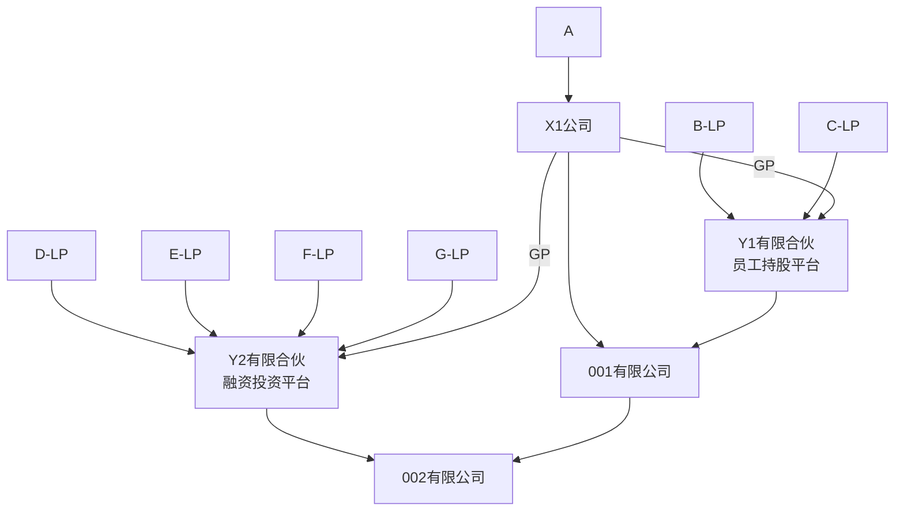
### 架构核心逻辑📌
1. **X1为上层控股主体（小张总持有）**
X1分别出任Y1（员工持股）、Y2（融资平台）两家有限合伙GP，**掌控合伙企业投票权**；A为实控人，B/C是骨干员工（LP，只享分红），D/E/F/G是外部融资投资人（LP）。

2. **分层控股链路**
- 001有限公司：由X1+Y1共同持股（主体经营/上市主体）
- 002有限公司：由Y2+001有限公司双层持股，实现**母公司通过合伙平台间接持有下层公司股权**

3. **落地价值**
- **控制权**：X1（实控方）以少量GP份额管住员工+投资人的大额LP股权，不丢决策权；
- **股权激励**：B/C放入Y1，不直接工商持股001，灵活进退不扰动主体股权；
- **融资隔离**：外部资本全部装在Y2，增资、退出仅变更合伙份额，不用改动001、002工商；
- **财税**：多层控股分红免税，优化20%分红个税。

---

## 股权架构必备协议清单&作用解析
## 一、8类必备协议明细
1. **股权投资合作协议书**
约定入股比例、出资方式、分红规则、权责划分，是股东合作基础法律文件，明确合伙底层规则。
2. **一致行动人协议**
员工/小股东投票权绑定实控人小张总，股东会表决跟随实控方，巩固控制权，避免骨干抱团否决经营决策。
3. **竞业限制协议**
持股骨干在职&离职后禁从事同业竞争，防止核心技术、客户资源外流，适配制造企业技术壁垒保护需求。
4. **保密协议**
约束持股员工严守成本、配方、财报、上市规划等商业机密，规避泄密造成经营损失。
5. **退股协议书**
提前约定退出对价、退出触发条件（离职、违纪、身故），避免后期扯皮，解决老骨干躺平不肯退股的痛点。
6. **附加-股份代持协议书**
不方便工商显名的投资人/员工，用代持锁定收益权，实控人代持股权，工商不分散、控制权稳固。
7. **附加-解除劳动合同协议书**
员工离职配套解约文书，联动股权退出条款，实现离职即按约定回购股权。
8. **附加-劳动合同**
股权激励绑定劳动关系，员工在岗才享有完整分红，约束低效老油条员工。

---

---

# 税务风险清理：风险识别和规范

### 28项历史问题识别扫描（已填充情况描述+解决思路）
| 序号  | 问题                | 情况描述                                                        | 解决思路                                                                                                         |
| :-- | :---------------- | :---------------------------------------------------------- | :----------------------------------------------------------------------------------------------------------- |
| 1   | 两套账问题             | 存在内账（真实经营数据）+外账（报税用，少记收入/多列成本），涉嫌偷税，是上市/融资重大障碍              | 1. 逐步并账，优先补报漏报收入； 2. 对历史少缴税款做自查补申报，争取滞纳金减免； 3. 重构核算体系，实现一套账合规管理                                        |
| 2   | 注册资金过大或过小问题       | 过大：认缴资本远高于实际经营需求，涉诉时需提前实缴，个人资产连带风险高； 过小：无法体现企业实力，影响融资、投标 | 过大：通过减资程序逐步降低注册资本； 过小：择机增资，匹配业务规模与授信需求                                                                    |
| 3   | 其他应付款余额过大         | 多为老板/关联方无偿占用资金、无票支出挂账，长期挂账易被认定为分红补税                         | 1. 梳理挂账明细，区分股东借款/无票支出； 2. 股东借款尽快归还或转为实收资本； 3. 无票支出补开合规发票或做费用化调整                                        |
| 4   | 商业回扣问题            |   5现金/私卡形式支付给客户方人员，无合规票据，涉嫌商业贿赂+偷税                       | 1. 停止现金回扣，改为合规佣金/服务费； 2. 补签服务协议，要求收款方开具发票； 3. 调整账务，将回扣计入销售费用并代扣个税 4. ==居间服务和中介服务问题== 5.  5% 税前扣除 |
| 5   | 买卖发票、虚开增值税专用发票问题  | 为抵税购买虚开发票，或为关联方虚开发票，涉嫌刑事犯罪，稽查风险极高                           | 1. 立即停止虚开行为，自查已抵扣发票； 2. 对虚开发票做进项税额转出，补缴税款； 3. 建立发票审核机制，杜绝无真实业务的发票流转                                    |
| 6   | 无票支出项目问题          | 采购/费用支出未取得发票，无法税前扣除，导致利润虚高多缴税                               | 1. 优先向供应商补开发票； 2. 无法补开的，凭合同、付款凭证、验收单做税前扣除备查； 3. 调整供应商，优先选择可开票合作方                                       |
| 7   | 不合规票据问题，无票收入问题处理  | 不合规票据（抬头错误/项目不全/假票）无法抵扣/扣除；无票收入未申报，少缴增值税/所得税                | 1. 替换不合规票据，重新取得合规发票； 2. 无票收入补做纳税申报，补缴税款及滞纳金； 3. 建立票据审核岗，入账前校验票据合规性                                     |
| 8   | 不合理发票报销问题、提前开发票问题 | 报销与业务无关的发票（老板个人消费），或提前开具未发生业务的发票，虚增成本/提前确认收入                | 1. 清理不合理报销，冲减相关成本费用； 2. 红冲提前开具的发票，按权责发生制确认收入； 3. 制定报销制度，明确业务真实性审核要求                                    |
| 9   | 财政性补贴处理问题         | 政府补贴未按规定计入“其他收益”/“递延收益”，直接计入资本公积或挂往来，导致所得税漏报                | 1. 区分补贴性质：与收益相关/与资产相关； 2. 按准则分期确认收入，补缴对应所得税； 3. 留存补贴文件、收款凭证，应对税务核查                                     |
| 10  | 关注滞留票及税负率控制问题     | 滞留票：取得专票未认证抵扣，易被稽查怀疑隐匿收入； 税负率异常：远低于行业平均，触发预警             | 1. 梳理滞留票，及时认证抵扣或做转出； 2. 测算行业税负率，逐步调整至合理区间； 3. 建立税负监控台账，避免大幅波动                                          |
| 11  | 收入确认按开票时间确认       | 未按权责发生制确认收入，开票才记账，导致收入滞后/提前，影响财报真实性与所得税申报                   | 1. 按发货/验收/完工进度确认收入，开票仅作收款凭证； 2. 补提已实现未开票收入，补缴所得税； 3. 重构收入确认流程，匹配会计准则要求                                 |
| 12  | 账面凭证问题            | 凭证缺失、附件不全、分录混乱，无法支撑账务数据，审计/稽查无法自证合规                         | 1. 补全缺失凭证及附件，重新装订归档； 2. 梳理错误分录，做账务调整； 3. 建立凭证审核流程，确保每笔业务有完整证据链                                         |
| 13  | 大额应付款无法支付问题       | 长期挂账的应付账款（超过3年）未支付，易被认定为“无法偿付的应付款项”，需计入应纳税所得额               | 1. 与供应商协商还款/债务豁免，签订书面协议； 2. 无法豁免的，主动申报为营业外收入，补缴所得税； 3. 建立应付账款账龄管理，定期清理超期款项                             |
| 14  | 存货账实不符问题          | 账面存货数量/金额与实际盘点差异大，多为漏记入库/出库、报废未处理，导致成本核算失真                  | 1. 全面盘点存货，查明差异原因（损耗/被盗/漏记）； 2. 按规定做盘盈/盘亏账务处理，调整成本； 3. 建立存货定期盘点+永续盘存制度，确保账实一致                           |

---
### 针对张老板案例的落地建议
1. **优先级排序**：先处理**虚开发票、两套账、无票收入**等高风险问题，再整改**存货、应付款、凭证**等基础问题；
2. **分期整改**：分3-6个月逐步清理，避免一次性补税导致现金流断裂；
3. **上市适配**：所有整改需留存完整底稿，确保IPO审计时可追溯，消除历史合规瑕疵。

---
## 发票风险和表内风险

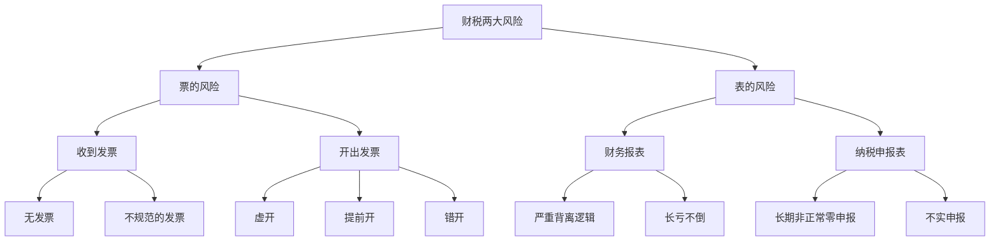
### 风险拆解&整改方案📌
#### 一、票类风险
1. **收票：无票+不合规发票**
现状：采购、服务费缺票、发票抬头/品名错误，成本无法税前扣除；
整改：限期补换合规发票，小额零星凭佐证材料入账，淘汰不能开票供应商。
2. **开票：虚开/提前开/错开**
现状：虚开发票涉刑事风险、提前开票虚增当期收入、品名错开引发稽查预警；
整改：立即叫停虚开，红字冲销提前错开发票，建立开票审核制度，按真实履约时点开票。

#### 二、表类风险
1. **财务报表：数据反常、常年亏损却持续经营**
现状：连续亏损还在扩产、财报指标违背行业经营逻辑，极易被税务风控；
整改：梳理历史错账，调整收入成本，规范账务核算，还原真实经营数据。
2. **纳税申报：长期零申报+虚假申报**
现状：有实际营收却零申报、人为少报收入偷税；
整改：自查补报漏报税费，修正往期申报表，按月据实申报纳税。

---

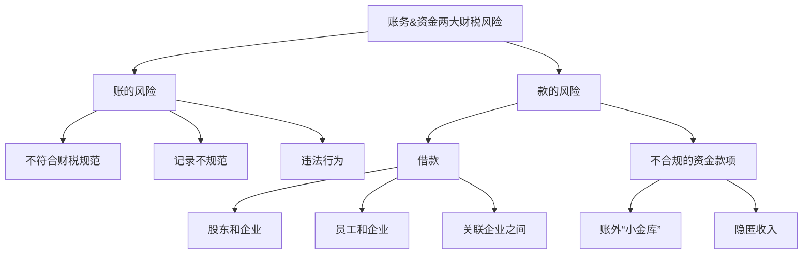

---

### 风险说明+整改方案📌
#### 一、账的风险
1. **不符合财税规范、记账不规范**
现状：科目乱用、成本归集无依据、原始单据缺失，财报无法反映真实经营；
整改：重新梳理错账调账，统一核算制度，完善凭证附件归档。
2. **账务违法行为**
现状：内外两套账、人为篡改账簿，涉嫌偷税；
整改：并账补申报，逐步过渡单一合规账务体系。

#### 二、款的风险
##### 1. 三类借款
- **股东&企业借款**：长期挂其他应收款跨年不还，税务视同分红征收20%个税；
  整改：限期归还借款或转增实收资本。
- **员工&企业借款**：员工大额借款长期占用资金；
  整改：限期清欠，因公借款留存审批资料。
- **关联企业拆借**：无息往来被核定利息收入补税；
  整改：签订借款协议，合规计息或清理往来。

##### 2. 不合规资金
- **账外小金库、私卡隐匿营收**：货款不走对公、体外循环少缴增值税与企业所得税；
  整改：全部资金回归对公账户，补报隐匿收入、补缴税款，关停私人收款通道。

---

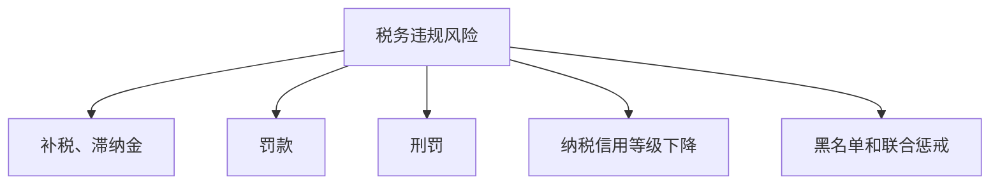
### 五项风险后果说明&前置防控📌
1. **补税+滞纳金**
企业少缴税款被稽查后，需全额补缴欠税，从税款滞纳日起按日加收万分之五滞纳金；
防控：自查梳理历史欠税，主动更正申报，减少滞纳金累加。
2. **行政罚款**
偷税、虚开发票等按少缴税额0.5~5倍处以罚款；虚开发票可单独处以大额罚金；
防控：全量整改不合规发票与隐匿收入事项。
3. **刑事处罚**
虚开专票、逃税金额达到立案标准，实控人、财务负责人面临有期徒刑、拘役；
防控：彻底关停买票、体外收款等违法行为。
4. **纳税信用降级**
评级下调后：发票领用限量、办税审核从严、银行授信受阻、招投标受限；
防控：按期如实申报，消除往期错报漏报。
5. **失信黑名单+联合惩戒**
重大税收违法列入失信名单，法人限制高消费、无法贷款、不能新设公司、股权受限；
防控：完成历史涉税整改，杜绝重大涉税违法。

---

# 无票支出7项问题+合规解决方案
|序号|问题内容|风险隐患|落地解决思路|
|----|----|----|----|
|01|零星支付、零散用工费用无票入账|无法税前扣除、成本虚高多缴所得税，私户付款涉嫌隐匿成本|1.小额零星采购凭收款凭证+身份信息入账； 2.零散用工通过个体户/灵活用工平台开票结算|
|02|市场推广、营销费用无票|白条入账不合规，稽查纳税调增补税|合作服务商规范开票，零星地推外包至个体工商户取得发票|
|03|居间介绍佣金（个人居间费）无票|公转私无票无法列支、代扣个税缺失|个人去税务局代开居间服务费发票，或设立个体户承接居间业务|
|04|供应商不开票、低价采购|缺票成本不能税前扣除，为抵税极易虚开发票|比价测算含税成本，更换可开票供应商；小规模供应商代开增值税发票|
|05|收付款大额现金、采购无发票|现金账外循环，极易被认定隐匿收支、涉嫌两套账|全面关停大额现金收付，所有采购对公结算，倒逼供应商开票|
|06|无票支出倒逼隐匿收入、少记营收|少报增值税、企业所得税，触发偷税稽查、补罚滞纳金|全量收入对公入账，据实申报，用合规票据补齐成本，不再靠隐匿收入对冲无票缺口|
|07|无票挂往来，其他应收/应付长期挂账|长期往来被认定股东分红、补缴20%个税|逐项清理挂账，补齐发票转入成本，无法补票的按税法做纳税调增|

### 整体筹划要点📌
1. **杜绝买票冲成本**：虚开发票触及刑事风险，是制造企业上市重大障碍；
2. **拆分零散业务**：零散用工、居间、小额采购统一平台化、个体户化取得合规票据；
3. **历史分批整改**：往期无票支出分年度更正申报，逐步消化往来遗留问题。

---

# 两账合一落地方案（问题+解决路径）
| 现存财税痛点 | 落地解决思路 |
| ---- | ---- |
| 发票取得（无票收入） | 供应链重构+业务外包；无票收入全部规范入账申报，上游拆分业务取得合规进项发票 |
| 采购加收税点开票 | 全流程测算含税/不含税综合成本，重新议价，优选可开票供应商 |
| 全场景缺发票 | 优化交易模式、重构合作业态，把无票业务拆分外包至个体/小规模主体 |
| 员工税后薪酬、企业承担个税 | 非全职岗位转为业务外包、灵活用工，取得服务费发票列支成本 |
| 股东分红20%高额个税 | 搭建X控股顶层架构，子公司分红至母公司免税；通过费用化列支替代分红提现 |
| 社保&个税基数超标 | 业务拆分、用工关系转换，合规调整薪酬基数 |
| 企业节税增效 | 逐项梳理税费优惠，合规落地税费筹划；足额申领行业、地方财政补贴、技改奖励 |

## 落地目标📌
1. 完成内外两套账合并，实现**一套账合规核算**，消除偷税、虚开稽查风险；
2. 补齐全链条成本发票，减少纳税调增，合理降低企业综合税负；
3. 适配制造公司后续扭亏、股权融资、上市合规要求。

> [!info]  税后 30 万相当于税前多少万？
> > 设税前年薪为 X，五险一金个人比例为 10%，专项附加扣除 2.4 万/年，起征点 6 万/年。
> 
> 应纳税所得额：
> $$
> Y = 0.9X - 8.4
> $$
> 
> 税后收入：
> $$
> 0.9X - \text{个税} = 30
> $$
> 
> 代入 20% 税率档（速算扣除数 16920）：
> $$
> 0.9X - 30 = (0.9X - 8.4) \times 0.2 - 1.692
> $$
> 
> 化简求解：
> $$
> 0.72X = 26.628
> $$
> $$$$

---

# 第二招｜安全合规节税落地三要点
### 1. 紧跟财税新政
政策出台30日内完成研读落地，紧盯小微企业、制造业、补贴返还、个税等优惠新政，及时享受税费减免，避免错过政策红利多交税。

### 2. 专业财税体系搭建
向落地实操的财税专家学习，摒弃不合规买票、体外收款避税思路，掌握**架构筹划、用工筹划、发票合规、合同控税**合法方法，杜绝稽查罚款风险。

### 3. 全量合同重新梳理
对采购、销售、居间、劳务等全部涉税合同逐条重审：
- 修改付款、开票、履约节点条款；
- 拆分混合业务、重新划分业务业态；
依托合同重构业务逻辑，在真实业务前提下合法优化税负。

---
## 适配张老板制造企业落地动作
1. 梳理制造行业技改补贴、小微企业所得税、残保金等优惠，申报申领补贴；
2. 重新修订供应商采购合同、经销商销售合同、居间佣金协议；
3. 结合前期顶层控股架构+灵活用工+自然人代开方案，全链条合规降税负。

---

# 第三招｜搭建成本分析管控体系

---

---
## 二、核心落地逻辑📌
> 股权不是单凭义气、先小人后君子、要用法律来保护自己
1. **控权保障**：一致行动+代持协议，从法律层面守住小张总控制权，LP只有收益无决策干扰；
2. **人员约束**：竞业+保密+劳动合同，根治制造企业老员工效率低、带走资源的历史问题；
3. **风险兜底**：入股+退股协议提前锁死进出规则，避免股东撤资、分家导致公司扭亏受阻、上市受阻。

---
### 优化方向（承接前文方案）
新设**家族控股有限公司**，张老板先全资持有控股公司，再由控股公司70%+小股东30%持股建筑公司，实现：分红免税留存控股公司、隔离个人无限连带责任、低成本婚前股权传承。

需要画出优化后的控股架构Mermaid代码吗？

---

## 2026 年开始，企业最大的风险 —— 税务合规？

被稽查冻结：大部分原因是企业买卖虚开发票，或者未开票收入钱进个人卡。

举例：客户不要发票，资金转入老板个人卡，对公账户资金缺口，衍生三项风险：

1. 公司向老板借款（其他应付款余额过大）
2. 未开票货物未入账报税（存货账实不符）
3. 资金经由老板借款回流企业（个人银行卡流水异常偏大）

税务局结合三项数据即可判定：**账外资金回流**

历史遗留涉税问题建议尽快清理，涉税风险极高！

---

# 亿企赢平台下税务监管穿透
## 税务常规风评-风险指标模型
### 左侧：风险指标模型与分值关系
“以数治税”背景下，税务为企业设定了对应的风险指标模型，税务通过风险指标模型监管企业，当企业命中风险指标，就会对应增加风险分数，风险分数就越高，触发的监管响应越严厉，从预警提示到正式稽查

### 右侧：企业目标并非完全“0风险”
在企业实际经营中无法实现绝对合规，企业应该尽量让自己少命中风险指标，将风险分值控制在安全区间内，但是企业往往比较被动，都是等税务来通知才知道企业有风险，无法提前监测

## 风险层级	分值区间	监管处置内容
低风险	＜45 分	收到电子税务局疑点提醒，提交情况说明即可合理化化解，属提醒类
中风险	45～70 分	下发《税务事项通知书》，企业自查、补缴税款 + 滞纳金，防范升级稽查
高风险	＞70 分	下发《税务检查通知书》，正式稽查；含调账、实地核查、行政处罚，涉刑责风险

# 税务监管-双随机抽查
|分类|触发稽查诱因|抽查规则|
| ---- | ---- | ---- |
|龙头企业/高新企业|上下游连带风险|抽查比例20%|
|正常库企业|同行/员工/股东举报|抽查比例3%|
|异常库企业（长期顶额开票、长亏不倒、信用等级低）|上下游连带、举报双重风险|抽查不限比例|

由此可见，税务稽查严峻，已经全面通过数智化监管企业，企业仅靠人工来应对税务监管是远远不够的

---

文
# 税务监管-税务自查案例 --亿企赢
国家税务总局XX税务分局
## 税收风险提示函
尊敬的纳税人：
经税收大数据分析，我们发现您存在以下涉税风险：
道路货物运输风险：1.取得动力费与运费不匹配，测算少记运费收入
指标6：所得税贡献率偏低
指标7：大额应付、预收款、应付账款期末余额；
指标9：少缴运输合同印花税，取得运费发票金额为：

请您就上述事项进行自查，如自查认为确实存在问题，请自行调整账务处理，办理更正纳税申报、补缴税款；如自查认为不存在问题，请说明情况并举证。请根据自查情况填写《纳税情况自查报告表》，并于2025年09月10日前通过电子税务局反馈。如我们认为您已自行纠正到位或者举证充分能够排除风险，将不再采取进一步稽查。

国家税务总局XX税务分局
2025年08月25日

### 企业案例备注
企业情况：购进柴油多，但是开具的运费发票金额小，税局系统从动力关系测算出企业开出去的运费发票与购进的柴油不匹配，存在隐匿收入的风险。导致所得税贡献率低，有大额往来挂账以及漏缴印花税

**投入产出比明显不合理**

---

字
## 标题：企业所得税税前扣除凭证——敏感发票占比过大 
### 副标题：企业所得税税前扣除凭证（发票）风险提示反馈（“按户管”）
#### 企业所得税税前扣除凭证（发票）风险提示反馈
按户管（已查看未反馈）
经税务机关数据分析比对，近期你单位存在企业所得税异常情况，涉及异常项目1项/次，发票6份，发票金额22611.32元。请你单位及时自查核实，核实结果请在30日内通过电子税务局反馈。

|序号|异常项目名称|风险提示信息推送日期|反馈结果|税款|滞纳金|罚款|纳税调整|纳税调减|操作|
| ---- | ---- | ---- | ---- | ---- | ---- | ---- | ---- | ---- | ---- |
|1|企业取得敏感消费票_|2023-01-06|待选择|0.00|0.00|0.00|0.00|0.00|反馈确认|

敏感费用：服务，咨询培训

---

## 往来大额挂账 超千万，无差别弹窗

---

# 成本管控三维体系（制造企业落地版）
## 一、三大成本分类
### 1. 经营成本
原材料采购、生产制造、人工薪酬、仓储物流、营销费用、税费、房租水电等显性财务成本；
落地：优化供应商议价、拆分零散采购、规范发票入账、依托架构与外包优化用工成本，减少无票损耗、重复支出。

### 2. 时间成本
生产停工、供应链延期、回款账期过长、项目低效拖延、财税整改耗时、融资等待周期；
落地：排产标准化、合同约定回款节点、提前统筹税务规划，压缩资金闲置与无效等待。

### 3. 试错成本
盲目采购囤货、新产品投产失败、不合规财税被稽查罚款、合作方违约、低效人员用工损耗；
落地：小批量试产、事前合同风控、全流程财税前置规划，规避稽查补税、罚款等大额隐性损失。

## 二、落地核心：成本管控必修课
1. 建立**全流程成本台账**，分产品核算单台生产成本；
2. 联动前面财税合规方案，通过业务重构、外包、自然人代开减少成本无法税前扣除带来的隐形税负成本；
3. 定期复盘三类成本数据，锁定压降空间，提升制造企业净利润。

## 适配张老板亏损制造企业
以成本管控为抓手，一边降生产&财税隐性损耗，一边结合股权架构、税务筹划增收节支，快速扭转长期亏损。

