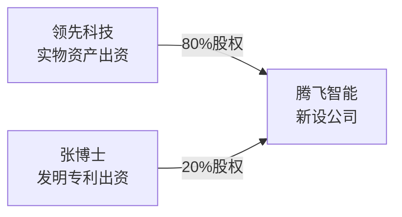

## 一、案例引入：国茂股份IPO资产注入场景
> **案例背景**：国茂股份2019年主板上市（股票代码603915），主营业务减速机研发生产销售。
> 上市重组阶段：国茂集团100%持有国茂股份。为解决同业竞争、关联交易，需要把集团名下土地、房屋不动产，装入上市主体国茂股份。
> 操作方式：**国茂集团以不动产（土地+房屋）对国茂股份做非货币出资**。


### 案例关键数据

| 项目 | 账面净值 | 评估价值 | 交易作价 | 评估增减值 |
| --- | --- | --- | --- | --- |
| 无形资产‑土地 | 1亿 | 1.5亿 | 1.5亿 | +0.5亿 |
| 固定资产‑房屋 | 3亿 | 3.5亿 | 3.5亿 | +0.5亿 |
| 合计 | **4亿** | **5亿** | **5亿** | **+1亿** |

> 
> 会计分录（国茂集团账面）

```
借：长期股权投资-国茂股份   5亿
贷：无形资产‑土地            1亿
贷：固定资产‑房屋            3亿
贷：营业外收入‑处置非流动性资产 1亿
```

> 
> 核心现象：不动产评估增值**1亿元**；集团没有收到现金，只换回了国茂股份股权，但税法会认定产生资产处置收益。

### 非货币资产投资完整法律流程（投资三部曲）

1. **资产评估**：聘请评估机构出具评估报告，不能直接按账面价值入股；国茂案例评估增值1亿。
2. **资产权属过户**：土地、房屋从投资方（国茂集团）过户至被投公司（国茂股份）名下。
3. **工商变更**：被投资公司完成注册资本、股东变更登记。

---

## 二、核心底层税法逻辑：视同销售 & 分解理论

> 
> 💡**分解理论（本讲最重要底层逻辑）**
> 商业上是一件事：拿不动产去投资换股权；
> 税法把它**拆解成两件事**：
> ①把不动产按公允价值卖掉 → ②用卖资产拿到的钱，再去投资入股公司。

```merimind
flowchart TD
    subgraph 【商业世界：1件事】
        S[国茂集团拿不动产投资换国茂股份股权]
    end
    subgraph 【税法世界：拆解为2件事】
        T1[①视同销售：按5亿公允价值卖掉不动产，产生1亿增值所得]
        T2[②用5亿现金，出资入股国茂股份换取股权]
    end
```

> 
> 小测试辅助理解：巧巧食品公司成本5元的香肠，做促销让路人直接吃掉。
> 
> 
> - 香肠所有权发生转移，虽然没有收到现金，**税法视同销售，需要确认收入缴纳企业所得税**。
> ✨判断关键点：**资产所有权是否发生转移，不在于有没有收到现金。**

> 
> 实务痛点：国茂集团吐槽：我没有拿到现金，只是拿到股权，产生1亿的应税所得，**没有现金流交税**，所以需要税收优惠做递延。

---

## 三、企业所得税：3类递延优惠对比（国茂集团案例）

> 
> 国茂集团不动产投资产生1亿评估增值所得，3种可选企业所得税优惠政策

| 优惠政策 | 适用条件 | 优惠核心内容 | 通俗解读 |
| --- | --- | --- | --- |
| **特殊重组优惠** | 投资资产占比不低于50% | 上家不交，下家不扣 | 上家暂不确认所得；但是被投企业资产计税基础沿用原账面，不能按评估价5亿税前扣除 |
| **特定划转优惠** | **100%全资母子公司（纯正血统）** | 上家不交，下家不扣 | 母公司划转给全资子公司，暂不确认所得；资产计税基础不调整为本评估值 |
| **五年分期优惠** | 无股权结构强制条件 | 所得可以在**连续5个纳税年度均匀分期计入应纳税所得额** | 把1亿增值，分摊5年慢慢交税，缓解现金流压力 |

> 
> ⚠️重点提醒：

1. 上述优惠不是**免税，是递延纳税**，只是把交税时间向后推迟（货币时间价值），不是永远不用交税。
2. “上家不交，下家不扣”含义：投资方暂时不交所得税；对应的，被投资企业拿到资产，**不能按照评估增值后5亿作为计税成本，只能沿用原来4亿的计税基础**。
3. 优惠全部需要**主动向税务局申报备案，不是自动享受**。

> 
> 国茂集团场景：国茂集团100%控股国茂股份，可以适用【特定划转优惠】。

---

## 四、各税种逐一拆解（国茂集团不动产投资案例）

> 
> 一笔非货币不动产出资，涉及5大税种

### 1. 企业所得税

- 纳税人：**投资方：国茂集团**
- 规则：非货币出资视同销售，评估增值部分属于应税所得；可根据条件选择上面三类递延优惠。

### 2. 增值税

- 纳税人：**投资方：国茂集团**
- 底层逻辑：增值税属于链条税。以不动产作价出资，属于增值税应税销售行为，需要按不动产公允价值计算销项税额；
- 被投企业（国茂股份）取得增值税专用发票，可以抵扣进项税额。

```
flowchart LR
A[国茂集团<br/>产生销项税额] -->|开具专票| B[国茂股份<br/>抵扣进项税额]
```

### 3. 土地增值税

- 纳税人：**投资方：国茂集团**
- 政策依据：**财税〔2018〕57号**> 
> ✅非房地产开发企业：改制重组房地产作价入股投资，**暂不征收土地增值税**
> ❗例外红线：==只要交易任意一方是**房地产开发企业，该优惠完全不能使用，必须缴纳土地增值税**。==

> 
> 利威金句：**土地增值税对房地产企业有“有色眼镜”**，房开企业不能享受改制重组土增暂缓征税政策。

> 
> 小测试：肥肥地产（房开企业）拿不动产100%投资瘦瘦地产。
> 👉双方一方是房开企业，**不能享受暂不征收土增政策，需要缴纳土地增值税**。

### 4. 契税

- 纳税人：**被投资方：国茂股份（承受房产土地一方）**
- 政策依据：**财税〔2018〕17号**> 
> ✅母公司向**全资100%子公司增资划转土地房屋，视同划转，免征契税**。

> 
> 接上小测试：==肥肥地产（房开）不动产投资100%持股瘦瘦地产；瘦瘦地产作为全资子公司，**契税仍然可以享受免征；契税优惠不受房开身份限制**。==

### 5. 印花税

> 
> 两方都要交税：国茂集团、国茂股份双方均产生印花税纳税义务。

1. **财产所有权转移书据**：不动产投资协议，按协议所载金额贴花；
2. **资金账簿印花税**：被投企业国茂股份，按“实收资本+资本公积”合计金额缴纳资金账簿印花税。

### 全税种总览表

| 税种 | 纳税义务人 | 国茂案例简要规则 |
| --- | --- | --- |
| 企业所得税 | 国茂集团（投资方） | 视同销售，评估增值产生所得，可选3种递延优惠，非直接免税 |
| 增值税 | 国茂集团（投资方） | 视同销售不动产，计销项；被投方可抵扣进项 |
| 土地增值税 | 国茂集团（投资方） | 非房开企业暂不征收；房开企业不得享受优惠 |
| 契税 | 国茂股份（被投资方） | 100%母子公司增资划转，免征契税 |
| 印花税 | 国茂集团 + 国茂股份 | 转让书据+资金账簿双向纳税 |

---

## 五、本讲6大核心知识点总结

1. **投资三部曲**：资产评估 → 资产过户权属转移 → 工商变更登记。
2. **法人税制 & 分解理论**：非货币出资税法拆分为“卖资产+再投资”两件事；所有权转移即视同销售，**无现金流也会产生应税所得**。
3. **税种赛道原则**：不同税种优惠政策独立，一个税种享受优惠，不等于其他税种跟着享受。（例：契税可免，土增房开企业不能免）
4. **增值税链条税**：投资方计销项，被投资方抵扣进项，增值税链条完整。
5. **递延纳税优惠≠免税**：企业所得税三类优惠只是推迟纳税时点，不是免除纳税义务，需要主动备案申报。
6. **房地产有色眼镜**：土地增值税改制重组优惠，**房地产开发企业不能享受**。

---


# 第08讲｜联姻生子‑股权合作模式
> 讲师：李利威｜《一本书看透股权架构》作者
> Obsidian笔记，内置Mermaid流程图；案例：腾飞智能，企业+个人共同非货币出资设立新公司


## 一、案例引入：联姻生子型合作【腾飞智能】
> **联姻生子模式定义**：两家/多方主体，各自输出资源（一方出钱/实物资产、一方输出技术专利），**共同出资新设一家公司**，如同双方联姻生下孩子（新公司）。

> 案例背景：
1. **领先科技（企业方）**：拥有厂房、土地、设备、存货、商标等实物资产；以全部资产作价出资。
2. **张博士（自然人）**：手握发明专利；有两种选择：①把专利直接转让拿钱；②拿专利作价入股新公司。
3. 新设主体**腾飞智能**：领先科技占股80%，张博士专利出资占股20%。



### 领先科技出资资产评估数据

| 项目 | 账面净值 | 评估值 | 交易作价 | 资产增值/减值 |
| --- | --- | --- | --- | --- |
| 存货 | 300 | 300 | 300 | 0 |
| 机器设备 | 500 | 300 | 300 | -200（减值） |
| 商标 | 200 | 400 | 400 | +200（增值） |
| 房屋 | 1000 | 4000 | 4000 | +3000（增值） |
| 土地 | 2000 | 3000 | 3000 | +1000（增值） |
| **合计** | **4000** | **8000** | **8000** | **+4000** |

> 
> 领先科技用资产投资，整体评估**增值4000万**；没有收到现金，换取腾飞智能80%股权。

### 非货币资产投资三部曲（复习）

1. 资产评估
2. 资产权属过户转移
3. 工商变更登记

---

## 二、企业方视角：领先科技出资全税种分析

> 
> 交易：领先科技以存货、设备、商标、房屋、土地，对腾飞智能非货币出资，占股仅80%，**不是100%全资母子公司**。

```
flowchart LR
    A[领先科技] -->|80% 资产出资| B[腾飞智能]
```

### 1.企业所得税

底层逻辑沿用**分解理论**：税法把投资拆分为两件事：①把全部资产按公允价值卖掉，产生4000万增值所得；②拿卖资产获得的8000万现金去出资入股腾飞智能。

> 
> 🤔课堂思考题：如果你是张博士，你愿意领先科技申报【特殊重组递延纳税】吗？

- 特殊重组后果：**上家不交，下家不扣**。领先科技暂时不交4000万对应的企业所得税；但是腾飞智能拿到这些资产，**计税基础只能按原来账面4000万，不能按评估8000万做成本税前扣除**。
- 站在张博士（小股东）角度：不希望申报特殊重组；资产不能按评估值折旧摊销，会造成腾飞智能账面利润虚高，多交企业所得税，损害20%小股东利益。

> 
> 重要区分：
> 
> 
> - 特定划转优惠：只适用于**100%全资子公司**；本案例领先科技只有80%持股，**特定划转优惠不能用**。
> - 可选优惠：①特殊重组（满足资产占比条件）；②五年分期纳税优惠。

### 2.契税（重点难点）

> 
> 政策原文：母公司以土地、房屋权属向**全资子公司**增资，才可以免征契税。
> 当前现状：领先科技只占腾飞智能80%股权，不是全资，直接投资**不能享受契税免征**。

✅讲义实操方案：**三步走干掉契税**

1. 第一步：领先科技先设立一家100%全资子公司；
2. 第二步：把房屋土地注入全资子公司，适用全资划转免征契税；
3. 第三步：张博士再增资进来，把全资子公司变成腾飞智能（领先80%、张博士20%）。

> 
> 通过架构调整，满足政策条件，规避大额契税。

### 3.其余税种简要

| 税种 | 纳税人 | 规则要点 |
| --- | --- | --- |
| 增值税 | 领先科技 | 存货、设备、不动产、商标出资全部视同销售，产生销项；腾飞智能取得专票可以抵扣进项 |
| 土地增值税 | 领先科技 | 非房地产企业，改制重组投资入股，暂不征收；如果一方是房开企业，则不能享受优惠 |
| 印花税 | 领先科技 & 腾飞智能 | 产权转移书据；腾飞智能按实收资本+资本公积缴纳资金账簿印花税 |

---

## 三、自然人视角：张博士专利技术出资

> 
> 业务：张博士个人，用自己研发的发明专利作价入股腾飞智能，取得20%股权。研发投入100多万，没有取得发票。

```
flowchart LR
    A[张博士<br/>个人，发明专利] -->|专利出资| B[腾飞智能]
```

### 底层税法依据：财税〔2015〕41号

> 
> **个人以非货币性资产投资，属于个人转让非货币性资产和投资同时发生。**
> 同样适用分解理论：
> 商业：拿专利换股权一件事；
> 税法：①转让专利视同卖掉专利；②用卖专利得到的钱出资入股公司。

### 各税种拆解

#### 1.个人所得税

- 纳税人：张博士（个人）
- 应税所得 = 专利评估公允价值 − 个人取得专利的成本。> 
> 痛点：张博士自主研发，100多万投入没有发票，**成本很难被税务局认可**，应税所得会变得很大。

✅个人可以选择的优惠：

1. **五年分期递延纳税**：所得可以分摊不超过5个公历年度缴纳个税，需要税局备案。
2. **技术入股递延纳税（区别五年分期）**：可以选择递延到**未来转让股权的时候，一次性再缴纳个税**（不是分5年，可无限向后递延，前提完成备案）。> 
> ⚠️重要提醒：个人非货币投资递延≠免税；被投企业腾飞智能，取得专利的计税基础，依然沿用张博士的原始成本，**不是评估价**（上家递延，下家不能按评估值扣除）。

#### 2.增值税

> 
> 政策：纳税人提供**技术转让、技术开发，配套技术咨询服务，免征增值税**。
> ✅张博士以专利技术出资，属于技术转让，可以享受增值税免税。

#### 3.土地增值税

> 
> 专利属于无形资产（技术），不涉及房产土地，**不征收土地增值税**。

#### 4.契税

> 
> 契税承受方是腾飞智能；专利技术不属于土地房屋权属，**不产生契税**。

#### 5.印花税

- 双方：张博士、腾飞智能均缴纳；
- 张博士：技术投资协议属于产权转移书据；
- 腾飞智能：资金账簿（实收资本+资本公积）缴纳印花税。

### 张博士专利出资税负总览

| 税种 | 纳税人 | 要点 |
| --- | --- | --- |
| 个人所得税 | 张博士 | 视同财产转让；可5年分期 / 技术入股递延纳税，必须备案；无发票成本难扣除 |
| 增值税 | 张博士 | 技术转让，免征增值税 |
| 土地增值税 | ‑ | 专利技术，不涉及 |
| 契税 | ‑ | 不涉及土地房屋，无契税 |
| 印花税 | 张博士 & 腾飞智能 | 产权转移书据 + 资金账簿 |

---

## 四、企业非货币投资 VS 个人非货币投资 递延优惠对比

> 
> 共同特点：
> 不管企业还是个人选择递延纳税优惠，都是**递延，不是免税**；上家暂不征税，**下家被投资企业资产计税基础不能按评估增值确认，沿用原历史成本**。

| 对比项 | 企业（领先科技‑企业所得税） | 个人（张博士‑个人所得税） |
| --- | --- | --- |
| 递延选项 | ①特殊重组；②特定划转（仅限100%全资）；③五年分期 | ①五年分期；②技术入股递延（可递延至股权转让时） |
| 下家资产计税基础 | 上家不交，下家不扣，按原账面成本 | 上家不交，下家不扣，按个人原始成本 |
| 适用场景 | 企业拿存货、不动产、商标等各类资产投资 | 个人拿技术、股权等非货币资产出资；技术出资有专属优惠 |
| 前提动作 | 全部需要向税务局主动备案，不会自动享受 | 全部需要向税务局主动备案，不会自动享受 |

> 
> 税收中性原则：
> 国家出台递延纳税优惠，考虑重组投资环节**没有现金流入，缺少纳税必要资金**，避免纳税人因为交不起税不敢做重组合作。优惠目的是解决现金流压力，不是免除税款。

---

## 五、本讲核心知识点复盘

1. **联姻生子模式**：多方（企业+企业 / 企业+个人）拿不同类型资源，共同新设公司；是股权合作常见模式。
2. **分解理论通用**：无论企业还是个人，非货币出资税法一律拆分为「卖资产 + 现金投资」两步；**没有收到现金，一样产生应税所得**。
3. **契税坑点**：土地房屋投资，全资母子公司才享受契税免征；持股不是100%时，要架构调整（三步走）实现免税。
4. **个人技术出资**：专利技术出资增值税可免征；个人研发无发票，资产成本确认是巨大风险；有两种递延纳税方案可选。
5. **递延纳税共性**：全部优惠≠免税；上家暂不纳税，下家资产不能按评估价税前扣除；**全部需要税务备案**。
6. **股东利益冲突**：企业大股东申请特殊重组递延，会损害新加入小股东利益（资产不能摊销，利润虚高多交税），合作前各方就要考虑税务后果。

---

## 六、Obsidian个人笔记拓展区

%%
实操思考记录：

1. 张博士自主研发专利，实操中如何留存资料证明研发成本？
2. 技术入股递延纳税，后续转让股权时怎么计算个税？
3. “联姻生子”新设公司，合作谈判时，税务后果需要写进股东协议吗？

---


