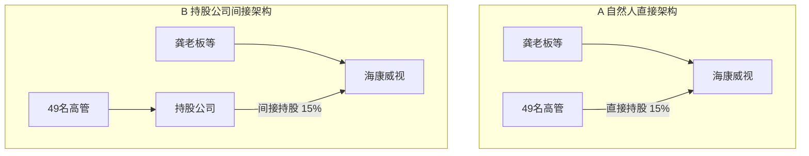

# 自然人架构

## 案例一;深圳兔宝教育科技有限公司
### 分红

| 股东    | 持股比例 | 是否交税 | 理由              |
| ----- | ---- | ---- | --------------- |
| 北京公司  | 51%  | 否    | 境内企业居民间的股息红利，免税 |
| 中国赵先生 | 5%   | 是    | 个人按股息红利 20% 交税  |
| 德国公司  | 25%  | 是    | 预提 10%          |
| 美国汤姆  | 24%  | 是    | 20%，可以申请免税      |
以上兔宝公司分红，股东们收到的股息红利需要交税吗？

原理：
 


---

## 1. 案例 二


# 股东龙女士 49% 股权、股东虎公司 51 股权

## 麒麟地产净资产

|    项目     |     金额     |
| :-------: | :--------: |
| **实收资本**  |   1000 万   |
| **资本公积**  |    0 万     |
| **盈余公积**  |   1000 万   |
| **未分配利润** | ==4000 万== |

> 💬 **注**：未分配利润 = 可以分配给股东但尚未分配的净利润。


问题：如何把这 4000 万拿到股东账户上。？

1. 原始方法--不采用，风险高，金税三期
	1. ## 方案1：用发票把钱套出来
	2. 1. **做壳**：股东注册成立个“壳”
	3. 2. **造假**：壳和公司之间虚构业务
	4. 3. **开票**：壳按业务类型向公司开发票
	5. 4. **回款**：公司将资金打到壳的账户里
	6. 5. **提款**：股东将资金从壳账户提走
2. 方案 2，股东从公司借款，只借不还。
	1. 视同分红
3. 方案 3
	1. 公司分红
		1. 一种是转赠资本
			1. 虎公司转赠资本，免税
			2. 龙女士，转赠资本，视同分红再投资，缴纳 20% 股息红利，好亏啊
	2. 


---

好的，我将根据您提供的案例内容，整理成一份**可直接用于学习、复习或分享的视频笔记**。

---

# 📒 视频笔记：股权架构的“天坑”——龙女士的教训

**视频主题：** 股权架构决定税负与风险
**核心案例：** 龙女士（自然人）与虎公司（法人）合资成立“齐力地产”

---

## 一、案例速览：三个阶段的税务对比

| 阶段                 | 事件                      | 龙女士（自然人）                     | 虎公司（法人）                        |
| ------------------ | ----------------------- | ---------------------------- | ------------------------------ |
| **① 成立**           | 各投 490 万/510 万，共 1000 万 | —                            | —                              |
| **② 分红（盈利 800 万）** | 按股比分红                   | 分红 392 万，**缴 20%个税=78.4 万**  | 分红 408 万，**免税（居民企业间股息红利）**     |
| **③ 注销（清算 800 万）** | 按股比分配剩余财产               | 收回 392 万，**亏损 98 万，无法抵税/退税** | 收回 408 万，**亏损 102 万，可在所得税前扣除** |

**最终结果：**
- 龙女士：赚钱时交税（78.4 万），亏钱时自负损失（98 万） → **双重打击**
- 虎公司：赚钱时免税，亏钱时抵税 → **赢家通吃**

---

## 二、核心教训：自然人直接架构的四大弊端

龙女士犯的错误是：**以自然人身份直接持有实体公司股权**（即“自然人直接架构”）。

| 弊端              | 具体表现                  | 后果                  |
| --------------- | --------------------- | ------------------- |
| 1️⃣ **财富不安全**   | 公司账面有亿级利润，老板个人却拿不到钱   | 公司风险波及个人资产          |
| 2️⃣ **财务不规范**   | 为避税，老板频繁从公司借款，形成“两套账” | ==个人银行卡大额资金无法自证来源== |
| 3️⃣ **阻碍上市/融资** | 财务不规范是 IPO 的最大障碍      | ==上市前需痛苦地规范账目==     |
| 4️⃣ **限制资本运作**  | 用未分配利润投资新公司，须先交 20%个税 | ==无法灵活进行资产重组或剥离==   |

---

## 三、正确的 “间接架构”解决方案

### 1. 最优架构（建议创业初期搭建）
```
创始人（龙女士）
        ↓ 出资
   [持股平台] ← 可以是有限合伙企业或有限公司
        ↓ 出资
   实体公司（齐力地产）
```

### 2. 间接架构的三大好处

| 好处 | 说明 |
|------|------|
| ✅ **节税** | 分红进入持股平台（有限合伙）时，平台本身不缴税；平台内的合伙人（龙女士）按“经营所得”或“股息红利”纳税，税率可能低于 20% |
| ✅ **隔离风险** | 持股平台作为防火墙，隔离个人与公司风险 |
| ✅ **便于资本运作** | 未来投资新公司或上市前整合资产，只在平台层面操作，无需动实体公司股权，税务成本更低、操作更灵活 |

---

## 四、一句话总结（可直接背诵）

> **“股权架构是公司税筹的顶层设计。自然人直接架构让你赚钱时多交税、亏钱时无补偿、风险面前无隔离；而法人股东或间接架构，则能实现税务优化与风险控制。”**

---

## 五、刻意练习（学完可以问自己）

1. 我目前是直接持股还是间接持股？
2. 如果未来公司有分红或清算，我的税务代价是多少？
3. 我是否需要立刻搭建一个持股平台（即使成本较高）？

---

如果你需要，我也可以帮你把这个笔记**转成 PPT/思维导图/口语化讲稿**，方便你直接拿去用。

---


# 股权结税实战营·第三讲：持股公司间接架构

## 一、什么是持股公司间接架构？

**定义**：  
在投资设立实体经营公司之前，自然人股东先成立一家**持股公司**，再由这家持股公司作为股东，投资设立实体公司。这种架构称为**持股公司间接架构**。

**关键特征**：  
- ==持股公司不从事任何经营业务，其存在的唯一目的就是对外投资。==
- 持股公司账上仅有与投资相关的科目，如：
  - 实收资本
  - 长期股权投资
  - 其他应收款
  - 投资收益

> **引用原话**：“持股公司不做任何经营业务，活着的唯一目的就是对外投资，账上仅有的投资类相关科目。”

---

## 二、持股公司间接架构的优点

### 1. 资金可用于再投资（无税周转）
- 持股公司收到的分红资金，可以**免税**用于再投资设立新公司。
- 相当于一个“资金周转站”，让分红资金在公司体系内循环，无需缴纳个人所得税。

### 2. 转增资本时可享受免税待遇
- 当实体公司用资本公积或盈余公积转增注册资本时，持股公司作为股东，可以享受**免税**待遇（自然人股东直接持股则需缴税）。

### 3. 投资损失可在税前抵扣
- 如果持股公司对外投资发生亏损，该损失可以在企业所得税前进行抵扣。

### 4. 税收优势适合水平型架构
- 持股公司间接架构特别适合搭建**水平型股权架构**（即多个实体公司平行持股）。

---

## 三、案例教程：四位股东如何搭建间接架构

### 背景
- 四位朋友（不想暴露身份，称为“他们”）计划一起在上海成立一家实体公司。
- 他们不希望采用“自然人直接架构”（即直接持股实体公司），因为可能有高额个税。
- 


三年后，赚钱了，账上 4 个亿分红给上海公司，上海公司有 4 个亿，但是每个股东想拿来的钱去投不同公司，达不成一致，只好分红给股东。
1. 这部分的钱到股东要缴纳 20% 股利分红
2. 如果换成以下架构，可以节省开支
3. 
4. 闭合性股份结构


---

## 四、对比解答：直接架构 vs 间接架构

1. ### 问题：间接架构真的比直接架构好吗？
	1. **答案：不一定，取决于资本战略。**
2. #### 股东类型一：把公司当“猪”养（未来计划卖掉）
	1. **适合架构**：自然人直接架构。
	2. **原因**：卖股套现时，自然人直接持股可以适用**20%的财产转让所得个税**（而非企业所得税+分红个税），整体税负更低。
3. #### 股东类型二：把公司当“儿子”养（长期持有，分红用于再投资）
	1. **适合架构**：持股公司间接架构。
	2. **原因**：分红可以免税在公司体系内循环，再投资无需额外缴税。
### 实操建议
> **引用原话**：“==要先定资本战略，再搭股权架构==。”  
> “但并不是每个企业家在设立公司的时候都会有那么明确的资本战略。”
推荐顺序：
1. **第一步**：先以**自然人直接架构**起步（设立成本低、操作简单）。
2. **第二步**：当公司盈利、有再投资需求时，**调整为持股公司间接架构**。
3. 第三步：调整应在**持股公司再投资其他项目之前**完成，以避免不必要的税务麻烦。

---

## 五、核心总结

| 维度 | 自然人直接架构 | 持股公司间接架构 |
|------|----------------|------------------|
| 适用场景 | 计划卖股套现 | 长期持有、分红再投资 |
| 分红税务 | 个人收分红需缴20%个税 | 持股公司间分红免税 |
| 资本转增 | 需缴个税 | 免税 |
| 投资损失抵扣 | 不可抵扣 | 可税前抵扣 |
| 再投资效率 | 需先缴税再投资 | 资金可直接免税再投资 |
| 架构难度 | 简单 | 稍复杂，需设立持股公司 |

> **最终建议**：  
> - 如果设立公司时已计划**未来卖股**，用直接架构。  
> - 如果设立时**不确定**，先用直接架构，**盈利后再调整为间接架构**。  
> - 如果明确要**长期持有、再投资**，最好一开始就搭建间接架构。

---

## 六、关键引用（原话摘录）

- “持股公司间接架构，由于税收上的优势，很适合搭建水平型架构。”
- “持股公司如同资金周转站一样，让投资分红的资金可以无税的进行再投资。”
- “那这里面的持股公司呢，如果分红用于个人消费，就放到个人腰包，私人银行卡里；如果分红款用于再投资，就放到公司钱包，持股公司账户里。”
- “很多人问我，李立威老师，间接架构真好，但真的间接架构比直接架构好吗？——先定资本战略，再搭股权架构。”

---

# 有限合伙公司的间接架构

这是一份将你提供的视频文字稿与图片笔记深度整合后的**《股权节税实战案例：海康威视与有限合伙架构》**结构化学习文档。文档将背景、冲突、解决方案和知识点进行了清晰的梳理，方便你作为学习资料留存。

---

## 股权节税实战案例：海康威视与有限合伙架构

## 一、 案例背景与数据还原

**海康威视**（市值超 3000 亿的上市公司）在上市前有一段经典的股权激励往事。

### 1. 公司发展时间轴
1. **2001 年 11 月**：公司成立
2. **2004 年 1 月**：期权激励
3. **2007 年 11 月**：期权行权
4. **2010 年 5 月**：公司上市
5. **2013 年 5 月**：高管减持

### 2. 股权激励详情（2004 年）
- **激励方式**：期权（给员工期待的权利）
- **激励人数**：胡扬忠为代表的员工共 49 人
- **授予价格**：1.98 元/注册资本
- **定价依据**：2003 年度经审计的净资产
- **激励比例**：15%
- **股份来源**：股东龚虹嘉以 75 万元价格做转让

> **案例背景**：2004 年，龚老板在董事会上承诺，只要高管们加油干，业绩达标，三年后拿出 15%的股权转让给大家。价格不论股价涨到多少，都以 2003 年的净资产（1.98 元/注册资本）为准，只需 75 万元。三年后业绩达标，2007 年 49 名高管迎来期权行权。此时，律师为海康威视出了两套股权架构方案。

---

## 二、 架构对比与税负测算

面对期权行权，高管们面临**自然人直接架构**和**持股公司间接架构**的选择。

| 架构对比 | A 自然人直接架构 | B 持股公司间接架构 |
| :--- | :--- | :--- |
| **股东层** | 龚老板等、49 名高管 | 龚老板等、49 名高管 |
| **中间层** | 无 | **持股公司**（红色背景） |
| **主体层** | 海康威视 | 海康威视 |
| **持股比例** | 49 名高管直接持有 **15%** | 由“持股公司”间接持有 **15%** |
| **员工偏好** | ✅ 受欢迎（税负低，变现自由） | ❌ 不受欢迎（税负重，流程长） |
| **老板偏好** | ❌ 不喜欢（管理成本高，分散控制权） | ✅ 受欢迎（方便股权管理，集中表决权） |

### 税负测算（2013 年高管减持套现 8.8 亿）
**如果选择 B 方案（持股公司间接架构）：**
1. 持股平台（威讯公司）卖掉股票，所得需缴纳 **25%的企业所得税**。
2. 剩余 75%净利润若分红给高管，需再缴纳 **20%的个人所得税**。
3. 综合税负：25% + 75%×20% = **40%**（每赚 1 块钱，4 毛钱要交税）。

**如果时光倒流选择 A 方案（自然人直接架构）：**
1. 高管直接卖股套现，只需缴纳一道个人所得税，税负比间接架构**砍掉一半**。

*(注：原图 Mermaid 代码中 B 方案的中间层写为“微醺公司”，结合视频文稿应为“威讯公司”或“持股公司”，在此修正为持股公司。)*



---

## 三、 核心冲突与破局方案

### 1. 核心冲突：“屁股决定脑袋”
- **员工要直接架构**：因为间接架构要重复征税（两道税）。
- **老板要间接架构**：==因为直接架构不利于股权管理（49 个股东签字、开会程序繁琐），且会稀释老板的控制权（49 名高管拥有财产权和表决权）。==
- 股权管理成本很高。

**灵魂拷问**：是否有一种持股平台，既能实现间接持股目的，又能避免重复交税？让鱼和熊掌兼得？

### 2. 破局方案：“后悔药”三部曲
海康威视在 2011 年的半年报中透露了解决方案：“公司股东杭州威讯投资管理有限公司已于 2011 年 6 月迁往新疆乌鲁木齐市，并变更公司名称为新疆威讯投资管理有限合伙企业。”
他们通过**三部曲**完成了架构的华丽转身：
1. **搬家**：从杭州迁往新疆乌鲁木齐（利用当地允许有限公司直接变更为有限合伙企业的特殊政策）。
2. **变性**：由有限公司变更为有限合伙企业。
3. **减持**：合伙企业卖掉股票套现后，再分配给 49 名高管。

**节税效果**：
不仅整体税负砍掉了一半，如果不算新疆乌鲁木齐给予的财政返还，高管实际税负约为 8200 万（若按个税地方留存 60%返还计算）。

---

## 四、 核心知识点总结

### 知识点一：有限合伙架构的三大优点

2006 年《合伙企业法》修改，催生了有限合伙企业（由 GP 普通合伙人和 LP 有限合伙人组成）。它兼具法律主体和税收导管双重属性。

1. **不重复征税（税收导管功能）**
   - 合伙企业本身**不交**企业所得税，也**不交**个人所得税。
   - 利润直接“穿透”到合伙人层面交税：合伙人是自然人交个税，是公司交企业所得税。避免了公司制下的“两道税”。
2. **改变纳税地点（政策高地）**
   - 通过跨区域变更注册地（如迁往新疆、西藏等有税收优惠或财政返还的地区），可以合法合规地大幅降低实际税负。
3. **分股不分权（法律优势）**
   - 老板作为 GP（普通合伙人），即使持股极少，也能拥有合伙企业的绝对控制权；员工作为 LP（有限合伙人），只享有分红权，没有表决权。完美解决了“给钱不给权”的股权激励痛点。

### 知识点二：股权激励架构选择指南

- 如果是**老板**，优先选择**持股公司间接架构**（或有限合伙架构）以集中控制权、方便管理。
- 如果是**员工**，偏好**自然人直接架构**以实现税负最低化和变现自由。
- **最优解**：**有限合伙间接架构**。既满足了老板集中管理、间接持股的目的，又利用合伙企业的导管功能避免了重复征税，让高管开心，实现皆大欢喜。

---


## 有限合伙架构

### 海康威视案例：持股公司 vs 有限合伙架构税负对比

| 项目 | 威讯为公司 | 威讯为合伙 |
| :---: | :---: | :---: |
| **持股平台税负** | 1.35 亿元 | 0 |
| **高管个人税负** | 0.81 亿元 | 1.08 亿元 |
| **税负合计** | **2.16 亿元** ⚠️ | **1.08 亿元** ⚠️ |

---
> 💡 **核心结论**：
> 将持股公司架构改为有限合伙架构，**税负降低 50%**。

*(注：原图底部配有一个竖起大拇指的卡通表情，强调这个节税效果的震撼性。表格中总计行的红色感叹号 ⚠️ 在原图中也做了醒目的标记。)*

1. 有限合伙企业税收作用
	1. 不重复 征税，
	2. 改变纳税地点
	3. 分股不分权

---


1. 有限合伙卖股权
	1. 代为申报
		1. 汇算清缴的意思
2. 税收洼地
	1. 分税制三个地点
		1. 新疆
		2. 西藏
		3. 新余
			1.  


---

### 税务征收方式对比：查账征收 vs 核定征收

#### 1. 查账征收
> 计算公式：**(收入 10 亿 - 成本 1 亿) × 35% = 3.15 亿**

*   **逻辑**：按照实际利润（收入减去实际成本）作为应纳税所得额，适用最高档的 **35%** 经营所得税率。

#### 2. 核定征收
> 计算公式：**(收入 10 亿 × 应税所得率 10%) × 35% = 0.35 亿**

*   **逻辑**：不看实际成本，直接按收入乘以税务局核定的“应税所得率”（假设为 10%）来确定应纳税所得额，再乘以 **35%** 的税率。

---

### 💡 核心对比与延展解读

| 征收方式 | 计算基数 | 适用税率 | 应纳税额 | 节税效果 |
| :---: | :---: | :---: | :---: | :---: |
| **查账征收** | 利润（10 亿-1 亿=9 亿） | 35% | **3.15 亿** | 税负沉重 |
| **核定征收** | 收入×10% = 1 亿 | 35% | **0.35 亿** | 税额直降 90% |

---


以下是图片内容的 Markdown 格式整理。这张图是对前文“改变纳税地点（政策高地）”这一知识点的具象化总结，展示了**“税收洼地”的三大核心筹划工具**：

---

### 图解：税收洼地的三大类型与代表地点

结合左侧“税”字被剪刀剪断的意象，企业或个人通过在特定“税收洼地”注册主体，可以实现大幅度降低税负的效果。

| 类型编号 | 筹划工具 | 代表地点 | 核心逻辑 |
| :---: | :---: | :---: | :--- |
| **1** | **财政返还** | **西藏** | 先按规定全额交税，地方财政再按地方留存部分的一定比例（通常为 50%-80%）以奖励、补贴等形式返还给企业。 |
| **2** | **税收优惠** | **新疆** | 国家或地方给予特定的税率减免或政策允许（例如之前海康威视案例中，新疆允许有限公司直接“变性”为有限合伙企业，且享受特定优惠）。 |
| **3** | **核定征收** | **新余** | 税务机关按照收入乘以固定的“应税所得率”（如前图所示的 10%）来计算利润，直接避开查账征收的高额实际利润税负。（注：目前对权益性投资的合伙企业已全面收紧） |

---

### 📝 知识点整合与延展（结合前文课程）

结合前面的视频文稿和 PPT，这张图完美串联了整个“有限合伙架构节税”的落地地图：

1. **新疆（税收优惠的应用）**：
   文稿中提到，海康威视的 49 名高管之所以能节税 50%，就是因为将持股平台“杭州威讯”搬到了**新疆乌鲁木齐**，利用当地特殊政策允许有限公司直接转为有限合伙企业，并享受当地的税收优惠。

2. **西藏（财政返还的应用）**：
   文稿中提到，如果算上新疆当地“个税地方留存 60%返还”，高管的实际税负仅 8200 万。这种返还逻辑的极致代表就是西藏等西部大开发地区。

3. **新余（核定征收的兴衰）**：
   前一张图展示了核定征收（10%应税所得率）只需交 0.35 亿，远远低于查账征收的 3.15 亿。江西新余曾是全国最著名的“股权转让核定征收”洼地。但**划重点**：近年来国家针对“权益性投资”的合伙企业（即专门持股、卖股的平台）已经**全面禁止核定征收**，要求一律改为查账征收。

**总结**：
这张图是做股权架构设计时的“工具菜单”。选择在哪里注册持股平台（西藏、新疆还是其他政策园区），决定了你的架构能享受哪种类型的税收红利。

---
*文档已更新，目前形成了：案例背景 → 架构冲突 → 有限合伙原理 → 税率对比 → 征收方式差异 → 税收洼地地图 的完整闭环。*