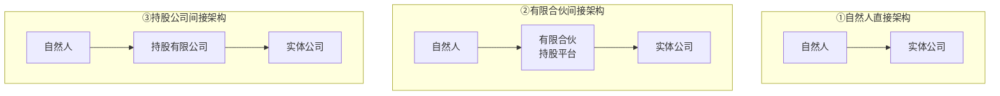
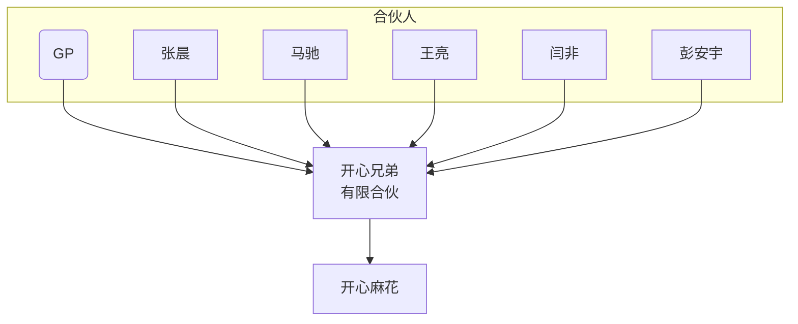
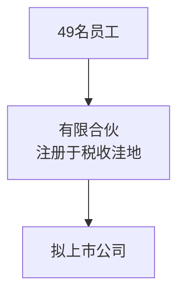
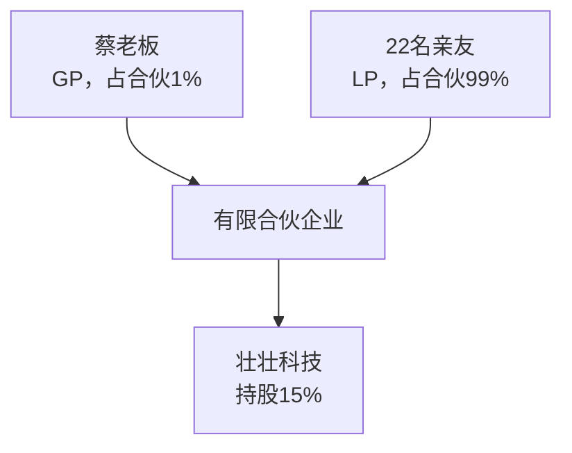

„„
> 讲师：李利威｜《一本书看透股权架构》作者
> 用途：Obsidian学习笔记，内置Mermaid流程图，复制即可渲染图示

%% 个人学习批注区：%%

## 一、三种基础持股架构
> 企业员工/股东持股，最常见3种架构，后面所有案例均围绕这三种架构做对比。



1. **自然人直接架构**：个人直接持有目标公司股权，结构最简单。
2. **有限合伙间接架构**：个人先进入有限合伙企业，由合伙企业持有目标公司股权，常用作股权激励平台。
3. **持股公司间接架构**：个人设立控股有限公司，由该公司持有目标公司股权。

---

## 二、掌趣科技｜金渊投资合伙案例（税收角度）

> 
> 案例背景：范丽华等员工，不直接持股掌趣科技，先进入**天津金渊投资（有限合伙）**，通过合伙平台间接持有掌趣科技股权。


### 场景1：合伙平台卖股套现（股权转让退出）

业务：金渊合伙把手里掌趣科技股票对外卖出，取得股权转让收益，收益最终归属于范丽华等员工。


**核心知识点**

1. 合伙企业本身**不缴纳企业所得税**，实行“先分后税”；收益穿透到合伙人，由合伙人缴纳所得税。
2. 同样是范丽华拿到卖股收益，三种架构税负不一样。

| 架构 | 转让股权（卖股套现）特点 |
| --- | --- |
| 自然人直接持股 | 按财产转让所得20%缴纳个税 |
| 有限合伙持股平台 | 各地执行口径不一，部分地区按经营所得5‑35%；部分地区按20% |
| 持股公司（有限公司） | 两层征税：公司交企业所得税，分红给到个人再交个税，综合税负高 |

> 
> 💡小结：**如果主要目的是未来转股套现，有限合伙相比持股公司有比较优势；但税负政策各地口径有差异，并不是天然就是20%税率。**

### 场景2：掌趣科技分红（上市公司股息红利）

业务：掌趣科技赚钱，向股东金渊合伙发放分红，合伙再把分红给到范丽华。


**关键知识点：纳税时间**

- ✘ 不是范丽华实际拿到钱才交税；
- ✔ **有限合伙企业取得分红的那一刻，合伙人就产生纳税义务（先分后税），不管合伙是否实际把钱打给个人。**

> 
> ⚠️重要规则：**有限合伙企业拿到的被投企业分红，不能享受居民企业之间股息红利免税政策**。（免税政策只适用于公司直接投资公司，合伙不适用）

#### 延伸案例1：开心麻花·开心兄弟有限合伙



> 
> 案例故事：2018开心麻花分红，开心兄弟（有限合伙）拿到分红，虽然是新三板企业，**通过合伙平台间接持股，员工不能享受新三板分红个税优惠**。
> 痛点：分红直接穿透算合伙人的应税收入，产生个税成本。

#### 延伸案例2：蓝色光标分红案例


> 
> 知识点验证：蓝色光标分给有限合伙智度德普，**有限合伙不是居民企业，这笔股息红利不能享受企业所得税免税待遇**。

##### 分红场景三种架构对比

| 架构 | 分红税负特点 |
| --- | --- |
| 自然人直接持股 | 上市公司股息红利，可以适用股息红利差别化个税优惠政策 |
| 有限合伙持股平台 | 分红直接穿透至个人合伙人，**无法享受居民企业免税，很多情况也无法享受上市公司股息红利优惠** |
| 持股公司间接架构 | 子公司分红给持股公司：居民企业之间分红，==免征企业所得税==；钱留在持股公司可以继续再投资，只有分红到个人时才征收个税。 |

> 
> 💡小结：如果企业未来会大量分红、希望利润留存平台继续投资，**持股公司架构在分红上优于有限合伙架构**。有限合伙在分红环节没有优势。

---

## 三、税收洼地风险｜拟上市公司股权激励（49名员工案例）

> 
> 业务场景：拟上市公司做员工股权激励，计划49名员工全部进入一家注册在**税收洼地**的有限合伙，宣传洼地最低税负3.5%。



### 讲义核心知识点

1. 洼地政策是地方财政返还/核定征收，属于地方操作，**并不是全国统一法定优惠**。
2. ==拟上市企业，股权激励持股平台不建议放在税收洼地。==
   - IPO审核中监管重点关注股权激励税务合规；洼地核定/返还存在被税务机关补税风险。
   - 政策不稳定，洼地政策随时可能取消，属于短期套利，**不适合长期规划**。
3. 隐形成本：后期税务沟通风险；一旦上市，企业要承担员工持股平台的税务合规风险。

> 
> 📝课堂思考题（讲义班级群讨论）
> 拟上市公司准备对员工进行股权激励，计划用有限合伙企业作为持股平台，请问，有限合伙企业适合设立在税收洼地吗？最好在哪里设立呢？

---

## 四、壮壮科技案例｜有限合伙法律风险：GP与LP利益冲突

> 
> 案例背景：蔡老板作为**GP普通合伙人仅出资1%**；22名亲友作为LP有限合伙人合计占合伙99%份额；合伙持有壮壮科技15%股权。



> 
> 案例故事：
> GP蔡老板拥有合伙企业全部执行事务权力，权力和出资比例脱钩。哪怕只占1%合伙份额，他可以对外转让合伙企业持有的壮壮科技股权（例如1元低价转让给自己家人蔡夫人），而占99%出资的LP亲友，很难阻止GP执行事务。

**法律层面风险点**

1. GP掌握执行权，出资比例小但控制权极大；LP出钱，但日常没有决策权。
2. 如果合伙协议没有做好约束条款，**极易发生GP损害LP利益的情形**。
3. 搭建合伙持股平台，必须在合伙协议中，对GP的转让、对外担保、处置股权等行为做严格限制。

---

## 五、有限合伙架构优缺点复盘（关联对应案例）

### ✅优点

1. **控制权集中（壮壮科技案例）**：少量份额的GP，可以控制整个平台，把众多员工/投资人的股权集中管理，避免实体公司股东人数过多。
2. **股权转让相对持股公司税负占优（掌趣科技卖股场景）**：对比持股公司双重征税，合伙“先分后税”，退出套现场景具备比较优势。
3. **股东人数扩容**：一个有限合伙最多可以有49个合伙人，可以间接突破有限公司股东人数限制，适合大量员工股权激励。

### ❌缺点（全部对应前面案例）

1. **分红环节无优势（掌趣科技分红、开心麻花、蓝色光标案例）**：被投企业分红给到合伙，**不享受居民企业分红免税**。
2. **GP与LP利益失衡风险（壮壮科技案例）**：GP权力过大，LP出资多但缺乏管控，协议没写清楚容易被侵害权益。
3. **税收洼地坑（49名拟上市员工案例）**：洼地核定征收不适合拟上市公司，政策不稳定，存在补税风险。
4. **税务执行口径各地不一致**：股权转让到底按经营所得5‑35%还是财产转让20%，不同地区税务局执行不一样，存在税务不确定性。

---

## 六、适用场景判断

### ✔适合使用有限合伙持股平台

1. 做员工股权激励，人数较多，希望创始人掌握控制权；
2. 主要目标是未来股权转让退出套现，分红较少；
3. 非上市阶段，提前做好合伙协议约束GP权力，不依赖税收洼地政策。

### ✘不建议优先使用有限合伙

1. 企业会持续大额分红，利润希望留平台继续投资（优先考虑持股公司架构）；
2. IPO前股权激励，想依靠洼地核定征收去降税负；
3. LP出资人占绝大部分出资，但又没有办法约束GP行为。

---

## 七、Obsidian个人笔记拓展区

%%

> 
> 可以在这里记录自己实操思考：
> 
> 
> 1. 实操搭建有限合伙持股平台，合伙协议需要增加哪些约束GP的条款？
> 2. 如果拟上市，持股平台注册地怎么选？
> 3. 对比三种架构，如果自己创业该怎么选？
> %%
> 
> 
> ```
> 
> ```

