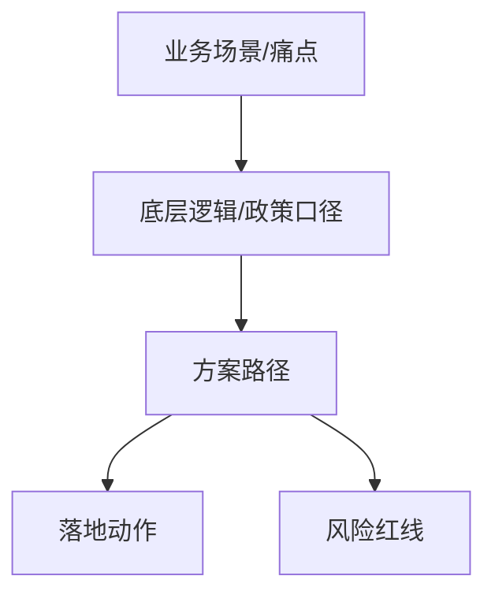

## 一、一句话结论

> [!important] 
> 这节课真正能拿去用的，是：

## 二、逻辑拆解

| 环节 | 内容 | 关键数据/口径 |
| :--- | :--- | :--- |
| 现状 |  |  |
| 症结 |  |  |
| 方案 |  |  |
| 效果 |  |  |

## 三、案例复盘

> [!example] 案例
> - 企业背景：
> - 原做法/风险：
> - 陈老师解法：
> - 可借鉴点：

## 四、落地动作清单

- [ ] 
- [ ] 
- [ ] 

### 可直接套用的工具/表单

| 工具/表 | 用途 | 谁来做 | 周期 |
| :--- | :--- | :--- | :--- |
|  |  |  |  |

## 五、政策依据 & 风险红线

| 依据/文号 | 关键条款 | 红线提示 |
| :--- | :--- | :--- |
|  |  |  |

> [!warning] 风险提示
> 

## 六、我的疑问 & 复盘

- 没听懂：
- 要验证（问老师/查政策/问同行）：
- 可迁移到自己工作的点：

---

> [!info] 填写说明（写完后可删除本段）
> **课程**：高级税务筹划 / 财务实操课 / 线下粉丝见面会 / CMA专场
> **模块**：第X招（如 第一招-税务合规、第二招-税务筹划、第三招-成本战略、第四招-全面预算、第五招-股权架构）
> **主题**：税务合规 | 税务筹划 | 无票支出 | 两账合一 | 成本管控 | 全面预算 | 经营分析 | 股权架构 | 财务BP | 资金管控 | 财务人成长
> **税种**：增值税 | 企业所得税 | 个人所得税 | 印花税 | 社保公积金 | 其他
> **风险等级**：高（涉刑/稽查）/ 中（补税滞纳金）/ 低（管理优化）
> **落地状态**：待整理 → 已理解 → 可落地 → 已落地 → 已验证
> **主要程度/困难程度**：一般 | 重要 | 核心 ／ 简单 | 一般 | 困难
> **掌握程度**：未掌握 | 模糊 | 理解 | 会讲 | 会用
